# Python中有潜在代码执行风险的函数


> 参考：
>
>  [Python中有潜在代码执行风险的函数(一)](https://xz.aliyun.com/t/6902)
>
> 


在Python中一些函数存在着任意代码执行的隐患，错误的使用这些方法将会导致漏洞的产生，攻击者可能会利用这些安全隐患进行攻击。

## 第一组

经典的两个存在执行代码隐患的函数 `eval()` 和 `exec()`

在python中，`eval`和`exec` 的用法极其相似。`eval`和`exec`都可以将传入的字符串执行，但两者又有不同之处


#### eval

eval是一个python内置函数，语法为`eval(expression, globals=None,locals=None)`

eval函数接收三个参数：其中

* **expression**参数是用做运算的字符串类型表达式；

* **globals**参数用于指定运行时的全局命名空间；
* **Locals**参数用于指定运行时的局部命名空间。


globals与 locals 是可选参数，默认值是 None，他们只在运算时起作用，运算后则销毁。

#### exec

在Python2中exec是一个内置语句(statement)而不是一个函数，但是到了Python3中exec将Python2中作为内置语句的exec和execfile()函数功能整合到一起，成为了一个新的函数，语法为`exec(object[, globals[,locals]])`

exec的第一个参数可以是code object，因此它可以执行复杂的代码逻辑，例如变量赋值操作等，这一点是eval做不到的。但exec返回值永远为 None，因此exec不能像eval一样将计算结果返回。exec的后两个参数与eval一致。（所以eval通常可以当作是一个计算器，计算一串字符的值）


#### 对比：


* ##### 在执行python语句上不同


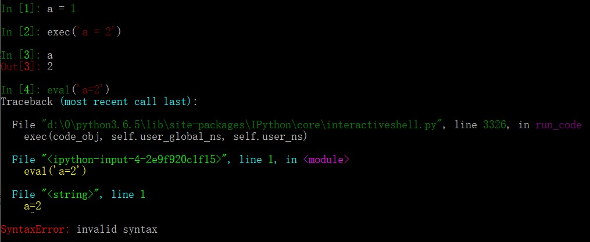


`exec()`可以对变量a进行赋值，而`eval()`并不能对a进行赋值

`exec()`可以执行python的`import os`，而`eval()`不能直接执行python语句，但是可以执行表达式`'__import__("os")'`并返回结果

> `__import__()`函数用于动态加载类和函数，可以将该引入模块作为一个动态对象使用


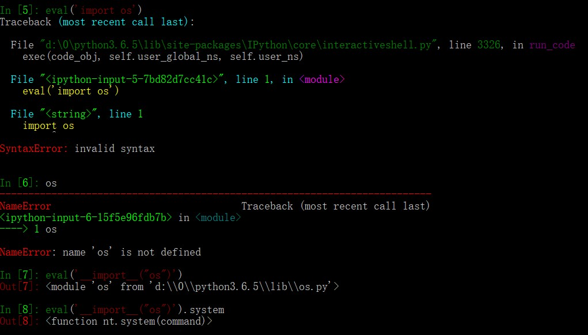

相较于exec：

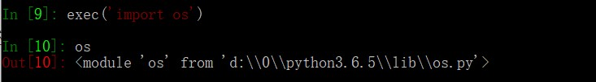


* ##### 返回值不同


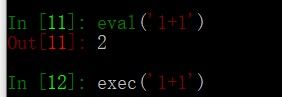

由图可见，eval在对表达式进行计算后，返回计算结果，而exec并无返回结果


虽然有种种不同，但是还是会将第一个传入参数进行执行


### 存在的安全隐患


以`eval()`函数为例，下图中的add函数使用`eval()`对传入参数进行处理，将传入的a，b拼接起来通过`eval()`计算返回结果

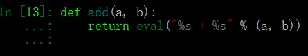

```python
def add(a, b):
	return eval("%s + %s" % (a, b))
```

通过eval进行执行表达式

```python
add("__import__('os').system('whoami')", 2)
eval("__import__('os').system('whoami')")
add("__import__('os').system('whoami') #", 2)
```


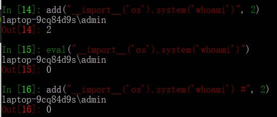

成功执行命令，并返回结果2。

返回结果0是因为`os.system()`执行成功的话，返回值为0。

如同sql注入一样的思路，在执行语句后面加上注释，即可返回结果0。


### 防范

通过上面可知，只要eval或exec中的传入变量可控，就存在执行系统命令的问题

针对上面的例子`eval("__import__('os').system('whoami')")`的问题，存在一种常见的限制方法：即指定`eval()`或`exec()`的**globals**参数为`{'builtins':None}`或者`{'builtins':{}}`这样的形式就可以避免任意代码执行的隐患。这种方法实际上是限制了他们可用的python内置模块(builtins)

在`eval()`和`exec()` ，**globals**参数用于指定运行时的全局命名空间，如果globals没有被提供，则使用python的全局命名空间

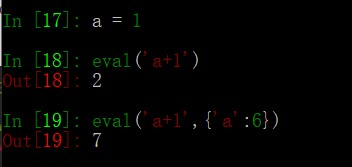

如上图，若不规定globals参数，则使用python全局的`a=1`，若提供了globals参数`{'a':6}`，则使用globals参数里的数据，即eval的作用域就是`{'a':6}`

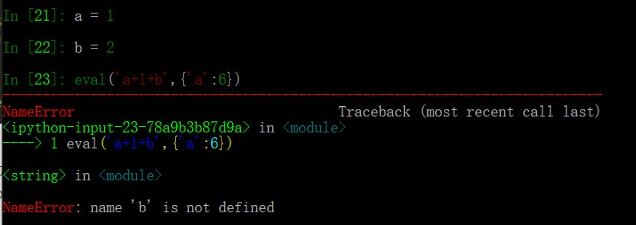

而且当eval使用了自己作用域里的参数，就不会使用python的全局命名空间


#### python的builtins模块

builtins模块是提供对python的所有“内建”标识符的直接访问功能。python解释器在加载时会首先加载内建名称空间并自动导入所对应的内建函数，在执行python的时候加上`-v`的选择就可以看到加载过程。

> [python源码分析——内建模块builtins初始化](https://blog.csdn.net/qq_33339479/article/details/81501802)

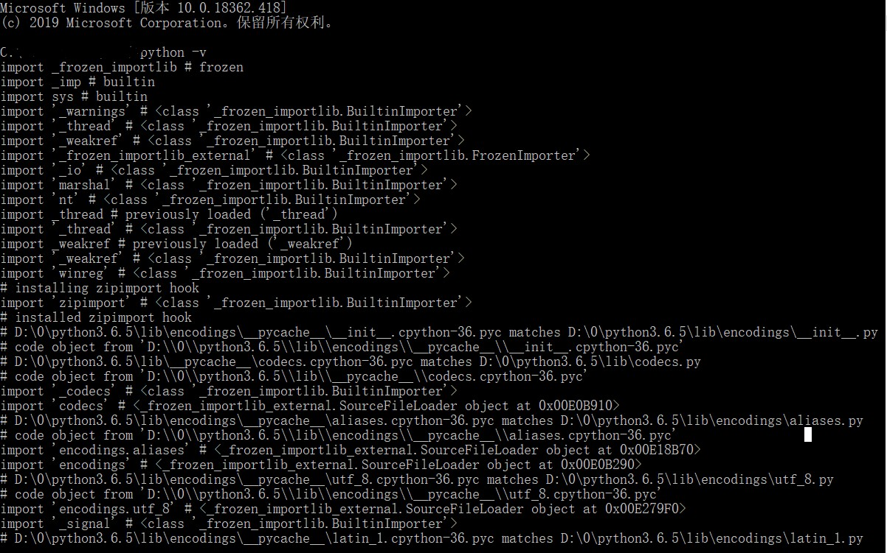

而且由于**builtins**的存在，使得在Python可以直接使用一些内建函数而不用显式的导入它们，例如input()、list()、**import** 等

通过命令`dir(__builtins__)`就可以看到所有的内建函数

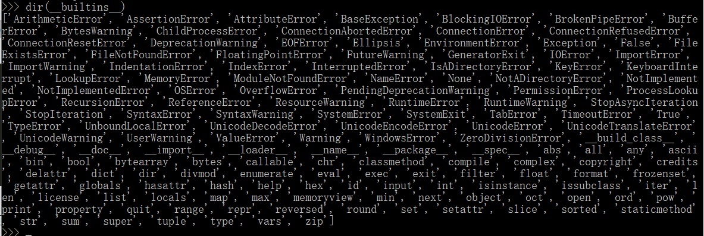

在python中使用上述函数都可以不用导入模块

回到`exec/eval`问题中，值得注意的是，在`exec/eval`中，若globals参数被提供，但是没有提供自定义的builtins，那么`exec/eval`会将当前环境中的**builtins**拷贝至自己提供的globals里，例子如下图：

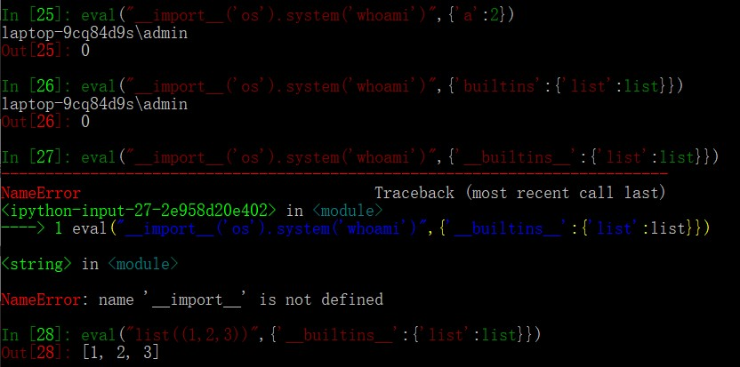

如图，若globals里不规定`__builtins__`，则会使用python全局的**builtins**，例如`in[25]`。如果定义了builtins，则会使用已经定义的**builtins**，如`in[27]`和`in[28]`。

> 这里我没搞懂26为什么也可以，因为builtins在python3.x的时候已经和builtin合并了。
>
> 后面实验时发现，builtins可以被当作模块所import，所以推测python初始化的时候使用的是`__builtins__`，实验证明这是正确的
>
> 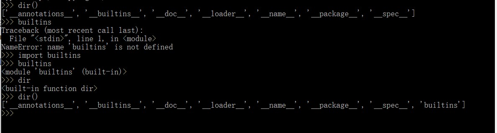


exec的globals策略与eval相同

因此可以通过指定globals参数，来控制eval运行执行的内置函数。这个方法看起来很有效的限制eval/exec对**import**等内置函数的使用，似乎可以防止任意代码执行。但是此方法仍然存在绕过


### 绕过

在上述防范中，通过globals参数对**builtins**中的内置函数范围进行限制，使得eval/exec无法随意使用”**import**”等内置函数来达成阻止任意代码执行

但是却存在如下绕过：`(1, 2).class.bases[0].subclasses`


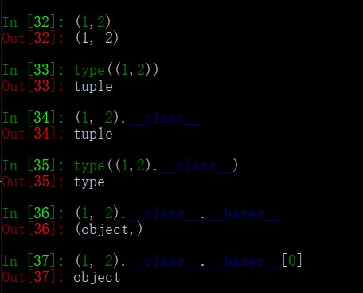

如图，`(1,2)`是一个元组，`__class__`用于查看对象所在的类，很显然`(1,2)`是个元组类型的对象，即tuple类

`__bases__`属性返回所有直接父类所组成的元组（直接父类是因为python的多继承属性所导致）

如`In[36]`可见元组类型的直接父类是object类

`__subclasses__` 可用来获取类的所有子类，贼恐怖

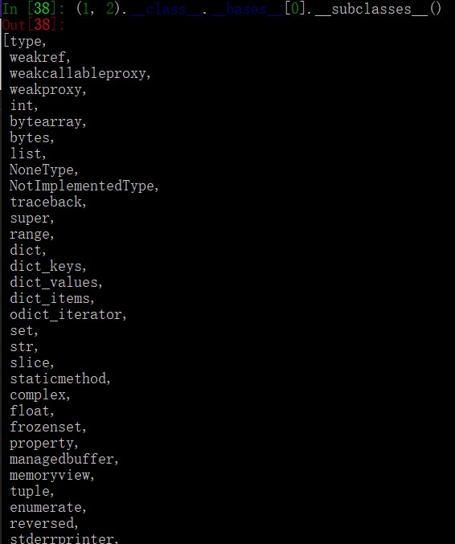

因为`(1,2).__class__.__bases__[0]`已经是object类了，而object类的子类众多，因此可以使用的类就非常丰富了

比如list就在object类里，对应着`(1,2).__class__.__bases__[0].__subclasses__()[7]`

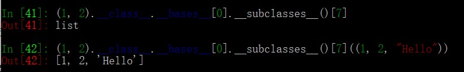

这样就可以调用list函数，将其转为一个list

**构造利用链的核心方法**就是：只要追溯到object类并使用subclasses()使用object子类即可

在object子类中，有执行系统命令的子类  `subprocess.Popen`

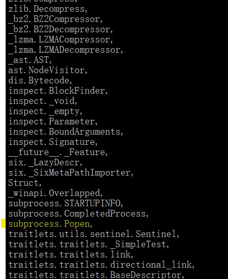


> subprocess 模块允许你生成新的进程，连接它们的输入、输出、错误管道，并且获取它们的返回码。
>
> `subprocess.Popen(args, shell=True, stderr=subprocess.PIPE, stdin=subprocess.PIPE,stdout=subprocess.PIPE)`
>
> * args
>   被用作启动进程的参数. 可能是一个列表或字符串.
> * shell
>   （默认为 False）指定是否使用 shell 执行程序。如果 shell 为 True，更推荐将 args 作为字符串传递而非序列。
> * stdout
>   从子进程捕获到的标准输出. 一个字节序列, 或一个字符串, 如果 run() 是设置了 encoding, errors 或者 text=True 来运行的. 如果未有捕获, 则为 None.
>   如果你通过 stderr=subprocess.STDOUT 运行, 标准输入和标准错误将被组合在一起, 并且 stderr` 将为 None.
> * stderr
>   捕获到的子进程的标准错误. 一个字节序列, 或者一个字符串, 如果 run() 是设置了参数 encoding, errors 或者 text=True 运行的. 如果未有捕获, 则为 None.
>
>
> **简而言之**
> 上面代码简而言之就是，接受args的命令，执行成功就将执行成功的结果存入stdout管道，执行失败的结果存入stderr管道。
>
> 
>
> 

显然，利用链：`().__class__.bases[0].__subclasses__()[176]("whoami")`

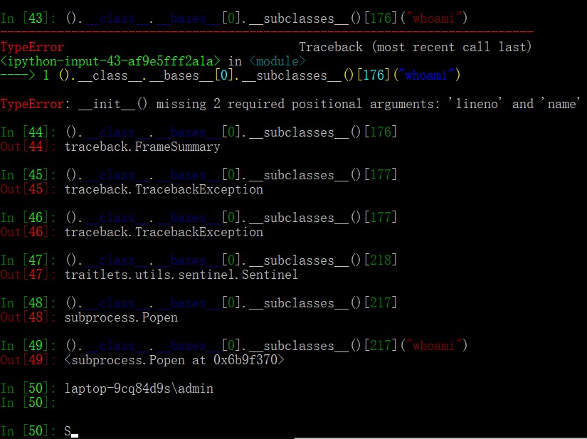

可能由于我的引入库不同，导致了subclasses的列表选择不同，我在subclasses[217]找到`subprocess.Popen`，然后成功执行whoami命令

每个python的运行环境不同，引入库的顺序不同，导致subprocess不一定在176位，甚至可能没有被引入

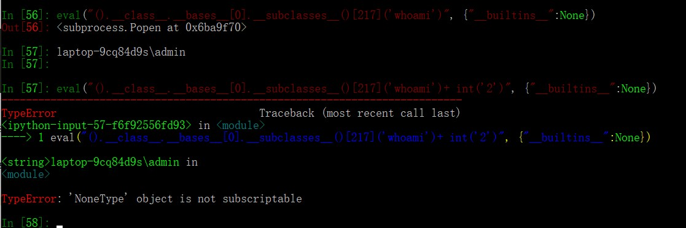

由图可见，虽然可能没被引入，但是这种方法能成功绕过。可见，虽然限制只允许使用list，但是我们仍然可以执行系统命令。因此，简单的使用{'**builtins**': None}是无法满足eval的安全需求的

实际上，可以使用ast.literal_eval()来代替eval()

ast.literal_eval()允许传入的内容如下

strings, bytes, numbers, tuples, lists, dicts, sets, booleans, None

当不合法的字符传入时，程序则会报错，如下图

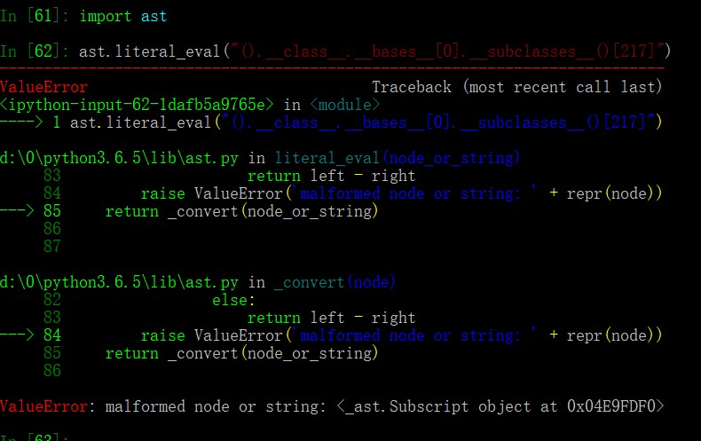

使用ast.literal_eval()代替eval和exec，可以有效的防止任意代码执行漏洞

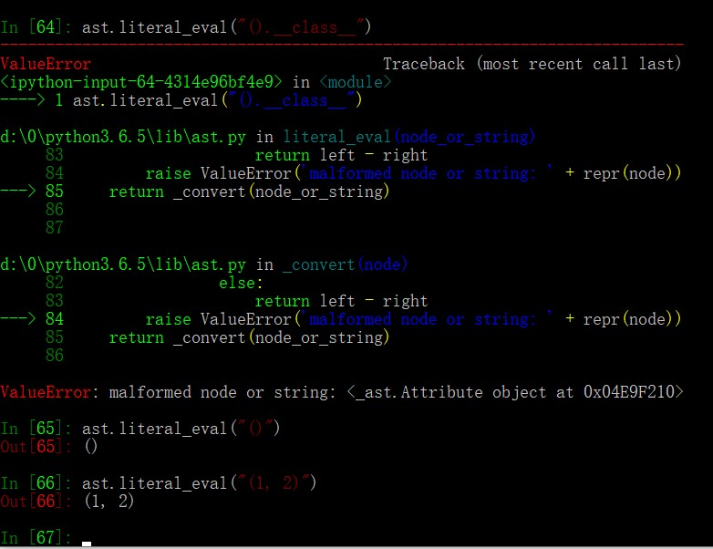

甚至只要有任何不合法的字符传入，程序就会报错

使用ast.literal_eval()代替eval和exec，可以有效的防止任意代码执行漏洞


> 扩展：
>
> [python沙箱逃逸](https://www.freebuf.com/articles/system/203208.html)


