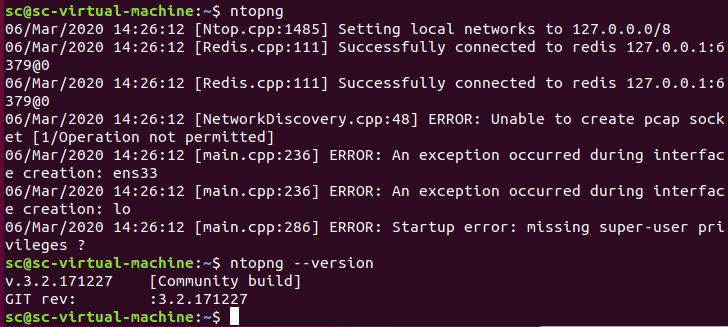
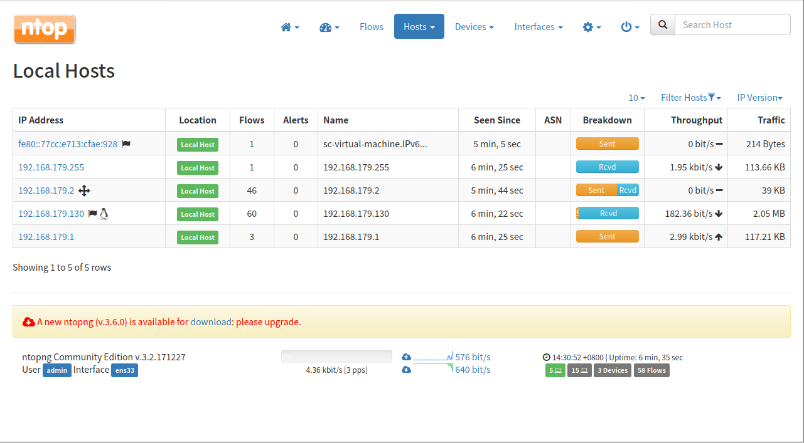
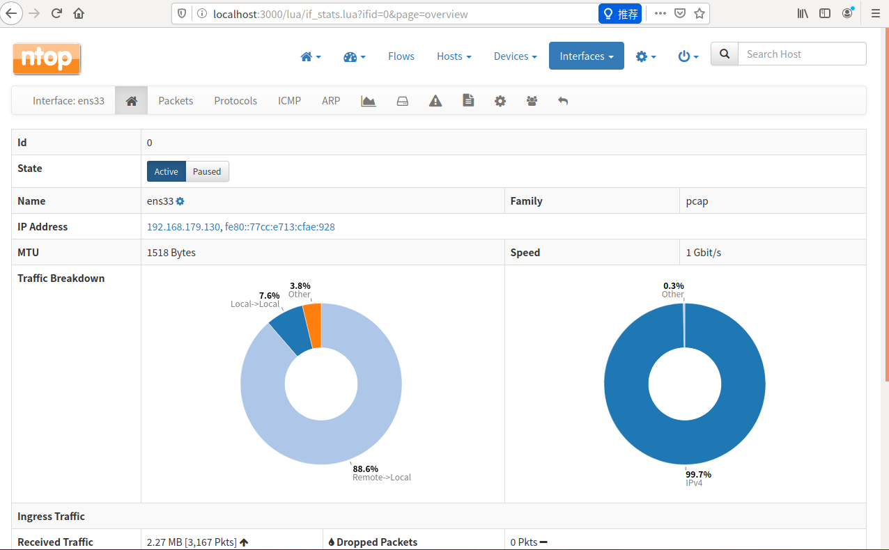
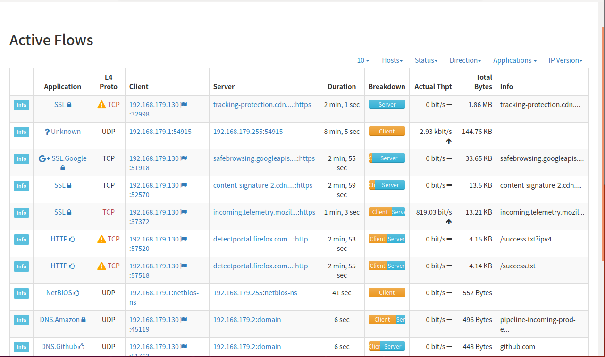
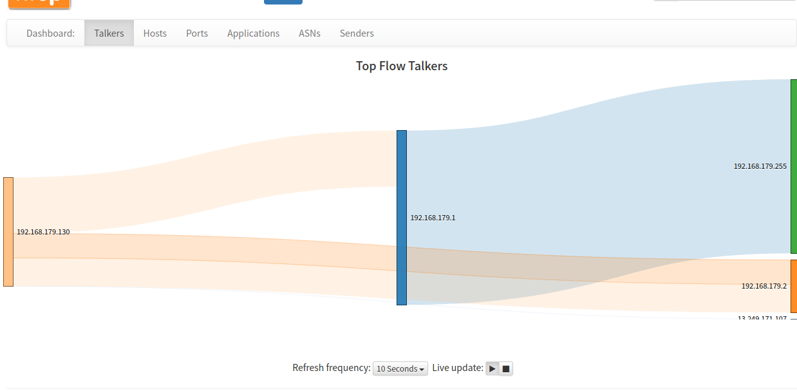

# Ntop


> 参考：
>
> [Github-ntop](https://github.com/ntop)
>
> [Github-ntop/ntopng](https://github.com/ntop/ntopng)
>
> [Ntopng](https://www.ntop.org/products/traffic-analysis/ntop/)
>
> [Ntopng-userguide](https://www.ntop.org/guides/ntopng/)
>
> [运用Ntop监控网络流量](https://www.jianshu.com/p/ef2252dbc176)
>
> 


Ntop是一种监控网络流量的工具，而Ntopng是基于web的高速流量分析和流收集工具，是ntop的下一代，ntopng基于libpcap，并且以可移植的方式编写

> Ntop的功能：
>
> * 自动从网络中识别有用的信息；
> * 将截获的数据包转换成易于识别的格式；
> * 对网络环境中通信失败的情况进行分析；
> * 探测网络环境中的通信瓶颈,记录网络通信的时间和过程。


### 使用

我在ubuntu18.04上装ntopng，linux就是这么简单，一行命令解决

```sh
$ sudo apt-get install ntopng
```




运行示例如下，运行后访问 http://localhost:3000

进入后要先注册，默认admin/admin，强制改密码，需要5位数，我改成了admin/12345

以下是所有主机




这是其主页，ens33是桥接外网的网卡




流量监控如下




针对某个流量的监控：我主机和虚拟机相互ping

