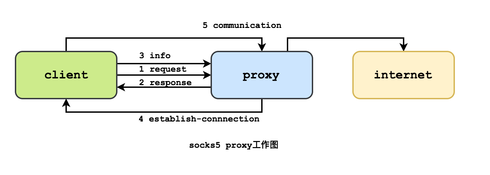
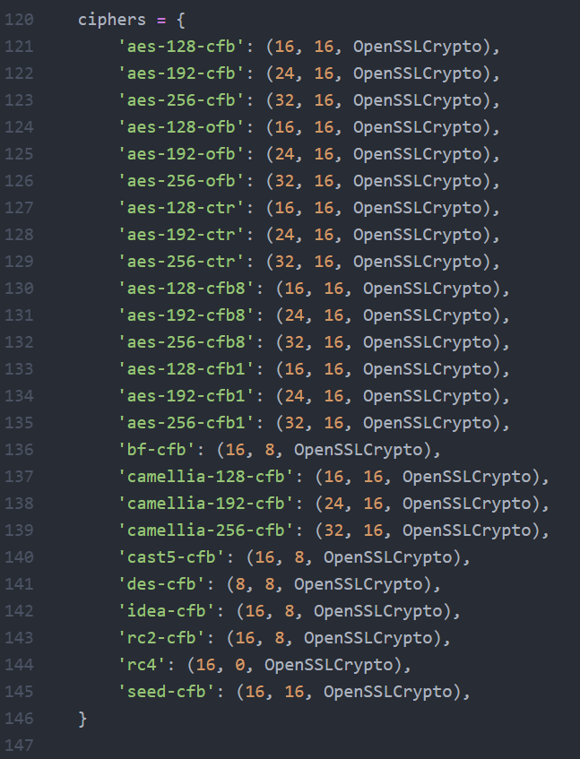
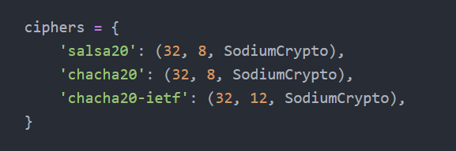
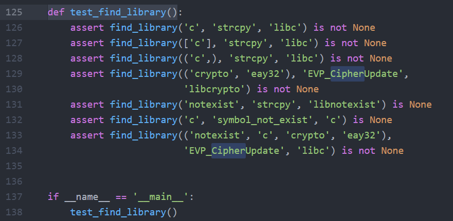
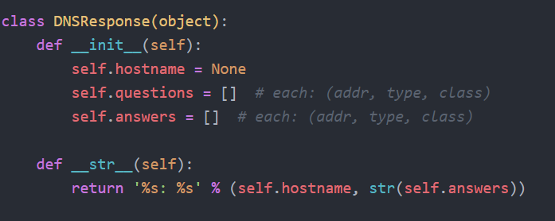

# 关于ShadowSocks的学习


对待科学上网的工具，既然开源的话，就要有科学的精神对其进行学习。


其GitHub官方网址：https://github.com/shadowsocks

本文学习的源码来自：https://github.com/shadowsocks/shadowsocks

版本是2.9.1的python版本


> 参考：
>
> [shadowsocks 源码分析：整体结构](https://bitmingw.com/2017/03/25/shadowsocks-code-analysis-overview/)
>
> [你也能写个 Shadowsocks](https://segmentfault.com/a/1190000011862912)
>
> [shadowsocks源码分析：ssserver](https://huiliu.github.io/2016/03/19/shadowsocks.html)
>
> [shadowsocks 源码阅读](https://0x01.io/2016/02/28/shadowsocks-源码阅读/)
>
> [Shadowsocks 源码分析——协议与结构](https://loggerhead.me/posts/shadowsocks-yuan-ma-fen-xi-xie-yi-yu-jie-gou.html)
>
> [shadowsocks客户端源码分析]([https://blog.gfkui.com/2018/04/29/shadowsocks%E5%AE%A2%E6%88%B7%E7%AB%AF%E6%BA%90%E7%A0%81%E5%88%86%E6%9E%90/index.html](https://blog.gfkui.com/2018/04/29/shadowsocks客户端源码分析/index.html))
>
> 


这个世界上不应该仅有一种声音。

但是。。。


## 关于SOCKS协议


ShadowSocks的数据传输时建立在SOCK5协议之上，SOCKS5 是 TCP/IP 层面的网络代理协议。

ss-server 端解密出来的数据就是采用 SOCKS5 协议封装的，通过 SOCKS5 协议 ss-server 端能读出本机软件想访问的服务的真正地址以及要传输的原数据


> 关于Socks5学习：
>
> [socks5 协议简介](http://zhihan.me/network/2017/09/24/socks5-protocol/)
>
> [HTTP协议和SOCKS5协议](https://www.cnblogs.com/yinzhengjie/p/7357860.html)
>
> [socks-wiki](https://zh.wikipedia.org/wiki/SOCKS)
>
> [rfc1928](https://www.ietf.org/rfc/rfc1928.txt)
>
> [rfc1929](https://www.ietf.org/rfc/rfc1929.txt)
>
> 


socks是一种网络传输协议，主要用于客户端与外网服务器之间通讯的中间传递。根据OSI七层模型来划分，SOCKS属于会话层协议，位于表示层与传输层之间。

socks5协议将socks4协议扩展：

* 对UDP连接的支持
* 多种用户身份验证方式和通信加密方式
* 将寻址方式扩展为包含域名和v6 IP地址（即IPv6）


socks协议的设计初衷是在保证网络隔离的情况下，提高部分人员的网络访问权限。但是他却被发现了新的用途：突破网络通信限制，这和该协议的设计初衷正好相反。


#### Socks5协议流程




建立TCP连接后，客户端需要先发送请求来协商版本及认证方式，详细可见[rfc1928](https://www.ietf.org/rfc/rfc1928.txt)


## Shadowsocks原理


- **PC**是需要利用shadowsocks代理的应用；
- **SS Local**：为shadowsocks客户端，通常运行在PC/手机上（也可以运行在任务PC可 以到达的位置），用于与shadowsocks服务端建立连接。
- **GFW**：你懂的
- **ss server**：shadowsocks服务端，与ss local通讯，完成ss local请 求的访问，并将返回数据加密返回给ss local


混淆时实在ClientHello阶段，即第1阶段时进行混淆，加入jiade目标网址


## shadowsocks源码分析


shadowsocks文件树形结构图如下

```

├── .gitignore
├── .travis.yml
├── CHANGES
├── CONTRIBUTING.md
├── debian
│   ├── changelog
│   ├── compat
│   ├── config.json
│   ├── control
│   ├── copyright
│   ├── docs
│   ├── init.d
│   ├── install
│   ├── rules
│   ├── shadowsocks.default
│   ├── shadowsocks.manpages
│   ├── source
│   │   └── format
│   ├── sslocal.1
│   └── ssserver.1
├── Dockerfile
├── LICENSE
├── MANIFEST.in
├── README.md
├── README.rst
├── setup.py
├── shadowsocks
│   ├── asyncdns.py
│   ├── common.py
│   ├── crypto
│   │   ├── __init__.py
│   │   ├── openssl.py
│   │   ├── rc4_md5.py
│   │   ├── sodium.py
│   │   ├── table.py
│   │   └── util.py
│   ├── daemon.py
│   ├── encrypt.py
│   ├── eventloop.py
│   ├── __init__.py
│   ├── local.py
│   ├── lru_cache.py
│   ├── manager.py
│   ├── server.py
│   ├── shell.py
│   ├── tcprelay.py
│   └── udprelay.py
├── tests
├─tests
│  ├──  aes-cfb1.json
│  ├──  aes-cfb8.json
│  ├──  aes-ctr.json
│  ├──  aes.json
│  ├──  assert.sh
│  ├──  chacha20-ietf.json
│  ├──  chacha20.json
│  ├──  client-multi-server-ip.json
│  ├──  coverage_server.py
│  ├──  fastopen.json
│  ├──  gen_multiple_passwd.py
│  ├──  graceful.json
│  ├──  graceful_cli.py
│  ├──  graceful_server.py
│  ├──  ipv6-client-side.json
│  ├──  ipv6.json
│  ├──  jenkins.sh
│  ├──  nose_plugin.py
│  ├──  rc4-md5-ota.json
│  ├──  rc4-md5.json
│  ├──  salsa20-ctr.json
│  ├──  salsa20.json
│  ├──  server-dnsserver.json
│  ├──  server-multi-passwd-client-side.json
│  ├──  server-multi-passwd-empty.json
│  ├──  server-multi-passwd-performance.json
│  ├──  server-multi-passwd-table.json
│  ├──  server-multi-passwd.json
│  ├──  server-multi-ports.json
│  ├──  setup_tc.sh
│  ├──  table.json
│  ├──  test.py
│  ├──  test_command.sh
│  ├──  test_daemon.sh
│  ├──  test_graceful_restart.sh
│  ├──  test_large_file.sh
│  ├──  test_udp_src.py
│  ├──  test_udp_src.sh
│  ├──  workers.json
│  │
│  ├─libsodium
│  │    └── install.sh
│  │
│  └─socksify
│       ├── install.sh
│       └── socks.conf
|
└── utils
    ├── autoban.py
    ├── fail2ban
    │   └── shadowsocks.conf
    └── README.md
```


有过python工程经验（类似于Flask）很明显得知，工程核心代码位于`shadowsocks`里，其他提供了打包测试功能。


对于核心代码：

```
├── shadowsocks
│   ├── asyncdns.py
│   ├── common.py
│   ├── crypto
│   │   ├── __init__.py
│   │   ├── openssl.py
│   │   ├── rc4_md5.py
│   │   ├── sodium.py
│   │   ├── table.py
│   │   └── util.py
│   ├── daemon.py
│   ├── encrypt.py
│   ├── eventloop.py
│   ├── __init__.py
│   ├── local.py
│   ├── lru_cache.py
│   ├── manager.py
│   ├── server.py
│   ├── shell.py
│   ├── tcprelay.py
│   └── udprelay.py
```


- **tcprelay.py**提供了类TCPRelay, TCPRelayHandler来处理TCP代理连接
- **udprelay.py**提供了类UDPRelay，UDPRelayHandler来处理UDP代理连接
- **eventloop.py**提供了类EventLoop对`epoll`, `kqueue`, `select`方法的包装，提供统一的IO复用接口
- **encrypt.py**提供加密解密相关接口
  - 具体的加密实现在crypto文件夹中实现
- **daemon.py**：用于实现守护进程；
- **shell.py**：读取命令行参数，检查配置
- **common.py**包含一些通用接口
- **lru_cache.py**：实现了LRU缓存
- **server.py**是服务端入口ssserver；
- **local.py**是客户端入口sslocal；


可以看到，基本每个文件中，都有这一行的引入模块

```python
from __future__ import absolute_import, division, print_function, \
    with_statement
```

这个模块是为了引入下一版本的python特性，提高代码对最新python版本的兼容性。

在`setup.py`中可见，该代码可在python2.6，python2.7以及python3.3，python3.4及以上版本运行，因此会引入该库来解决兼容性问题

主要是为了兼容`import `，除法`/`，`print`，`with`

> > about `__future__`：
> >
> > https://www.liaoxuefeng.com/wiki/897692888725344/923030465280480
>
> * import
>
> https://blog.csdn.net/caiqiiqi/article/details/51050800
>
> Python 2.4或之前, Python会先查找当前目录下有没有string.py, 若找到了，则引入该模块，然后你在main.py中可以直接用string了。
>
> 而引入absolute_import 可以先从系统库中引用。
>
> * `/`
>
> python2中，`/`为整除，而python3中，整除是`//`。
>
> * print
>
> python2中，print是一个语法结构，而python3中，print是一个内置函数，有多个参数
>
> 即明显地，python2中，`print 'hello world'`；而在python3中，`print('hello world')`
>
> * with
>
> http://www.voidcn.com/article/p-wrgsfqdl-boq.html
>
> python2.5需要引入的语法，没有看到2和3有什么区别，应该是为了兼容所引入的。
>
> 在stackoverflow的一个问题里说的很清楚了：https://stackoverflow.com/questions/3791903/which-python-version-needs-from-future-import-with-statement
>
> version<=2.4不支持，version2.5需要这个import with_statement，在version>=2.6的时候，python已经将with内嵌进去了。
>
> 


### Crypto


#### openssl.py


`from ctypes import ...`：ctypes是python和C的桥梁，ctypes是python标准库之一，里面引入了许多C的函数以及变量类型

> https://www.cnblogs.com/gaowengang/p/7919219.html


`__all__ = ['cipher']`规定了对外暴露的接口

> https://www.cnblogs.com/wxlog/p/10566628.html


由此直接看到下面的`cipher`，里面定义了ss的加密方法



这也就是crypto模块对外提供的所有加密方法

`def load_openssl()`方法用来寻找运行系统中的openssl库

全局变量`libcrypto`用来存放打开的openssl对象

定义了一个`OpenSSLCrypto`对象用来加密

函数`def run_method(method)`用来调用该对象进行加解密

然后下面有一堆的`test`函数


#### rc4_md5.py

直接调用`hashlib`模块的md5进行运算，没啥好说的


#### sodium.py

soudium是钠的意思，好像也是在英语中代表着纯盐

> https://blog.abyss.moe/archives/24/
>
> https://github.com/jedisct1/libsodium

但是查了下`libsodium`是一个新的软件库，为了加解密、签名、哈希等。是一个现代的密码库，着重于移植性、安全性，是NaCl(Networking and Cryptographt library)的一个分支==>http://nacl.cr.yp.to/

这里面也是实现了三种加密（都没听过，往后有时间可以了解一下




#### util.py

基本在Crypto文件夹下的所有文件基本都引用了这个模块

这模块提供了①查找dll库的函数：`def find_library_nt(name)`、`def find_library(possible_lib_names, search_symbol, library_name)`
②测试加解密函数：`def run_cipher(cipher, decipher)`
③检验引入的库是否存在：`def test_find_library()`

其main函数主要是为了检测是否引入所有所需的dll库，所以引入这个模块可确保其他编写加密的文件不会出现无法调用库的情况




#### table.py

好像是一种单表替换加密


### \_\_init__.py

一个很正常的init文件，跟crypto的\__init__.py差不多


### asyncdns.py

从文件名就可以看出，这是一个异步的DNS查询

其文件里提到了rfc1035，即DNS协议

```python
# 规定了hostname的格式
VALID_HOSTNAME = re.compile(br"(?!-)[A-Z\d\-_]{1,63}(?<!-)$", re.IGNORECASE)
# 以及后面对hostname的判断
def is_valid_hostname(hostname):
    if len(hostname) > 255:
        return False
    if hostname[-1] == b'.':
        hostname = hostname[:-1]
    return all(VALID_HOSTNAME.match(x) for x in hostname.split(b'.'))
```


以下是该文件里对DNS协议写的一些通用的工具类函数用于解析地址、回应等，以及构造地址和请求

```python
def build_address(address)
def build_request(address, qtype)
def parse_ip(addrtype, data, length, offset)
def parse_name(data, offset)
def parse_record(data, offset, question=False)
def parse_header(data)
def parse_response(data)
```

采用了`class DNSResponse(object)`这个类来存储DNS回应，即目标的hostname、请求、以及answer



`class DNSResolver(object)`类实现了简单的异步查询DNS，其中异步缓存采用了LRUCache的方式（具体实现在`lru_cache.py`中）

核心处理方法：

```python
# 只有可读事件
def handle_event(self, sock, fd, event):
    	# 防御性编程，实际上是个无用的判断
        if sock != self._sock:
            return
        if event & eventloop.POLL_ERR:
            # 当错误发生时,重新初始化sock
            logging.error('dns socket err')
            # 从事件循环中移除 slef._sock
            self._loop.remove(self._sock)
            self._sock.close()
            # TODO when dns server is IPv6
            # 初始化sock
            self._sock = socket.socket(socket.AF_INET, socket.SOCK_DGRAM,
                                       socket.SOL_UDP)
            self._sock.setblocking(False)
            # 重新加入事件循环
            self._loop.add(self._sock, eventloop.POLL_IN, self)
        else:
            '''
			读取一个 UDP 包，并取出前 1024 个字节
        	注意：如果一个 UDP 包超过 1024 字节，比如：2048 字节。
        	一次 recvfrom(1024) 也会消耗整个 UDP 包。这里是认为
        	DNS 查询返回的 UDP 包都不会超过 1024 字节。
            '''
            data, addr = sock.recvfrom(1024)
            if addr[0] not in self._servers:
                logging.warn('received a packet other than our dns')
                return
            self._handle_data(data)

```


### common.py

该文件提供了都是些工具类的函数，如bytes和str的互相转化（python2中bytes属于str类）、是否是ip

```python
# ip地址转换函数
# 数值格式(numeric):存储地址的二进制格式
# 点分十进制:就是我们常见的ip(192.168.1.1)
def inet_pton(family, addr) # 将点分十进制的ip地址转化为用于网络传输的数值格式

def inet_ntop(family, ipstr)# 将数值格式转化为点分十进制的ip地址格式

# 大概某个版本前的socket没有ip地址转换函数
def patch_socket():
    if not hasattr(socket, 'inet_pton'):
        socket.inet_pton = inet_pton

    if not hasattr(socket, 'inet_ntop'):
        socket.inet_ntop = inet_ntop
        
        
def pack_addr(address) # 打包地址

def parse_header(data) # 解析socket5头部

class IPNetwork(object) # 初始化网络列表
```


### daemon.py


### encrypt.py


