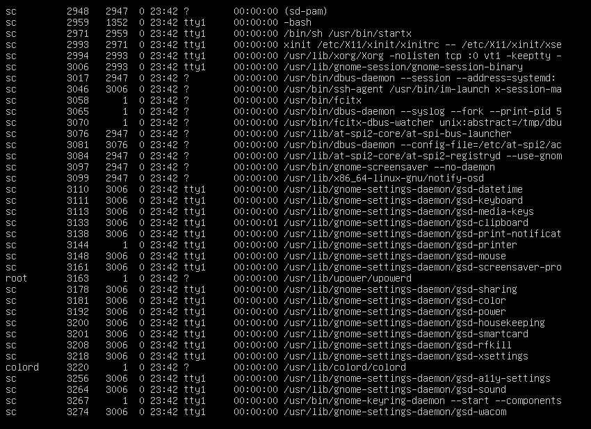
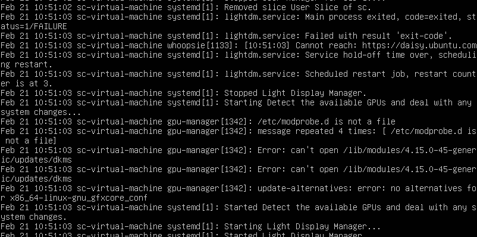
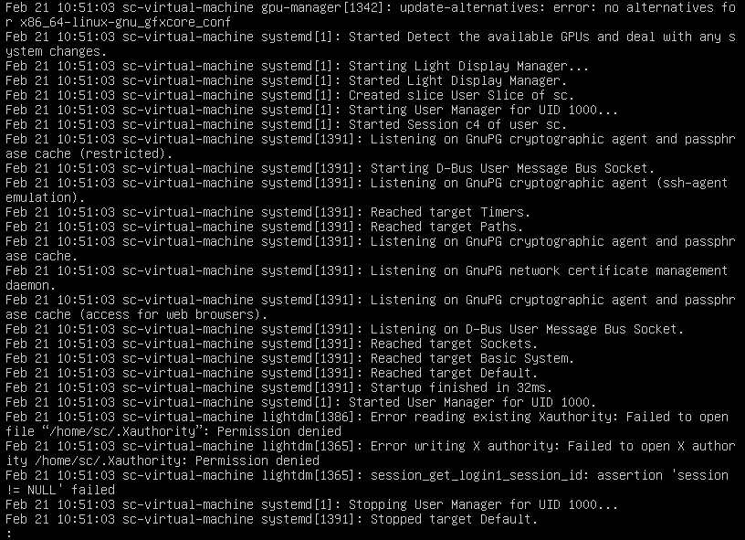
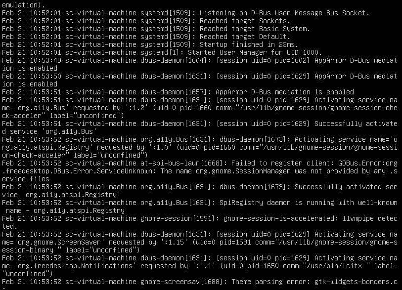
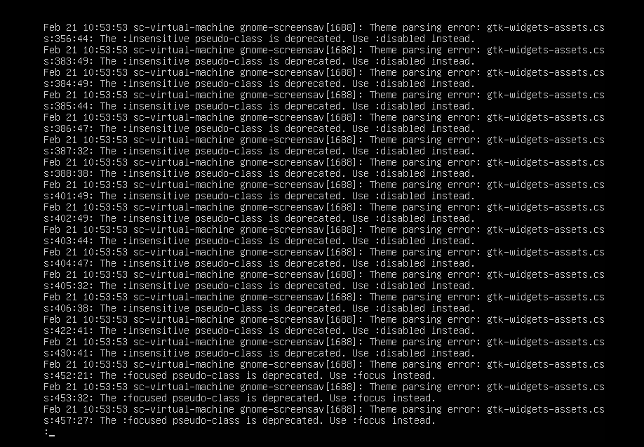
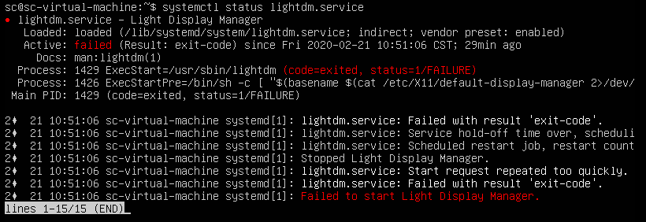
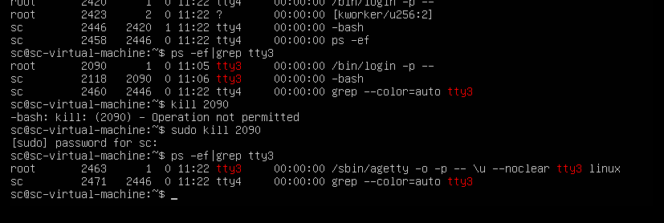

# 关于VMware虚拟机中，Ubuntu开机黑屏解决若干


相当于Mark

没想到，在写系统安全内核模块时，锁屏开出来后，他界面就崩了，我想着重启能解决一切问题，然后重启完他就凉了

一直在冒一个白色的光标，心想着继续重启看看有没提示

```
piix4_smbus:HostSMBuscontrollernotenabled
```

然后再启动一行时看见这个，搜索解决办法

但是网上都是大同小异的办法——进入终端，禁用模块

但是我没有终端啊

最后查到开机时一直按shift可以进入一个选择启动界面，类似windows的bios

进去后就可以选择恢复模式，以root身份进入

> https://blog.csdn.net/jays_/article/details/80848666
>
> https://www.cnblogs.com/elixforever/p/4924492.html

然而解决完再次重启，却还是黑屏，虽然少了那一行，但我已经知道了，这不是关键问题

> https://blog.csdn.net/what_about_us/article/details/81207926

然后就想着以黑屏的方式直接搜解决办法，然后就看到上面这个链接有着综合的解释，便学着他mark下来

尝试了其中的办法，发现原来真的是图形界面崩了，按住`crtl+alt+F2~6`可以进入tty2~6，也就是无图形化终端

想着我下午也同时开过vmware和wegame，然后把vmware给暂停了，搜出来这种情况有可能是LSP问题

> https://www.cnblogs.com/zhang-yawei/p/12071970.html
>
> ​		虚拟机和主机之间的通信，基本上是以 socket 的方式进行通信的（这里的 socket 泛指一切 socket，包括本地的、网络的等等）；
>
> 　　某个程序通过 LSP 给系统的 TCP/IP stack 注入了自己的 DLL，如果程序退出时，没有把这个 DLL 收回来，或者回收失败、没有彻底回收等，那么这个 DLL 残留的东西影响了整个 TCP/IP stack，而且是永久性的。
> 　　每个 socket 收发的数据包是要经过 TCP/IP stack 的，这个 DLL 可能会对这些 socket 的数据包做了些什么操作（比如修改数据、直接丢弃等等），然后所以你的虚拟机就黑屏了……
> 　　`netsh winsock reset`这条命令会重置，所以那些被注入的 DLL 就被清理掉了，所以一切都是最初的模样了……


但是我用这个命令重启之后，以为他能恢复原样，但是他没有！

用tty1的startx进入黑屏，然后他就没法动了，我们进tty2的`ps -ef `查看进程，发现都是正常的啊



可见gnome正常运行啊


> https://askubuntu.com/questions/999180/16-04-to-17-10-login-loop-because-of-xsession-and-upstart

果然还是google靠谱，找到了一个方法，让我看到了桌面，不过又报了下面这行错误

```
could not set the configuration for CRTC 63
```

然后没有搜到解决办法，太晚了，先睡


------


我们还是从正常方式去debug吧，既然是图形化界面崩了，就去找gnome的错误日志

不过之前调中文还得先搞英文来，太难了

> [https://wiki.ubuntu.org.cn/%E4%BF%AE%E6%94%B9locale](https://wiki.ubuntu.org.cn/修改locale)

调完之后，去`/var/log`下查看日志

太多且太杂了，准备清空日志，重新复现错误

> 清空日志：https://www.cnblogs.com/Jimmy1988/p/8892483.html

找到疑似的几个错误，注意10:51:02是正常启动完系统进入tty1的时间









后面全是主题解析错误，也就是无法打开桌面

但是根据第二张图的日志中lightdm.service一直在重启失败

> LightDM：Light Display Manager，是一个轻量级linux桌面显示管理器
>
> [LightDM_百度百科](https://baike.baidu.com/item/LightDM/9557430?fr=aladdin)

我们看下服务状态



然后发现服务启动过后，卡在了莫名其妙的地方




想要更新软件包试试

然后发现还没网

> https://blog.csdn.net/zhu334974857/article/details/77198545
>
> https://www.geek-share.com/detail/2706261264.html

然后发现应该是dns的问题

然后更新软件包之后，我竟然看到了久违的桌面了

应该就是软件包有相互不兼容的情况导致lightdm启动失败

重装ubuntu桌面，然后有了循环登陆错误

看了下别人的解决办法，没有相符的，大多都是与N卡驱动不兼容，卸载N卡驱动然后重装，结果我想着这思路，前面解决办法中新装了一个`unity`，我直接`apt remove unity`然后就进去了woc

终于把这个ubuntu搞好了，果然没有重装解决不了的问题，唯一不好的就是我用的ubuntu16.04一不小心升级成了ubuntu.18.04，不过心情倍爽儿

