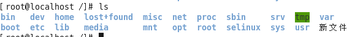
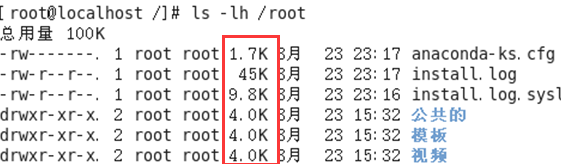
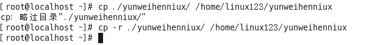

#  Linux Study Note


> 参考：
>
> [黑马程序员-linux从入门到精通](<https://www.bilibili.com/video/av23360560?from=search&seid=11213656872957708813>)
>
> 
>
> 


## Linux系统的文件


linux一切皆文件

文件操作种类：创建文件、编辑文件、保存文件、关闭文件、重命名文件、删除文件、恢复文件


### 文件目录结构

Bin：全称binary，含义是二进制。该目录中存储的都是一些二进制文件，文件都是可以被运行的。

Dev：该目录中主要存放的是外接设备，例如盘、其他的光盘等。在其中的外接设备是不能直接被使用的，需要**挂载（类似windows下的分配盘符**。

Etc：该目录主要存储一些配置文件。

Home：表示“家”，表示**除了root用户以外其他用户的家目录**，类似于windows下的User/用户目录。

Proc：process，表示进程，该目录中存储的是Linux运行时候的进程。

Root：该目录是root用户自己的家目录。

Sbin：全称super binary，该目录也是存储一些可以被执行的二进制文件，但是必须得有super权限的用户才能执行。

Tmp：表示“临时”的，当系统运行时候产生的临时文件会在这个目录存着。

Usr：全称是User Software Resource，注意不是user的缩写。存放的是用户自己安装的软件。类似于windows下的program files。

Var：存放的程序/系统的日志文件的目录。

Mnt：当外接设备需要挂载的时候，就需要挂载到mnt目录下。


## Linux的基本指令


linux指令指在linux终端（命令行）中输入的内容。

一个完整的指令的标准格式：Linux通用的格式

```shell
#指令主体 (空格) [选项] (空格) [操作对象]
```

一个指令可以包含多个选项，操作对象也可以是多个。


#### 1.`ls`指令

含义：ls（list）

##### 用法1：#ls

含义：列出当前工作目录下的所有文件/文件夹的名称




##### 用法2：#ls	路径

含义：列出指定路径下的所有文件/文件夹的名称

路径分为相对路径和绝对路径


##### 用法3：#ls	选项	路径

含义：在列出指定路径下的文件/文件夹的名称，并以指定的格式进行显示。

常见的语法：

```shell
#ls -l 路径
#ls -la 路径
```


选项解释：

​         -l：表示list，表示以详细列表的形式进行展示

​         -a：表示all，显示所有的文件/文件夹（包含了隐藏文件/文件夹）


上述列表中的第一列表示文档类型，**其中 “ - ” 表示改行对应的文档类型为文件，“ d ” 表示文档类型为文件夹**。


**在Linux中，隐藏文档一般以 “ . ” 开头。** 


##### 用法4：#ls	-lh	路径

含义：列出指定路径下的所有文件/文件夹的名称，以列表的形式并且在显示文档大小的时候以**可读性较高的形式显示**




ls列出的结果颜色说明，**其中蓝色的名称表示文件夹，黑色的表示文件，绿色的其权限为拥有所有权限**


#### 2.`pwd`指令

用法：#pwd					（print working directory，打印当前工作目录）


#### 3.`cd`指令

命令：#cd			（change directory，改变目录）

作用：用于切换当前的工作目录

##### 语法：#cd	路径

P.S. 在linux中有一个特殊符号~，用于表示当前用户的家目录


#### 4.`mkdir`指令

指令：mkdir		（make directory，创建目录）

##### 语法1：#mkdir	路径			

路径，可以是文件夹名称也可以是包含名称的一个完整路径

假如是文件夹名称，则在当前目录下创建该文件夹


##### 语法2：#mkdir	-p	路径

含义：**当一次性创建多层不存在的目录的时候**，添加-p参数，否则会报错


##### 语法3：#mkdir	路径1	路径2	路径3	...

表示一次性创建多个目录


#### 5.`touch`指令

作用：创建文件

语法：#touch	文件路径

路径可以是直接的文件名也可以是路径


一次性创建多个文件


#### 6.`cp`指令


指令含义：cp		（copy，复制）

作用：复制文件/文件夹到指定位置

##### 语法：#cp	被复制的文档路径	文档被复制到的路径

简单来说就是#cp	源地址	目的地址


**注意：Linux在复制过程中是可以重新对新位置的文件进行重命名的，但是如果不是必须的需要，则建议保持前后名称一致。**

**当使用cp命令进行文件夹复制操作的时候需要添加选项“-r”（-r表示递归复制），否则目录将被忽略**




#### 7.`mv`指令

指令含义：mv		（move，移动，剪切）

作用：移动文档到新的位置

##### 语法：#mv	需要移动的文件路径	需要保存的位置路径


注：在Linux中重命名的命令也是mv，语法和移动语法一样。


#### 8.`rm`指令

指令含义：rm		（remove，移除，删除）

##### 语法：#rm	选项	需要移除的文件路径

选项：	-f：force，强制删除，不提示是否删除

​				-r：表示递归

在删除的时候如果不带选项，会提示是否删除，如果需要确认则输入“y/yes”，否则输入

**注意：如果在删除的时候不想频繁的确认，则可以在指令中添加选项“-f”，表示force（强制）。**


删除一个文件夹：


**注意：删除一个目录的时候需要做递归删除，并且一般也不需要进行删除确认询问，所以移除目录的时候一般需要使用-rf选项。**

删除多个文件：


删除一个目录下具有公共特性的文件，例如都以Linux开头


其中**\*称之为通配符，意思表示任意的字符，Linux\*，则表示只要文件以Linux开头，后续字符则不管**。


#### 9.`vim`指令

指令：vim	（Vim是一款文本编辑器，号称编辑器之神）

##### 语法：#vim	文件路径

作用：可以打开一个文件，文件不存在时，可以创建该文件

vim其他用法参考本文后续。


#### 10.输出重定向

**一般命令的输出都会显示在终端中，有些时候需要将一些命令的执行结果想要保存到文件中进行后续的分析/统计，则这时候需要使用到的输出重定向技术。**

\>：覆输出，会覆盖掉原先的文件内容

\>>：追加输出，不会覆盖原始文件内容，会在原始内容末尾继续添加

##### 语法：#正常执行的指令 > / >>文件的路径

注意：文件可以不存在，不存在则新建


#### 11.`cat`指令

作用1：cat有直接打开一个文件的功能。

##### 语法1：#cat	文件的路径


作用2：cat还可以对文件惊醒合并

##### 语法2：#cat	待合并的文件路径1	待合并的文件路径2	...	文件路径n	>	合并之后的文件路径


#### 12.`df`指令

作用：查看磁盘空间

##### 语法：#df	-h

-h表示以较高可读性的形式展示大小


#### 13.`free`指令

作用：查看内存使用情况

##### 语法：#free	-m

-m表示以mb为单位查看


剩余的真实可用的内存为1665mb。

Swap：用于临时内存，当系统真实内存不够用的时候可以临时使用磁盘空间来充当内存。


#### 14.`head`指令

作用：查看一个文件的前n行，若不指定n，则默认显示前10行。

##### 语法：#head	-n	文件路径

n表示数字


#### 15.`tail`指令

作用1：查看一个文件的末n行，如果n不指定，则默认显示后10行

##### 语法：#tail	-n	文件路径

n表示数字


作用2：可以通过tail指令来查看一个文件的动态变化内容（变化的内容不能是用户手动添加的）

##### 语法：#tail	-f	文件路径

**该命令一般用于查看系统的日志比较多**


#### 16.`less`指令

作用：查看文件，以较少的内容进行输出，按下辅助功能键（数字+回车，空格键+上下方向键）查看更多

##### 语法：#less	需要查看的文件路径


退出的时候只需要按下q键


#### 17.`wc`指令

作用：统计文件内容信息（包含行数、单词数、字节数）

#### 语法：#wc	-lwc	需要统计的文件路径

-l：表示lines，行数

-w：表示words，单词数，依照空格来判断单词数量

-c：表示bytes，字节数


#### 18.`date`指令

作用：表示操作时间日期（读取、设置）

##### 语法1：#date

输出的形式：2019年8月24日	星期六	20:13:14

##### 语法2：#date	+%F	（等价于	#date	"+%Y-%m-%d"）

输出形式：2019-08-24

##### 语法3：#date	"+%F  %T"	（等价于	#date	"+%Y-%m-%d	%H:%M:%S"）

引号表示让“年月日与时分秒”成为一个不可分割的整体

输出的形式：2019-08-24	20:13:14

##### 语法4：#date	-d	"-1  day"	"+%Y-%m-%d  %H:%M:%S"

用于获取之前或者之后的某个时间（备份）


符号的可选值：+（之后）、-（之前）

单位的可选值：day（天）、month（月份）、year（年）
```shell
%F：表示完整的年月日

%T：表示完整的时分秒

%Y：表示四位年份

%m：表示两位月份（带前导0）

%d：表示日期（带前导0）

%H：表示小时（带前导0）

%M：表示分钟（带前导0）

%S：表示秒数（带前导0）

(以下摘自#date --help)
  %%	一个文字的 %
  %a	当前locale 的星期名缩写(例如： 日，代表星期日)
  %A	当前locale 的星期名全称 (如：星期日)
  %b	当前locale 的月名缩写 (如：一，代表一月)
  %B	当前locale 的月名全称 (如：一月)
  %c	当前locale 的日期和时间 (如：2005年3月3日 星期四 23:05:25)
  %C	世纪；比如 %Y，通常为省略当前年份的后两位数字(例如：20)
  %d	按月计的日期(例如：01)
  %D	按月计的日期；等于%m/%d/%y
  %e	按月计的日期，添加空格，等于%_d
  %F	完整日期格式，等价于 %Y-%m-%d
  %g	ISO-8601 格式年份的最后两位 (参见%G)
  %G	ISO-8601 格式年份 (参见%V)，一般只和 %V 结合使用
  %h	等于%b
  %H	小时(00-23)
  %I	小时(00-12)
  %j	按年计的日期(001-366)
  %k   hour, space padded ( 0..23); same as %_H
  %l   hour, space padded ( 1..12); same as %_I
  %m   month (01..12)
  %M   minute (00..59)
  %n	换行
  %N	纳秒(000000000-999999999)
  %p	当前locale 下的"上午"或者"下午"，未知时输出为空
  %P	与%p 类似，但是输出小写字母
  %r	当前locale 下的 12 小时时钟时间 (如：11:11:04 下午)
  %R	24 小时时间的时和分，等价于 %H:%M
  %s	自UTC 时间 1970-01-01 00:00:00 以来所经过的秒数
  %S	秒(00-60)
  %t	输出制表符 Tab
  %T	时间，等于%H:%M:%S
  %u	星期，1 代表星期一
  %U	一年中的第几周，以周日为每星期第一天(00-53)
  %V	ISO-8601 格式规范下的一年中第几周，以周一为每星期第一天(01-53)
  %w	一星期中的第几日(0-6)，0 代表周一
  %W	一年中的第几周，以周一为每星期第一天(00-53)
  %x	当前locale 下的日期描述 (如：12/31/99)
  %X	当前locale 下的时间描述 (如：23:13:48)
  %y	年份最后两位数位 (00-99)
  %Y	年份
  %z +hhmm		数字时区(例如，-0400)
  %:z +hh:mm		数字时区(例如，-04:00)
  %::z +hh:mm:ss	数字时区(例如，-04:00:00)
  %:::z			数字时区带有必要的精度 (例如，-04，+05:30)
  %Z			按字母表排序的时区缩写 (例如，EDT)


```


#### 19.`cal`指令

作用：用来操作日历的

##### 语法1：#cal				（等价于#cal	-l）

直接输出当前月份日历

##### 语法2：#cal	-3

表示输出上一个月+本月+下个月的日历

##### 语法3：#cal	-y	年份

表示输出某一个年份的日历


#### 20.`clear`  |  `(ctrl+L)`   指令

作用：清除终端中已经存在的命令和结果（信息）

##### 语法：#clear		或 		快捷键 ctrl  +  L

注意：该命令并不是真的清除了之前的信息，而是把之前的信息都隐藏到了最上面，可以通过滚动条继续查看以前的信息。


#### 21.管道pipe

##### 管道符：	|   

作用：管道一般可以用于“**过滤**”，“特殊”，“扩展处理”

##### 语法：管道不能单独使用，必须需要配合前面的指令一起使用，起作用**主要是辅助作用**


**①过滤**案例（**高频率使用**）：需要通过管道查询出根目录下包含“y”字母的文档名称。

```shell
#ls	| grep y

针对上面这个命令说明：
①以管道作为分界线，前面的命令有个输出，后面需要先输入，然后再过滤，最后再输出，通俗的讲就是管道前面的输出就是后面指令的输入；
②grep指令：主要用于过滤
```


②特殊用法案例：通过管道的操作方法来实现`less`的等价效果（了解）

之前通过less查看一个文件，可以`#less` 路径

现在通过管道还可以这么：`#cat 路径|less`

 

③扩展处理：统计某个目录下的文档的总个数？

**答：#ls / | wc -l**


#### 22.`hostname`指令

作用：操作服务器的主机名（读取or设置）

##### 语法1：#hostname

含义：表示输出完整的主机名

语法2：#hostname	-f

含义：表示输出当前主机名中的FQDN（全限定域名）


#### 23.`id`指令

作用：查看一个用户的一些基本信息（包含用户id，用户组id，附加组id...），该指令如果不指定用户则默认当前用户。

##### 语法1：#id

默认显示当前执行该命令的用户的基本信息

##### 语法2：#id	username

显示指定账户（username）的基本信息


验证用户信息可通过文件（`/etc/passwd`）

验证用户组信息可通过文件（`/etv/group`）


#### 24.`whoami`指令

作用：“我是谁？”，显示当前登录的用户名，**一般用于shell脚本，用于获取当前操作系统的用户名方便记录日志。**

##### 语法：#whoami


#### 25.`ps -ef`指令

指令：ps

作用：用于查看服务器进程信息

选项含义：

​	-e：等价于“-A”，表示列出全部的进程

​	-f：显示全部的列（显示全字段）


```
各列的含义：

UID：该进程执行的用户id；
PID：进程id；
PPID：该进程的父级进程id，如果一个程序的父级进程找不到，该程序的进程称之为僵尸进程（parent process ID）；
C：Cpu的占用率，其形式是百分数；
STIME：进行的启动时间；
TTY：终端设备，发起该进程的设备识别符号，如果显示“?”则表示该进程并不是由终端设备发起；
TIME：进程的执行时间；
CMD：该进程的名称或者对应的路径

```


##### #ps	-ef	|	grep	"进程名称"

用于查看特定进程的状态


#### 26.`top`指令

作用：查看服务器的进程占用的资源

##### 语法：进入命令：#top（动态显示）

##### 		   退出命令：按下q键


```
表头含义：
PID：进程id；
USER：该进程对应的用户；
PR：优先级；
VIRT：虚拟内存；
RES：常驻内存；
SHR：共享内存；
	计算一个进程实际使用的内存 = 常驻内存（RES）- 共享内存（SHR）
S：表示进程的状态status（sleeping，其中S表示睡眠，R表示运行）；
%CPU：表示CPU的占用百分比；
%MEM：表示内存的占用百分比；
TIME+：执行的时间；
COMMAND：进程的名称或者路径

```


在运行top命令时，可以有如下快捷键：

M：表示将结果按照内存（MEM）从高到低进行降序排列

P：表示将结果按照CPU使用率从高到低进行降序排列

1：当服务器拥有多个CPU的时候可以使用“1”快捷键来切换是否展示显示各个cpu的详细信息


#### 27.`du -sh`指令

作用：查看目录的真实大小

##### 语法：#du	-sh	目录路径

选项含义：

​		-s：summaries，只显示汇总的大小

​		-h：表示以高可读性的形式进行显示


#### 28.`find`指令

作用：用于查找文件（参数贼多，55个）

##### 语法：#find	路径范围	选项	选项的值

选项：

​	-name：按照文件名称进行搜索（支持模糊搜索）

​	-type：按照文件的类型进行搜索（文件类型：“-”表示文件，在使用find的使用需要用f来替换；“d”表示文件夹）


注：*为通配符，匹配所有字符


#### 29.`service`指令

作用：用于控制一些软件的服务启动、停止、重启

##### 语法：#service	服务名	start/stop/restart

例：启动本机安装的Apache，其服务名为httpd


* 其服务启动规则可自己编写，后续将会专门开一篇讲述


#### 30.`kill`指令

作用：表示杀死进程（当遇到僵尸进程或者处于某些原因需要关闭进程的时候）

##### 语法：#kill	进程的PID（需要配合ps一起使用）


与kill相似的命令：#killall

##### 语法：#killall	进程名称


#### 31.`ifconfig`指令

作用：用于操作网卡相关的指令

语法：#ifconfig（获取网卡信息）

注意该命令在windows环境下为ipconfig

Eth0表示Linux中的一个网卡，eth0是其名称。Lo（**loop，本地回还网卡，其ip地址一般都是127.0.0.1**）也是一个网卡名称。注意：inet addr就是网卡的ip地址。


#### 32.`reboot`指令

作用：重启计算机

##### 语法1：#reboot

重启

##### 语法2：#reboot	-w

模拟重启，但是不重启（只写关机与开机的日志信息）


#### 33.`shutdown`指令

作用：关机（慎用）

##### 语法1：#shutdown	-h	now	"关机提示"

##### 			 #shutdown	-h	time(14:41)	"关机提示"


如果想要取消关机计划的话，则可以按照以下方式去尝试：

**①针对于centos7.x之前的版本：ctrl+c**

**②针对于centos7.x（包含）之后的版本：#shutdown  -c**

>除了shutdown关机以外，还有以下几个关机命令
>
>`#init	0`
>
>`#halt`
>
>`#poweroff`
>
>


#### 34.`uptime`指令

作用：输出计算机的持续在线时间（计算机从开机到现在运行的时间）

##### 语法：#uptime


#### 35.`uname`指令

作用：获取计算机操作系统的相关信息

##### 语法1：#uname

获取操作系统类型

##### 语法2：#uname	-a

-a：表示all，表示获取全部的系统信息（**类型、全部主机名、内核版本、发布时间、开源计划**）


#### 36.`netstat	-tnlp`指令

作用：查看网络连接状态

##### 语法：#netstat	-tnlp


```shell
选项说明：
	-t：表示只列出tcp协议的连接；
	-n：表示将地址从字母组合转化成ip地址，将协议转化成端口号来显示；
	-l：表示过滤出“state（状态）”列中其值为LISTEN（监听）的连接；
	-p：表示显示发起连接的进程pid和进程名称；
```


#### 37.`man`指令

作用：manual，手册（包含了Linux中全部的命令手册，英文）

##### 语法：#man	命令

退出按下q键

例：#man	cp


## 编辑器之神——Vim编辑器


