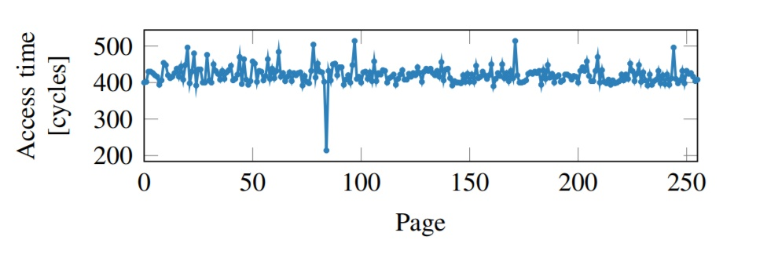

## 0x00 序


由于新型冠状病毒，美股多次熔断，我们的安全课也提到了熔断一词：Meltdown，将其与硬件安全联系在了一起

Meltdown，源自于2018年1月3日的两组CPU芯片漏洞之一

> 2018年1月3日，Google Project Zero（GPZ）团队安全研究员Jann Horn在其团队博客中爆出CPU芯片的两组漏洞，分别是Meltdown与Spectre。

**Meltdown对应CVE-2017-5754（乱序执行缓存污染），Spectre对应CVE-2017-5753（边界检查绕过）与CVE-2017-5715（分支目标注入）。看CVE编号就能知道，这两组漏洞早在2017年6月就已经由GPZ团队向英特尔提交，而在差不多时间由Lipp等人发布的论文Meltdown与Spectre Attacks也详细描述了这一攻击，从文中的声明来看，Lipp等人与GPZ团队似乎是独立发现了这两组漏洞。**

Meltdown漏洞影响几乎所有的Intel CPU和部分ARM CPU，而Spectre则影响所有的Intel CPU和AMD CPU，以及主流的ARM CPU。从个人电脑、服务器、云计算机服务器到移动端的智能手机，都受到这两组硬件漏洞的影响。

总所周知，软件更换肯定比硬件更换容易，软件某个版本有了bug或漏洞，我们大可换其版本，重装就完事了，或者不用他且罢，但是对于硬件级的漏洞，我们也只能从软件层面修复打补丁，或者也就只能等着修复了漏洞的新版CPU发布了，不过换CPU也是一件麻烦事。


> 参考：
>
> [Meltdown and Spectre](https://meltdownattack.com/)
>
> [Github - IAIK / meltdown](https://github.com/IAIK/meltdown)
>
> [Github - paboldin / meltdown-exploit](https://github.com/paboldin/meltdown-exploit)
>
> [Github - speed47 / spectre-meltdown-checker](https://github.com/speed47/spectre-meltdown-checker)
>
> [Meltdown.pdf——漏洞发现者的论文](meltdown.pdf)
>
> [Meltdown.pdf——论文翻译](https://blog.csdn.net/jus3ve/article/details/79202105)
>
> 
>
> [一步一步理解CPU芯片漏洞：Meltdown与Spectre](https://www.freebuf.com/articles/system/159811.html)：其中分析的exp是这个[Github - paboldin / meltdown-exploit](https://github.com/paboldin/meltdown-exploit)
>
> [Meltdown漏洞利用解读（Part 1）：基础篇](https://www.anquanke.com/post/id/148119)
>
> [首发：Meltdown漏洞分析与实践](https://mp.weixin.qq.com/s/zlspXeDGlAEzVsq2h6gg8w)
>
> [理解CPU Spectre漏洞](https://www.freebuf.com/column/161135.html)
>
> [解读 Meltdown & Spectre CPU 漏洞](https://zhuanlan.zhihu.com/p/32757727)
>
> [给程序员解释Spectre和Meltdown漏洞](https://zhuanlan.zhihu.com/p/32784852)
>
> 
>
> 修复：
>
> [史上最大CPU漏洞Meltdown & Spectre 影响与修复指南](https://www.freebuf.com/articles/system/159577.html)
>
> 


## 0x01 漏洞原理


计算机操作系统有一个最基本的安全目标：保证用户程序不能任意访问内核/其他用户程序的内存。一旦某个恶意应用可以任意访问其他应用程序/操作系统的内存，那么后果则不堪设想。

为了实现这个目标，操作系统和计算机硬件（CPU）采取了以下措施：

- 操作系统：通过虚拟内存为每个应用程序和内核开辟独立的地址空间，规定相应的访问权限。
- CPU：通过硬件实现支持虚拟内存（TLB）及其相应的访问权限。

举例来讲，如果有一个用户程序试图访问一个内核的内存地址，那么在CPU执行相应指令的过程中会探测到没有访问权限，进而触发中断/异常，导致程序终结。

所以一般情况下，除非恶意程序通过软件漏洞提权获得了内核权限，否则是无论如何也绕不过CPU 的权限检查从而能访问内核地址的。

具体来看，假设非法访问内存的指令为

```c
mov rax  byte[x]  // 将内核地址x处的内容存到寄存器rax
```

操作系统会事先标注好内核的内存地址范围，如果 x 在内核的这个地址范围内，并且 CPU 不是以内核模式运行的话，那么该指令会被 CPU 标注为非法，引起异常，异常处理程序会将 `rax` 清空为0，并且终结此程序，这样后续指令再来读 `rax` 的时候就只能读到0了。目前看来这一整套流程还是无懈可击的。

然而这里一个重要的前提假设是：**CPU 在做权限检查并且将 `rax` 清零的过程中，不会泄露任何关于 [x] 的信息**。

一般的恶意攻击者，采用的是前一种方法进行攻击：提权，让CPU通过权限检查，然而Meltdown却另辟蹊径，在 `rax` 寄存器清零的过程中，采用了侧信道攻击获取信息

Meltdown和Spectre这两个漏洞利用了这个过程，他们来源于芯片厂商为了提高CPU性能而引入的两种特性：乱序执行（Out-of-Order Execution）和预测执行(Speculative Execution)。

#### 乱序执行和预测执行

##### 乱序执行

简单来说，现代CPU执行效率太高，但是内存访问端的速度跟不上，因此现代处理器为了提高性能并不严格按照指令的顺序串行执行，而是对执行进行相关性分析后并行处理乱序执行。比如当处理器中的某些指令需要等待某些资源，处理器不会真的在这里等待而停止指令的执行，而是利用等待资源的时间继续执行后续的指令。在支持乱序执行的CPU中，后面的指令可能在前面指令执行结束前就开始执行了。（两个漏洞的万恶之源）

但是为了保证程序运行的正确性，处理器会对指令执行安全检查，只有当前用户权限符合指令权限时才能被执行，比如用户空间的指令访问内核内存处理器就会抛出异常。然而安全检查这个操作只有在指令退休（retirement——一条指令退休只有当它的执行的结果真正被提交并对系统可见时才会发生）时才会进行。也就是说，**如果在乱序执行中，指令并没有真正执行完成而只是加载到缓存中（下文会提）是不会执行安全检查的**。而此时由于乱序执行而被提前执行的指令会被处理器丢弃，但由于乱序执行的指令对缓存的操作在这些指令被丢弃时不会被重置。正是安全检查与乱序执行的空窗期才会让Meltdown有机可乘。


##### 预测执行

预测执行涉及到程序的控制流，现在处理器不是去解析所有分支指令后然后决定执行哪个操作，而是预测哪个控制流会更有可能被运行再提取相应的指令代码执行。如果预测正确的话，会带来很高的性能提升并提高处理器的并行性。如果预测错误，那些被预测执行的不正确结果会被丢弃，处理器会将状态恢复到预测执行行前的正确状态，再重新跳转到正确执行的分支或指令中运行。与乱序执行类似，预测执行对处理器缓存的操作会被保留。

### 攻击

这种机制从宏观上看似乎没什么问题，但由于处理器的缓存（cache）机制，那些被预测执行或乱序执行的指令会被先加载到缓存中，但在处理器恢复状态时并不会恢复处理器缓存的内容。而最新的研究表明攻击者可以利用缓存进行侧信道攻击，而Meltdown与Spectre从本质上来看属于利用处理器的乱序执行或预测执行漏洞进行的缓存侧信道攻击。


> * ##### 缓存侧信道攻击
>
> 缓存通过数据共享来加快数据访问，也就是说缓存命中与失效对应的响应时间是有差别的，攻击者正是利用这种时间的差异性来推测缓存中的信息，从而获得隐私数据。缓存侧信道攻击主要有Evict+Time[7]、Prime+Probe[6])与Flush+Reload[5]等攻击方式，这里主要简单介绍一下Flush+Reload，也是下文meltdown的exploit中利用的方法。
>
> 假设攻击者和目标程序共享物理内存（也可以是云中不同虚拟机共享内存），攻击者可以反复利用处理器指令将监控的内存块（某些地址）从缓存中驱逐出去，然后在等待目标程序访问共享内存（Flush阶段）。然后攻击者重新加载监控的内存块并测量读取时间(Reload阶段)，如果该内存块被目标程序访问过，其对应的内存会被导入到处理器缓存中，则攻击者对该内存的访问时间将会较短。通过测量加载时间的长短，攻击者可以清楚地知道该内存块是否被目标程序读取过。
>
> Meltdown与Spectre利用这种侧信道可以进行越权内存访问，甚至读取整个内核的内存数据。
>
> 


#### Meltdown攻击指令序列

以一个简化的meltdown攻击指令序列为例

```assembly
; rcx = kernel address
; rbx = probe_array
mov rax, byte [rcx]
shl rax, 0xc
mov rbx, qword [rbx + rax]
```

* `rcx`为我们非法访问的内核地址，`rcx`寄存器存放用户空间程序不可访问的内核地址

* `rbx`为我们用户空间中的一个数组，`rbx`寄存器指向探测数组`probe_array`

* `mov des src`，将`src`的数据移到`des`里，第三行的是尝试将内核地址中的一个字节移到`rax`寄存器中，是一个非法操作。该条指令视图访问内核地址，处理器会对其进行作安全检查，检查该进程是否有权限访问该地址。由于我们是以普通用户去执行的，因此这条指令会触发异常，该指令及之后的指令对寄存器的修改都会被丢弃，这样处理器能够回到正常执行的指令中，但由于处理器采用乱序执行的方式，在等待处理器完成该指令的同时（权限检查结束之前），后两条已经执行了，尽管他们都会被丢弃

* `shl des src`，将`src`逻辑左移`des`位，这里将读到的数据乘以4096（4KB，0xC,正好为x86架构中的一个页的大小4KB）

* 第五行指令将上一条作为索引，对`rbx`探测数组进行探测，简单来说就是遍历这个数组。理论上讲，执行第四行指令时，`rax`就应该清零了，但是由于乱序执行，第四行和第五行的指令将会被执行，知道异常处理的时候，将 `rbx` 和 `rax` 清零。


目前看起来确实没啥问题，因为`rbx`也会清零，任何关于内核地址的信息都没有留下来。

但是问题的关键就在第三行指令：**如果地址 `rbx + rax` 不在cache中的话，CPU 会自动将这一地址调入cache中，以便之后访问时获得更好的性能，然而异常处理并不会将这个cache flush掉。而这条 cache 的地址是和 `rax` 直接相关的，这样就相当于在 CPU 硬件中留下了和 `rax` 相关的信息。**

那么如何还原 `rbx + rax` 这个被cache的地址呢？这时候需要用到的原理就是利用cache的访问延时，即已经被cache的数据访问时间短，没有被cache的数据访问时间长。由于`rbx`这个array是在用户地址空间内的，可以自由操作，首先我们要确保整个 `rbx`这个数组都是没有被cache的，然后执行上述攻击代码，这时候 `rbx + rax` 这个地址就已经被cache了，接下来遍历整个`rbx` 探测数组，来测量访问时间，访问时间最短的那个 page 就可以确定为 `rbx + rax`。（如下图，图来自原论文meltdown）



可以看到访问速度最快的，就是已经被cache到的内核地址空间中的一个字节byte，如此循环，即可获得全部内核空间的数据。

github中的PoC就是利用`sudo cat /proc/kallsyms | grep “linux_proc_banner”`获取`linux_proc_banner`在内核中的地址，再读取该地址上的值，去获取 `/proc/version` 的内容，证明漏洞存在

> 至于和meltdown同期的spectre漏洞，和 meltdown 的原理相似，利用分支预测错误的 speculative execution，访问到不该访问的信息，并且同样是通过 cache 这个side channel 传递出去。而且由于利用的分支预测原理普及率非常高，Spectre 的影响面更大一些。


具体的Meltdown的exploit分析可以看这篇文章：[Meltdown_Exploit分析](https://www.freebuf.com/articles/system/159811.html#0X02 Exploit 分析)


我现在只是懂了他为什么这么做，但是我还想懂得他为什么会想到这么做（要去思考1.他做了什么2.他为什么这么做3.他为什么这样想4.忘了哪看到的逻辑层次(绝对不是百度搜出来的那个)

//TODO

[libkdump](https://github.com/IAIK/meltdown/tree/master/libkdump)这是作者开源出来的exp库，我们可以通过阅读(//TODO：等我对操作系统有着更深层次的理解时，来分析代码)并编译它，或者直接利用他编译后的库来使用


## 0x02 解决办法


* Linux上现在提出的解决手段是KPTI（通用技术称为Kaiser），内核和用户态不共享页表，每次你异常、IO、系统调用，都要把内核页表重新装进来。	
  https://lwn.net/Articles/738975/

* windows已经推送漏洞更新了，在某个系统补丁里0.0

  ```powershell
  //以管理员权限打开powershell运行命令
  //可以看到提示
  Set-ExecutionPolicy Bypass
  Install-Module SpeculationControl
  Get-SpeculationControlSettings
  ```

  

其余可参见文章：[史上最大CPU漏洞Meltdown & Spectre 影响与修复指南](https://www.freebuf.com/articles/system/159577.html)


## 0x03 漏洞危害


Meltdown与Spectre本质上都是基于缓存侧信道的攻击。

**Meltdown与Spectre主要用于信息泄露**，并不能对目标内存地址进行任意修改。攻击者必须要有执行权限才能进行攻击，对于一般用户只要不被执行恶意代码（比如访问恶意网站），就不会被Meltdown与Spectre攻击。但是在云端，攻击者可以租赁虚拟机来执行攻击者想要执行的任意代码，从而获取宿主物理机以及其它租户的信息，这对云服务商的冲击还是非常大的。


> 文中关于exp的思考问题：
>
> ### 值得进一步思考的问题
>
> > 1. 该利用代码一次只能探测一个字节的数据，如果在内核数据还没读取完整之前处理器已经处理异常了该怎么办？
> >    个人认为：觉得应该可以多次探测，不是每次都能这么快处理异常的
> >
> > 2. 探测数组target_array是否可以不用设置成256\*4KB，设置成512\*2KB，1024\*1KB效果会如何？
> >    个人认为：应该是可以的，但是感觉效率没有256 \* 4KB的效率高
> >
> > 3. 探测数组target_array是个大数组，占用多个内存页面，是否容易被检测到？
> >    个人认为：应该是不容易被检测到的，切换页面也需要时间，占多个页面导致效率大大降低
> >
> > 

