# llvm


> 参考：
>
> [LLVM官网](http://llvm.org/)
>
> [LLVM-docs](http://llvm.org/docs/) ：注意要查看对应版本的文档，每个版本文档都有所改变
>
> [Github-llvm/llvm-project](https://github.com/llvm/llvm-project/)
>
> [Github-llvm-mirror/llvm](https://github.com/llvm-mirror/llvm)
>
> 
>
> [LLVM基础(IR简介&CFG图生成&可视化)](https://www.jianshu.com/p/707c4f8af150)：可以生成可视化的IR流程图
>
> 
>
> 参考的GitHub
>
> [Github-heroims/obfuscator](https://github.com/heroims/obfuscator) ：移植好的ollvm9.0等
>
> [OLLVM代码混淆移植与使用](https://heroims.github.io/2019/01/06/OLLVM%E4%BB%A3%E7%A0%81%E6%B7%B7%E6%B7%86%E7%A7%BB%E6%A4%8D%E4%B8%8E%E4%BD%BF%E7%94%A8/) ：heroims的博客
>
> [Github-iamywang/obfuscator](https://github.com/iamywang/obfuscator)
>
> [Github-HikariObfuscator/Hikari](https://github.com/HikariObfuscator/Hikari)
>
> [Github-GoSSIP-SJTU/Armariris](https://github.com/GoSSIP-SJTU/Armariris)
>
> 
>
> [Github-obfuscator-llvm/obfuscator](https://github.com/obfuscator-llvm/obfuscator) ：官方版本
>
> [obfuscator-wiki](https://github.com/obfuscator-llvm/obfuscator/wiki)
>
> 
>
> [pediy.com---[原创]ollvm快速学习](https://bbs.pediy.com/thread-225756.htm)
>
> [llvm入门](https://juejin.im/post/5bfba01df265da614273939a)
>
> [OLLVM代码混淆移植与使用](https://heroims.github.io/2019/01/06/OLLVM%E4%BB%A3%E7%A0%81%E6%B7%B7%E6%B7%86%E7%A7%BB%E6%A4%8D%E4%B8%8E%E4%BD%BF%E7%94%A8/)
>
> [llvm学习（三）：移植ollvm等作品到单独编译的Pass](https://www.leadroyal.cn/?p=659)
>
> [蓝色的味道](https://zhuanlan.zhihu.com/frozengene)：谁说不能与龙一起跳舞：Clang / LLVM
>
> [OLLVM代码混淆移植与使用](https://www.jianshu.com/p/e0637f3169a3)
>
> [llvm入门笔记](https://zhuanlan.zhihu.com/llvm-tutorial)
>
> [llvm编译流程](https://www.jianshu.com/p/333cf1c02a0e)
>
> 
>
> [LLVM学习总结与OLLVM项目分析](https://www.jianshu.com/p/942875aa73cc)
>
> [Obfuscator-llvm源码分析](https://sq.163yun.com/blog/article/175307579596922880)
>
> [ollvm源码分析](https://blog.csdn.net/king_jie0210/article/details/81705540)
>
> [[原创]ollvm源码分析 - Pass之Flattening](https://bbs.pediy.com/thread-255130.htm)
>
> [[原创]ollvm源码分析 - Pass之SplitBaiscBlocks](https://bbs.pediy.com/thread-255078.htm)
>
> [GoSSIP安全研究项目：孤挺花（Armariris） LLVM混淆框架](https://zhuanlan.zhihu.com/p/27617441)
>
> [为OLLVM添加字符串混淆功能](https://mp.weixin.qq.com/s/rORMNBExWVyGvWMFvYTXPw)
>
> [llvm之旅第四站 － 编写Pass](http://www.nagain.com/activity/article/14/)
>
>
> [Github-haidragon / study_obscure](https://github.com/haidragon/study_obscure)
>
> 
>
> 
>
> [[原创]Fllvm（Fuck-ollvm）介绍](https://bbs.pediy.com/thread-225681.htm)
>
> 
>
> 


## 啥是LLVM？


> [[原创]LLVM了解篇剧场版](https://bbs.pediy.com/thread-247981.htm)

以上这篇文章简要地介绍了LLVM

LLVM：Low Level Virtual Machine(最初)

官方定义：**LLVM是一个模块化和可重用的编译器和工具链技术的集合**

LLVM最初是在2000年由伊利诺伊大学香槟分校(UUIC)的学生Chris Lattner及其硕士顾问Vikram Adve创建的研究项目，并在2003年发布第一个正式版本，目的是提供一种基于SSA的现代编译策略，这种策略能够支持任何编程语言的静态和动态编译。

有意思的是，他的作者原本想要写一个低层虚拟机的，然而他并没有被当成虚拟机来用，逐渐地偏离了他原本的方向。现在llvm不是任何单词的缩写，而是一种体系，包含了一系列的项目

对于LLVM核心（LLVM Core）来说，它是一个编译器基础设施框架，它包含了为我们编写编译器一系列的库（如程序分析、代码优化、机器代码生成等），并且提供了调用这些库的相关工具，如llvm-opt可以调用LLVM优化相关的库，llvm-mc可以调用LLVM机器代码生成相关的库。并为此提供了一个非常方便简单、具备类型的、平台无关的统一中间代码语言，称之为LLVM IR.


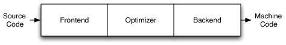


以上是一个正常编译器的流程，源代码经过前端编译成中间代码，在经过优化和后端生成相应的机器码，即可执行文件


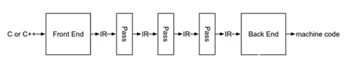

LLVM编译一个源文件的过程：预处理 -> 词法分析 -> Token -> 语法分析 -> AST -> 代码生成 -> LLVM IR -> 优化 -> 生成汇编代码 -> Link -> 目标文件

> 其中IR(intermediate representation)是前端语言生成的中间代码表示，也是Pass操作的对象，它主要包含四个部分：
>
> （1）Module：比如一个.c或者.cpp文件。
>
> （2）Function：代表文件中的一个函数。
>
> （3）BasicBlock：每个函数会被划分为一些block，它的划分标准是：一个block只有一个入口和一个出口。
>
> （4）Instruction：具体的指令。
>
> IR中各部分的具体关系如下图：
>
> 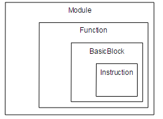


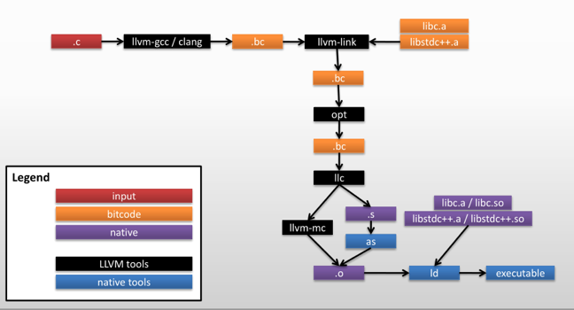

拿个例子来说就是：首先，我们有C代码程序文件，然后经过了Clang前端（或者古老的llvm-gcc前端，这是在Clang出现以前使用的前端，可以产生LLVM IR），然后会产生LLVM IR。在这里，我们可以发现LLVM IR是以.bc结尾，缩写代表的单词是bitcode，它是序列化的数据，用以存储在磁盘中。而LLVM IR非常牛逼的创建了三种LLVM IR表示格式，除了bitcode这种用以存储的格式，第二种是用于人类可读的的格式，一般以.ll结尾。

```sh
$ clang a.c -S -emit-llvm# 生成.ll可读文件
```

这条命令即可产生`.ll`文件

而第三种格式则是内存表示格式，这一般是用于我们程序开发，去操作LLVM IR。那么这里面有一个宏观的概念，那就是一个编译单元（即一个.c文件），在LLVM IR中代表着一个Module，而一个Module里面含有Global Value，主要包括Global Variable 和 Function，而至于Global Alias大家接触比较少，我们暂时忽略。而一个Function里面包含着Basic Block，而一个 Basic Block里面包含着指令，如add。那么关系你可以认为是Module -> Function -> Basic Block -> Instructions. 这是一个宏观的认识，需要具备。而这一个也就是我们常常去查阅的相关LLVM IR的API，如：[llvm-GlobeValue](http://llvm.org/docs/doxygen/html/classllvm_1_1GlobalValue.html)

而这里明确的一点是，这三者是完全等价的，并且可以转换的

再回到上面的流程图，即产生`.bc`的阶段。产生完毕后，它这里直接进入`llvm-link`阶段，其实不太完整。若是我们使用了O2等优化，我们在这里还会经历一个优化的阶段，即对这一个编译单元的优化，大约包括了40多种优化Pass，如死代码消除，内联等。而经过优化后，依然是.bc文件，然后再进入llvm-link阶段。而在llvm-link阶段，所要做的其实就是把多个.bc文件合并成一个.bc文件，并且做链接时优化，在这篇文章中提到过一个例子：[LLVM Link Time Optimization](http://llvm.org/docs/LinkTimeOptimization.html)，可以查阅一下是如何进行链接时优化的。

而经过`llvm-link`阶段后，我们得到了一个新的`.bc`文件，那么我们会再次进入优化阶段，重新再进行一次优化。因为经过`llvm-link`后，我们的IR结构可能发生了一些变化，从而可能更有利于我们优化，得到更优化的IR。而这一步骤后，可以得到最终优化后的.bc，正式进入代码生成阶段。

而在这一幅图中，只列举出来了一个llc，即走机器代码生成的路径。其实对于LLVM来说，还可以有一个过程，那就是lli，即解释执行LLVM IR。不过我们这里不多谈，我们重点在机器代码生成。那么llc的作用就是把LLVM IR 编译成汇编文件`.s`，这里你可以把LLVM IR想象成一个编程语言，然后经过了llc编译器，最后产生了汇编文件。如同C程序，经过Clang，产生了LLVM IR一般。那么，产生了汇编文件以后，就可以调用系统的汇编器，如GNU的as，从而产生目标文件object file，即`.o`文件了。而细心的童鞋可能注意到了这里还有一条路径是`llvm-mc`，直接走生成object file的过程。而这条路径在如今来说，并不是每个平台都会走，核心在于LLVM本身的集成汇编器，即`-fintegrated-as`，使用集成汇编器既可以使用MCLoweing到MCInst，再使用MCStreamers直接到`.o`，当然也可以到`.s`。而目前本身的集成汇编器，我认为是并非完美，但是以发展趋势来看，会大一统的，从而做到没有平台差异，这也是LLVM做集成汇编器的一大理由。而生成完.o文件，剩下的过程就很简单了，就是链接器链接相关的库，然后和目标文件一起生存可执行文件`.out / .exe`了。


```sh
# 二进制代码形式
$ clang -emit-llvm -c main.c -o main.bc

# 可读文本代码形式
$ clang -emit-llvm –S -c main.c -o main.ll
```


* #### llvm 和 clang 的关系

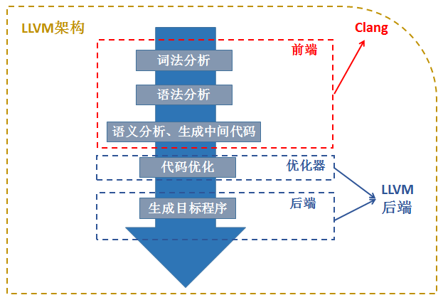

对于 LLVM 来说，其前端是 clang，在编译源码文件的时候使用的编译工具也是 clang。
而生成中间 IR 代码后，llvm需要对 IR 代码进行一些操作，例如添加一些代码混淆功能。LLVM 的做法是通过编写 Pass(其实就是对应的一个个模块，每个类实现不同的功能)来实现混淆的功
能。所以实现混淆，其实就是编写功能性的 Pass


### Obfuscator-LLVM


Obfuscator-LLVM是由瑞士伊夫尔东莱班的应用科学与艺术大学信息安全小组（HEIG-VD）于2010年6月发起的一个项目。

该项目的目的是提供[LLVM](http://www.llvm.org/)编译套件的开源分支，该套件能够通过[代码混淆](http://en.wikipedia.org/wiki/Obfuscation_(software))和防篡改来提高软件安全性。由于我们目前大部分工作在[中间表示](http://en.wikipedia.org/wiki/Intermediate_language)（IR）级别，因此我们的工具与所有编程语言（C，C ++，Objective-C，Ada和Fortran）和目标平台（x86，x86-64，PowerPC，PowerPC-64）兼容。

LLVM当前支持的ARM，Thumb，SPARC，Alpha，CellSPU，MIPS，MSP430，SystemZ和XCore）。

Obfuscator-LLVM的目的主要是在编译时增强软件就对抗向工程和编译时修改（动态调试？）


#### Install

可以直接从github上下载源码

```sh
$ git clone -b llvm-4.0 https://github.com/obfuscator-llvm/obfuscator.git
$ mkdir build
$ cd build
# 如果不想跑测试用例加上-DLLVM_INCLUDE_TESTS=OFF 
$ cmake -DCMAKE_BUILD_TYPE=Release ../obfuscator/
$ make -j7
```


然而我在4核4G虚拟机里编译将近2h，还报错了tcl

我现在只想再来几根内存条 :(

```sh
error:virtual memory exhausted:Cannot allocate memory
$ make -j7 >>40%

$ make -j4 >>95%

$ make -j2 >>100%
```


#### o-llvm手动打包


> http://www.few.vu.nl/~lsc300/LLVM/doxygen/index.html
>
> API Document


因为我下的ollvm9.0的`-fla`有bug，所以决定亲自打包一波，顺便再深入了解ollvm

由Diffinity将ollvm4.0和llvm4.0进行对比，发现了以下文件的不同，也就意味着我们将ollvm打包进最新的llvm也需要修改以下文件。

```sh
./include/llvm/Transforms/Obfuscation/ # obfuscation的头文件
./include/llvm/Transforms/CryptoUtils.h # obfuscation的头文件
./lib/Transforms/IPO/LLVMBuild.txt
./lib/Transforms/IPO/PassManagerBuilder.cpp # Pass注册
./lib/Transforms/Obfuscation/ # obfuscation source code
./lib/Transforms/CMakeLists.txt
./lib/Transforms/LLVMBuild.txt
./tools/clang # 集成clang,要在gitignore里取消clang的注释
./.gitignore
./CMakeLists.txt
./CODE_OWNERS.TXT
./LICENSE.TXT
```


从自己的github的obfuscator仓库中clone下来，注意一定要clone，直接下载downloadzip没有.git信息，虽然他真的很慢。

然后创建自己的llvm9.0分支

```sh
$ git clone git@github.com:Magic-King/obfuscator.git
Cloning into 'obfuscator'...
remote: Enumerating objects: 86723, done.
remote: Total 86723 (delta 0), reused 0 (delta 0), pack-reused 86723
Receiving objects: 100% (86723/86723), 132.79 MiB | 35.00 KiB/s, done.
Resolving deltas: 100% (15346/15346), done.
$ git  branch -a
* master
  remotes/origin/HEAD -> origin/master
  remotes/origin/clang-425.0.24
  remotes/origin/llvm-3.3
  remotes/origin/llvm-3.4
  remotes/origin/llvm-3.5
  remotes/origin/llvm-3.6.1
  remotes/origin/llvm-4.0
  remotes/origin/master

$ git  branch -r
  origin/HEAD -> origin/master
  origin/clang-425.0.24
  origin/llvm-3.3
  origin/llvm-3.4
  origin/llvm-3.5
  origin/llvm-3.6.1
  origin/llvm-4.0
  origin/master

$ git remote add origin git@github.com:Magic-King/obfuscator.git
fatal: remote origin already exists.

$ git checkout -b llvm-9.0
Switched to a new branch 'llvm-9.0

$ git push origin llvm-9.0
Total 0 (delta 0), reused 0 (delta 0)
remote:
remote: Create a pull request for 'llvm-9.0' on GitHub by visiting:
remote:      https://github.com/Magic-King/obfuscator/pull/new/llvm-9.0
remote:
To github.com:Magic-King/obfuscator.git
 * [new branch]          llvm-9.0 -> llvm-9.0

```

然后把最新的llvm9.0.1放入`obfuscator/`文件夹下，把clang放入 `obfuscator/tools/clang`里

然后将obfuscator-llvm4.0移植到obfuscate里，具体可以查看我的github的commit记录

网址如下：https://github.com/Magic-King/obfuscator/commits/llvm-9.0

但是，手动打包之后，`-fla`还是有问题，不过其他选项倒是没问题，应该是`-fla`和llvm-9.0不兼容的问题


#### o-llvm的特点

* [nstructions Substitution](https://github.com/obfuscator-llvm/obfuscator/wiki/Instructions-Substitution) `-mllvm -sub`：指令替换
* [Bogus Control Flow](https://github.com/obfuscator-llvm/obfuscator/wiki/Bogus-Control-Flow) `-mllvm -bcf`：伪控制流
* [Control Flow Flattening](https://github.com/obfuscator-llvm/obfuscator/wiki/Control-Flow-Flattening) `-mllvm -fla`：激活控制流扁平化
* [Functions annotations](https://github.com/obfuscator-llvm/obfuscator/wiki/Functions-annotations)：可以针对一些特定函数进行混淆（选择性混淆）


##### [nstructions Substitution](https://github.com/obfuscator-llvm/obfuscator/wiki/Instructions-Substitution)

这种混淆技术的目标仅在于用功能上等效但更复杂的指令序列代替标准的二进制运算符（如加，减或布尔运算符）。当几个等效的指令序列可用时，随机选择一个。

这种混淆非常简单，并且不会增加很多安全性，因为可以通过重新优化生成的代码轻松地将其删除。但是，如果伪随机数发生器使用不同的值作为种子，则指令替换会在生成的二进制文件中带来多样性。

当前，只有整数运算符可用，因为用浮点值替代运算符会带来舍入误差和不必要的数值误差。


可用的编译器选项：

- `-mllvm -sub`：激活指令替换
- `-mllvm -sub_loop=3`：如果激活了通行证，则将其应用到功能上3次。默认值：1。


wiki中提到了可替换的运算：add、sub、and、or、xor。


##### [Bogus Control Flow](https://github.com/obfuscator-llvm/obfuscator/wiki/Bogus-Control-Flow) 

该方法通过在当前基本块之前添加一个基本块来修改函数调用图。这个新的基本块包含一个不透明的谓词，然后有条件地跳转到原始的基本块。

原始的基本块也将被克隆并填充以随机选择的垃圾指令。

可用的编译器选项：

- `-mllvm -bcf`：激活伪控制流程
- `-mllvm -bcf_loop=3`：如果激活了通行证，则将其应用到功能上3次。默认值：1
- `-mllvm -bcf_prob=40`：如果激活了通行证，则基本团块将以40％的概率被混淆。默认值：30


##### [Control Flow Flattening](https://github.com/obfuscator-llvm/obfuscator/wiki/Control-Flow-Flattening)

此过程的目的是完全弄平程序的控制流程图。简单来说就是拆分基本块并置于无限循环中，程序流程由switch控制

可用的编译器选项：

- `-mllvm -fla`：激活控制流展平
- `-mllvm -split`：激活基本块分割。一起使用可改善展平性。
- `-mllvm -split_num=3`：如果激活了通行证，则在每个基本块上应用3次。默认值：1


##### [Functions annotations](https://github.com/obfuscator-llvm/obfuscator/wiki/Functions-annotations)

注释使您可以按功能指定要应用（或不应用）混淆的功能

用法：只需向您的函数添加属性。

例如：

```c++
int foo() __attribute((__annotate__(("fla"))));
int foo() {
   return 2;
}
```

您可以为每个功能添加使用一个或多个注释。如果要禁用功能的混淆，也可以使用“反向标志”（例如，如果要禁用功能的伪造控制流，请使用注释“ nobcf”）。


#### 对比


我自己写了一个测试文件，然后用于clang和ollvm混淆的各种测试

源代码如下，关于混淆之后的执行文件和源文件打包在了[here](./test.zip)

```c
#include <stdio.h>
#include <stdlib.h>

int main(){
	printf("Hello LLVM");
	char *a= "Hello fucking bug";
	//a = "Hello O-LLVM!I will fuck you!";
	int sum = 0;
	for (int i = 1;i<=10;i++){
		sum += i;
	}
	printf("%s\nthe answer of what i do is %d\n",a,sum);
	printf("test finished!\n");
	return 0;
}
```


以下是gcc编译的文件通过ida逆向所得的流程图

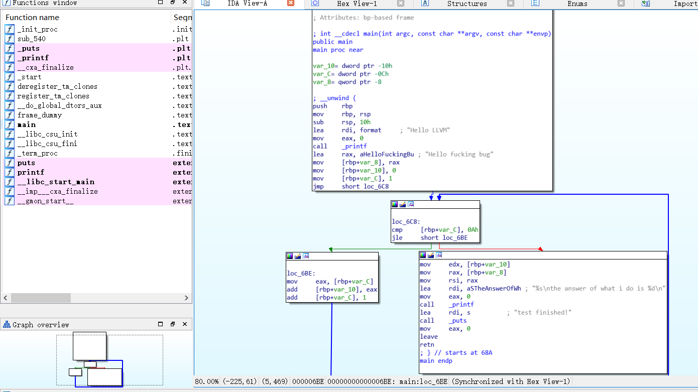


以下是用clang9.0 编译test的流程图，可见大体的流程是和gcc相同的，不过通过ida的万能F5反编译出来的源码，clang版本的基本和源码差不多，gcc版本的循环的变量挺奇怪的，但是总体流程还是不变的

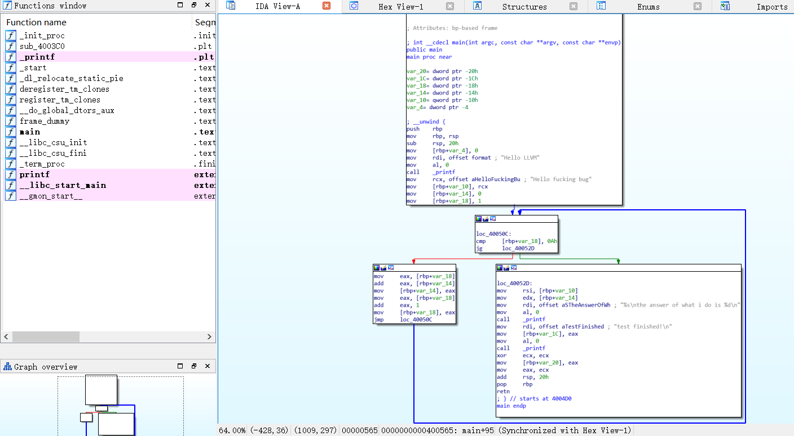


下图是加了ollvm的bcf选项的反汇编结果，可见添加了许多虚假控制流，真正执行的循环是左半部分，他把for循环结束之后的该执行的语句放到了右半部分，在添加虚假控制流

看反汇编的代码，他把for循环放入了一个while循环里，然后用一个if控制是否结束原来的循环，加入结束，就用`goto`到达最后执行的语句里，这里又写了一个假的while，经我看下来，这个while也就执行一次，循环就退出了，果然混淆后想搞懂流程贼麻烦

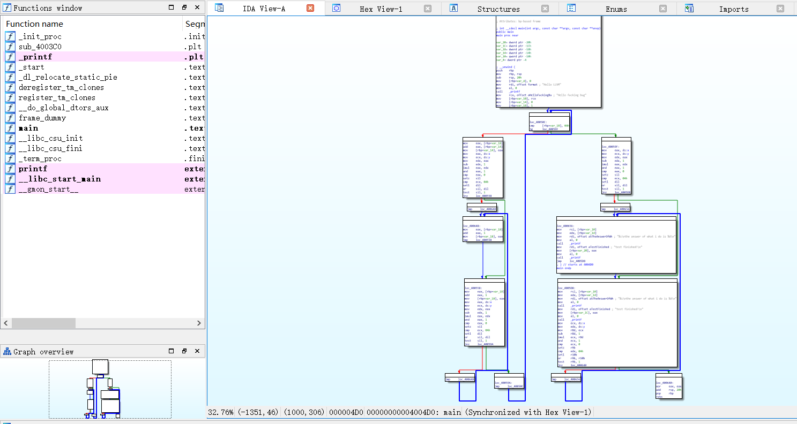


ollvm编译fla选项，由于适配llvm9.0的fla选项失败了，所以这边是引用-split选项得出来的反汇编结果，split也就是fla平坦化所选择的选项

对比原来的clang反汇编出来的结果是不是多了许多可供选择的路，正如wiki所说是用switch控制的

反汇编出来的代码嵌套了多层while循环，并加入if判断，低层应该就是用switch实现的，然后再某几个switch case加入break破坏循环达到控制流程的目的

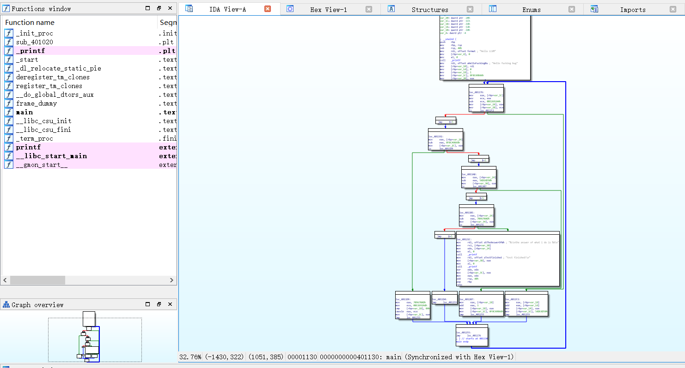


这个是最简单的，和clang编译的版本对比，主要区别在于分块之后的左边的块，他把其指令进行了替换，具体咋替换看我后面的源码分析

不过可惜的是，这个代码替换对于ida来说好像不是什么大事情，利用万能的F5反汇编时，他成功把循环里的加法还原了，产生的代码和clang版本没混淆的一模一样

可能这需要和其他几个选项一起使用会比较好

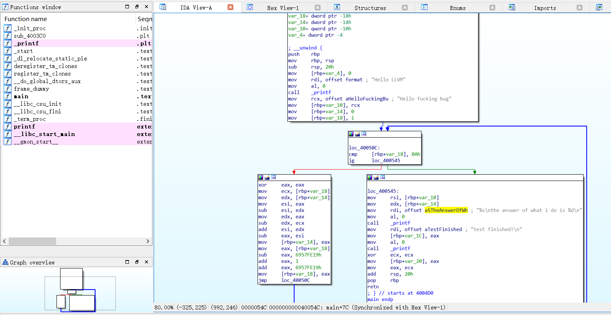


//TODO：字符串混淆


### o-llvm源码分析


通过我们手动将ollvm与llvm9.0打包的过程，我们可以非常清楚地了解了ollvm的源码结构

```sh
./include/llvm/Transforms/Obfuscation/ # obfuscation的头文件
./include/llvm/Transforms/CryptoUtils.h # obfuscation的加密工具类的头文件
./lib/Transforms/IPO/LLVMBuild.txt # pass模块编译的模块注册
./lib/Transforms/IPO/PassManagerBuilder.cpp # Pass注册
./lib/Transforms/Obfuscation/ # obfuscation source code
./lib/Transforms/CMakeLists.txt # 加入子目录
./lib/Transforms/LLVMBuild.txt # 加入LLVM编译子目录
```

我们知道，ollvm就是通过编写llvm的pass来将其中间语言IR进行不同程度的混淆


#### Bogus Control Flow

**Bogus Control Flow**的功能是为函数增加新的虚假控制流和添加垃圾指令。

其中文件位于`./include/llvm/Transforms/Obfuscation/BogusControlFlow.cpp`

其中的注释跟我们非常形象的演示了其的工作内容

```cpp
// This file implements BogusControlFlow's pass, inserting bogus control flow.
// It adds bogus flow to a given basic block this way:
//
// Before :
// 	         		     entry
//      			       |
//  	    	  	 ______v______
//   	    		|   Original  |
//   	    		|_____________|
//             		       |
// 		        	       v
//		        	     return
//
// After :
//           		     entry
//             		       |
//            		   ____v_____
//      			  |condition*| (false)
//           		  |__________|----+
//           		 (true)|          |
//             		       |          |
//           		 ______v______    |
// 		        +-->|   Original* |   |
// 		        |   |_____________| (true)
// 		        |   (false)|    !-----------> return
// 		        |    ______v______    |
// 		        |   |   Altered   |<--!
// 		        |   |_____________|
// 		        |__________|
//
```


他的Cpp文件先写好了Debug信息，再定义了以下为pass提供的选项常量

其中，我们最常见的 `cl::opt<data_type>`是用来传递llvm之间pass共享的参数，也就是我们在编译时所给的`-bcf_prob = 50`这个命令行编译参数可以传递到pass的核心所在

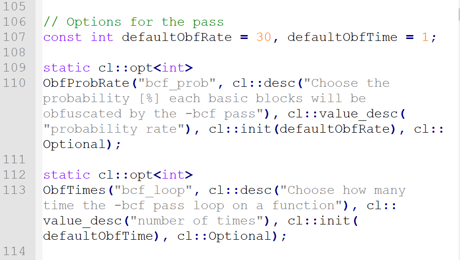

`cl::opt`这个用法让我想起了c++中`std::cout`、`using namespace std`，经查询发现，这是一个类似于python的import的一个语法，namespace是为了和c的.h区分开来

> 详细可见：
>
> [C++ Namespace 详解](https://www.cnblogs.com/MrYuan/p/4955956.html)
>
> [C++ 命名空间](https://www.runoob.com/cplusplus/cpp-namespaces.html)
>
> [C++/C++11中命名空间(namespace)的使用](https://blog.csdn.net/fengbingchun/article/details/78575978)：这里面有一段折磨人的代码，读懂了应该就懂了c++的namespace的作用域

目前读下来，最常见的应该就是`namespace llvm`和 `namespace cl`了

```cpp
struct BogusControlFlow : public FunctionPass
```

这里，BogusControlFlow继承至FunctionPass，因此它的入口函数即为runOnFunction

> struct的继承和class的继承有很大的区别，struct的继承是基于子类(struct)的public继承，class是基于子类(class)的private继承

整个namespace写了一个struct 类用于混淆

其中`runOnFunction`为入口函数，先判断bcf的两个参数`-bcf_loop`和`-bcf_prob`是否符合正确范围内，然后检查是否启用了`-bcf`选项，假如启用了，则进入核心函数`bogus(F);`，然后继续处理`doF(*F.getParent());`

在`bogus()`函数里，先实现了Debug的相关部分，在每次进入函数前输出debug信息，用于处理debug模式下的`-bcf`选项。然后定义一个list链表，用于储存BasicBlock，BasicBlock用for循环利用迭代器的模式从传入的 `F` 获取。一个while循环，当基本块非空时，利用`cryptoutils`工具类获取随机数，从链表中选择基本块进行混淆(用`addBogusFlow(basicBlock, F);`函数)，并标记已混淆过该块，防止重复混淆某一基本块，否则就不混淆。然后弹出链表中的第一块，这样直到混淆次数为0为止。

`addBogusFlow()`函数，将给定的基本块进行添加虚假控制流。首先获得一个基本块Basic Block，利用createAlteredBasicBlock()函数生成一个与原基本块相似的Basci Block，然后利用`BasicBlock->getTerminator()->eraseFromParent();`把他们的父母节点擦除，然后创建两个条件恒为真的左右子节点，然后将其创建分支循环。（其过程是创建一个恒真的分支，进入分支的基本块后，加入一个判断，若真进入原基本块，若假进入假基本块，经假基本块的垃圾代码之后，再进入原基本块。在为真时，进入原基本块，将基本块主体执行完之后，在加入分支判断，正确返回结果，错误跳转至混假基本块进行循环）

> https://sq.163yun.com/blog/article/175307579596922880：这个讲的特别形象，配合着图一起阅读，这边借用其一张图

```c
int add(int a, int b){
    return a+b;
}
```

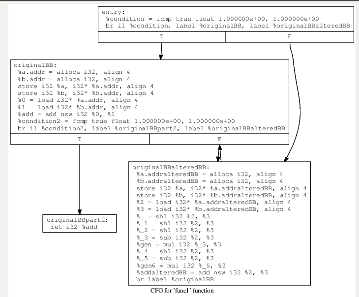

如图，对于上述函数，分离其基本块，创建一个入口entry，然后加入一个恒真的分支，把生成相似的基本块放至错误分支里，即其永远不会执行的垃圾代码，将所执行的基本块放入正确分支里

`createAlteredBasicBlock()`函数用于生成与给定基本块相似的基本块，将操作运算符进行重新映射，重新映射节点，重新映射对应的数据，然后加入随机的指令

对于`doF()`函数，该函数的功能是将Function中所有为真的判断语句进行替换，比如之前的`1.0 == 1.0 `。它的思想是定义两个全局变量x、y并且初始化为0，然后遍历Module内的所有指令，并将所有的FCMP_TRUE分支指令替换为`y<10 || x*x(x-1)%2 ==0`，我们从反汇编的代码来看，很明显的就有y<10这个分支


#### Flattening

**Flattening**的主要功能是为函数增加switch-case语句，使得函数变得扁平化。下面就对它的实现源码进行分析。

其中文件位于`./include/llvm/Transforms/Obfuscation/Flattening.cpp`

Flattening继承了`FunctionPass`，因此它的入口函数即为`runOnFunction`。在`runOnFunction`函数的具体实现中，首先判断是否包含了启动`-fla`的命令。在编译目标程序代码时，如要启动fla模块，需要带上参数`-mllvm -fla`。

参数检查完毕之后，调用flatten函数。flatten函数是该Pass的核心，下面对该函数进行分析。

先是声明了一些后面要用的变量，然后创建了一个数组，用来存储随机数种子

```c++
// SCRAMBLER
  char scrambling_key[16];
  llvm::cryptoutils->get_bytes(scrambling_key, 16);
  // END OF SCRAMBLER  
// Lower switch
  FunctionPass *lower = createLowerSwitchPass();
  lower->runOnFunction(*f);
```

后两行调用了外部一个外部pass：`creatLowerSwitchPass()`，用来消除当前函数的内部用switch方式的代码，将其全转换成`if else`的调用，方便后面的代码块分割

然后一个for循环，像bcf那样，将函数分为各个基本块储存在`vector<BasicBlock *> origBB`的一个向量数组里，等等的代码是针对基本块的操作，就像乐高那样一块块进行拼接。

然后的话，若只有一个以下的基本块，那么无法平坦化，直接返回`false`

然后开始遍历基本块，先把第一块从vector数组中移除，因为按照他的流程平坦化的设计，第一块进行单独处理，作为整个混淆流程的开始逻辑，所以紧接着先对第一块进行处理。

检查第一块中是否包含条件跳转分支，如果包含条件跳转分支，则按照条件分支的位置进行代码块分割，分割逻辑跟SplitBasicBlock的逻辑一致，整个分割的目的也是为了后面进行流程平坦化准备的


然后开始是核心代码了

```c++
// Create switch variable and set as it
  switchVar =
      new AllocaInst(Type::getInt32Ty(f->getContext()), 0, "switchVar", insert);
  new StoreInst(
      ConstantInt::get(Type::getInt32Ty(f->getContext()),
                       llvm::cryptoutils->scramble32(0, scrambling_key)),
      switchVar, insert);
```

这一段创建了一个switch用的变量，相当于是`switch(caseVar)`，并通过`StoreInst`进行赋值，这时就用上了之前的随机数种子，将生成的随机数用作case。

接着创建了两个空的基本块`loopEntry`和`loopEnd`，然后将switch语句放入`loopEntry`中，将第一块基本块连接上`loopEntry`，`loopEnd`跳转回`loopEntry`，在switch语句加入默认的`swDefault`基本块大概成型了

大概就和下面这个流程图差不多了

```c++
//				  	+--------+
//                  |first bb|
//                  +---+----+
//                      |
//                 +----v----+
//                 |loopEntry| <--------+
//                 +----+----+          |
//                      |               |
//                 +----v---+           |
//                 | switch |           |
//                 +----+---+           |
//                      |               |
//         +------------+               |
//         |                            |
//	+------v-------+                    |
//	| default case |                    |
//	+------+-------+                    |
//         |                            |
//         +-----------+                |
//                     |                |
//                     |                |
//                     v                |
//               +-----+------+         |
//               |  loopEnd   +---------+
//               +------------+
```

骨架成型了，接下来把剩余的基本块往switch语句中填入就行了。

但是填入之后肯定是个死循环了，我们这时候就要活用flatten的思想，控制switch case的caseVar的值来达到控制流程的目的——很简单，在每个基本块即每个case之后，补上一条对caseVar的值更新的语句即可达到控制流程的目的

剩下代码就是来更新每个case中代码块对caseVar的操作了，怎么更新呢，很简单，就是更新成当前代码块原后续逻辑块在当前这个代码框架下的case值

接下来的操作分三种情况来进行

* case中代码块没有后续块，那就是一个返回块，不需要更新caseVar

* case中代码块只有一个后续块，也就是一个无条件跳转分支，直接更新成后续块对应的case即可

* case中代码块有2个后续块，也就是一个条件跳转分支，通过successor对象（就是后续块的意思）直接在switch结构中查找出对应的case值

  ```c++
  SelectInst *sel =SelectInst::Create(br->getCondition(), numCaseTrue, numCaseFalse, "",i->getTerminator());
  ```

  如上，使用llvm的SelectInst来实现分支选择，像227行写的，根据br->getCondition()是否为True来决定是跳转到numCaseTrue还是numCaseFalse

最后这样就成功平坦化成功了

拿一个例子来理解：

```c++
int func1(int a,int b)
{
     int result;
     if(a>0){
            result=a+b;
     }
     else{
            result=a-b;
     }
     return result;
}
```

如下图，这是原本上面这个函数的IR图

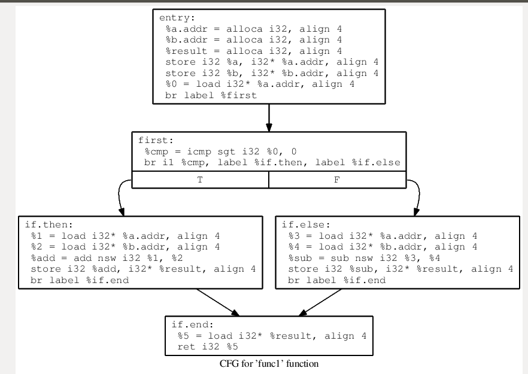

先判断第一个基本块有没有if语句，我们这个函数刚开始明显没有，先将第一块分开成一个基本块

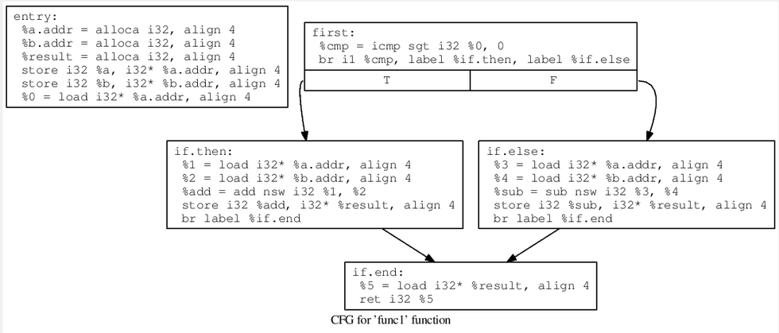


然后创建三个基本块`loopEntry`、`loopEnd`、`swDefault`，组成如下图左边的流程

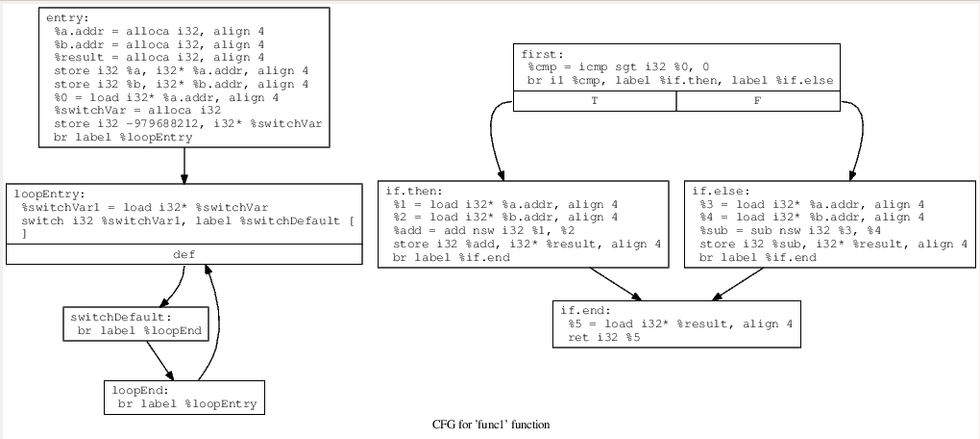

这时候，switch语句我们已经可以看见了，接下来就是将vector里存储的每个基本块加入switch-case语句中，每一个basicblock对应一个case，并且caseVar为刚开始产生的随机数值，如下图所示

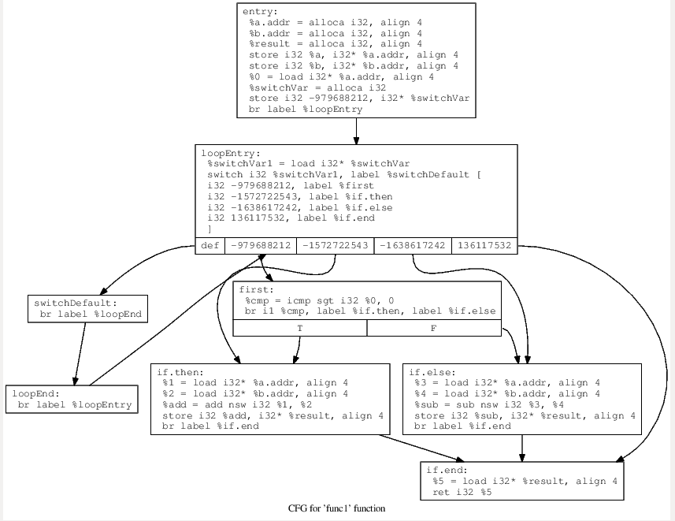

添加完全部基本块之后，需要修改每个基本块的跳转关系，使得每个基本块执行完毕之后，会重新设置caseVar的值，从而跳转到`loopEnd`块，然后回到switch-case的判断语句中，能够顺利跳转到下个case，处理后即为下图成型

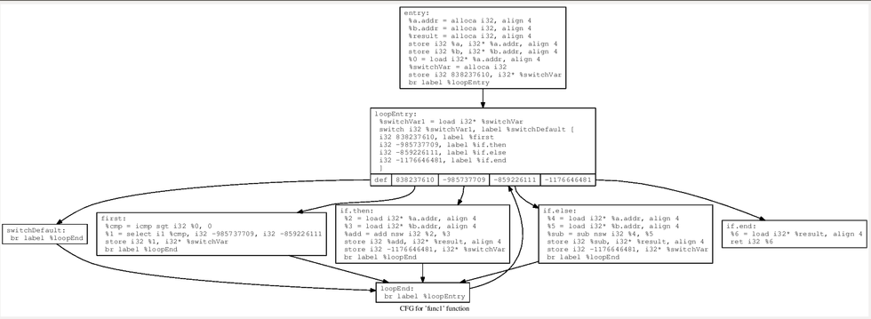


#### Substitution

Substitution的主要功能是对程序的一些指令进行替换。

其中文件位于`./include/llvm/Transforms/Obfuscation/substitution.cpp`

```c++
#define NUMBER_ADD_SUBST 4
#define NUMBER_SUB_SUBST 3
#define NUMBER_AND_SUBST 2
#define NUMBER_OR_SUBST 2
#define NUMBER_XOR_SUBST 2

static cl::opt<int>
ObfTimes("sub_loop",
         cl::desc("Choose how many time the -sub pass loops on a function"),
         cl::value_desc("number of times"), cl::init(1), cl::Optional);


// Stats
STATISTIC(Add, "Add substitued");
STATISTIC(Sub, "Sub substitued");
// STATISTIC(Mul,  "Mul substitued");
// STATISTIC(Div,  "Div substitued");
// STATISTIC(Rem,  "Rem substitued");
// STATISTIC(Shi,  "Shift substitued");
STATISTIC(And, "And substitued");
STATISTIC(Or, "Or substitued");
STATISTIC(Xor, "Xor substitued");
```

如上代码，通过该文件的宏定义，就可知每种运算替换的方式有多少种，可以对哪些指令进行替换：很明显的有：加减、位的与、或、异或，五种运算的替换

而注释的是未实现的运算替换，在官方wiki里可以知道，为了保证混淆再恢复之后的正确性，避免浮点数运算带来的程序误差，所以没有实现这些运算的替换（乘、除、取余，移位）

在源文件里，类似地，在相应的namespace里定义了这些内容，与之前两个混淆方式类似，`substitution`继承于`FunctionPass`，以`runOnFuntion`函数为入口，里面再判断flag参数正确之后，朴实无华地调用了`substitute(tmp)`函数己行混淆

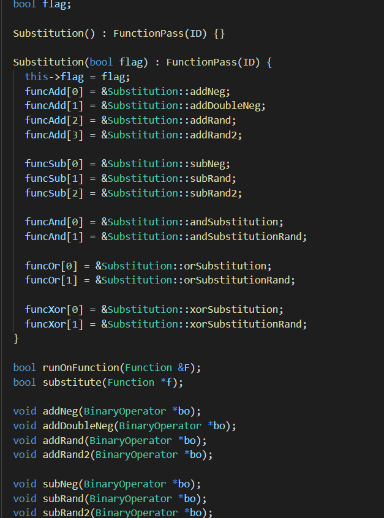


主函数`substitute()`很简单，用一个while循环维护混淆次数(即给的flag参数`-sub_loop`)，然后两层`for`循环。第一个for循环用来遍历函数中的基本块(Basic Block)，第二个`for`循环用于遍历每个基本块中的所有指令，然后采用一个`switch-case`语句用来针对不同指令的不同替换操作，case里用随机数来决定用哪种方式去替换

接下来的所有代码都是其替换方式的实现

> [Instructions-Substitution](https://github.com/obfuscator-llvm/obfuscator/wiki/Instructions-Substitution)：在其官方wiki里都有说明是怎样的替换方式，在其注释下代码很好理解，相关的函数不懂就查查llvm的函数库就可以了
>
> * `Add`指令支持4种替换方法，分别是
>
>   * `a = b - (-c)`
>   * `a = -(-b + (-c))`
>   * `r = rand (); a = b + r; a = a + c; a = a – r `
>   * `r = rand (); a = b - r; a = a + b; a = a + r `
>
> * `Sub`指令支持3种替换方法，分别是
>
>   * `a = b + (-c)`
>   * `r = rand (); a = b + r; a = a - c; a = a – r `
>   * `r = rand (); a = b - r; a = a - c; a = a + r `
>
> * `And` 指令支持1种替换方法，分别是
>
>   * `a = b & c` => ` a = (b^~c)& b `
>
>     
>
> * `Or`指令支持1种替换方法，分别是
>
>   * `a = b | c` => `a = (b & c) | (b ^ c) `
>
>     
>
> * `Xor` 指令支持1种替换方法，分别是
>
>   * `a = a ^ b `=> `a = (!a & b) | (a & !b) `
>
>     


#### StringObfuscation

有很多大佬对于ollvm的混淆进行了升级，每个版本对于其混淆的实现方式各不相同，这边我分析的是上海交通大学的孤挺花项目的字符串混淆实现分析，项目地址为：https://github.com/GoSSIP-SJTU/Armariris

与上面三种原有项目的混淆方式不同，字符串混淆的类`StringObfuscationPass`继承至`ModulePass`，在入口函数`runOnModule`里重写了父类函数，在里面实现了加密，在私有函数中实现了解密函数，在加密的末尾实现了调用，保证函数运行的正确性

函数的思想：是以两个vector来存储静态变量和加密后的字符串，利用Module类的`global_iterator`迭代器遍历全局变量，判断是否为`.str.`类型，即字符串类型，进行加密替换，加密方式采用了最原始的异或加密


#### bug寻找

适配llvm9.0和ollvm4.0时发生了许多错误

可见 [bug_Log](bug_log.txt)

[Segmentation Fault 的原因若干](https://www.cnblogs.com/wpgraceii/p/10622582.html)

最快的当然还是把相关错误的llvm4.0的代码移植到llvm9.0处


解决string_obf error编译时报强制转换类型错误方法 ：http://hellollvm.org/slides/porting-ollvm.pdf

>  http://hellollvm.org/


### 对抗


//TODO：大坑，现在对逆向还不是很熟悉，先对方法了解一波


引用项目Fllvm(虽然他不开源)中，作者对自己改写的ollvm变版fllvm的自信，来学习对抗ollvm的方式

> Fllvm与当前反混淆工具的对抗：当前应对ollvm混淆的大体方法为：自写脚本、bcf、decllvm、符合执行。前三个无论是自己找规律，还是基于capstone(反汇编引擎)，对Fllvm都只存在理论的可行性，基本用途不大。

由作者一段话可知，大概就是找规律写脚本复原，或者采用符号执行的方式去反混淆(原谅我真的找不到作者所说的bcf是啥)

我看的大多找规律的都是从原版ollvm的混淆方式入手，写反混淆的脚本去运行

还是能用符号执行分析的大佬比较nb


> 资料：
>
> [反混淆：恢复被OLLVM保护的程序](https://www.freebuf.com/articles/terminal/130142.html)
>
> [[原创]ARM64 OLLVM反混淆](https://bbs.pediy.com/thread-252321.htm)
>
> [Android OLLVM反混淆实战](https://www.anquanke.com/post/id/200744)：基于Angr
>
> [基于符号执行的反混淆方法研究.pdf](https://www.hacking8.com/uploadfile/kcon/2019/24%E6%97%A5/%E5%9F%BA%E4%BA%8E%E7%AC%A6%E5%8F%B7%E6%89%A7%E8%A1%8C%E7%9A%84%E5%8F%8D%E6%B7%B7%E6%B7%86%E6%96%B9%E6%B3%95%E7%A0%94%E7%A9%B6.pdf)
>
> [基于符号执行的反混淆方法研究.pdf](https://www.hacking8.com/uploadfile/kcon/2019/24日/基于符号执行的反混淆方法研究.pdf)
>
> [利用符号执行去除控制流平坦化](https://security.tencent.com/index.php/blog/msg/112)
>
> [反混淆：恢复被OLLVM保护的程序](https://www.cnblogs.com/h2zZhou/p/6637890.html)
>
> [使用Binary Ninja去除ollvm流程平坦混淆](https://mlog.club/article/3446618)
>
> 
>
> > 关于逆向：https://blog.yuuoniy.cn/2018/08/03/XMAN-reversing-1/
>
> 


> 
>
> * 基于Miasm框架(一个Python开源逆向工程框架)，进行反混淆
>
> https://github.com/cea-sec/miasm
> [反混淆：恢复被OLLVM保护的程序](https://www.freebuf.com/articles/terminal/130142.html)
>
> 
>
> 
>
> * IDA插件，利用micro code API进行反混淆
>
> Hex-rays：[Hex-Rays Microcode API vs. Obfuscating Compiler](http://www.hexblog.com/?p=1248)
> 项目地址：[Github-RolfRolles / HexRaysDeob](https://github.com/RolfRolles/HexRaysDeob)
> [使用IDA microcode去除ollvm混淆(上)](https://xz.aliyun.com/t/6749)
>
> 
>
> 
>
> * DecLLVM，针对OLLVM的IDA分析插件
>   [Github-F8LEFT / DecLLVM](https://github.com/F8LEFT/DecLLVM)
>   [Gitlab-F8LEFT / DecLLVM](https://gitlab.com/F8LEFT/DecLLVM)
>   [吾爱破解2016安全挑战赛cm7 Android CrackMe 分析详解](https://www.52pojie.cn/thread-484892-1-1.html)
>
> 
>
> * Unicorn 引擎
>   [[翻译]Unicorn引擎教程](https://bbs.pediy.com/thread-224330.htm)
>   [[原创]使用unicorn engin还原Armariris字符串混淆](https://bbs.pediy.com/thread-252257.htm)
>
> 
>
> * Angr 符号执行框架
>   Github里有
>
> 
>
> 


> 关于符号执行：
> 
>
> [符号执行](https://pdfs.semanticscholar.org/a29f/c90b207befb42f67a040c6a07ea6699f6bad.pdf)是一种重要的形式化方法和软件分析技术，通过使用符号执行技术，将程序中变量的值表示为符号值和常量组成的计算表达式，符号是指取值集合的记号，程序计算的输出被表示为输入符号值的函数，其在软件测试和程序验证中发挥着重要作用，并可以应用于程序漏洞的检测。
>
> 符号执行的发展是从静态符号执行到动态符号执行到[选择性符号执行](http://dslab.epfl.ch/pubs/selsymbex.pdf)，动态符号执行会以具体数值作为输入来模拟执行程序，是[混合执行](http://mir.cs.illinois.edu/marinov/publications/SenETAL05CUTE.pdf)(concolic execution)的典型代表，有很高的精确度，目前较新的符号执行工具有[Triton](https://github.com/JonathanSalwan/Triton)和[angr](https://github.com/angr/angr)
>
> 关于符号执行的paper：https://github.com/saswatanand/symexbib
>
> 符号执行的框架：Miasm、Angr、Triton


