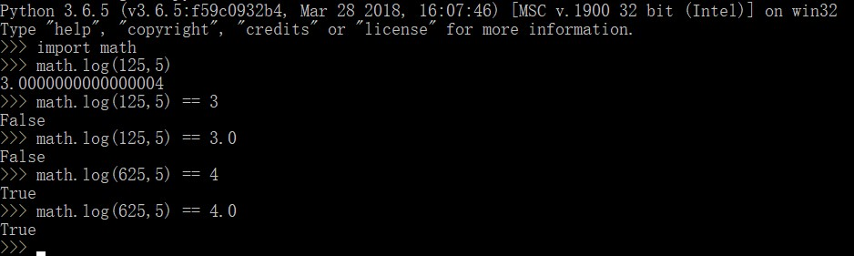
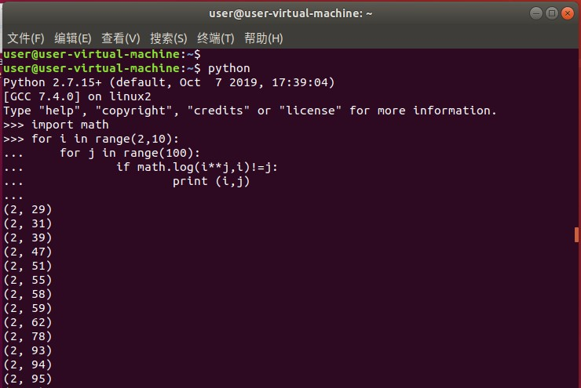
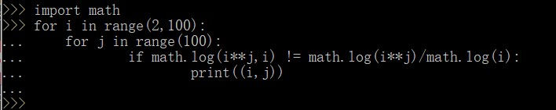

# To record some strange tricks


## Python


##### 1.something about math.log

如图，当math.log(125,5)时应该值为3的，但是出了一个bug




好奇心驱使我去写一个脚本看看，然后发现这些能hack math.log函数的不在少数

```python
for i in range(2,101):
	for j in range(100):
		ij = i**j
        if math.log(ij, i) != j:
            print(i,'\t',j)
```

然后去ubuntu虚拟机尝试了python2，发现也有这个问题




看了官方文档，发现有底数的对数函数是通过换底公式实现的，统一换成以e为底的对数去计算，因此会有除法的溢出导致以上问题。

> - `math.``log`(*x*[, *base*]) 
>
>   With one argument, return the natural logarithm of *x* (to base  *e*). With two arguments, return the logarithm of *x* to the given  *base*, calculated as `log(x)/log(base)`.

```python
math.log(x[,base]) = log(x) / log(base)
```

哪怕是`math.log(x**y,x)`也会有这个问题。

最有力的证明：




------


