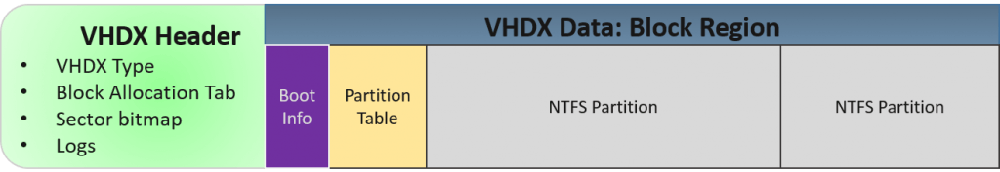

# Virtual Hard Disk


一直很好奇老师用的`.vhdx`是啥，知道他发来了一个`.vhdx`文件格式的东西我才开始了解

> 资料：
>
> [vhdx-wiki](https://en.wikipedia.org/wiki/VHD_(file_format))
>
> [Understanding and Working with VHD(X) Files](https://www.altaro.com/hyper-v/understanding-working-vhdx-files/)
>
> [windows的虚拟磁盘（vhd，vhdx）使用](https://www.cnblogs.com/strayromeo/p/8872255.html)
>
> [linux 挂在vhdx的方法](https://gist.github.com/allenyllee/0a4c02952bf695470860b27369bbb60d)
>
> [linux下挂载VHD等虚拟磁盘文件](https://www.cnblogs.com/oloroso/p/6385398.html)
>
> 
>
> 


vhd是一种虚拟硬盘的文件格式，他可以包含能在物理HDD上找到的内容，比如磁盘分区和文件系统，也可以包含文件夹和文件，通常用作虚拟机的硬盘，而vhdx是第二代的vhd，在性能上也有所不同

* vhdx在windows 8和windows server 2012之后被支持
* vhd的容量限制为2040GB，而vhdx最多为64TB
* vhdx可防止电源故障，并由hyper-V使用


功能有：

* 在vhd和主机文件系统之间移动文件
* 备份与还原
* 防病毒和安全性
* 图像管理和修补
* 磁盘转换：物理到虚拟，虚拟到物理
* 生命周期管理和重新配置





VHDX模拟硬盘，与文件系统的格式无关，也与分区无关。vhdx具有与物理硬盘驱动器相同的特征。假如创建一个ntfs格式的vhdx就如上图所示


#### 老师给的vhdx使用攻略

由于我的硬盘快炸了就不实验这个了

```
下载vhdx文件，放到一个妥帖的地方备份先。
一个有空闲80G以上的硬盘比如E:，解压缩vhdx放到e:下
“以管理员身份”运行“命令提示符”，执行：
bcdedit /copy {current} -d "windows 10 x64 v2004 20h1 b19041"
会返回一个uuid，像这样子：
{78088406-4d9e-11e9-951e-97df5fa30904}
然后继续执行（注意uuid换成你返回的）（注意把E换成你的盘符，大括号中括号要保持不要删）
bcdedit /set {78088406-4d9e-11e9-951e-97df5fa30904} osdevice vhd=[e:]\Windows10x64-v2004-20h1-b19041.vhdx
bcdedit /set {78088406-4d9e-11e9-951e-97df5fa30904} device vhd=[e:]\Windows10x64-v2004-20h1-b19041.vhdx
bcdedit /set {78088406-4d9e-11e9-951e-97df5fa30904} hypervisorlaunchtype OFF
然后重开机，注意有个开机选择菜单，
选这个v2004即可进入新的windows
不选或直接回车的话，会继续旧的windows。
将来如果想删掉，直接把vhdx删掉就完事了。

附
$ md5sum W*
52cd80b26541bb92e306291362a930cb *Windows10x64-v2004-20h1-b19041.7z
fc99df570f50bd7b4cfd0b08a905a11e *Windows10x64-v2004-20h1-b19041.vhdx

```


#### windows下使用

windows下可以用磁盘管理去创建或附加

右键开始菜单或者`win`+`R`运行`diskmgmt.msc`命令，打开磁盘管理工具

选择一个硬盘，在菜单中点击操作，创建VHD即可


##### 卸载

去磁盘管理工具，点击对硬盘，分离vhd


#### Linux下使用


```sh
# file:install_tools.sh

# install qemu utils
sudo apt install qemu-utils

# install nbd client
sudo apt install nbd-client

#------------------------------------
#file:mount_vhdx.sh
#!/bin/bash

VHDX_IMG="$1"
MOUNT_POINT="$2"

# [ubuntu] How do you mount a VHD image
# https://ubuntuforums.org/showthread.php?t=2299701
# 

# Load the nbd kernel module.
sudo rmmod nbd;sudo modprobe nbd max_part=16

# mount block device
sudo qemu-nbd -c /dev/nbd0 "$VHDX_IMG"

# reload partition table
sudo partprobe /dev/nbd0

# mount partition
sudo mount -o rw,nouser /dev/nbd0p1 "$MOUNT_POINT"


#-----------------------------------------
#file:unmount_vhdx.sh
#!/bin/bash

MOUNT_POINT="$1"

#unmount & remove nbd module
sudo umount "$MOUNT_POINT" && sudo qemu-nbd -d /dev/nbd0 && sudo rmmod nbd

```


