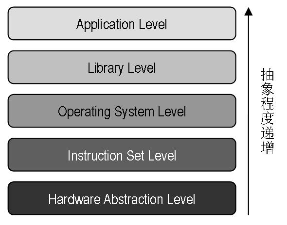
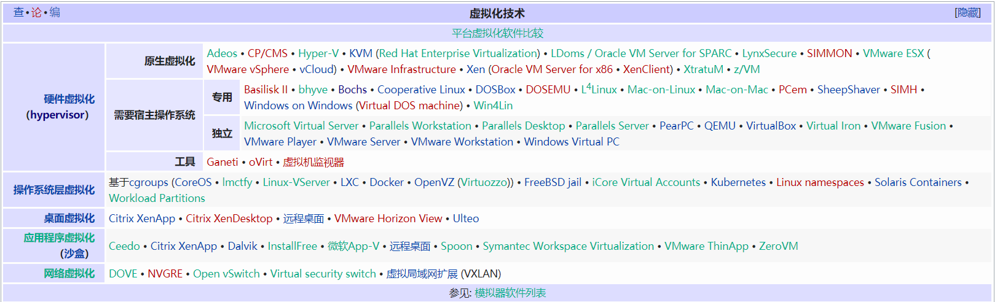
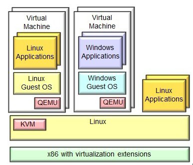
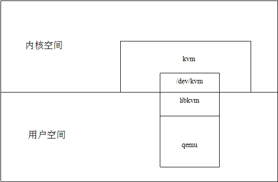
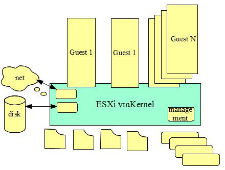

# 虚拟化技术

## 0x00 序

虚拟化技术，是我们一项平时日常接触，但从未去细致了解过的一项技术。就如我们常用的vmware、virtual box、docker 都采用了不同程度的虚拟化技术，甚至jvm也是一种虚拟化技术的体现。

这次我们来了解一波虚拟化技术

> 参考：
>
> [虚拟化 - wiki](https://zh.wikipedia.org/zh-cn/%E8%99%9B%E6%93%AC%E5%8C%96)
>
> [虚拟化技术介绍](https://www.jianshu.com/p/d808b8e6c917)
>
> [IBM- 虚拟化技术漫谈](https://www.ibm.com/developerworks/cn/linux/l-cn-vt/index.html)
>
> [虚拟化，看这篇文章就够了](https://zhuanlan.51cto.com/art/201703/536043.htm)
>
> [VMware 虚拟化介绍](https://www.vmware.com/cn/solutions/virtualization.html)
>
> 虚拟化技术应用介绍：
>
> [虚拟化技术概念以及分类和应用全解](http://www.cbdio.com/BigData/2016-04/01/content_4763208.htm)
>
> [虚拟化技术总览](https://www.cnblogs.com/bakari/p/7857967.html)
>
> [Xen、OpenVZ、KVM、Hyper-V、VMWare虚拟化技术介绍](https://qiaodahai.com/xen-openvz-kvm-hyper-v-vmware-virtualization.html)
>
> [云计算之虚拟化技术](https://www.jianshu.com/p/312056e70387)
>
> Intel的虚拟化技术：[英特尔® 虚拟化技术（英特尔® VT）](https://www.intel.cn/content/www/cn/zh/virtualization/virtualization-technology/intel-virtualization-technology.html)
>
> 

## 0x01 什么是虚拟化

虚拟化（Virtualization）技术最早出现在 20 世纪 60 年代的 IBM 大型机系统，在70年代的 System 370 系列中逐渐流行起来，这些机器通过一种叫虚拟机监控器（Virtual Machine Monitor，VMM）的程序在物理硬件之上生成许多可以运行独立操作系统软件的虚拟机（Virtual Machine）实例。随着近年多核系统、集群、网格甚至云计算的广泛部署，虚拟化技术在商业应用上的优势日益体现，不仅降低了 IT 成本，而且还增强了系统安全性和可靠性，虚拟化的概念也逐渐深入到人们日常的工作与生活中。

wiki的定义是这么讲的：在计算机技术中，**虚拟化（技术）**或**虚拟技术**（英语：Virtualization）是一种资源管理技术，是将计算机的各种实体资源（CPU、内存、磁盘空间、网络适配器等），予以抽象、转换后呈现出来并可供分割、组合为一个或多个电脑配置环境。由此，打破实体结构间的不可切割的障碍，使用户可以比原本的配置更好的方式来应用这些电脑硬件资源。这些资源的新虚拟部分是不受现有资源的架设方式，地域或物理配置所限制。一般所指的虚拟化资源包括计算能力和数据存储。

而广义上来讲，虚拟化代表着对计算资源的抽象，而不仅仅局限于虚拟机的概念。例如对物理内存的抽象，产生了虚拟内存技术，使得应用程序认为其自身拥有连续可用的地址空间（Address Space），而实际上，应用程序的代码和数据可能是被分隔成多个碎片页或段），甚至被交换到磁盘、闪存等外部存储器上，即使物理内存不足，应用程序也能顺利执行。

## 0x02 虚拟化的分类

虚拟化的分类主要有两种分法，一种按虚拟的对象分类，另一种按抽象程度分类

我这里先介绍按抽象程度分类，毕竟按对象分太杂了，推荐直接从wiki中查阅其具体分类

而**虚拟化技术的本质在于对计算机系统软硬件资源的划分和抽象**。计算机系统的高度复杂性是通过各种层次的抽象来控制，每一层都通过层与层之间的接口对底层进行抽象，隐藏底层具体实现而向上层提供较简单的接口。

如下图，为一个层次关系图

由这个关系图，我们将虚拟化技术分为五个层次

* #### [硬件抽象](https://zh.wikipedia.org/wiki/硬體抽象)层等级的虚拟化（Hardware Abstraction Level）

主要由虚拟机监视器(virtual machine monitor，VMM&Hypervisor)来隐藏不同厂商的处理器、存储器、芯片组等等特征，为这些虚拟机提供抽象与统一的虚拟平台。

目前大多数X86平台的商业电脑使用这种虚拟化，最主要是由于现今处理器厂商提供了硬件辅助虚拟化技术

主要的代表有：VMware ESXi、Hyper-V、Citrix。

* #### [指令集架构](https://zh.wikipedia.org/wiki/指令集架構)等级的虚拟化（Instruction Set Architecture Level）

指令集架构的虚拟化是透过软件来模拟不同架构的处理器、存储器、总线、磁盘控制卡、计时器等多个I/O设备，软件会将虚拟机所发出的指令转换为本机可以操作的指令在现有的硬件上运行。这种等级的虚拟化对于模拟相同处理器架构的平台可以提供很好的兼容性，如X86架构、Sparc架构、Alpha架构

不过由于每条指令都由软件来模拟，因此会损失较大的性能

主要的代表有：Bochs、QEMU。

* #### [操作系统](https://zh.wikipedia.org/wiki/操作系统)等级的虚拟化（Operating System Level）

硬件抽象层等级的虚拟化中的[全虚拟化](https://zh.wikipedia.org/wiki/全虚拟化)与操作系统底层间有非常高的隔离能力，支持不同的操作系统，**安装后不须要重启主机、或修改引导程序（Boot Loader）以达到双系统的目的，风险低、维护简单。**由于此等级的虚拟机可以访问底层操作系统，因此用户必须花费大量的时间来安装与设置虚拟机，接着才能开始评估或测试所需运作的软件，这些设置包含了操作系统的安装、安全性或兼容性软件的更新、网络、系统设定等，如果所需的操作系统与底层操作系统相同，那么其实它们所作的跟实际上安装一台实体机器没有什么区别。

操作系统内核虚拟化可以最大限度的减少新增虚拟机的所需，在这个等级的虚拟机共享实体主机上的硬件以及操作系统，呈现彼此独立且隔离的虚拟机环境。

应用软件的环境是由操作系统、库、相依性软件、特定于系统的数据结构或文件系统，例如︰NTFS或Ext4，以及其他环境设置所组成。如果这些都保持不变，应用软件很难发现与真实环境的区别。这是所有操作系统等级虚拟化的关键想法。

主要代表有：Docker，LXC，OpenVZ

* #### [库](https://zh.wikipedia.org/wiki/函式庫)等级的虚拟化（Library Level）

大部分的应用程序都是使用由许多库组成的[API](https://zh.wikipedia.org/wiki/应用程序接口)（Application Programming Interface）来设计，使用动态链接的方式用于隐藏操作系统的细节，目的是提供程序员更简单的工作。这也产生了一种新的虚拟化方式，使用不同的API与不同操作系统底层的[ABI](https://zh.wikipedia.org/wiki/应用二进制接口)（Application Binary Interface）来进行模拟的工作。

主要代表有：Wine、WSL(Windows Subsystem for Linux)。

一个是在linux跑exe，另一个是在windows下跑linux

* #### [编程语言](https://zh.wikipedia.org/wiki/编程语言)等级的虚拟化（Programming Language Level）

此等级的虚拟化会将高级语言转译成一种名为[字节码](https://zh.wikipedia.org/wiki/字节码)的语言，透过虚拟机转译成为可以直接运行的命令。跨操作系统平台、跨语言皆为其优点。就将其语言和系统低层之间再次封装了一层虚拟机，由虚拟机充当中间的翻译。

> 传统电脑是由指令集架构所驱动的一种机械语言，硬件的操作由特殊的I/O指令处理，也可以透过区块映射（Mapping）来操作存储器.
>
> 大概是直接通过编译链接，生成相应的二进制文件。

主要代表有：Oracle Java、Microsoft  .NET 、Parrot。

主要技术分类如下，我们接下来拿几个代表性的讲讲

## 0x03 典型的虚拟化技术应用

* KVM

官网：http://www.linux-kvm.org/

KVM（Kernel-based Virtual Machine）是基于内核的虚拟机，KVM是集成到Linux内核的VMM，是X86架构且硬件支持虚拟化技术(Intel VT或AMD-V)的Linux的全虚拟化解决方案。它是Linux的一个很小的模块，利用Linux做大量的事，如任务调度、内存管理与硬件设备交互等。

KVM本身不执行任何模拟，需要用户控件程序通过`/dev/kvm`接口设置一个客户机的虚拟虚拟地址空间，向它提供模拟的I/O，并将其视频显示映射回宿主机的显示屏。

KVM是一个独特的管理程序，通过将KVM作为一个内核模块实现，在虚拟环境下Linux内核集成管理程序将其作为一个可加载的模块可以简化管理和提升性能。在这种模式下，每个虚拟机都是一个常规的Linux进程，通过Linux调度程序进行调度。

而基于KVM架构的VPS，默认是没有系统的，可自己上传ISO或调用服务商自带的ISO手动安装系统。这个非常适合热爱DIY自己VPS的客户。由于KVM架构全功能虚拟化架构，甚至拥有独立的BIOS控制，所以对母服务器性能影响较大，所以基于KVM的VPS较贵，但KVM VPS相对其它架构的VPS较为自由。

如图，KVM是基于linux的一个内核模块，而用户无法直接控制内核模块做一些事情，此时kvm的开发者选择了QEMU(开源虚拟化工具，可以虚拟化不同的cpu)，然后kvm使用了qemu的一部分作为kvm的用户空间工具。

>  QEMU是一套由Fabrice Bellard所编写的模拟处理器的自由软件。它与Bochs，PearPC近似，但其具有某些后两者所不具备的特性，如高速度及跨平台的特性。经由kqemu这个开源的加速器，QEMU能模拟至接近真实电脑的速度。

kvm和qemu的关系如下图

* Xen

官网：http://xen.org/

Xen 由剑桥大学开发，它是基于硬件的完全分割，物理上有多少的资源就只能分配多少资源。

其可分为Xen-PV（半虚拟化），和Xen-HVM（全虚拟化）。

Xen最重要的优势在于半虚拟化，此外未经修改的操作系统也可以直接在xen上运行(如Windows)，能让虚拟机有效运行而不需要仿真，因此虚拟机能感知到hypervisor，而不需要模拟虚拟硬件，从而能实现高性能。（即采用全虚拟化，用iso安装任意系统）

* hyper-v

官网：http://www.microsoft.com/zh-cn/server-cloud/

 Hyper-V是微软提出的一种系统管理程序虚拟化技术，采用微内核的架构，兼顾了安全性和性能的要求。Hyper-V底层的Hypervisor运行在最高的特权级别下，微软将其称为ring -1（而Intel则将其称为root mode），而虚机的OS内核和驱动运行在ring 0，应用程序运行在ring 3下，这种架构就不需要采用复杂的BT（二进制特权指令翻译）技术，可以进一步提高安全性。从架构上讲Hyper-V只有“硬件－Hyper-V－虚拟机”三层，本身非常小巧，代码简单，且不包含任何第三方驱动，所以安全可靠、执行效率高，能充分利用硬件资源，使虚拟机 系统性能更接近真实系统性能。

* Vmware ESXI

官网：http://www.vmware.com/

由图可见，管理工具直接嵌入到了ESXi vmKernel中，没有分化出独立的管理工具

* OpenVZ

官网：http://openvz.org/

OpenVZ（简 称OVZ）采用SWsoft的Virutozzo虚拟化服务器软件产品的内核，是基于Linux平台的操作系统级服务器虚拟化架构。这个架构直接调用母服务器（母机）中的内核，模拟生成出子服务器（VPS，小机），所以，它经过虚拟化后相对于母服务器，性能损失大概只有的1-3%。

OpenVZ另一个特点是，它是直接调用母服务器的内核，所以会导致部分软件无法使用，以及部分内核文件是无法修改。

## 0x04 虚拟化安全现状

> 参考： 
>
> 参考论文地址：[link](https://kns.cnki.net/KCMS/detail/detail.aspx?dbcode=CJFQ&dbname=CJFDLAST2016&filename=XXAQ201609016&v=MDUwMzBadUZDcmdVNzNPUFRYS2Y3RzRIOWZNcG85RVlvUjhlWDFMdXhZUzdEaDFUM3FUcldNMUZyQ1VSN3FmWWU=)
>
> [【虚拟化安全】全面虚拟化安全风险列表&专业安全建议](http://blog.nsfocus.net/virtualization-security-advise/)
>
> [虚拟化平台的安全问题与看法](https://www.sec-un.org/virtualization-platform-security-questions-and-comments/)
>
> [虚拟化安全——携程安全报道](http://www.owasp.org.cn/OWASP_Events/download/20121013.pdf) ：OWASP
>
> [操作系统与虚拟化安全](https://www.coursera.org/learn/os-virtsecurity#syllabus) ：北大课程？？？
>
> 

* 虚拟机蔓延
  * 僵尸虚拟机：在实际运维过程中，由于安全管理流程的不规范，导致很多已经停用的虚拟机及相关镜像文件仍然被保存在硬盘上，有些可能以多份备份的形式被保存，占用了服务器的大量存储资源。
  * 虚胖虚拟机：通常在配置虚拟机时会分配略高于其需求的资源以保证其可用性和安全性,然而过度的资源分配,包括CPU、内存和存储容量等,会导致其他虚拟机资源的匮乏,从而造成较为严重的资源浪费,甚至对企业业务造成影响。虚拟机蔓延会对系统的安全性、资源的利用率等产生影响,因此,应采取相应的技术手段、运用相关的管理方法来抑制虚拟机的蔓延,以保证虚拟化部署的安全性。

* 虚拟机迁移：虚拟机迁移是指将虚拟机从一个主机或存储位置移至另一个主机或存储位置的过程。迁移的过程不会影响用户的访问，这项技术也使得数据中心在资源协调方面更加灵活。但是从安全角度来看,虚拟机迁移技术给系统带来了一定的安全风险。系统的入侵检测系统通常会通过监测指定交换机端口流量来对系统进行检测，当虚拟机发生迁移时,可能导致迁移后的虚拟机流量不经过入侵检测系统所监测的端口，从而导致迁移后的虚拟机脱离系统的入侵检测系统,从而带来安全风险。

* 特殊配置隐患：不说了，都是人为因素，人才是最大的漏洞

* 虚拟化安全攻击

  * 虚拟机跳跃：虚拟机跳跃是指攻击者基于一台虚拟机通过某种方式获取同一个Hypervisor上的其他虚拟机的访问权限,进而对其展开进攻。由于同一个Hypervisor上的虚拟机之间可以通过网络连接或共享内存的方式进行通信,这种方式就会导致攻击者进行虚拟机跳跃攻击。
    就比如侧信道攻击

  * 虚拟机逃逸：如其名，即可以通过在虚拟机中进行逃逸，从而控制运行虚拟机的物理机
    典型案例：蓝色药丸、CloudBurst。

    > 逃逸的后果：
    >
    > - 安装Hypervisor级后门;
    > - 拒绝服务攻击;
    > - 窃取数据;
    > - 控制其他VM;

  * 拒绝服务攻击：在虚拟化基础架构中,若管理员在Hypervisor上制定的资源分配策略不够严谨,恶意攻击者就能通过利用一个虚拟机将所有的系统资源耗尽,从而造成其他的虚拟机由于资源匮乏而拒绝服务。

