# <center>Misc&WriteUp</center>


msic永远充满了惊喜


# <center>攻防世界&Misc新手练习区</center>


## 0x01  this_is_flag 


> 题目描述： Most flags are in the form flag{xxx}, for example:flag{th1s_!s_a_d4m0_4la9} 


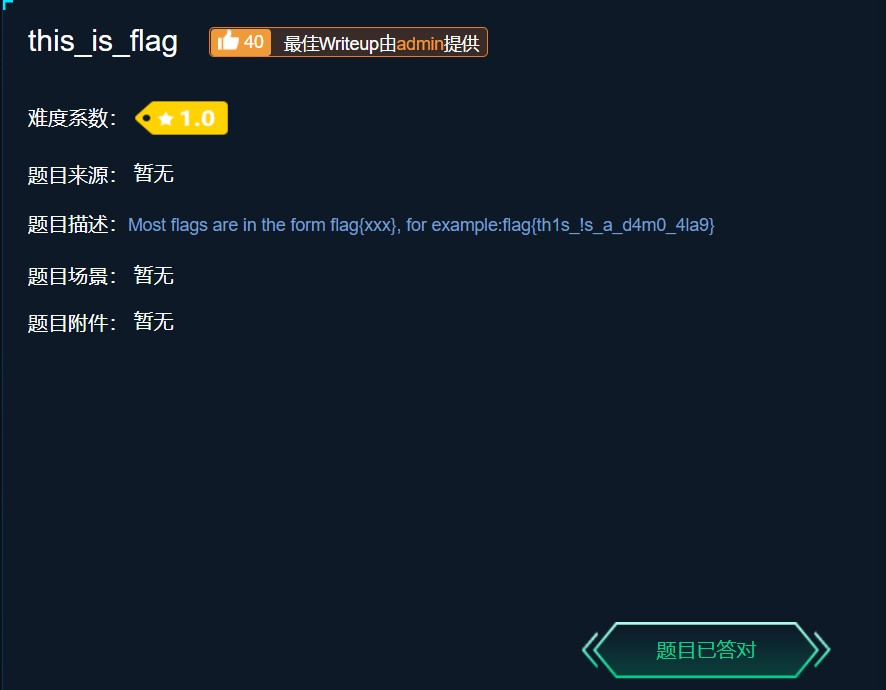


易知flag为：`flag{th1s_!s_a_d4m0_4la9} `


## 0x02 ext3


> 题目描述： 今天是菜狗的生日，他收到了一个linux系统光盘 


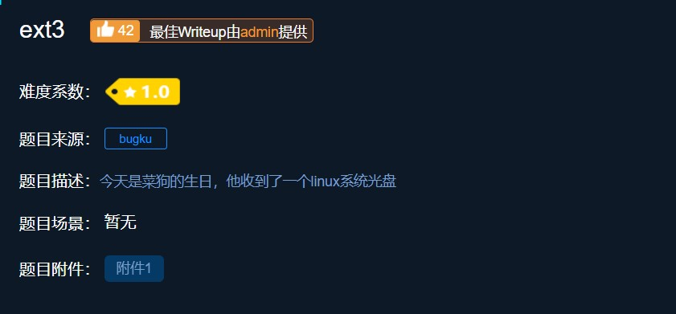


下载附件得到一个19.5MB的文件，由于题目是ext3，所以联想到将该文件挂载至linux下

运行`mount test /mnt/`,然后发现下面有一堆文件

执行`find |grep flag`，得到` ./O7avZhikgKgbF/flag.txt `

用`cat`命令查看文件，得到一串字符` ZmxhZ3tzYWpiY2lienNrampjbmJoc2J2Y2pianN6Y3N6Ymt6an0= `

明显的base64编码，转码得到flag：` flag{sajbcibzskjjcnbhsbvcjbjszcszbkzj}  `


------

但是看官方wp，发现是另外一种做法。

不知道为啥判断附件为img格式，然后用winhex打开该文件搜索flag得到如下

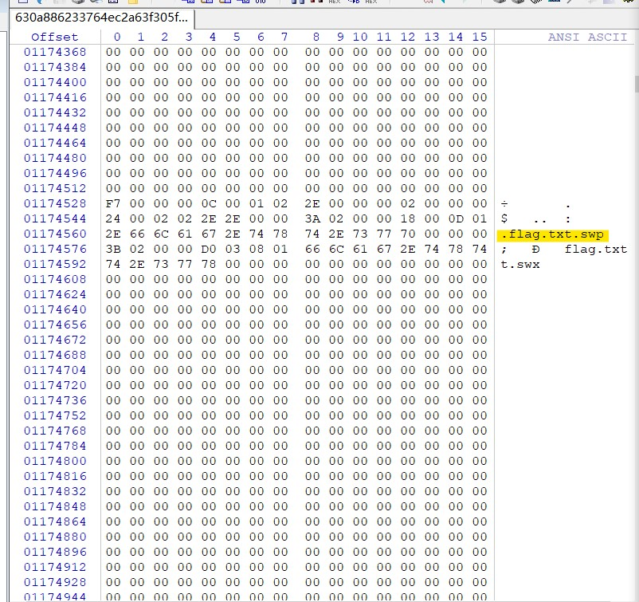


然后解压该文件（我用bandzip没有打开，改后缀为img装载显示光盘映像已损坏），搜索得到flag.txt，然后其他步骤相同


## 0x03  give_you_flag 


>  题目描述：菜狗找到了文件中的彩蛋很开心，给菜猫发了个表情包 


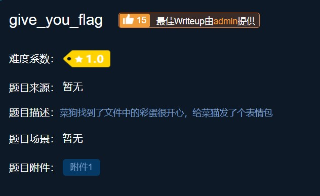


下载附件，发现是一个gif文件，打开查看发现在最后几秒闪过一个二维码

第一次做傻傻地用了linux下convert命令，将gif转到png，发现50多帧都被拆分成一个个png，

二维码大概在49帧，后面才发现有Stegsolve可以查看图片的每一帧

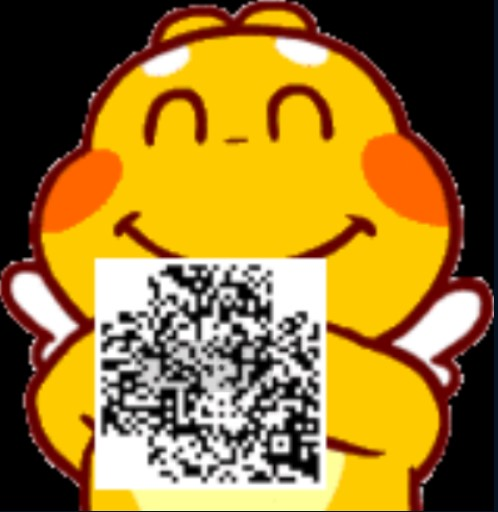

明显是个二维码，修补其三角定位，得到下图

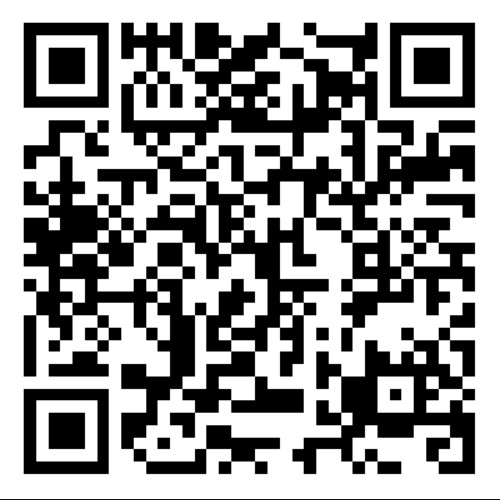


扫码得到flag：` flag{e7d478cf6b915f50ab1277f78502a2c5}` 


## 0x04 pdf


>  题目描述：菜猫给了菜狗一张图，说图下面什么都没有 

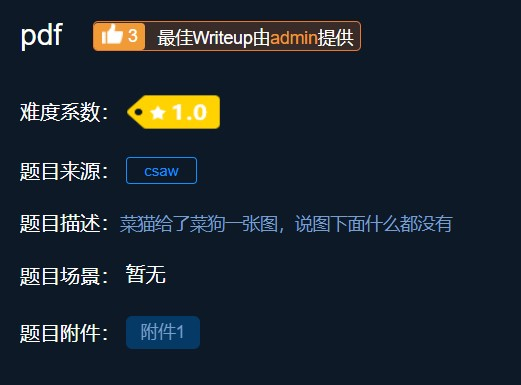


打开附件是一个pdf，里面是一张图片，推测将pdf转为word格式之后，移走图片，发现flag就在图片底下

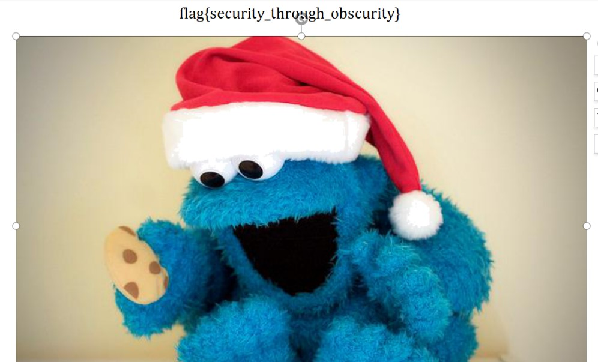


易知得到flag：` flag{security_through_obscurity} `


## 0x05 stegano

>  题目描述：菜狗收到了图后很开心，玩起了pdf 提交格式为flag{xxx}，解密字符需小写 


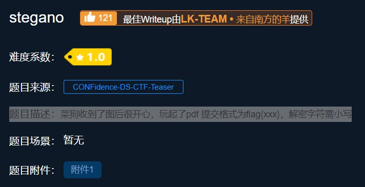


打开附件发现一份文档

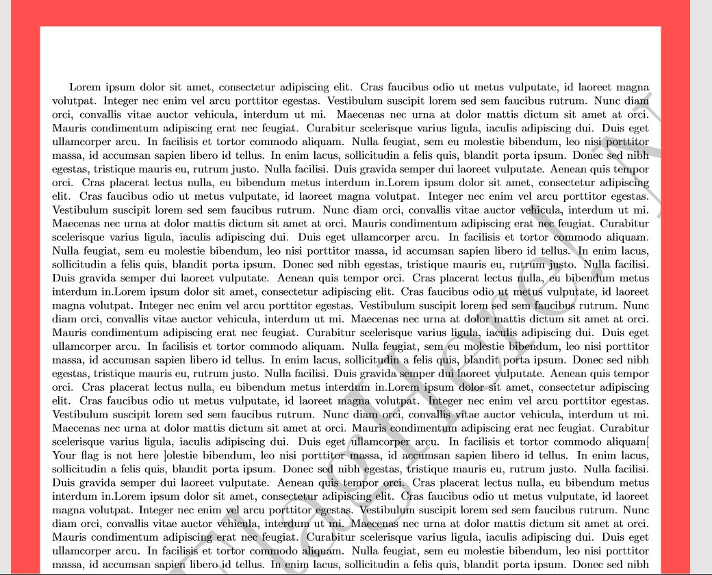

一开始没有思路，就先用之前的convert命令，将pdf的东西全部复制出来查看，发现

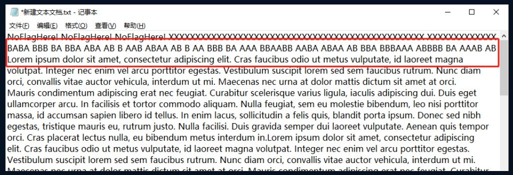

将AB转换为. - 可得到如下

```

 -.-. --- -. --. .-. .- - ..- .-.. .- - .. --- -. ... --..-- ..-. .-.. .- --. ---... .---- -. ...- .---- ..... .---- -... .-.. ...-- -- ...-- ..... ..... ....- --. ...-- 


```

解摩斯密码得到：` CONGRATULATIONSFLAG1NV151BL3M3554G3 `

flag为：` flag{1NV151BL3M3554G3} `


## 0x06  SimpleRAR 


>  题目描述：菜狗最近学会了拼图，这是他刚拼好的，可是却搞错了一块(ps:双图层) 

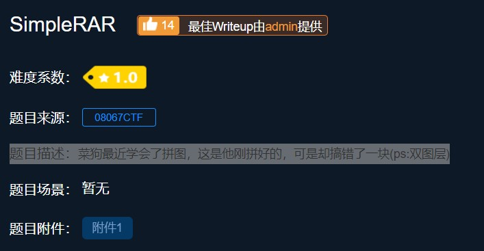

下载完附件，只有一个文件，打开`flag.txt` ,里面写着`flag is not here`

打开winhex查看该rar，发现里面还有一个secret.png，然后根据文件头（或者使用rar修复） 将A8 3C 7A 修改为 A8 3C 74 。 

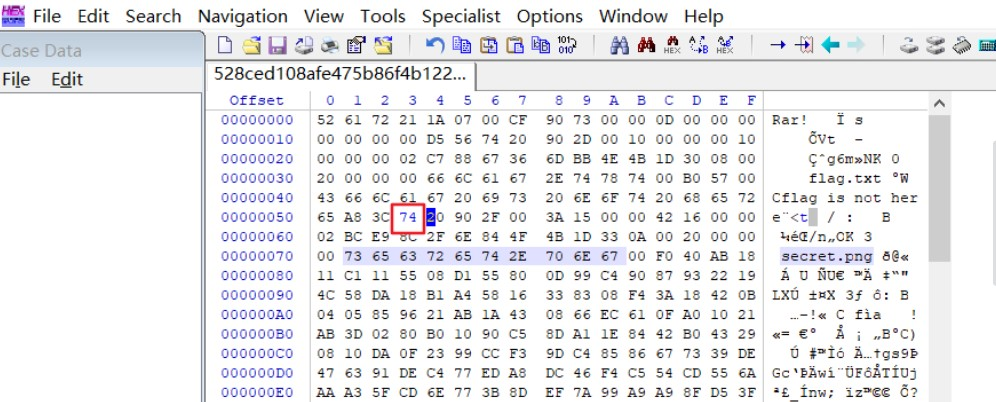

然后解压得到secret.png，打开是一个空白图片，便想到用winhex查看。


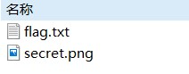


发现文件头是GIF，将后缀改为.gif，然后用Stegsolve分离出两帧图片，分别是二维码的上下部分，还少定位符，补齐定位符，扫码得到flag：` flag：flag{yanji4n_bu_we1shi} `

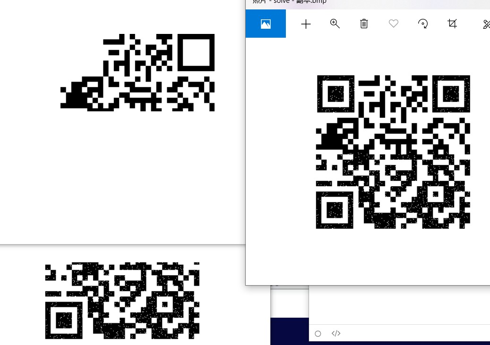


## 0x07 坚持60s

>  题目描述：菜狗发现最近菜猫不爱理他，反而迷上了菜鸡 

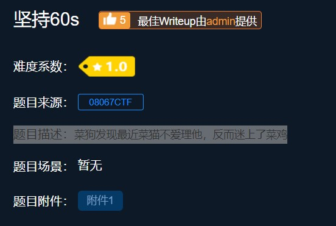

下下来是一个jar包，用java运行，发现是一个小游戏，根据题目联想需要坚持60s。

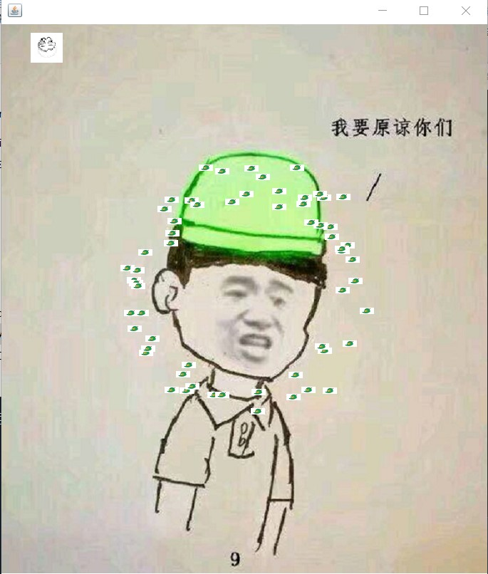


玩了几次之后手残放弃，然后解压缩文件，用winhex打开文件搜索flag，在`/cn/bjsxt/plane/PlaneGameFrame.class`里找到   `flag{RGFqaURhbGlfSmlud2FuQ2hpamk=}`易知是base64编码，base64decode得到`flag{DajiDali_JinwanChiji}`

第二种办法，我在找到flag后思考这是misc题也不是逆向题，便觉得这游戏肯定有bug，然后根据常识发现右边和下面的边界可以穿过来躲避障碍，但是完全卡入右边界之后无法返回。

之后发现到下边只能卡入一半，于是突发思维，将小方块卡入右下角然后留下了一个小角，发现可以成功躲过60s（记得计时，在60s~70s时主动出去死亡即可，然后成功得到flag明文

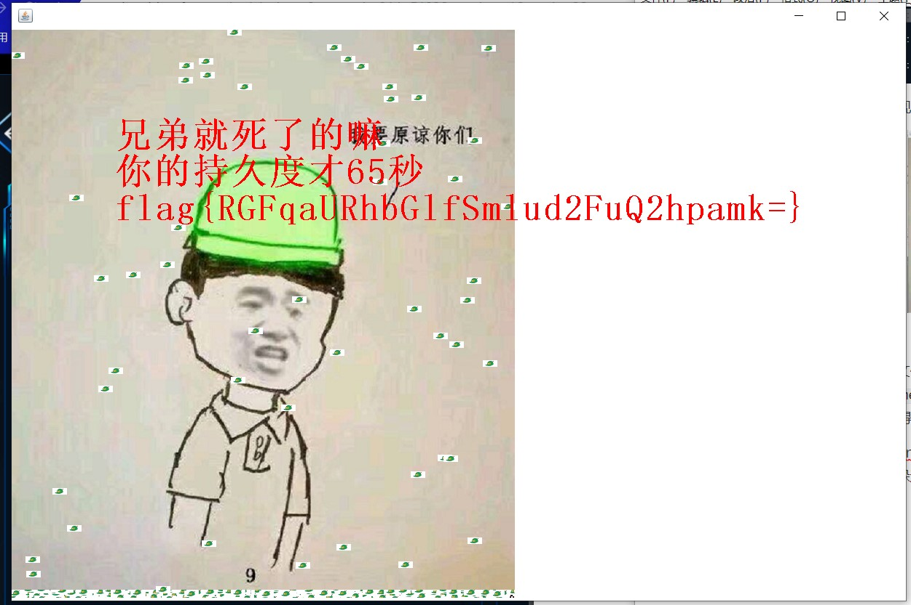


## 0x08 gif


>  题目描述：菜狗截获了一张菜鸡发给菜猫的动态图，却发现另有玄机 

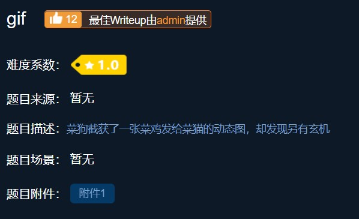

得到一个zip包，查看里面有103张黑白色的图片，联想到二进制。

白色图片代表0，黑色图片代表1。

01100110前八位二进制换算后为 f 证明思路正确。

01100110011011000110000101100111011110110100011001110101010011100101111101100111011010010100011001111101

二进制转字符串得到 flag：`flag{FuN_giF}`

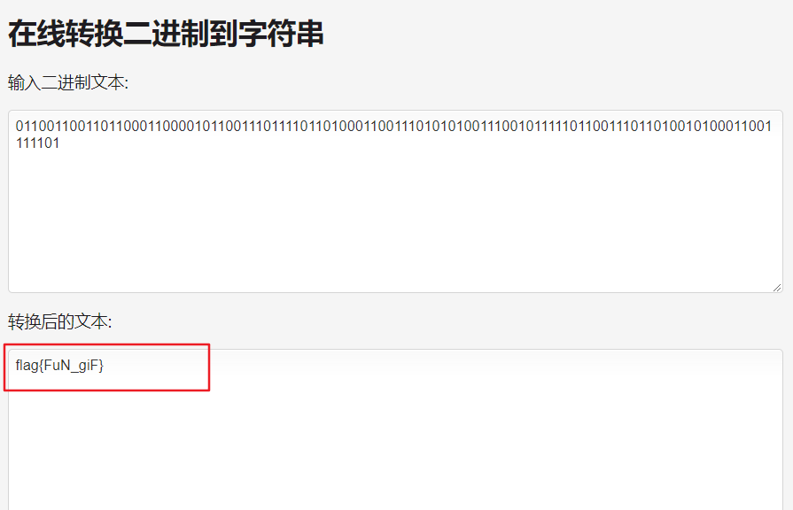


## 0x09  掀桌子

>  题目描述：菜狗截获了一份报文如下c8e9aca0c6f2e5f3e8c4efe7a1a0d4e8e5a0e6ece1e7a0e9f3baa0e8eafae3f9e4eafae2eae4e3eaebfaebe3f5e7e9f3e4e3e8eaf9eaf3e2e4e6f2，生气地掀翻了桌子(╯°□°）╯︵ ┻━┻ 

 题目只有描述中这一段字符串有信息，推测是十六进制，写python的转换代码

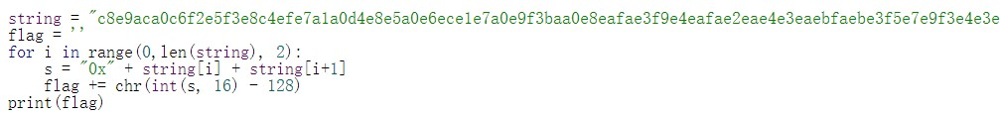

 每两个一组，将16进制转换为10进制，减去128以后输出 ascii。 

得到` Hi, FreshDog! The flag is: hjzcydjzbjdcjkzkcugisdchjyjsbdfr `


## 0x0a  如来十三掌 

>  题目描述：菜狗为了打败菜猫，学了一套如来十三掌。 

下下来附件是一个docx，发现是一段文字，贼像佛教里的文字

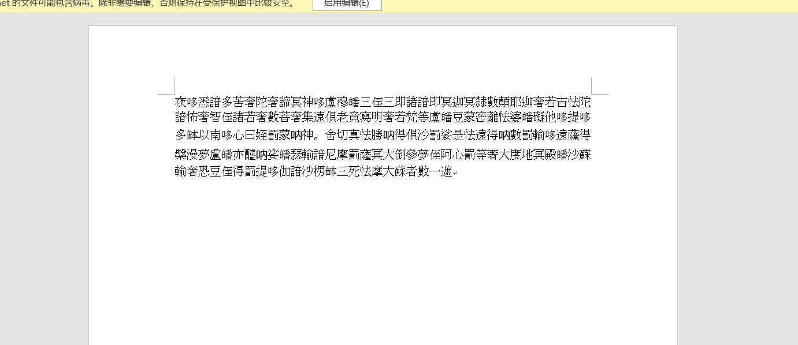


搜索得到这是一种佛语加密，在网站 http://keyfc.net/bbs/tools/tudoucode.aspx  [**与佛论禅**](http://keyfc.net/bbs/tools/tudoucode.aspx)  可以翻译，但是将全文复制到chrome和firefox打开的网站里都解码失败了，后看他的说明，推测应该在复制过程中会将繁体字转换为简体字，这样你复制后的文字已经不是最初的原文了，所以解不出。试验过在MicrosoftEdge中能够成功解码。

 解完是一串像base64编码的字符`MzkuM3gvMUAwnzuvn3cgozMlMTuvqzAenJchMUAeqzWenzEmLJW9`，但是该字符解码得到是一串乱码，然后发现这个字符串需要先用rot13（与题目“如来十三掌”谐音）转一下，然后再base64解码，得到flag。 


## 0x0b  base64stego 

>  题目描述：菜狗经过几天的学习，终于发现了如来十三掌最后一步的精髓 

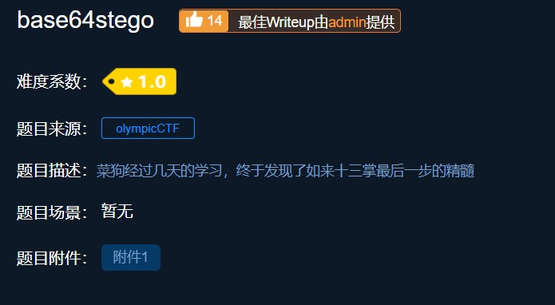


打开压缩包，压缩包是伪加密的根据ctf-wiki里直接用winhex改一个标志位，或者用winrar修复即可

是一个`stego.txt`可以看到很多行的base64编码

解码出来是在wiki百科上对Steganography的解释

```
Steganography is the art and science of
 writing hidden messages in such a way that no one
, apart from the sender and intended recipient, suspe
cts the existence of the mess
age, a form of security through obscurity. T
he word steganography is of Greek origin and means "concea
led writing" from the Greek words steganos meaning "co
vered or protected", and graphein meaning "to w
rite". The first recorded use of the term was in 1499 by Joh
annes Trithemius in his Steganographia, a trea
tise on cryptography and steganography disg
uised as a book on magic. Generally, mess
ages will appear to be something else: images, arti
cles, shopping lists, or some ot
her covertext and, classically, the hidden message may be in invi
sible ink between the visible lines of a private letter.

The
 advantage of steganography, over cr
yptography alone, is that messages do not attract attention
 to themselves. Plainly visible encrypted messages�no matter 
how unbreakable�will arouse s
uspicion, and may in themselves be incriminating 
in countries where encryption is illegal. Therefore,
 whereas cryptography protects the contents of
 a message, steganography can be said to protect b
oth messages and communicating parties.

Steganography inclu
des the concealment of information within com
puter files. In digital steganography, electronic communication
s may include steganographic coding insi
de of a transport layer, such as a document file, image fil
e, program or protocol. Media 
files are ideal for steganographic transmissio
n because of their large size. As 
a simple example, a sender might start with a
n innocuous image file and adjust the color of every 100th pixel 
to correspond to a letter in the alphabet, a
 change so subtle that someone not specifically looking f
or it is unlikely to notice it.

The
 first recorded uses of steganography can be tr
aced back to 440 BC when Herodotus mentions two examples o
f steganography in The Histories of 
Herodotus. Demaratus sent a warning about a 
forthcoming attack to Greece by w
riting it directly on the wooden backing of a wax tablet bef
ore applying its beeswax surface. Wax tablets were in common use
 then as reusable writing surfaces, sometime
s used for shorthand. Another ancient example is that o
f Histiaeus, who shaved the head of his most trusted s
lave and tattooed a message on it. After his hair had g
rown the message was hidden. The purpose was to
 instigate a revolt against the Persians.

Steganography has b
een widely used, including in recent historical times and t
he present day. Possible permutations are endless and
 known examples include:
* Hidden messages within wax ta
blets: in ancient Greece, people wrote me
ssages on the wood, then covered it with wax upon which an innocen
t covering message was written
.
* Hidden messages on messenger's body: also used in ancien
t Greece. Herodotus tells the story o
f a message tattooed on a slave's shaved head, hidden by the
 growth of his hair, and exposed by shaving his head
 again. The message allegedly carried a warning to Greece abo
ut Persian invasion plans. Th
is method has obvious drawbacks,
 such as delayed transmission while waiting for the s
lave's hair to grow, and the restrictions o
n the number and size of mess
ages that can be encoded on one person
's scalp.
* In WWII, the French Resistance sent some messages w
ritten on the backs of couriers 
using invisible ink.
* Hidden messages on paper wr
itten in secret inks, under other messages
 or on the blank parts of other
 messages.
* Messages written in Morse code on knitting yarn and 
then knitted into a piece of clothing wor
n by a courier.
* Messages written on the back o
f postage stamps.
* During and after
 World War II, espionage agents used photographically p
roduced microdots to send information back and
 forth. Microdots were typically 
minute, approximately less than the size of the period prod
uced by a typewriter. WWII microdots needed to be embedded
 in the paper and covered with an adhesive (such as collodion). T
his was reflective and thus detectable 
by viewing against glancing light. Alternative techniques included
 inserting microdots into slits cut into the edge of
 post cards.
* During World War II, a spy for 
Japan in New York City, Velvalee
 Dickinson, sent information to accommodatio
n addresses in neutral South Americ
a. She was a dealer in dolls, and 
her letters discussed how many of this or that doll
 to ship. The stegotext was the doll orders, while the
 concealed "plaintext" was itself enco
ded and gave information about ship movements,
 etc. Her case became somewhat fa
mous and she became known as the
 Doll Woman.
* Cold War count
er-propaganda. In 1968, crew membe
rs of the USS Pueblo (AGER-2) intelligence ship held as pr
isoners by North Korea, communicated in sign
 language during staged photo opport
unities, informing the United States they 
were not defectors but rather were being held ca
ptive by the North Koreans. In other photo
s presented to the US, crew members gave "the finger" to 
the unsuspecting North Koreans, in an attempt to 
discredit photos that showed them smi
ling and comfortable.

--
http://en.wikipedia.org
/wiki/Steganography

```

推测是base64隐写，跑脚本得到flag：` flag{Base_sixty_four_point_five} `

```python
import base64
import sys

def deStego(stegoFile):
    b64table = "ABCDEFGHIJKLMNOPQRSTUVWXYZabcdefghijklmnopqrstuvwxyz0123456789+/"
    with open(stegoFile,'r') as stegoText:
        message = ""
        for line in stegoText:
            try:
                text = line[line.index("=") - 1:-1]
                message += "".join([ bin( 0 if i == '=' else b64table.find(i))[2:].zfill(6) for i in text])[2 if text.count('=') ==2 else 4:6]  
            except:
                pass
    return "".join([chr(int(message[i:i+8],2)) for i in range(0,len(message),8)])

if __name__ == "__main__":
    if len(sys.argv) == 2:
        print(deStego(sys.argv[1]))
    else:
        print(deStego("stego.txt"))

```


## 0x0c  功夫再高也怕菜刀 

>  题目描述：菜狗决定用菜刀和菜鸡决一死战 

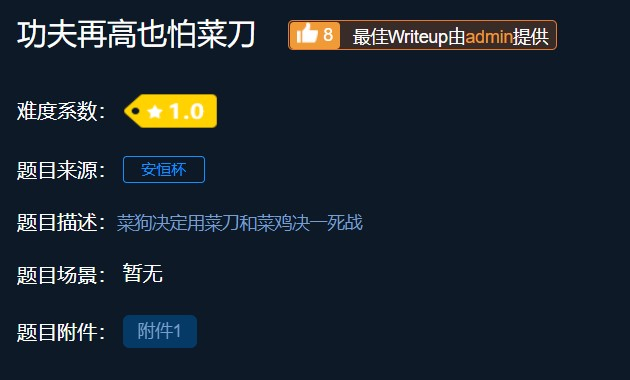


下载附件发现是一个`.pcapng`文件，是一个wireshark流量包。

用wireshark打开，`ctrl+F`查找flag

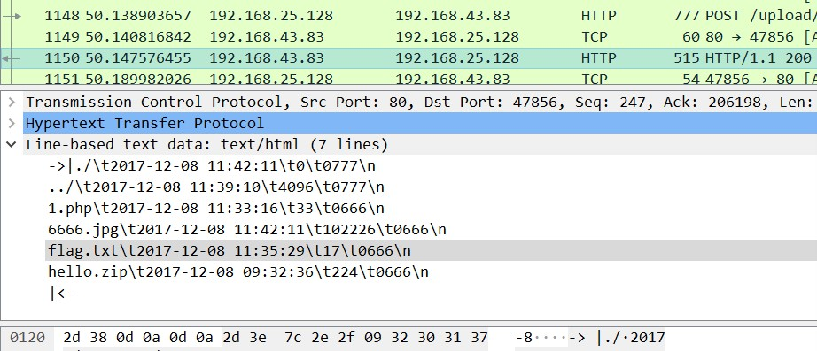

发现里面有zip和flag.txt还有6666.jpg。

追踪6666.jpg那一行的TCP请求，右键追踪TCP流

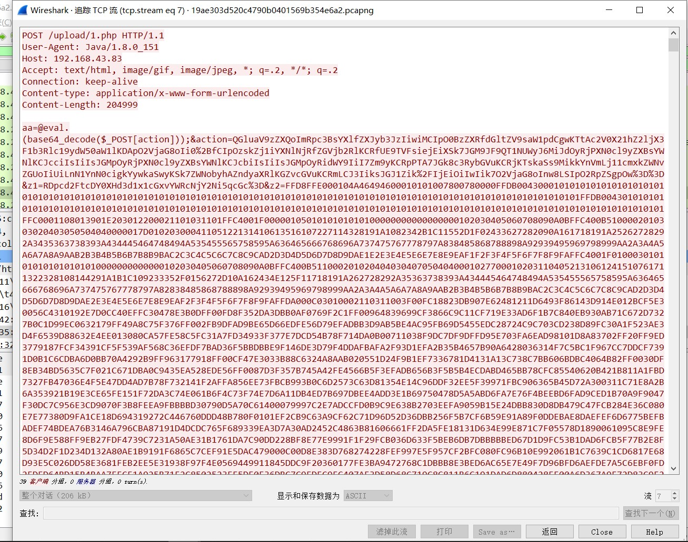


由于图片JPG的文件头是`FFD8`文件尾是`FFD9`，将文件另存为 ，然后用文本编辑器，编辑导出的文件，查找并删除第一个jpg文件头（FFD8）和最后一个文件尾（FFD9）之外的字符串，剩下的全是十六进制字符串。然后把十六进制保存为图片，我用的“010 Editor”，打开后新建空白文件，复制图片十六进制字符串到粘贴板，点击菜单栏“Edit-Paste From-Paste From Hex Text”，然后保存为图片就行了，保存后的图片如下图。 


刚才看到里面有存在一个hello.zip，便用foremost处理流量包，分理出一个压缩文件，里面就是flag.txt，为加密文件，联想至刚刚那张复原的图片，用密码`Th1s_1s_p4sswd_!!!`尝试打开文件，得到flag：`flag{3OpWdJ-JP6FzK-koCMAK-VkfWBq-75Un2z}`


