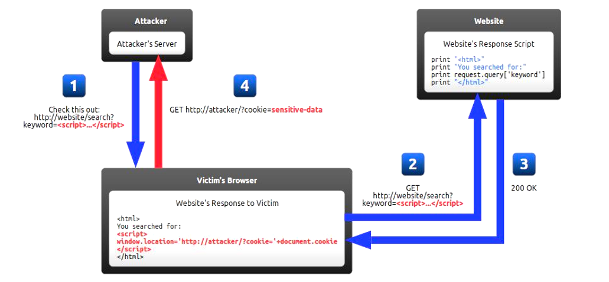
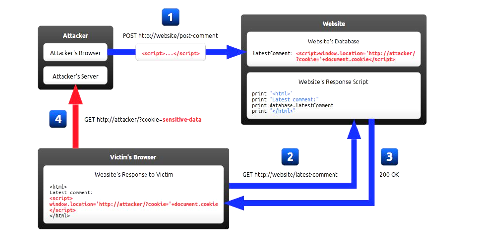
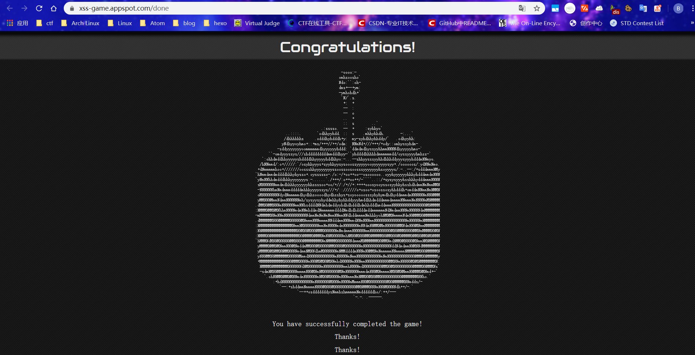

# XSS 跨站脚本攻击


上节课，老师讲了有关XSS的攻击，我们便在这复习一波

> 主要参考：
>
> 老师的ppt以及ctf-wiki
>
> [Google Security - XSS](https://www.google.com/about/appsecurity/learning/xss/index.html)
>
> [ctf-wiki : XSS Cross-site Scripting Attack](https://ctf-wiki.github.io/ctf-wiki/web/xss-zh/)
>
> [跨站脚本漏洞(XSS)基础讲解](https://www.jianshu.com/p/4fcb4b411a66)
>
> [前端安全系列（一）：如何防止XSS攻击？](https://tech.meituan.com/2018/09/27/fe-security.html)
>
> [浅谈XSS攻击的那些事（附常用绕过姿势）](https://zhuanlan.zhihu.com/p/26177815)
>
> 


然后这边有一个在线的xss靶场：[the XSS game](https://xss-game.appspot.com/)


### XSS简介

什么是XSS：跨站脚本攻击，Cross-Site Scripting，为了和CSS(层叠样式表)区分开来，把第一个字母C改成了X，也就是现在所说的XSS攻击

跨站脚本（Cross-Site Scripting，XSS）是一种经常出现在 WEB 应用程序中的计算机安全漏洞，是**由于 WEB 应用程序对用户的输入过滤不足**而产生的。攻击者利用网站漏洞把恶意的脚本代码注入到网页中，当其他用户浏览这些网页时，就会执行其中的恶意代码，对受害用户可能采取 Cookies 资料窃取、会话劫持、钓鱼欺骗等各种攻击。


### XSS分类


XSS主要分为3种，分别是反射性XSS、持久性XSS(存储型XSS)、DOM XSS


* #### 反射性XSS


最经典的反射性XSS，就是我们在一个对话框里输入`<script>alert('Hello, XSS!')</script>`

然后跳出一个向你打招呼的XSS对话框


反射型 XSS 的攻击步骤：

1. 攻击者构造出特殊的 URL，其中包含恶意代码。
2. 用户打开带有恶意代码的 URL 时，网站服务端将恶意代码从 URL 中取出，拼接在 HTML 中返回给浏览器。
3. 用户浏览器接收到响应后解析执行，混在其中的恶意代码也被执行。
4. 恶意代码窃取用户数据并发送到攻击者的网站，或者冒充用户的行为，调用目标网站接口执行攻击者指定的操作。


反射型 XSS 漏洞常见于通过 URL 传递参数的功能，如网站搜索、跳转等。

由于需要用户主动打开恶意的 URL 才能生效，攻击者往往会结合多种手段诱导用户点击。



如图，攻击者给出一个诱使你点进去的超链接（包含脚本）(1)，用户点进去该网站(2&3)，服务器将该请求返回给用户，返回的页面形成victim's browser里的内容，然后执行了脚本，将自身的cookie发送给攻击者


* #### 存储型XSS


存储型 XSS 的攻击步骤：

1. 攻击者将恶意代码提交到目标网站的数据库中。
2. 用户打开目标网站时，网站服务端将恶意代码从数据库取出，拼接在 HTML 中返回给浏览器。
3. 用户浏览器接收到响应后解析执行，混在其中的恶意代码也被执行。
4. 恶意代码窃取用户数据并发送到攻击者的网站，或者冒充用户的行为，调用目标网站接口执行攻击者指定的操作。

这种攻击常见于带有用户保存数据的网站功能，如论坛发帖、评论区、用户私信等。





如图，很简单的在一个评论区里，攻击者在评论区进行评论了一个脚本(1)，此时，服务器将这个脚本存储下来，并作为评论展示给每个用户。当其他用户浏览评论时(2&3)，服务器将脚本返回给用户，用户加载给页面，即评论区的脚本时，将自身的cookie以get方式发给攻击者的网站(4)，此时攻击者就获得了用户的cookie


* **反射型 XSS 和存储型 XSS 的区别**是：存储型 XSS 的恶意代码存在数据库里，反射型 XSS 的恶意代码存在 URL 里。


* #### DOM 型 XSS


DOM 型 XSS 的攻击步骤：

1. 攻击者构造出特殊的 URL，其中包含恶意代码。
2. 用户打开带有恶意代码的 URL。
3. 用户浏览器接收到响应后解析执行，前端 JavaScript 取出 URL 中的恶意代码并执行。
4. 恶意代码窃取用户数据并发送到攻击者的网站，或者冒充用户的行为，调用目标网站接口执行攻击者指定的操作。

DOM 型 XSS 跟前两种 XSS 的区别：DOM 型 XSS 攻击中，取出和执行恶意代码由浏览器端完成，属于前端 JavaScript 自身的安全漏洞，而其他两种 XSS 都属于服务端的安全漏洞。


### XSS的危害

其实归根结底，XSS的攻击方式就是想办法“教唆”用户的浏览器去执行一些这个网页中原本不存在的前端代码。

可问题在于尽管一个信息框突然弹出来并不怎么友好，但也不至于会造成什么真实伤害啊。的确如此，但要说明的是，这里拿信息框说事仅仅是为了举个栗子，真正的黑客攻击在XSS中除非恶作剧，不然是不会在恶意植入代码中写上alert（“say something”）的。

在真正的应用中，XSS攻击可以干的事情还有很多，这里举两个例子。

- #### 窃取网页浏览中的cookie值

在网页浏览中我们常常涉及到用户登录，登录完毕之后服务端会返回一个cookie值。这个cookie值相当于一个令牌，拿着这张令牌就等同于证明了你是某个用户。

如果你的cookie值被窃取，那么攻击者很可能能够直接利用你的这张令牌不用密码就登录你的账户。如果想要通过script脚本获得当前页面的cookie值，通常会用到document.cookie。

试想下如果像空间说说中能够写入xss攻击语句，那岂不是看了你说说的人的号你都可以登录（不过某些厂商的cookie有其他验证措施如：Http-Only保证同一cookie不能被滥用）

- #### 劫持流量实现恶意跳转

这个很简单，就是在网页中想办法插入一句像这样的语句：

```js
<script>window.location.href="http://www.baidu.com";</script>
```

那么所访问的网站就会被跳转到百度的首页。

早在2011年新浪就曾爆出过严重的xss漏洞，导致大量用户自动关注某个微博号并自动转发某条微博。具体各位可以自行百度。


### XSS漏洞防范


* 过滤
  服务器对输入内容进行过滤，对一些常用的标签(`<script>`、``、`<a>`)进行过滤，也有可能需要多次过滤以防绕过
* 输入输出编码
  服务器对输入内容的一些常见符号进行编码，使得浏览器不会对标签进行解释执行
* 对内容长度进行限制
  对于注入内容一般比较长的进行长度限制，因为达成XSS攻击一般需要较长的字符串，比如输入名字的时候，我们没必要开过长的数组


作为用户，我们需要小心点击来源不明的URL，对浏览器进行安全加固，虽然大多差错是来源于服务器端的检查过滤不足导致的，但后果却是导致我们的信息丢失，因此作为用户我们也应当加以防范。


### XSS防范与绕过


安全总是在对抗中产生的，假如没有攻击，那么哪来的防范提升呢？正如老话：魔高一尺，道高一丈。只有在不断地攻击中，安全才能更胜一步。

既然XSS被发现，就会有人对他进行防范，既然有了防范，那么就会有人去想方设法的去绕过他


这里介绍一些经典的绕过方式

* 大小写绕过
* 利用过滤后返回语句在此构成攻击语句来绕过（简称套娃）
  比如：`http://192.168.1.102/xss/example3.php?name=<sCri<script>pt>alert("hey!")</scRi</script>pt>`
* 并不是只有script标签才可以插入代码，比如`<a>`、``、`<div>`等等
* 编码脚本代码绕过关键字过滤
* 主动闭合标签实现注入代码
* 组合各种方式：就如同sql注入一样，XSS需要用心去构造0.0


## XSS靶场通关构造


> https://blog.csdn.net/abc_12366/article/details/82054946

1

输入框搞事情了

`<script>alert('hello,XSS!')</script>`


2

评论区搞事情了

``


3

在url搞事情，这边我自己没注意，它使用`“”`表示字符串，`''`表示标签里的字符串，没注意到卡了一会儿

`https://xss-game.appspot.com/level3/frame#1'/><script>alert('Hello,XSS!');</script>'`


4

类似于一个计时器，但不过根据描述需要绕过，当然也就是在输入框搞事情了

js动态引用参数问题

输入`3'`可以看到 `onload="startTime('3'');"`

尝试输入`3');alert('hello,XSS!`


5

这个可太刺激了，我竟然没发现能看源代码，亏我按F12看代码，在N次尝试下猜实现

输入转为链接过滤不严

看源代码按下面的`toggle`

构造如下：`https://xss-game.appspot.com/level5/frame/signup?next=javascript:alert(1)`


6

引入外部js，过滤不严导致绕过造成xss

#后面能访问到url所指的地方，比如将其替换为`baidu.com`

所以这边写个简易的javascript脚本

```js
alert(1);
```

然后保存

用我们python3自带的简易服务器用于其url访问

```sh
$ python -m http.server 8000
```

然后访问本地8000端口就可以看到本地文件了

然后构造url：`https://xss-game.appspot.com/level6/frame#HTTP://127.0.0.1:8000/temp.js`

注意，题目js源码中有对http的过滤

当然也可以用google的jsapi：`https://xss-game.appspot.com/level6/frame#hTTps://google.com/jsapi?callback=alert`


通关撒花




最后通向了其XSS学习网站：https://www.google.com/about/appsecurity/learning/xss/index.html


## 构造一个XSS网站以及其对抗


通过上面的靶场练习已经很熟悉XSS的原理了


刚开始再用flask基本实现一个搜索功能时，发现无法XSS，后面经查询Flask和jinja2都有在传输时对数据进行html转义，但默认是Flask关闭html转义，jinja2开启html转义

> flask和其模板jinja2 禁用html转义
>
> https://blog.csdn.net/super_tiger_lee/article/details/77837443
>
> https://www.jianshu.com/p/6950b616f2b7
>
> 简单来说，在使用变量 `{{var}}` 利用jinja管道的方法，对 `var` 变量进行信任，而不进行html转义，即写为 `{{ var | safe }}`
>
> 


在前后台传输数据遇到的问题：

> 太久没写flask有点生疏，然后导致表单获取请求时一直为空，忘记啥原因了，这边mark一下
>
> get请求表单通过`request.args.get('name')`获得
>
> post请求表单通过`request.form.get('name')`获得


* 在评论时，防止get请求刷新后重复评论，需要用post去请求评论


实现html转义，有html包提供的方法，但代码里我们可以直接仿造其写一个(其实很简单)

```python
import html
s = "<script>alert(1);</script>"
tran_s = html.escape(s)
ret = html.unescape(tran_s)
```


下面给出代码

前端部分

主要用jinja2模板写的

```html
<!DOCTYPE html>

<html><head><meta http-equiv="Content-Type" content="text/html; charset=UTF-8">
<title>fuckXSS</title>
<style type='text/css'>
div {
    display: block;
}
table {
    border-collapse: separate;
    border-spacing: 2px;
}
.message-container {
    padding: 10px;
    background-color: #F9F9F9;
    border: 1px solid #C4C4C4;
    border-radius: 5px 5px;
    width: 400px;
    font-size: 12px;
}
td {
    display: table-cell;
    vertical-align: inherit;
}
.shim {
    position: absolute;
    margin-left: -20px;
    top: 15px;
    height: 21px;
    width: 10px;
}
b {
    font-weight: bold;
}
blockquote {
    display: block;
    margin-block-start: 1em;
    margin-block-end: 1em;
    margin-inline-start: 40px;
    margin-inline-end: 40px;
}
</style>
</head>

<body>

<h1 style='text-align: center'> 反射性XSS </h1>
    <div style='text-align: center;
  margin: 0 auto;'>
  

	<form action="/rxss" method="GET">
	  <input type="text" id="query" name="query" value="{{query}}">
	  	<br>
		anti-XSS<input type="checkbox" name="anti-XSS" value="1"/>
		<br>
	  <input id="button" type="submit" value="Search">
	</form>

    <br>Your Search for {{ query|safe }}<br>
	Unfortunately it has gone!<br>



	<form action="/rxss" method="GET">
	  <input type="text" id="query" name="query" value="Enter query here...">
	  	<br>
		anti-XSS<input type="checkbox" name="anti-XSS" value="1"/>
		<br>
	  <input id="button" type="submit" value="Search">
	</form>



	</div>
  

<h1 style='text-align: center'> 持久性XSS </h1>
    <div style='text-align: center;
  margin: 0 auto;'>
	

	<form name="pxss" action="pxss" method="POST">
	  <input id="qcomment" name="qcomment" value="Enter comment here..." onfocus="this.value=&#39;&#39;">
	  <br>
	anti-XSS<input type="checkbox" name="anti-XSS" value="1"/>
	<br>
	  <input id="button" type="submit" value="Comment">
	</form>

	</div>  

<br><br>
<div id="post-container" align="center">
<table class="message"> 

<tbody><tr> <td valign="top" class="message-container"> 
<div class="shim"></div>
<b>You</b><br>
<span class="date">Sun Apr 12 2020 16:44:32 GMT+0800 (中国标准时间)</span>
<blockquote>Welcome!<br><br>This is your <i>personal</i> stream. You can post anything you want here, especially <span style="color: #f00ba7">madness</span>.</blockquote>
</td></tr>



<tr> <td valign="top" class="message-container"> 
<div class="shim"></div>
<b>You</b><br>

<blockquote><p>{{comment_item | safe}}</p></blockquote>
</td></tr>



</tbody>
</table>
</div>

</body></html>
```


后端部分：

通过Python的Flask实现

通过路由来接收搜索和评论请求，把评论内容存储在一个数组里（毕竟是临时的，重启Flask应用即可清除评论）

XSS的对抗将输入进行html编码实现，勾选框即可启用

escape仿照了HTML包里面对于html编码的实现，利用python的字符串替代直接替换相关的html符号，实现html编码

```python
# !/usr/bin/env python
# -*- coding: utf-8 -*-
#
# @time		: 	2020/04/12
# @Author	:	Magic
# @File		:	xss_test_server.py


from flask import Flask,render_template,request,redirect,url_for

app = Flask(__name__)


comment = []

@app.route('/', methods=["GET","POST"])
def index():
	return render_template("XSS.html", comment=comment, query=None)


# Realize the Reflected XSS attack Vulnerable Search box
@app.route('/rxss', methods=["GET","POST"])
def rxss():
	if request.method == "GET":
		qdata = request.args.get('query')
		action = request.args.get('anti-XSS')
	if not action:
		action = 0
	print(request.args)
	if int(action):
		qdata = escape(qdata)
	print(qdata)
	return render_template("XSS.html", query=qdata)


# Realize the Persistent XSS attack Vulnerable Comment
@app.route('/pxss', methods=["GET","POST"])
def pxss():
	if request.method == "POST":
		qcomment = request.form.get('qcomment')
		action = request.form.get('anti-XSS')
	global comment
	if not action:
		action = 0
	print(request.form)
	if int(action):
		qcomment = escape(qcomment)
	comment.append(qcomment)
	print(comment)
	#return render_template("XSS.html", comment=comment)
	return redirect(url_for('index'))


# 检查字符串是否含有标签并编码
def escape(s, quote=True):
    """
    Replace special characters "&", "<" and ">" to HTML-safe sequences.
    If the optional flag quote is true (the default), the quotation mark
    characters, both double quote (") and single quote (') characters are also
    translated.
    """
    s = s.replace("&", "&amp;") # Must be done first!
    s = s.replace("<", "&lt;")
    s = s.replace(">", "&gt;")
    if quote:
        s = s.replace('"', "&quot;")
        s = s.replace('\'', "&#x27;")
    return s


if __name__ == '__main__':
	app.run(debug=True, port=12345)

```


