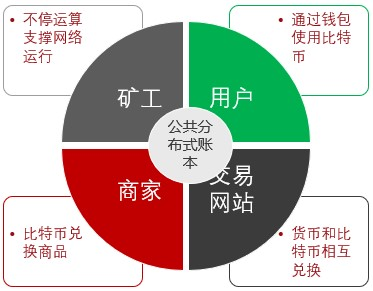
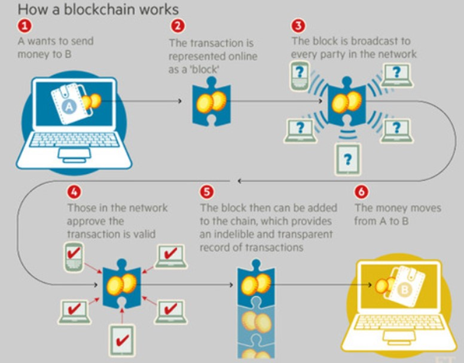

## Bit Coin

#### 数字货币和纸质货币的对比

| **属性** | **分析**                                                     | **优势方** |
| -------- | ------------------------------------------------------------ | ---------- |
| 便携     | 大部分场景（特别是较大数额支付时）下数字货币将具备更好的便携性 | 数字货币   |
| 防伪     | 两者各有千秋，但数字货币整体上会略胜一筹。 纸币依靠的是各种设计（纸张、油墨 、防伪 暗纹 、 夹层等）上的精巧，数字货币依靠的则是密码学上的保障。 事实上，纸币的伪造时有发生，但数字货币的伪造目前还无法实现 | 数字货币   |
| 辨伪     | 纸币即使依托验钞机等专用设备仍会有误判情况，数字货币依靠密码学易于校验 | 数字货币   |
| 匿名     | 通常情况下，两者都能提供很好的匿名性 。 但都无法防御有意的追踪 | 持平       |
| 交易     | 对纸币来说，谁持有纸币谁就是合法拥有者，交易通过纸币自身的转移即可完成，无法复制 。 对数字货币来说则复杂得多，因为任何数字物品都是可以被复制的，但数字 形式也意味着转移成本会更低 。 总体上看，两者适用不同的情景 | 持平       |
| 资源     | 通常情况下，纸币的生产成本要远低于面额。 数字货币消耗资源的计算则复杂得多 。 以比特币为例，最坏情况下可能需要消耗接近甚至超过面值的电能 | 持平       |
| 发行     | 纸币的发行需要第三方机构的参与，数字货币则通过分布式算法来完成发行。 在人类历史上，通胀和通缩往往是不合理地发行货币造成的，而数字货币尚缺乏大规模验证， 还有待观察 | 持平       |
| 管理     | 纸币发行和回收往往通过统一机构，易于监管和审计；目前出现的数字货币在这方面 还缺乏足够支持和验证 | 纸币       |

#### 双重支付攻击

对于数字货币来说，数字化内容容易被复制。数字货币持有人可以将同一份货币发给多个接收者，这种攻击称为“双重支付攻击”。

数字货币1.0：即银行中通过电子账号里面的数字记录了客户的资产

但他依赖于一个前提：假定存在一个安全可靠的第三方记账机构负责记账，这个机构负责所有的担保环节，最终完成交易。

银行、支付宝都属于这种类型。

#### 去中心化的技术难关

* 货币的防伪：谁负责对货币的真伪进行鉴定
* 货币的交易：如何确保货币从一方安全转移到另外一方
* 避免双重支付：如何避免同一份货币支付给多个接收者

#### 数字货币的定义

数字货币可以认为是一种**基于节点网络和数字加密算法的虚拟货币**。数字货币的**核心特征**主要体现在三个方面：

①由于来自于某些开放的算法，数字货币没有发行主体，因此没有任何人或机构能够控制它的发行；

②由于算法解的数量确定，所以数字货币的总量固定，这从根本上消除了虚拟货币滥发导致的可能；

③由于交易过程需要网络中的各个节点的认可，因此数字货币的交易过程足够安全 。

数字货币是一种不受管制的、数字化的货币，通常由开发者发行和管理，被特定虚拟社区的成员所接受和使用。欧洲银行业管理局将虚拟货币定义为：价值的数字化表示，不由央行或当局发行，也不与法币挂钩，但由于被公众所接受，所以可作为支付手段，也可以电子形式转移、存储或交易 

#### 比特币的诞生

2008 年 10 月 31 日， 一位化名 Satoshi Nakamoto （中本聪）的人在 metzdowd 密码学邮件列表中提出了比特币（ Bitcoin）的设计白皮书《 Bitcoin: A Peer-to-Peer Electronic Cash System 》，并在2009 年公开了最初的实现代码 。 

#### 比特币的意义和价值

比特币首次真正从实践意义上实现了**安全可靠的去中心化数字货币机制** ，这也是它受到无数金融科技从业者热捧的根本原因 。 

* 作为一种概念货币，比特币主要希望解决已有货币系统面临的几个核心问题：
  - 被掌控在单一机构手中，容易被攻击 
  - 自身的价值无法保证，容易出现波动 
  - 无法匿名化交易，不够隐私

##### 比特币的生态系统如下：

区块链因比特币而生，但是现在已经脱离了比特币网络自身。

## Block Chain

区块链本质上是一个去中心化的数据库，又不仅仅是一个数据库。是一串使用密码学方法相关联产生的数据块，每一个数据块中包含了一组比特币网络交易的信息，用于验证其信息的有效性(防伪)和生成下一个区块。

2015年被业界视为区块链元年，2016年则是区块链产业深化发展和全面加速前行的一年，2019年为“上链元年”。

* 区块链的**特点**
  * 分布式容错性：分布式网络及其鲁棒，能够容忍部分节点的异常状态
  * 不可篡改性：一致提交后的数据会一直存在，不可销毁和修改
  * 隐私保护性：密码学保证了数据隐私，即便数据泄露也无法解析
* 随之带来的业务特性
  * 可信任性：区块链技术可以提供天然可信的分布式账本平台，不需要额外的第三方中介机构参与
  * 降低成本：跟传统技术相比，区块链技术可能需要时间、人力和维护成本更少
  * 增强安全：区块链技术将有利于安全、可靠的审计管理和账目清算，减少犯罪风险

所有跟**信息、价值、信用**等相关的交换过程，都将可能从区块链技术中得到启发或直接受益。

Wikipedia的定义：是借由密码学串接并保护内容的串连文字记录。类比于一种分布式数据库技术，通过维护数据块的链式结构，可以维持持续增长的、不可篡改的数据记录。

区块链技术最早的应用出现在比特币项目中。

基本概念：

* 交易（transaction）：一次对账本的操作，导致账本状态的一次改变，如添加一条转账记录
* 区块（block）：记录一段时间内发生的所有交易和状态结果，是对当前账本状态的一次共识
* 链（chain）：由区块按照发生顺序串联而成，是整个账本状态变化的日志记录

若把区块链作为一个状态机，则每一次交易是视图改变一次状态，而每次共识生成的区块，就是参与者对于区块中交易导致状态的改变的结果进行确认。

在实现上，首先假设存在一个分布式的数据记录账本，这个账本只允许添加 、 不允许删除 。 账本底层的**基本结构**是一个**线性的链表**，这也是其名字“区块链”的来源 。

链表由一个个“区块”串联组成，后继区块记录前导区块的哈希值（ pre hash ） 。 新的数据要加入，必须放到一个新的区块中 。 而这个块（以及块里的交易）是否合法，可以通过计算哈希值的方式快速检验出来 。 任意维护节点都可以提议一个新的合法区块，然而必须经过一定的共识机制来对最终选择的区块达成一致。 

> * 比特币为例，区块链的共组过程
>
> 1. 比特币客户端发起一项交易，广播到比特币网络中并等待确认 。
>
> 2. 网络中的节点会将一些收到的等待确认的交易记录打包在一起（此外还要包括前一个区块头部的哈希值等信息），组成一个候选区块 。 
>
> 3. 试图找到一随机串放到区块里，使得候选区块的哈希结果满足一定条件（比如小于某个值） 。 这个 nonce 串的查找需要一定的时间去进行计算尝试。
>
> 4. －旦节点算出来满足条件的 nonce 串，这个区块在格式上就被认为是“合法”了，就可以尝试在网络中将它广播出去 。 
>
> 5. 其他节点收到候选区块，进行验证，发现确实符合约定条件了，就承认这个区块是一个合法的新区块，并添加到自己维护的区块链上 。
>
> 6. 当大部分节点都将区块添加到自己维护的区块链结构上时，该区块被网络接受，区块中所包括的交易也就得到确认 。 

如图，A想要向B发起交易（1，2），做工作量证明，然后将交易广播至区块链网络中（3），让其他节点验证工作量证明（4），验证成功后，将交易区块加入该链的末尾（5），交易成功（6）。

#### 工作量证明

Proof of Work：简称PoW，即工作量证明。比特币的这种基于算力寻找 nonce 串的共识机制。 目前，要让哈希结果满足一定条件，并无已知的快速启发式算法，只能进行尝试性的暴力计算 。 尝试的次数越多（工作量越大），算出来的概率越大 。

通过调节对哈希结果的限制，比特币网络控制平均约 10 分钟产生一个合法区块 。 算出区块的节点将得到区块中所有交易的管理费和协议固定发放的奖励费（目前是 12.5 比特币，每四年减半），这个计算新区块的过程俗称为**挖矿** 。 

比特币网络中存在大量（据估计数千个）的维护节点，而且大部分节点都是正常工作的，默认都只承认所看到的最长的链结构 。 只要网络中不存在超过一半的节点提前勾结一起采取恶意行动，则最长的链将很大概率上成为最终合法的链 。 而且随着时间增加，这个概率会越来越大。 例如，经过 6 个区块生成后，即便有一半的节点联合起来想颠覆被的结果，其概率也仅为（1/2)6 = 1.6% ，即低于 1 /60 的可能性 。当然，如果整个网络中大多数的节点都联合起来作恶，可以导致整个系统无法正常工作 。 要做到这一点，往往意味着付出很大的代价，跟通过作恶得到的收益相比，得不偿失 。 

#### 区块链的演化

* 区块链1.0

  ​		区块链1.0是随着比特币的发明而引入，基于用于加密货币

* 区块链2.0

  ​		主要用于金融服务，在这一阶段引入合同

* 区块链3.0

  ​		用于金融服务行业之外，同时还包括政府、卫生、媒体、艺术和司法等更综合的行业

* Generation X（区块链X）

  ​		这是区块链发展过程中一个奇点，有一天我们将会拥有一个公共区块链服务，任何人都可以使用，进而在所有领域提供服务

三种典型演化场景

| 场景                   | 功能     | 智能合约           | 一致性                           | 权限 | 类型   | 性能   | 编程语言     | 代表       |
| ---------------------- | -------- | ------------------ | -------------------------------- | ---- | ------ | ------ | ------------ | ---------- |
| 公信的数字货币         | 记账功能 | 不带有或较弱       | Pow                              | 无   | 公有链 | 较低   | 简单脚本     | 比特币网络 |
| 公信的交易处理         | 智能合约 | 图灵完备           | PoW、PoS                         | 无   | 公有链 | 受限   | 待定语言     | 以太坊网络 |
| 带权限的分布式账本处理 | 商业处理 | 多种语言、图灵完备 | 包CFT、BFT在内的多种机制、可插拔 | 支持 | 联盟链 | 可扩展 | 高级编程语言 | 超级账本   |

演化出的几种类型：

> * 公有区块链：对公众开放，任何人都可以作为节点参与进来。任何人不会持有该账本，而且向任何参与者开放
> * 私有区块链：仅向特定组织开放，进而确定账本的共享过程
> * 半私有区块链：兼具私有性和公有性，私有部分由某一团体控制，而公有部分则向参与者开放
> * 侧链技术：包括单路楔入式侧链和双路楔入式侧链。针对后者，货币可在主链和侧链间移动，并在必要时返回至主链
> * 许可账本：参与者是已知且受信的，许可账本不需要使用分布式协商一致机制，相反，可以使用一致性协议来维护共享账本
> * 分布式账本：分布式账本分布在参与者之间，并扩散于多个站点或组织中。对应的记录是连续存储的，而不是按情况排序的
> * 共享账本：共享的应用程序和数据库
> * 全私有和专有账本：适用于组织内部的特定私有环境共享数据，并提供数据的真实性保证
> * 标记化区块链：标准的区块链，通过挖掘和初始分布来生成加密货币
> * 无代币区块链：不需在节点间传递值，只需在受信各方之间共享数据

##### **区块链是首个自带对账功能的数字记账技术实现** 

  跟传统的记账技术相比，**基于区块链的分布式账本**应该包括如下**特点**：

* 维护一条不断增长的链，只可能添加记录，而发生过的记录都**不可篡改**

* **去中心化**，或者说多中心化，无需集中控制而能达成共识，实现上尽量采用分布式

* 通过**密码学的机制**来确保交易无法被抵赖和破坏，并尽量保护用户信息和记录的隐私性 

#### 分类

根据参与者的不同，可以分为公开（public）链、联盟（ consortium）链和私有（private）链。

* **公有链**，顾名思义，任何人都可以参与使用和维护，如比特币区块链，信息是完全公开的；

如果进一步引入许可机制，可以实现私有链和联盟链两种类型：

* **私有链**，由集中管理者进行管理限制，只有内部少数人可以使用，信息不公开；

* **联盟链**则介于两者之间，由若干组织一起合作维护一条区块链，该区块链的使用必须是带有权限的限制访问，相关信息会得到保护，如供应链机构或银行联盟 。 

## 分布式系统与去中心化