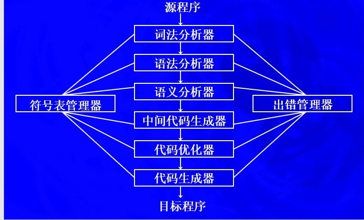

## 引论

编译原理是良好的数学基础和好的工程结构功能的结合。

Compiler：编译，述而不作，忠于编写的东西

编译器从逻辑上可以分成若干阶段，**每个阶段把源程序从一种表示变换成另一种表示**

### 1.1什么叫编译程序

翻译器（翻译程序）：Translater

能将一种语言程序（源语言程序）转换成另一种等价的语言程序（目标语言程序）

编译器（编译程序）：Compiler

能将一种计算机高级语言程序（源语言程序）转换成另一种等价的计算机低级语言程序（目标语言程序）

解释器（解释程序）：Interpreter

也是一种翻译程序，以一种语言写的源程序作为输入，但不产生目标代码，而是边解释边执行

解释器和编译器的区别：

①编译分成两步完成：先翻译，在运行

②解释只用一步就完成：边解释边执行

可变目标编译程序（Retargetable Compiler）

交叉编译程序（Cross Compiler）

### 1.2编译程序的组成

   

 词法分析器：读入组成源程序的字符流，并将它们组织成为有意义的词素的序列

语法分析器：使用由词法分析器生成的各个词法单元的第一个分量来创建树形的中间表示，该中间表示给出了词法分析产生的词法单元流的语法结构。一个常用的表示方法便是语法树，树中的每个内部节点表示一个运算

语义分析器：使用语法树和符号表中的信息来检查源程序是否和语言定义的语义一致。同时也收集类型信息，并把这些信息存放在语法树或符号表中，以便在随后的中键代码生成过程中使用。

中间代码生成器：在把一个源程序翻译成目标代码的过程中，一个编译器可能构造出一个或多个中间表示。这些中间表示可以有多种形式。比如语法树是一种中间表示形式，通常在语法分析和语义分析中使用。

代码优化器：机器无关的代码优化步骤试图改进中间代码，以便生成更好的目标代码

代码生成器：代码生成器以源程序的中间表示形式作为输入，并把它映射到目标语言。

符号表管理器：记录源程序中使用的变量的名字，并收集和每个名字的各种属性有关的信息。

>Tips:
>
>如何学习构造编译程序
>
>（1）源语言，对被编译的源程序深刻理解其结构和含义
>
>（2）目标语言，假定目标语言是机器语言，就必须搞清楚硬件的系统结构和操作系统的功能
>
>（3）编译方法，把一种语言翻译成另一种语言的方法很多，重点
>
>
>
>

## 高级语言及其语法描述

### 2.1程序语言的语法和语义

#### 2.1.1语法

任何语言均可作一个集合。这个集合中的每个元素都是在一定符号集（字母表）上的一个符号串。

对于自然语言来说，他们是定义在某个字母表上的**句子的集合**

对于程序语言来说，他们也是定义在某个字母表上的**句子**的集合。这里的句子，就是一个源程序。

词法规则：单词符号是语言中具有独立意义的最基本单位。语言的单词符号是由词法规则所确定的，即词法规则规定了单词符号的形成规则。

语法规则：上下文无关文法或BNF（Backus-Naur范式）

#### 2.1.2语义

语义，定义程序的意义

没有公认的形式系统描述语义

### 2.2程序语言的一般特征

#### 高级语言的分类

* 强制性语言（Imperative Language）|过程式语言：Fortran，C，Pascal
* 应用式语言（Applicative Language）|函数式语言：LISP
* 基于规则的语言（Ruled-based Language）：Prolog
* 面向对象语言（Object-oriented Language）：JAVA，c++

### 2.3程序语言的语法描述

#### 一、字母表和符号串

  **字母表**：符号的非空有限集合   例：∑ ={a，b，c}

  **符号**：字母表中的元素         例： a，b，c

  **符号串**：符号的有穷序列       例：a, aa, ac, abc，..

  **空符号串**：无任何符号的符号串( ε )    

> **符号串的形式定义**
>
>    有字母表å，定义：
>
>   （1）ε是å上的符号串；
>
>   （2）若x是å上的符号串，且aÎ å，则ax或xa是å上的符号串；
>
>   （3）y是å上的符号串，iff（当且仅当）y可由（1）和（2）产生。   

  **符号串集合**：由符号串构成的集合。

#### 二、符号串和符号串集合的运算

**符号串相等**：若x、y是集合上的两个符号串，则x＝y，iff（当且仅当）组成x的每一个符号和组成y的**每一个**符号依次相等。

**符号串的长度**：若x为符号串，其长度|x|等于组成该符      号串的符号个数。（例：x＝STV， |x|=3）

**符号串的连接**：若x、y是定义在Σ是上的符号串，且x＝XY，y＝YX，则x和y的连接 xy＝XYYX也是Σ上的符号串。（注意：一般`xy ≠ yx`，但是`εx = xε`）

**符号串集合的乘积运算**：令A、B为符号串集合，定义`AB＝{ xy | x∈A, y∈B}`

**符号串集合的幂运算**：有符号串集合A，定义A0 ={ε},  A1=A,  A2=AA,  A3=AAA,…… ……,                    An＝An-1A=AAn-1  ，n>0

**符号串集合的闭包运算**：设A是符号串集合，定义  A＋＝ A1 ∪ A2 ∪ A3 ∪……∪ An ∪……  称为集合A的正则闭包。A*＝ A0 ∪A＋ 称为集合A的闭包。（A0 = { ε } ）

**为什么对符号、符号串、符号串集合以及它们的运算感兴趣？**

若A为某语言的基本字符集

​        A＝{a,b,……z,0,1,……,9, +,－,×,_/, ( , ), =……}

B为单词集

​     B ={begin, end, if, then,else,for,……,<标识符>,<常量>,……}

  则B ⊂  A* 。

语言的句子是定义在B上的符号串。

若令C为句子集合，则C ⊂ B*  ,  程序 ⊂ C

#### 三、文法的直观理解

**1.什么是文法**：文法是对语言结构的定义与描述。即从形式上用于描述和规定语言结构的称为“文法”（或称为“语法”）。

**2.语法规则**：我们通过建立一组规则（产生式），来描述句子的语法结构。规定用“`::=`”表示“由……组成“。

> 例如：
>
> <句子>::=<主语><谓语>
>
> <主语>::=<代词>|<名词>
>
> <代词> ::=你|我|他
>
> <名词>::= 王民|大学生|工人|英语
>
> <谓语>::=<动词><直接宾语>
>
> <动词>::=是|学习
>
> <直接宾语>::=<代词>|<名词>
>
> 

**3.由产生式推导句子**：3.有了一组产生式之后，可以按照一定的方式用它们去推导或产生句子。

​    推导方法：从一个要识别的符号开始推导，即用相应产生式的**右部**来替代产生式的**左部**，每次仅用一条产生式去进行推导。

