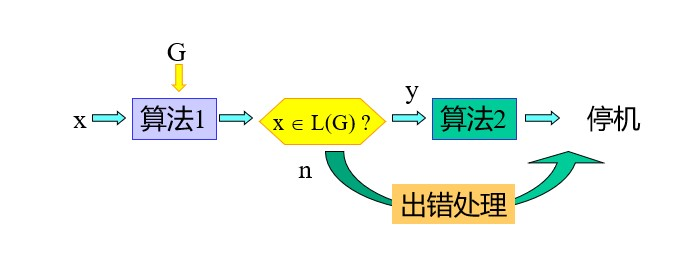
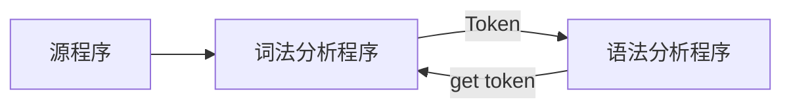
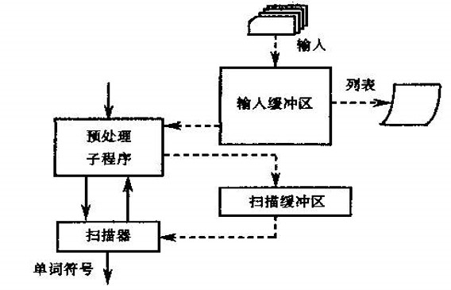
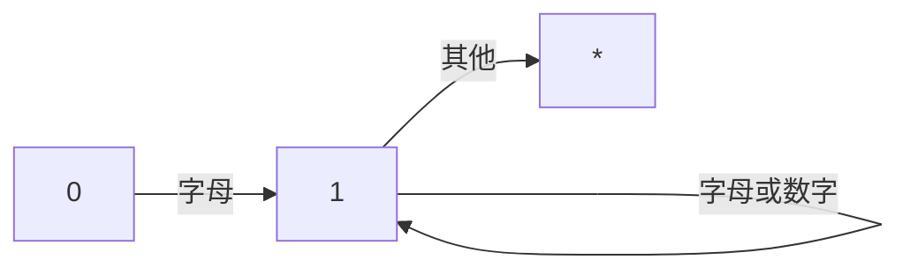
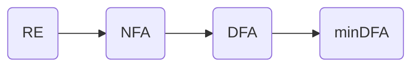

## 一、引论

编译原理是良好的数学基础和好的工程结构功能的结合。

Compiler：编译，述而不作，忠于编写的东西

编译器从**逻辑**上可以分成若干阶段，**每个阶段把源程序从一种表示变换成另一种表示**


### 1.1什么叫编译程序

翻译器（翻译程序）：Translater

能将一种语言程序（源语言程序）转换成另一种等价的语言程序（目标语言程序）

编译器（编译程序）：Compiler

能将一种计算机高级语言程序（源语言程序）转换成另一种等价的计算机低级语言程序（目标语言程序）

解释器（解释程序）：Interpreter

也是一种翻译程序，以一种语言写的源程序作为输入，但不产生目标代码，而是边解释边执行


解释器和编译器的区别：

①编译分成两步完成：先翻译，在运行

②解释只用一步就完成：边解释边执行


可变目标编译程序（Retargetable Compiler）

交叉编译程序（Cross Compiler）


### 1.2编译程序的组成


 词法分析器：读入组成源程序的字符流，并将它们组织成为有意义的词素的序列

语法分析器：使用由词法分析器生成的各个词法单元的第一个分量来创建树形的中间表示，该中间表示给出了词法分析产生的词法单元流的语法结构。一个常用的表示方法便是语法树，树中的每个内部节点表示一个运算

语义分析器：使用语法树和符号表中的信息来检查源程序是否和语言定义的语义一致。同时也收集类型信息，并把这些信息存放在语法树或符号表中，以便在随后的中键代码生成过程中使用。

中间代码生成器：在把一个源程序翻译成目标代码的过程中，一个编译器可能构造出一个或多个中间表示。这些中间表示可以有多种形式。比如语法树是一种中间表示形式，通常在语法分析和语义分析中使用。

代码优化器：机器无关的代码优化步骤试图改进中间代码，以便生成更好的目标代码

代码生成器：代码生成器以源程序的中间表示形式作为输入，并把它映射到目标语言。

符号表管理器：记录源程序中使用的变量的名字，并收集和每个名字的各种属性有关的信息。


>Tips:
>
>如何学习构造编译程序
>
>（1）源语言，对被编译的源程序深刻理解其结构和含义
>
>（2）目标语言，假定目标语言是机器语言，就必须搞清楚硬件的系统结构和操作系统的功能
>
>（3）编译方法，把一种语言翻译成另一种语言的方法很多，重点
>
>
>
>


## 二、高级语言及其语法描述


### 2.1程序语言的语法和语义


#### 2.1.1语法

任何语言均可作一个集合。这个集合中的每个元素都是在一定符号集（字母表）上的一个符号串。

对于自然语言来说，他们是定义在某个字母表上的**句子的集合**

对于程序语言来说，他们也是定义在某个字母表上的**句子**的集合。这里的句子，就是一个源程序。

词法规则：单词符号是语言中具有独立意义的最基本单位。语言的单词符号是由词法规则所确定的，即词法规则规定了单词符号的形成规则。

语法规则：上下文无关文法或BNF（Backus-Naur范式）


#### 2.1.2语义

语义，定义程序的意义

没有公认的形式系统描述语义


### 2.2程序语言的一般特征

#### 高级语言的分类


* 强制性语言（Imperative Language）|过程式语言：Fortran，C，Pascal
* 应用式语言（Applicative Language）|函数式语言：LISP
* 基于规则的语言（Ruled-based Language）：Prolog
* 面向对象语言（Object-oriented Language）：JAVA，c++


### 2.3程序语言的语法描述

#### 一、字母表和符号串

  **字母表**：符号的非空有限集合   例：∑ ={a，b，c}

  **符号**：字母表中的元素         例： a，b，c

  **符号串**：符号的有穷序列       例：a, aa, ac, abc，..

  **空符号串**：无任何符号的符号串( ε )    

  **符号串集合**：由符号串构成的集合。

> **符号串的形式定义**
>
>    有字母表∑，定义：
>
>   （1）ε是∑上的符号串；
>
>   （2）若x是∑上的符号串，且`a∈ ∑`，则`ax`或`xa`是 ∑ 上的符号串；
>
>   （3）y是∑上的符号串，iff（当且仅当）y可由（1）和（2）产生。   

  


#### 二、符号串和符号串集合的运算

**符号串相等**：若x、y是集合上的两个符号串，则x＝y，iff（当且仅当）组成x的每一个符号和组成y的**每一个**符号依次相等。

**符号串的长度**：若x为符号串，其长度|x|等于组成该符      号串的符号个数。（例：`x＝STV， |x|=3`）

**符号串的连接**：若x、y是定义在Σ是上的符号串，且`x＝XY，y＝YX`，则x和y的连接 `xy ＝ XYYX `也是Σ上的符号串。（注意：一般`xy ≠ yx`，但是`εx = xε`）

**符号串集合的乘积运算**：令A、B为符号串集合，定义`AB＝{ xy | x∈A, y∈B}`

**符号串集合的幂运算**：有符号串集合A，定义A<sup>0</sup> ={ε},  A<sup>1</sup>=A,  A<sup>2</sup>=AA,  A<sup>3</sup>=AAA,…… ……,                    A<sup>n</sup>＝A<sup>n-1</sup>A=AA<sup>n-1 </sup> ，n>0

**符号串集合的闭包运算**：设A是符号串集合，定义  A<sup>＋</sup>＝ A<sup>1</sup> ∪ A<sup>2</sup> ∪ A<sup>3</sup> ∪……∪ A<sup>n</sup> ∪……  称为集合A的正则闭包。A*＝ A<sup>0</sup> ∪A<sup>＋ </sup>称为集合A的闭包。（A<sup>0</sup> = { ε } ）


**为什么对符号、符号串、符号串集合以及它们的运算感兴趣？**

若A为某语言的基本字符集

​        A＝{a,b,……z,0,1,……,9, +,－,×,_/, ( , ), =……}

B为单词集

​     B ={begin, end, if, then,else,for,……,<标识符>,<常量>,……}

  则B ⊂  A* 。

语言的句子是定义在B上的符号串。

若令C为句子集合，则C ⊂ B<sup>*</sup>  ,  程序 ⊂ C


#### 三、文法的直观理解


**1.什么是文法**：文法是对语言结构的定义与描述。即从形式上用于描述和规定语言结构的称为“文法”（或称为“语法”）。


**2.语法规则**：我们通过建立一组规则（产生式），来描述句子的语法结构。规定用“`::=`”表示“由……组成“。

> 例如：
>
> <句子>::=<主语><谓语>
>
> <主语>::=<代词>|<名词>
>
> <代词> ::=你|我|他
>
> <名词>::= 王民|大学生|工人|英语
>
> <谓语>::=<动词><直接宾语>
>
> <动词>::=是|学习
>
> <直接宾语>::=<代词>|<名词>
>
> 


**3.由产生式推导句子**：3.有了一组产生式之后，可以按照一定的方式用它们去推导或产生句子。

​    **推导方法**：从一个要识别的符号开始推导，即用相应产生式的**右部**来替代产生式的**左部**，每次仅用一条产生式去进行推导。

<句子>  => <主语><谓语>

<主语><谓语> => <代词><谓语> 

  …… ……

这种推导一直进行下去，直到所有带< >的符号都由终结符号替代为止。

> **说明**：有若干语法成分同时存在时，我们总是从最左的语法成分进行推导，这称之为**最左推导**，类似的有**最右推导**（一般推导）。
>
>    

**文法**实在**形式上**对句子结构的定义与描述，而未涉及**语义**问题


**4.语法树**

一般用语法树来描述一个句子的语法结构。


#### 四、文法和语言的形式定义


##### 1.文法的定义


**定义1:**  文法 G =（V<sub>N</sub>，V<sub>T</sub>，P，Z）

​			V<sub>N</sub> ：	非终结符号集
​			V<sub>T</sub> ：	 终结符号集
​			P：		产生式或规则的集合
​			Z：		开始符号（识别符号）  Z∈VN

> * 产生式：产生式是一个有序对(U, x), 通常写为:
>
> ​       `U ::= x` 或`U ➡ x`；   `|U| = 1  |x| >= 0`
>
> * 非终结符号：出现在产生式的左部,且能推出符号或符号串的那些符号。其全体构成非终结符号集，记为V<sub>N</sub> 
>
> * 终结符号：不出现在产生式的左部,且不能推出符号或符号串的那些符号。其全体构成终结符号集，记为V<sub>T</sub> 


```
无符号整数的文法:
G[<无符号整数>]=（VN，VT，P，Z）
	VN＝{<无符号整数>, <数字串>, <数字>}
	VT  = {0,1,2,3,4,5,6,7,8,9}
	P = {<无符号整数> → <数字串> ;
        <数字串> → <数字串> <数字> ;
        <数字串> → <数字> ;
    	<数字> →0;    <数字> →2; 	<数字> →3;	<数字> →4;	
    	<数字> →5;    <数字> →6;	<数字> →7;	<数字> →8;    <数字> →9; }
	Z = <无符号整数>;
```

注：产生式左边符合构成集合V<sub>N</sub>，且Z ∈ V<sub>N</sub>

​		有些产生式有相同的左部，可以合在一起

​		给定一个文法，实际上只需给出产生式的集合，并指定识别符号（开始符号）


##### 2.推导与归约


**定义2：**直接推导：

有文法G：`v = xUy`，`w = xuy`，其中x、y∈V\*，U∈V<sub>N</sub>，u∈V\*，

若U ::= u∈P，则v &rArr; w，

若 x = y = ε ， 有 U ::= u， 则U &rArr; u

x和y是符号串，若使用一次产生式可以从x变换出y，则称x直接推导出y(或者说y是x的直接推导），记为x&rArr;y。


**定义3：** `+`推导：x和y是符号串，若使用若干次产生式可以从x变换出y，则称x推导出y(或者说y是x的推导），记为x  =<sup>+</sup>=&rArr;y。

即，若有直接推导序列：x=U0==>U1==>U2==>……==>Un=y,则 x=<sup>+</sup>=>y 。


 **定义4：**`*`推导：x和y是符号串，若使用0次或若干次产生式可以从x变换出y，则称x*推导出y(或者说y是x的*推导），记为x=<sup>*</sup>=>y。

如：N=<sup>\*</sup>=>N， N=<sup>\*</sup>=>109


**定义5：**最右推导&最左推导

* **最右推导**：若符号串α中有两个以上的非终结符时，对推导的每一步坚持把α中的最右非终结符进行替换，称为最右推导。

* **最左推导**：若符号串α中有两个以上的非终结符时，对推导的每一步坚持把α中的最左非终结符进行替换，称为最左推导。


**！！！规范推导＝最右推导**


**定义6：**推导的逆过程为归约

x==>y，可称为x直接推导出y，也可称为y直接归约出x


##### 3.语言的形式定义


**定义7：**文法G[Z]

​			（1）**句型**：x是句型 &hArr; Z =<sup>\*</sup>=>x,且 x∈V<sup>*</sup>；

​			（2）**句子**：x是句子 &hArr; Z =<sup>+</sup>=> x, 且 x∈V<sub>T</sub><sup>*</sup>；

​			（3）**语言**：L（G[Z]）={x| Z=<sup>+</sup>=>x， x∈V<sub>T</sub><sup>*</sup> }；（文法G[z]产生的所有句子的集合）


**定义8：**G和G'是两个不同的文法，若L(G) = L(G')，则G和G'为**等价文法**


编译感兴趣的问题如下

给定终极符x，文法G，求x ∈ L(G)？




**4.文法分类**


* 形式语言：用文法和自动机所描述的没有语义的语言

语言定义： L(G[Z]) = { x | Z=<sup>+</sup>=>x，x∈V<sub>T</sub><sup>\*</sup> }

文法定义：乔姆斯基将所有文法定义为一个**四元组**：G = （V<sub>N</sub>，V<sub>T</sub>，P，Z）

> V<sub>N</sub> ：	非终结符号集
> V<sub>T</sub> ：	 终结符号集
> P：		产生式或规则的集合
> Z：		开始符号（识别符号）  Z∈VN


文法和语言的分类：0型、1型、2型、3型

**定义9：** 0型文法

> P： u  &rarr; v ，其中 u ∈ V<sup>+</sup>，v ∈ V<sup>*</sup>
>
> 0型文法称为**短语结构文法**。产生式的左部和右部都可以是符号串，一个短语可以产生另一个短语。
>
> 0型语言：L0，这种语言可以用**图灵机（Turing）**接受
>
> 


**定义10：**1型文法

> P： xUy &rarr; xuy ，其中 U ∈V<sub>N</sub>，x、y、u ∈ V<sup>*</sup>
>
> 1型文法称为**上下文有关**或上下文敏感。即只有在x、y这样的上下文中才能将U改写为u
>
> 1型语言：L1，这种语言可以有一种**线性界限自动机**接受
>
> 


**定义11：**2型文法

> P： U &rarr; u ，其中 U ∈ V<sub>N</sub> ，u ∈ V<sup>*</sup>
>
> 2型文法称为**上下文无关文法**。即把U改写为u时，不必考虑上下文。
>
> 注意：2型文法与BNF表示相等价。
>
> 2型语言：L2，这种语言可以由**下推自动机**接受
>
> 


**定义12：**3型文法

> （左线型） P： U &rarr; T | U &rarr; wT ，其中 U、w ∈ V<sub>N</sub> ，T ∈ V<sub>T</sub> 
>
> （右线性）P： U &rarr; T | U &rarr; Tw ，其中 U、w ∈ V<sub>N</sub> ，T ∈ V<sub>T</sub> 
>
> 3型文法称为**正则文法**。它是对2型文法进行进一步的限制
>
> 3型语言：L3，又称正则语言、正则集合，这种语言可以由**有穷自动机**接受
>
> 


由上易知， L0 &sup; L1 &sup; L2 &sup; L3

0型文法可以产生L0、L1、L2、L3，但2型文法只能产生L2，不能产生L1


##### 5.语法树与二义性文法


1.推导与语法树

语法树：句子结构的图示表示法，通常表示称一棵倒立的树，即

> 结点：		符号
>
> 根节点：	识别符号
>
> 中间节点：非终结符
>
> 叶节点：	终结符~~或非终结符~~
>
> 
>
> 边：表示节点间的派生关系


句型的推导及语法树的生成（自顶向下）

给定G[Z]，句型w：可建立推导序列，Z =<sup>*</sup>=> w；可建立语法树，以Z为树根节点，每步推导生成语法树的一枝，最终可生成句型的语法树。

语法树的生成规律不同，但最终生成的语法树形状完全相同

一般推导

 ```mermaid
graph TB
	A[<无符号整数>] --> B[<数字串>]
	B --> C[<数字串>]
	B --> D[<数字>]
	C --> E[<数字>]
	E --> F[1]
	D --> G[0]
 ```


树与推导：句型推导过程 &hArr; 句型语法树的生长过程

①由推导构造语法树

从**识别符号**开始，**自左向右**建立**推导**序列 &rArr; 由**根节点**开始，**自上而下**建立**语法树**

②由语法树构造推导

**自叶而根**修剪子树的末端节点，直至把整棵树剪掉（留根），每剪一次对应一次归约 &rArr; 从句型开始，**自右向左**地逐步进行**归约**，建立推导序列


2.文法的二义性

**定义：**若对于一个文法的某一句子存在两棵不同的语法树，则该文法是**二义性文法**，否则是无二义性文法

换而言之，无二义性文法的句子**只有一棵语法树**，尽管推导过程可以不同

```
比如二义性文法: G[E]:	E := E+E | E*E | (E) | i
					Vn = {E}
					VT = {+,*,(,),i}

针对 i+i*i 有两种不同的语法树
```


**定义：**若一个文法的某句子存在两个不同的**规范推导（最右推导）**，则该文法是**二义性**的，否则是无二义性的

> 若文法是二义性的，则在编译时就会产生不确定性，遗憾的是在理论上已经证明：文法的二义性是不可判定的，即不可能构造出一个算法，通过有限步骤来判定任一文法是否有二义性
>
> 现在的解决办法是：提出一些限制条件，称为无二义性的充分条件，当文法满足这些条件时，就可以判定文法是无二义性的。
>
> 由于无二义性文法比较简单，我们也可以采用另一种解决办法：即不改变二义性文法，而是确定一种编译算法，使该算法满足无二义性充分条件。


句柄：句型的句柄是和某产生式右部匹配的子串。句柄是直接短语，即某产生式的右部，具有最左性

若句柄不存在重复，就说明文法无二义性

如 S &rarr; ABC ，ABC为该句子的句柄


## 三、词法分析


* 词法分析 （Lexical Analysis） 

实现词法分析器的程序称为词法分析程序（扫描器）

词法分析程序的**主要任务**：对构成源程序的字符串**从左到右的扫描**，**逐个字符地**读入源程序字符并按照构词规则切分成一个一个具有独立意义的单词。并确定其属性（如保留字、标识符、运算符、界限符和常量等）。再把它们转换成长度统一的标准形式——属性字（TOKEN）。

词法分析是编译过程中的第一个阶段，在语法分析前进行。也可以和语法分析结合在一起作为一遍，由语法分析程序调用词法分析程序来获得当前单词供语法分析使用。




> 为什么将词法分析工作从语法分析工作中独立出来？
>
> * 简化设计
>
> * 改进编译效率
>
> * 增加编译系统的可移植性
>
>  


### 3.1 词法分析器的要求


* **功能：输入源程序，输出单词符号**


**单词符号是一个程序语言的基本语法符号**

* **单词的分类**：

> 1.**关键字：**由程序语言定义的具有固定意义的标识符。也称为保留字或基本字
>
> 2.**标识符：**用来表示程序中各种名字的字符串。
>
> 3.**常    数：**常数的类型一般有整型、实型、布尔型、文字型。
>
> 4.**运算符：**如+、－ 、*、/ 等。
>
> 5.**界限符：**如逗号、分号、括号等。
>
> 

**一个程序语言的关键字、运算符、界限符都是固定的，即数量有限及意义明确；而对于标识符和常数通常是不确定的。**

词法分析器所输出的单词符号常常表示为二元式：（单词种别，单词符号的属性值）

单词种别一般将①标识符归为一种，②常数按类型分种（整数实数布尔），③关键字全体视为一种，或者一个一种，④运算符可采用一符一种，⑤界符一般也用一符一种。

如果一个种别只含一个单词符号，那么对于这个单词符号，种别编码可完全代表其自身。若一个种别有多个单词符号，那么，对于每个单词符号，除了给出种别编码外，还应给出有关的单词符号的属性信息。

**单词符号的属性**是指单词符号的特性或特征。属性值是反应特性或特征的值。

```c++
while(i>=j)i++;//以该语句为示例
//该句的单词符号序列如下:
<while, ->
<(, ->
<id, point(i)>//存放指向i的指针
<>=, ->
<id, point(j)>//存放指向j的指针
<), ->
<id, point(i)>
<--, ->
<;, ->
```


### 3.2 词法分析器的设计


#### Ⅰ、输入、预处理


词法分析器工作的第一步是输入源程序文本。输入串一般是放在一个**缓冲区**中，这个缓冲区称**输入缓冲区**。词法分析的工作（单词符号的识别）可以直接在这个缓冲区中进行。但在许多情况下，把输入串**预处理**一下，对单词符号的识别工作将是比较方便的。


##### 预处理的主要工作

* 某些跳格符、回车符和换行符等编辑性字符，在别处的任何出现都没有意义，预处理时可以将其剔掉
* 注解部分——仅在于改善程序的易读性和易理解性。对于它们，预处理时可以将其剔掉
* 空白符（一个或相继数个）用作单词符号之间的间隔，即用作界符。在这种情况下，预处理时可把相继的若干个空白结合成一个。


#### Ⅱ、单词符号的识别：超前搜索




上图为词法分析器结构，当词法分析器调用预处理子程序处理出一串输入字符放进扫描缓冲区之后，分析器就从此缓冲区种逐一识别单词符号。当缓冲区里的字符串被处理完之后，它又调用预处理程序装入新串。

> 超前搜索的原因
>
>* 在程序中有一些单词的识别经常需要多读入一些字符才能知道哪些字符组成一个单词
>
>   


#### Ⅲ、状态转换图


状态转换图是一张有限方向图，是设计词法分析器的有效工具。



一个状态转换图可用于识别（或接受）一定的字符串


### 3.3 正规表达式与有限自动机


#### 1.正规式与正规集

正规式也称正则表达式（regular expression），是说明单词的模式（pattern）的一种重要的表示法，是定义正规集的数学工具

##### **正规式及其所表示的正规集的定义：**

设字母表为∑，辅助字母表∑‘ = { φ，ε， |，&bull;，*，（，）}，

① ε 和 φ 都是 ∑ 上的正规式，他们所表示的正规集分别为 { ε }和 { } ；

② 对任何 a ∈ ∑ ，a 是 ∑ 上的一个正规式，他所表示的正规集为 { a } ；

③ 假定 e<sub>1</sub> 和 e<sub>2</sub> 都是 ∑ 上的正规式他们所表示的正规集分别为 L(e<sub>1</sub>) 和 L(e<sub>2</sub>)，那么，( e<sub>1</sub> ) ，         e<sub>1</sub> | e<sub>2</sub>  ， e<sub>1</sub> &bull; e<sub>2</sub>   ， e<sub>1</sub><sup>*</sup> 也都是正规式，他们所表示的正规集分别为 L( e<sub>1</sub> )， L( e<sub>1</sub> ) &cup; L( e<sub>2</sub> )，    L( e<sub>1</sub> ) L( e<sub>2</sub> )  和  ( L( e<sub>1</sub> ) )<sup>\*</sup> ；

④仅由有限次使用上述三步骤而定义的表达式才是 ∑ 上的正规式，仅有这些正规式所表示的集合才是 ∑ 上的正规集。

* 注意，| 、 &bull; 、* 、均为正规式的运算符

> | 表示或
>
> &bull; 表示连接
>
> \* 表示闭包，即任意有限次的自重复连接
>
> 在不混淆的情况下，括号可以省去，但规定算符的优先顺序为 *， &bull; ，|。连接符 &bull; 一般可省略不写，三个算符均为左结合的。

```
例:
a						{a}
a|b			 			{a,b}
ab						{ab}
(a|b)(a|b)	            {aa,ab,ba,bb}
a*	            		{ε,a,a,……,任意个a的串}
(a|b)*					{ε,a,b,aa,ab,bb,……,所有由a和b组成的串}
```


* 结论：程序设计语言的单词都能用正规式来定义


正规式的等价性：若两个正规式 e<sub>1</sub> 和 e<sub>2</sub> 所表示的正规集相同，则说 e<sub>1</sub> 和 e<sub>2</sub> 等价，写作 e<sub>1</sub> = e<sub>2</sub> 。

```
例:
e1 = (a|b) , e2 = (b|a) ,e1 == e2
e1 = b(ab)* , e2 = (ba)*b , e1 == e2
```


正规式服从的规律有：

* 或服从交换律：U|V = V|U
* 或的可结合律：U|(V|W) = (U|V)|W
* 连接的可结合律：(UV)W = U(VW)
* 分配律：U(V|W) = UV | UW，(V|W)U = VU | WU
* ε是连接的恒等律：εU = U，Uε = U
* 素零一律：U|U = U
* 或的抽取律： U* = ε|U|UU|...


#### 2.确定有限自动机

确定有限自动机（有穷自动机）作为一种识别装置，能准确地识别正规集，即识别正规文法所定义的语言和正规式所表示的集合，引入有穷自动机这个理论，正是为词法分析程序的自动构造寻找特殊的方法和工具

有穷自动机分两类：确定的有限自动机（deterministic Finite Automata）和不确定的有限自动机（Nondeterministic Finite Automata）




##### DFA

DFA定义：一个确定的有穷自动机（DFA）M是一个五元组： M = （ S ，∑ ，δ  ，s<sub>0</sub> ，F ）

> 其中：
>
> * S 是一个有穷集，他的每个元素称为一个状态；
> * Σ 是一个有穷字母表，他的每个元素称为一个输入符号，所以也称 Σ 为输入符号表
> * δ 是转换函数，实在 S × Σ &rarr; S 上的单值部分映射，即，如果 δ（s，a）= s‘ ，                     (s ∈ S，s' ∈ S ) 就意味着，当前状态为s，输入符为a时，将转换至下一个状态s’，s'称作s的一个后继状态
> * s<sub>0</sub> ∈ S 是唯一的一个初态
> * F &sub; S 是一个终态集（可空），终态也称可接受状态或结束状态
>
> 


DFA可以用一个矩阵表示，该矩阵的行表示状态，列表示输入字符，即s行a列的矩阵元素表示  δ（s，a）的值。这个矩阵称为**状态转换矩阵**。

一个DFA也可以表示为一张确定的状态转换图

> 假定DFA M含有 m个状态和 n个输入字符，那么，这个图含有m个状态结点，每个结点顶多有n条箭弧射出和别的结点相连接，每条箭弧用Σ中的一个不同输入字符作标记，整张图含有唯一的一个初态结点和若干个（可以是0个）终态结点。
>
> 一般来说，初态节点旁边标以 &rArr; ；终态节点用双圈表示。
>
> 

例如：

| 状态 | a    | b    |
| ---- | ---- | ---- |
| +S   | U    | V    |
| U    | Q    | V    |
| V    | U    | Q    |
| -Q   | Q    | Q    |


如上表，可表示`(a|b)*`，也可画成如下图


**DFA的确定性**

1.映射δ ： S × Σ &rarr; S 是一个单值函数。也就是说，对任何状态s∈S和输入符号 a ∈ Σ ，f（s，a）唯一地确定了下一状态。从转换图的角度来看，假定字母表 Σ 含有n个输入字符，那么，任何一个状态结最多只有n条弧射出，而且每条弧以一个不同的输入字符标记。 


##### NFA

NFA的定义：一个非确定的有穷自动机（NFA）M是一个五元组：M = （ S ，∑ ，δ  ，S<sub>0</sub> ，F ）

> 其中：
>
> * S 是一个有穷集，他的每个元素称为一个状态；
> * Σ 是一个有穷字母表，他的每个元素称为一个输入符号，所以也称 Σ 为输入符号表
> * δ 是转换函数，实在 S × Σ<sup>\*</sup>  &rarr; S 上的单值部分映射，即， δ： S × Σ<sup>\*</sup> &rarr; 2<sup>S</sup> 表明在某状态下对于某输入符号可能有多个后继状态
> * S<sub>0</sub>  &sub; S 是一个非空初态集
> * F &sub; S 是一个终态集（可空），终态也称可接受状态或结束状态
>
> 


如图，为一个NFA

∑<sup>\*</sup> 上的符号串 t 被 NFA M 接受也可以这样理解：

对于Σ*中的任何一个串t，若存在一条从某一初态结到某一终态结的道路，且这条道路上所有弧的标记字依序连接成的串(不理采那些标记为ε的弧)等于t，则称t可为NFA M所识别(读出或接受)。若M的某些结既是初态结又是终态结，或者存在一条从某个初态结到某个终态结的道路,其上所有弧的标记均为ε，那么空字可为M所接受。

NFA M所能接受的符号串的全体记为L(M) 

**结论：** Σ 上一个符号串集 V &sub; Σ<sup>*</sup> 是正规的，当且仅当存在一个 Σ 上的不确定的有穷自动机M，是的 V = L(M)


##### NFA和DFA的等价性

* DFA是NFA的特例

对于每个NFA M，存在一个DFA M’ ，使得L( M ) =L( M’ )。对每个NFA M存在着与之等价的DFA M’。即：对于任何两个有穷自动机M和M’，如果L( M )=L( M’ )，则称M与M’是等价的。

有一种算法，将NFA转换成接受同样语言的DFA。这种算法称为**子集法**。

与某一NFA等价的DFA不唯一

从NFA的矩阵表示中，表项通常是一状态的集合，而在DFA的矩阵表示中，表项是一个状态，NFA到相应的DFA的构造的基本思路是： 

- **DFA的每一个状态对应NFA的一组状态。**

DFA使用他的状态去记录在NFA读入的一个输入符号后可能达到的所有状态。


##### NFA确定化算法（ NFA &rarr; DFA  的转换）


假设NFA N = （ K， Σ ， f ，K<sub>0</sub>，K<sub>t</sub> ）按如下办法构造一个DFA M=（ S， å，δ，S<sub>0</sub> ，S<sub>t</sub>），使得L(M) = L(N) ：

1. M的状态集 S 由 **K 的一些子集**组成。用 [ S<sub>1</sub> ，S<sub>2</sub> ，…，S<sub>j</sub> ] 表示 S 的元素，其中 S<sub>1</sub> ，S<sub>2</sub> ，…，S<sub>j</sub> 是K的状态。并约定， 状态 S<sub>1</sub> ，S<sub>2</sub> ，…，S<sub>j</sub>  是按某种规则排列的，即对于子集{S<sub>1</sub> ，S<sub>2</sub> } = {S<sub>2</sub> ，S<sub>1</sub> }来说，S的状态就是 [S<sub>1</sub> ，S<sub>2 </sub>]

2. M和N的输入字母表是相同的，即 Σ
3. 转换函数是这样定义的： δ（ [ S<sub>1</sub> ，S<sub>2</sub> ，…，S<sub>j</sub> ] ，a ） = [ R<sub>1</sub> ，R<sub>2</sub> ，…，R<sub>t</sub> ]  ，其中                      { R<sub>1</sub> ，R<sub>2</sub> ，…，R<sub>t</sub>  } = ε-closure（ move（{S<sub>1</sub> ，S<sub>2</sub> ，…，S<sub>j</sub> } ， a） ）
4.  S<sub>0</sub>  = ε-closure（ K<sub>0</sub> ）为 M 的开始状态
5.  S<sub>t</sub> = {S<sub>i</sub> ，S<sub>k</sub> ，…，S<sub>e</sub> }， 其中  [ S<sub>i</sub> ，S<sub>k</sub> ，…，S<sub>e</sub> ]  ∈ S 且 {S<sub>i</sub> ，S<sub>k</sub> ，…，S<sub>e</sub> } &cap; K<sub>t</sub>  &ne;  &phi; 


> * **状态集合 I 的 ε-闭包**，表示为ε-closure( I )，定义为一状态集，是状态集I中的任何状态S经任意条ε弧而能到达的状态的集合。
>
>   状态集合I的任何状态S都属于ε-closure(I)
>
> * **状态集合 I 的 &alpha; 弧转换**，定义状态集合 J 表示为 J = move(I,a) ，其中J是所有那些可从I中的某一状态经过一条a弧而到达的状态的全体。
>
>   I<sub>a</sub>  =  ε-closure( J )  =  ε-closure( move( I , a )  )
>
> 


如之前NFA的例子：

```
I={1},  ε-closure(I) = {1,2}；
I={5},  ε-closure(I) = {5,6,2}；
move( {1,2} , a ) = {5,3,4}
ε-closure({5,3,4}) = {2,3,4,5,6,7,8}；
```

构造NFA N的**状态K的子集**的算法：

​		假定所构造的子集族为C，即 C = （T<sub>1</sub> ，T<sub>2</sub> ，… ， T<sub>I</sub> ），其中 T<sub>1</sub> ，T<sub>2</sub> ，… ， T<sub>I</sub>  为状态K的子集。

```
1.开始，令ε-closure(K0)为C中的唯一成员，并且他是未被标记的

2.while( C中尚未被标记的子集T )do{
	标记T;
	for 每个输入字母a do{
		U := ε-closure( move(T, a) );
		if U 不在 C 中:
			将U作为未标记的子集Ti加在C中;
	}
}
```


例：


如上图为实例NFA，构造其状态转换表

|         I          |   I<sub>a</sub>    | I<sub>b</sub> |
| :----------------: | :----------------: | :-----------: |
|     {i，1，2}      |     {1，2，3}      |   {1，2，4}   |
|     {1，2，3}      | {1，2，3，5，6，f} |   {1，2，4}   |
|     {1，2，4}      |     {1，2，3}      |       {1，2，4，5，6，f}     |
| {1，2，3，5，6，f} | {1，2，3，5，6，f} | {1，2，4，6，f} |
| {1，2，4，5，6，f} | {1，2，3，6，f} | {1，2，4，5，6，f} |
|  {1，2，4，6，f}   | {1，2，3，6，f} | {1，2，4，5，6，f} |
|  {1，2，3，6，f}   | {1，2，3，5，6，f} | {1，2，4，6，f} |

将其每个状态确定化，即得到如下等价DFA

N

状态转换表如下，将一组状态替换成对应符号。

|  I   |  Ia  |  Ib  |
| :--: | :--: | :--: |
|  S   |  A   |  B   |
|  A   |  C   |  B   |
|  B   |  A   |  D   |
|  C   |  C   |  E   |
|  D   |  F   |  D   |
|  E   |  F   |  D   |
|  F   |  C   |  E   |


##### minDFA

说一个有穷自动机是化简了的，即是说，**它没有多余状态并且它的状态中没有两个是互相等价的**。一个有穷自动机可以通过**消除多余状态**和**合并等价状态**而转换成一个最小的与之等价的有穷自动机。即用一个状态代替所有与其等价的状态。

所谓有穷自动机的多余状态，是指这样的状态：从自动机的开始状态出发，任何输入串也不能到达的那个状态；或者从这个状态没有通路到达终态。

* DFA的最小化就是寻求最小状态DFA

**最小状态DFA的含义：**①没有多余状态（死状态）；②没有两个状态时互相等价的（不可区别）。

> 两个状态s和t可区别：不满足
>
> * 兼容性：同时终态或同时非终态
> * 传播性：从s出发读入某个a（a ∈ Σ ）和从t出发读入某个a到达的状态等价
>
> 两个状态s和t等价：
>
> * 如果由 s 出发能导出的所有串的集合与 t 出发能导出的所有串的集合相等，我们称状态 s 与状态 t 是等价的。
>
> 


如上面示例的DFA，C和F是等价的。

C和F同是终态，读入a到达C和F，C和F同是终态，C和F读入a都到达C，读入b都到达E。

同理D和E也是等价的


##### DFA最小化的算法：分割法（逐步分组试探法）

核心思想：把一个DFA的状态分成一些不相交的子集，使得任何不同的两子集的状态都是可区别的，而同一子集中的任何两个状态都是等价的。算法假定每个状态射出的弧都是完全的,否则，引入一个新状态，叫**死状态**，该状态是非终态，将不完全的输入弧都射向该状态，对所有输入，该状态射出的弧还回到自己。

```
设有DFA M = ( s , ∑ , f, s0 , sz ),最小状态DFA M'
1.  因为不难证明，如果si是非终结状态，而sj是终结状态，那么si和sj一定互不等价(根据等价的定义可知，它们导出的符号串集不同)。所以开始可以把K中的终态和非终态分开，分成两个子集，形成一个基本划分：
       P2＝{I1,I2}    (I1∪I2＝K, I1∩I2＝Φ)
2. 若此两个子集还可以进行划分，则作进一步的划分，形成Pm ,假定到某个时候Pm已经含有m个子集，记为：Pm＝{I1,I2,…,Im}，设s'和s"是Ii中的任意两个状态，如果对某个a∈Σ,存在Ij ，使  f(s',a), f(s",a)∈Ij ，则称s'和s"关于a是拟等价的。
    如果存在s'，s"∈Ii，使得对字母表Σ中的某个符号a, s'和s"不为拟等价，则我们说Ii是可分的。
    换句话说，令Ii ＝{s1，s2, …，sn} ，如果对某个a∈Σ，使得Ia i＝{ f(s1,a)，f(s2,a)，…，f(sn,a)}不全落在现行Pm的某一个子集Ij之中；即Ia i这个集合中的元素分别属于I1，I2，…，Im中的几个不同集合，则Ii可分为几个集合（至少可一分为二）。 
3．转2,上述过程务必一再重复，直到P中的每个集合均是不可再分时为止。
此时，P所含的集合数不再增加，即P中的每个集合中的状态互相等价，而不同集合间的状态互不等价。
4.为P中的每一组选一代表，这些代表构成M'的状态。把原来导入非代表状态的弧均导入其代表即可，即若s'是一代表且f(s',a)=t,令r是t组的代表，则M'中有一转换f'(s',a)=r，M'的开始状态是含有S0的那组的代表，M'的终态是含有F的那组的代表。
5.去掉M'中的死状态。 

```


##### 正规式与有穷自动机的等价性（Re &hArr; NFA）

定理：①对于 Σ 上的NFA M，可以构造一个 Σ 上的正规式R，是的L(R) = L(M)。②对于 Σ 上的任一个正规式R，可以构造一个 Σ 上 的NFA M，是的L(M) = L(R)。


Re &rArr; NFA：

```
转换方法：我们把状态转换图的概念拓广，令每条弧可用一个正规式标记。
1. 在M的状态图上加进两个结点x、y。从x结点用ε弧 连接到M的所有初态结点，从M的所有终态结点ε弧 连接到y结点。形成一个与M等价的M， M只有一个初态和一个终态。
2. 逐步消去M中的所有结点，直至只剩下x结点和y结点。在消结过程中，逐步用正规式来标记弧，其消结规则如下：
A--R1-->2--R2-->3			==>			1--R1R2-->2
1--R1-->2,1--R2-->2			==>			1--R1|R2-->2
1--R1-->2--R2-->2--R3-->3	==>			1--R1R2*R3-->2
最后x结点和y结点之间的弧上的标记就是所求的正规式R
```


NFA &rArr; Re

```
方法如上反转
首先，对正规式R构造如下拓广转换图
然后通过对R进行分裂和加进新结点的办法，逐步把这个图转变为：每条弧标记为中的一个字母或ε ，其转换规则如下:
1--R1R2-->2				==>			A--R1-->2--R2-->3
1--R1|R2-->2			==>			1--R1-->2,1--R2-->2
1--R1R2*R3-->2			==>			1--R1-->2--R2-->2--R3-->3
在整个分裂过程中，所有新结点均采用不同的名字，保留x和y为全图的唯一初态结点和终态结点，至此我们就可以得到一个与R 等价的NFA M
```


##### 正规文法与有穷自动机的等价性

定理：①对于给定的正规文法G[R]，可以直接构造一个NFA M，使得L（M）=L（G）。②对于 Σ 上的任一个NFA M ，可以直接构造正规文法G[R] ，使得L（ R ）=L（ M ）。


把给定的正规文法G[R]转换为一个Σ上的NFA M构造规则:

```
设G[R]=（VN，VT，P，R）， NFA M=（ K，Σ，f，S，Z）
1.令 Σ = VT;
2. K = VN，S = R；即对G中的每个非终结符生成M的一个状态（不妨取相同的名字，G的开始符号是M的初态;
3.增加一个新状态Z，作为NFA M 的终态，Z∈K;
4.对G中的形如A->tB（其中t为终结符或ε；A和B为非终结符）的产生式,构造M的一个转换函数     f（A，t）=B;
5.对G中的形如A->t（其中t为终结符或ε；A和B为非终结符）的产生式,构造M的一个转换函数      f（A，t）=Z;

```


把给定的å上的NFA M转换为一个正规文法G[R]的构造规则:

```
设NFA M=（ K，Σ，f，S，Z）,G[R]=（VN，VT，P，R）,
1.令 VT = Σ ;
2.令VN =  K即对M的每一个状态生成G中的非终结符（不妨取相同的名字，G的开始符号是M的初态;
3.令S=R（如果M有多个初态，应先拓广自动机，引入新初态x）;
4.对M 的终态Z增加一个产生式： Z->ε;
5.对M的每一个转换函数f（A，t）=B可写G的一个产生式A->tB（其中t为终结符或ε;A和B为非终结符）;
```


##### 词法分析程序的自动构造

​		若对自动机的每一个状态赋予一定的功能，并把其边上的符号视为转移条件，那么自动机就成为一个程序了。


### 四、语法分析


