#  数据库系统概念


## 引言


DBMS定义：由一个相互关联的数据集合和一组用以访问这些数据的程序组成，这个数据集合同城称作**数据库(Database)**。

DBMS的目标：方便、高效地存取数据库信息


* 四个基本概念
  * 数据（Data）
  * 数据库（Database）
  * 数据库管理系统（DBMS）
  * 数据库系统（DBS）


### 数据

数据（Data）是数据库中存储的基本对象

**数据的定义**：描述事物的符号记录

**数据的种类**：文字、图形、图像、声音

**数据的特点**：数据与其语义是不可分的

！数据的形式不能完全表达其内容


#### 数据结构

**逻辑结构**：数据之间存在的逻辑关系，如表、树、图、数组等

**物理结构**：数据在计算机内的存储方式，如顺序方式、链接方式


### 数据库

数据库（Database，简称DB）是**长期**储存在计算机内、**有组织的**、**可共享**的**大量**数据集合

#### 数据库的特征

* 数据按一定的数据模型组织、描述和储存
* 可为各种用户共享
* 冗余度较小
* 数据独立性较高
* 易扩展


### 数据库管理系统

数据库管理系统（Database Management System，简称DBMS）由一个相互关联的数据的集合和一组用以访问这些数据的程序组成，是位于用户与操作系统之间的一层数据管理软件。

**用途**：科学地组织和存储数据、高效地获取和维护数据


* **数据定义功能**：提供数据定义语言（DDL），定义数据库中的数据对象
* **数据操作功能**：提供数据操纵语言（DML），操纵数据实现对数据库的基本操作（增删改查）
* **数据库的运行管理**：保证数据的安全性、完整性，保证多用户对数据的并发使用，发生故障后的系统恢复
* **数据库的建立和维护功能**：数据库数据批量装载，数据库转储，介质故障恢复，数据库的重组织，性能监视


### 数据库系统

数据库系统（Database System，简称DBS）是指在计算机系统中引入数据库后的系统，在不引起混淆的情况下常常把数据库系统简称为数据库

**数据库系统的组成**：由数据库、数据库管理系统、应用系统（及其开发工具）、数据库管理员（和用户）构成

如下图所示


下图为各系统间的关系


### 数据管理技术

数据管理：对数据进行分类、组织、编码、存储、检索和维护，是数据处理的中心问题

数据管理的发展动力：应用需求的推动；计算机硬件的发展；计算机软件的发展。

发展阶段：①人工管理阶段（50年代中期以前）②文件系统阶段（50年代后期~60年代中期）③数据库系统阶段（60年代后期开始）


> 早期，数据库应用程序直接建立在文件系统之上，文件系统的弊端如下：
>
> * 数据的冗余和不一致性：多种文件格式，相同的信息在几个文件重复存储
> * 数据访问困难：对于每一个新任务，需要写一个程序
> * 数据孤立：数据分散在不同格式的多个文件中
> * 完整性问题：一致性约束“淹没”在程序代码中，增加新约束或修改现有约束很困难
> * 更新的原子性问题：难以保持原子性，执行部分更新，是的数据处于不一致状态
> * 多用户的并发访问异常：系统的总体性能和相应速度要求：并发访问数据，没有控制的并发访问导致不一致性
> * 安全性问题：控制用户只存取部分数据难以实现
>
> 


数据库的观点：数据不是依赖于处理过程的附属品，而是现实世界中独立存在的对象

数据统一按表结构存放

<center>数据库VS文件系统</center>  


### 实例与模式

Instance and Schemas

型(Schema)与值(Instance)的区别：

* 型是对数据的结构和属性的说明——模式
* 值是型的一个具体赋值——实例
* 型是相对稳定的，值是随时间不断变化的


```c++
class person{
	public:	string name;
			string address;
};
person Tom;
//person是型,Tom是变量,Tom在某时刻的值是实例
```


#### 模式：数据库的总体设计

* 通过高级程序设计语言进行类比
* **物理模式**：在物理层描述的数据库设计
* **逻辑模式（子模式）**：在逻辑层描述的数据库设计

#### 实例：在特定时刻存储在数据库中的信息集合

* 类似于一个变量的值

#### 物理数据的独立性：物理模式的改变而不会影响逻辑模式

* 应用依赖于逻辑模式
* 在一般情况下，应明确定义不同层次之间和组件之间的接口，这样某些部分的改变不会对其他部分造成较大影响

#### 逻辑数据的独立性

* 当模式改变时，修改外模式（模式映像），使外模式保持不变，从而应用程序可以保持不变，称为数据的逻辑独立性


### 数据视图


**物理层**：描述数据存储

**逻辑层**：描述存储在数据库中的数据，以及数据间的关系

**视图层**：最高层次的抽象，只描述整个数据库的某部分数据。视图层提供了防止用户访问数据库的某些部分的安全性机制


如图，下图的COBOL和PL/I是由由逻辑层创建的两个视图，而最下面那个即是物理层所存放的数据


### 数据模型

**数据库结构的基础是数据模型**

数据模型描述的内容：数据、数据关系、数据语义、数据约束

常用数据模型：关系模型、实体-联系数据模型（ER模型，主要用于数据库设计）、基于对象的数据模型（oo数据模型，面向对象和对象关系）、半结构化数据模型（XML，可扩展标记语言）、其他模型（如网状模型、层次模型）等


### 数据库语言


* DML（Data Manipulaton Language）：操纵按照某种适当的数据模型组织起来的数据的语言
  - 查询
  - 更新（增、删、改）

DML分类：①过程化：用户指定需要什么数据以及如何获得这些数据；②声明式（非过程化）：用户指定需要什么数据，而不指明如何获得这些数据

SQL是应用最广泛的DML


* DDL（Data Definition Language）：用于定义数据库模式以及其他特征的语言
  * 数据库模式
  * 完整性约束：
    * 主键（ID，用来确定唯一的instructor）
    * 参照完整性（SQL中的参照约束）
  * 断言
  * 授权

DDL编译器产生一系列存储在**数据字典**中的表，数据字典包含元数据（元数据是关于数据的数据）


### 关系数据库

SQL：是一门广泛使用的非过程化语言

```sql
# 例
# SQL-DML
select instructor.ID, department.building
from instructor, department
where instructor.dept_name = department.dept_name and
		department.dept_nmae = 'Physics';

# SQL-DDL
create table deptment(
	dept_name char(20),
    building char(20),
    budget numberic(12,2)
);

```


来自应用程序的数据库访问：DML由宿主语言执行


### 数据库设计

数据库设计的主要内容是数据库模式的设计

数据库设计过程：

* 获取用户需求
* 概念设计
* 逻辑设计
* 物理设计


现实世界是实体及其实体之间关系的集合

实体：现实世界中区别于其他对象的事情或物体，实体被一组属性所描述

关系：几个实体之间的关联

可以用实体关系图（entity-relationship diagram，E-R图）来表示


规范化：数据库设计的另外一种方法，目标是生成一个关系模式集合，是我们的存储信息是没有不必要的冗余，同时又能方便地检索数据

规范化最常用的方法就是使用函数依赖

规范化也提供了判定一个关系模式优劣的标准


### 数据存储和查询

存储管理器是一个程序模块，提供了数据库中存储的低层数据与应用程序以及向系统提交的查询之间的接口

* 存储管理器的任务
  * 与文件管理器交互
  * 对数据的有效的存储、查询、更新
* 存储管理器部件
  * 权限及完整性管理器
  * 事务管理器
  * 文件管理器
  * 缓冲区管理器


#### 查询管理器

查询管理器的组件包括

* DDL解释器：他解释DDL语句，并将这些定义记录在数据字典中
* DML编译器：将查询语言中的DML语句翻译成为一个执行方案
* 查询执行引擎：执行由DML编译器产生的低级指令


* 查询处理器的工作过程
  * 解析和转换
  * 优化
  * 计算


过程如下图


两方面来评估一个给定查询：①正则表达式②每个操作有不同的实现算法

需要估计操作的开销：关键取决于数据库需要维护的关系的统计信息；需要顾及中间结果的统计数据，从而计算复杂的表达式成本


### 事务管理

**事务**是由一系列操作序列构成的程序执行单元，是一个不可分割的工作单位

**事务管理组件**保证了当系统出现了故障（例如电源故障、操作系统崩溃）或事务失败时，数据库仍然保持一致性（正确性）

**并发控制管理器**控制了并发事务间的相互影响，保证数据库的一致性


### 数据库系统内部结构


#### 数据库体系结构

数据库系统的体系结构很大程度上取决于数据库系统所运行的计算机系统

* 集中式
* 客户/服务器式
  * 远程数据库用户工作用的客户机（Clinet）
  * 运行数据库系统的服务器（Server）
* 并行（多处理器）
  * 并行系统通过并行地使用多个处理器和磁盘来提高处理速度和I/O速度
* 分布式
  * 在分布式数据库系统中，数据库存储于几台计算机中，分布式系统中的计算机之间通过网络相互通信，他们不共享主存储器或磁盘


### 数据挖掘

数据挖掘式应用一系列技术从大型数据库或数据仓库中提取人马感兴趣的信息和知识，这些知识或信息式隐含的，实现未知而潜在有用的，提取的知识表示为概念、规则、规律、模式等形式

数据挖掘式一类深层次的数据分析


### 数据库管理员

对数据库系统进行集中控制的人称作数据库管理员（Database Administrator）

* DBA的作用
  * 模式定义
  * 存储结构及存取方法定义
  * 模式及物理组织的修改
  * 数据访问授权
  * 日常维护


## 关系模型


关系理论是建立在集合代数理论基础上的，有坚实的数学基础


#### 关系数据结构

* **单一的数据结构——关系**：现实世界中的实体及实体间的各种联系均用关系来表示

* **数据的逻辑结构——二维表**：从用户角度，关系模型中的数据的逻辑结构是一张二维表


#### 属性的类型

* 每个属性的可能的取值范围（集合）叫属性的**域**

* 属性的值（通常）要求为**原子的**，也就是说，不可再分的
  * 属性的原子性问题要根据应用的需求确定
* null（空值）：是一个特殊的值，表示值未知或不存在
  * 空值给数据库访问和更新带来了很多困难


### 关系的基本概念


#### 关系

笛卡尔积D<sub>1</sub> × D<sub>2</sub> × ... × D<sub>n</sub> 的子集叫做在域D<sub>1</sub>，D<sub>2</sub> ，...，D<sub>n</sub> 上的关系，用R(D<sub>1</sub>，D<sub>2</sub> ，...，D<sub>n</sub> )表示

R是关系的名字，n是关系的度或目

关系是笛卡尔积中有意义的子集

关系也可以表示为二维表


#### 关系模型和实例

```
A1,A2,...,An 是属性
R = (A1,A2,...,An) 是一个关系模式
例:
instructor = (ID,name,dept_name,salary)

形式上，给定集合D1,D2,...,Dn,一个关系r是D1×D2×...×Dn 的一个子集,因此,一个关系是一组n元组(a1,a2,...,an)的集合，其中ai ∈ Di

```

关系的当前值（关系实例）可以用一个表指定

元素t是关系r中的一个元组，表中一行代表一个元组

* 数据库由多个关系组成


### 码

* **码的作用**：我们必须有一种能够区分给定关系中不同元组的方法。我们一般用元组中的属性表明，即一个元组的属性值必须是能够唯一区分元组的，一个关系中没有两个元组在所有属性上的取值都相同

* **超码**：超码是一个或者多个属性的集合，这些属性的组合可以使我们在一个关系中唯一地标识一个元组（例如，{ID}和{ID，name}都是instructor的超码）

* **候选码**：最小的超码称为候选码，即超码的任意真子集都不能成为超码（例如，{ID}是Instructor的一个候选码）

* **主码**：从一个关系的多个候选码中选定一个作为主码（习惯上把主码属性放在其他属性前面，并且加下划线）

* **外码**：一个关系模式r1可能在他的属性中包含另一个关系r2的主码，这个属性称作r1上参照r2的外码（r1和r2可以是同一个关系）
  * 关系r1称作外码依赖的参照关系
  * 关系r2称作外码的被参照关系


### 关系查询语言

查询语言是用户用来从数据库中请求获取信息的语言

* 广泛应用的查询语言：SQL
* “纯”查询语言
  * 关系代数（过程化）
  * 元组关系演算（非过程化）
  * 域关系演算（非过程化）


### 关系操作


* 基本操作
  * 一元运算
    * 选择、投影、更名
  * 多元运算
    * 笛卡尔积、并、集合差
* 其他运算
  * 集合交、θ连接，自然连接、除、赋值


自然连接：设r和s是关系模式R和S的实例，R和S关系实例的自然连接是关系模式R∪S的实例，遵守以下规则：①对于每一对元组 t<sub>r</sub> 和 t<sub>s</sub> ，其中 t<sub>r</sub>  来自r，t<sub>s</sub> 来自s；②如果 t<sub>r</sub> 和 t<sub>s</sub> 在属性组R∩S上的每个属性值都一样，添加一个元组t到结果集，其中 t由t<sub>r</sub> 在r上相同的值，t有 t<sub>s</sub> 在s上相同的值


笛卡尔积运算从两个关系中合并元组，但不同于连接运算的是，其结果包含来自两个关系元组的所有对，无论它们的属性是否匹配


```
# 选择元组
Relation r:
	A	B	C	D
	α	α	1	7
	α	β	5	7
	β	β	12	3
	β	β	23	10

select tuples with A=B and D>5
σ A=B and D>5 (r)

ans:
	A	B	C	D
	α	α	1	7
	β	β	23	10
	
	
------------------------------

# 选择列(属性)

Relation r:
	A	B	C
	α	10	1
	α	20	1
	β	30	1
	β	40	2


select A and C

Projection
Π A,C (r)

ans:
	A	C
	α	1
	β	1
	β	2


------------------------------

# 连接两个关系
# 笛卡尔积

Relation r,s:
	r
		A	B
		α	1
		β	2
	s
		C	D	E
		α	10	a
		β	10	a
		β	20	b
		γ	10	b

r × s:
	
	A	B	C	D	E
	α	1	α	10	a
	α	1	β	10	a
	α	1	β	20	b
	α	1	γ	10	b
	β	2	α	10	a
	β	2	β	10	a
	β	2	β	20	b
	β	2	γ	10	b


------------------------------

# 并运算

Relation r,s:
	r
		A	B
		α	1
		α	2
		β	1
	
	s
		A	B
		α	2
		β	3
		
r ∪ s:
		A	B
		α	1
		α	2
		β	1
		β	3
		

------------------------------

# 差运算

Relation r,s:
	r
		A	B
		α	1
		α	2
		β	1
	
	s
		A	B
		α	2
		β	3
		
		
r - s: 

		A	B
		α	1
		β	1
		
------------------------------

# 交运算

Relation r,s:
	r
		A	B
		α	1
		α	2
		β	1
	
	s	
		A	B
		α	2
		β	3

r ∩ s:
		A	B
		α	2
		
------------------------------

# 自然连接

Relation r,s
	r
		A	B	C	D
		α	1	α	a
		β	2	γ	a
		γ	4	β	b
		α	1	γ	a
		δ	2	β	b
	
	s
		B	D	E
		1	a	α
		3	a	β
		1	a	γ
		2	b	δ
		3	b	ε
		

Natural Join
r ⋈	s:
		A	B	C	D	E
		α	1	α	a	α
		α	1	α	a	γ
		α	1	γ	a	α
		α	1	γ	a	γ
		δ	2	β	b	δ


------------------------------

# 连接两个关系
# 笛卡尔积

------------------------------

```


## SQL


SQL：Structured Query Language 

商用系统一般支持sql-92的大部分特性，并支持后续的扩充标准中部分的扩充特性，以及系统特殊的自有特性

体系结构：user==(==>view==>table)==>base table==> stored file


| SQL功能  | 操作符                 |
| -------- | ---------------------- |
| 数据查询 | Select                 |
| 数据定义 | Create、Alter、Drop    |
| 数据操纵 | Insert、Update、Delete |
| 数据控制 | Grant、Revoke          |

 


### 数据定义

**SQL的数据定义语言（DDL）**能够定义每个关系的信息，包括①每个关系的模式；②每个属性的值域；③完整性约束；④将来的信息，如每个关系的索引集合，每个关系的安全性和权限信息，磁盘上每个关系的物理存储结构


####  **SQL的基本类型**

 * char(n)：固定长度的字符串，用户指定长度n
 * varchar(n)：可变长度的字符串，用户指定最大长度n
 * int：整数类型（和机器相关的整数类型的有限子集）
 * smallint：小整数类型（和机器相关的整数类型的子集）
 * numeric(p,d)：定点数，精度由用户指定，这个数有p位数字，其中d位数字在小数点右边
 * real，double，precision：浮点数与双精度浮点数，精度与机器相关
 * float(n)：浮点数，精度由用户指定，精度至少为n位

 


#### 创建表结构


使用`create table `命令创建一个SQL关系表：

```sql
create table r( A1 D1,
				A2 D2,
				...,
				An Dn)

# r是关系名
# 每个Ai是关系模式r的一个属性名
# Di是属性Ai的域的类型

#例
create table instructor(ID	char(5),
                        name	varchar(20)	not null,
                        dept_name	varchar(20),
                        salary	numeric(8,2) )
    
insert into instructor  
   values (‘10211’, ’Smith’, ’Biology’, 66000);

```


##### `Create table`中的完整性约束

* `not null` 
* `primary key(A1,A2,...,An)`
* `foreign key(Am,...,An) references r`

注：被声明为主码的属性自动被确保为`not null` 

例：

```mysql
create table instructor(
						ID	char(5),
						name	varchar(20)	not null,
						dept_name	varchar(20),
						salary	numeric(8.2),
						primary key(ID),
						foreign key(dept_name) references department)

create table takes(
					ID	varchar(5),
					course_id	varchar(8),
					sec_id	varchar(8),
					semester	varchar(6),
					year	numeric(4,0),
					grade	varchar(2),
					primary key (ID,course_id,sec_id,semester,year),
					foreign key (ID) references	student,
					)

```

主码的声明和属性的声明可以放在一起，例如`course_id	 varchar(8)  primary key,`


#### 删除和更改表结构


```mysql
# 删除表和他的内容
drop table student

# 删除表中的内容,但是保留表
delete from student


# 更改表结构
alter table

# 属性A是关系r将要增加的属性,D是A的域
# 对于关系r中的所有元组,在新增加的属性上的取值都为null
alter table r add A D

# A是关系r的一个属性名
# 许多数据库不支持删除属性的操作
alter table r drop A

# 修改表中属性A的数据类型,将A的域改为D
# 可能破坏原有的数据
alter table r modify A D


```


#### 索引

建立索引是加快查询速度的有效手段

建立索引：由DBA或表的属主（建立表的人）根据需要建立索引；或者有些DBMS自动建立特定列上（Primary key，unique）的索引

维护索引：DBMS自动完成

使用索引：DBMS自动选择是否使用索引以及使用哪些索引

定义的格式

```mysql
create	[unique | distinct]	[cluster]	index	index_name	
		on table_name	(col_name	[asc | desc]	[,col_name asc|desc,...])
# unique(distinct):	唯一性索引，不允许表中不同的行在索引列上取相同的值.若已有相同值存在,则系统给出相关信息,不建此索引.系统并拒绝违背唯一性的插入、更新
# cluster: 聚集索引,表中元组按索引项的值排序并物理地聚集在一起.一个基本表上只能建一个聚集索引
# asc|desc: 索引表中索引值的排序次序,缺省为asc

drop index index_name
# 删除索引

```


##### 索引的有关说明

* 可以动态地定义索引，即可以随时建立和删除索引

* 不允许用户在数据操作中引用索引。索引如何使用完全由系统决定，这支持了数据的物理独立性

* 应该在使用频率高的、经常用于连接的列上建索引

* 一个表上可建多个索引。索引可以提高查询效率，但索引过多耗费空间，且降低了插入、删除、更新的效率


##### 创建索引

```mysql
create	table	student(
	ID	varchar(5),
    name	varchar(20)	not null,
    dept_name	varchar(20),
    total_credit	numeric(3,0)	default	0,
    primary	key(ID)
)

create	index	studentID_index	on student(ID)
```


* 索引是一种数据结构，用于加快查询在索引属性上取给定值的元组的速度

==>详细见后面 [#索引]()


### SQL查询的基本结构


**SQL的数据操纵语言（DML）**提供了从数据库中查询信息，以及在数据库中插入元组、删除元组、修改元组的能力


* SQL中的标识符大小写不敏感


#### Select

`select`子句用于列出查询结果中所需要的属性，与关系代数中的投影运算相对应

SQL允许在关系和查询结果中保留重复的元组

强制去重，需要在`select`之后使用关键字`distinct`

`*`一般代表所有属性，是一个通配符

`Select`子句可包含`+`、`-`、`*`、`/`运算符的算数表达式,运算对象可以是常量或者元组的属性

```mysql
# 典型的查询语句
# Ai表示一个属性,ri表示一个关系,P是一个谓词(即可以是一个条件判断)
select	A1,A2,...,An
from	r1,r2,...,rn
where	P

# 去重
select distinct dept_name
	from	instructor
	
# 关键词all显式指明不去重复
select all dept_name 
	from instructor
	
# *代表所有属性
select *
	from instructor
	
# Select子句可包含+、-、*、/运算符的算数表达式,运算对象可以是常量或者元组的属性
select	ID,name,salary/12
	from instructor


```


#### where

`where`子句指定查询结果必须满足的条件，与关系代数中的选择谓词相对应

比较结果可以使用逻辑连词`and`，`or`，`not`连接

比较结果可以用于算术表达式

> 语法成分：
>
> * 逻辑运算符：and，or，not
> * 比较运算符：<，<=，>，>=，=，<>
> * between条件：判断表达式的值是否在某范围内，例如 `age between 18 and 20 `==`age∈[18,20]`，`not between ... and ... `
>
> 


```mysql
# 找出所有在Computer Science系并且工资超过80000美元的教师的姓名
select	name
from	instructor
where dept_name = 'Computer Science' and salary > 80000


```


#### from

`from`子句列出了查询中的包含关系，与关系代数中的笛卡尔积运算相对应

笛卡尔积不是经常被直接使用，他在使用时经常与`where`子句（关系代数的选择操作）一起使用


```mysql
# 求笛卡尔积instructor × teacher
# 产生所有的instructor-teacher对,包含两个关系的所有属性
select	* 
from	instructor, teacher


```


#### 连接


```mysql
# 例
# 对于大学所有讲授课程的教师,找出他们的姓名以及所讲授的课程的标识
select	name,course_id
from instructor,teacher
where instructor.ID = teacher.ID

```


##### 连接查询及执行过程

同时涉及多个表的查询称为连接查询

用来连接两个表的条件称为连接条件或连接谓词

一般格式：`[<table_name1>.]<col_name1><比较运算符>[<table_name2>.]<col_name2>`

`[<table_name1>.]<col_name1> between [<table_name2>.]<col_name2> AND [<table_name3>.]<col_name3>`


连接字段：连接谓词中的列名称为连接字段。连接条件中的各连接字段类型必须是可比的，但不必是相同的

> * 嵌套循环法（Nested-Loop）
>
>   * 首先在表1中找到第一个元组，然后从头开始扫描表2，逐一查找满足连接件的元组，找到后就将表1中的第一个元组与该元组拼接起来，形成结果表中一个元组。
>   * 表2全部查找完后，再找表1中第二个元组，然后再从头开始扫描表2，逐一查找满足连接条件的元组，找到后就将表1中的第二个元组与该元组拼接起来，形成结果表中一个元组
>   * 重复上述操作，直到表1中的全部元组都处理完毕
>
>   
>
>   ------
>
>   
>
>  * 排序合并法（Sort-Merge）
>
>     * 首先按照连接属性对表1和表2排序
>     * 对表1的第一个元组，从头开始扫描表2，顺序查找满足连接条件的元组，找到后就将表1中的第一个元组与该元组拼接起来，形成结果表中一个元组。当遇到表2中第一条大于表1连接字段值的元组时，对表2的查询不再继续
>     * 找到表1的第二条元组，然后从刚才的中断点处继续顺序扫描表2，查找满足连接条件的元组，找到后就将表1中的第一个元组与该元组拼接起来，形成结果表中一个元组。直接遇到表2中大于表1连接字段值的元组时，对表2的查询不再继续
>     * 重复上述操作，直到表1或表2中的全部元组都处理完毕为止
>
>    
>
> ------
>
>    
>
> * 索引连接法（Index-Join）
>
>   * 对表2按连接字段建立索引
>   * 对表1中的每个元组，依次根据其连接字段值查询表2的索引，从中找到满足条件的元组，找到后就将表1中的第一个元组与该元组拼接起来，形成结果表中一个元组
>
>   
>


#### 自然连接

自然连接只考虑两个关系模式中都出现的属性上取值相同的元组对，并且相同属性的列只保留一个副本

```mysql
select	*
from	instructor	natural join	teacher

select	name,course_id
from	instructor, teacher
where	instructor.iD = teacher.ID
||
select	name,course_id
from instructor natural join	teacher
```


自然连接中的危险：有些属性可能具有相同的名称，但是他们的实际意义是不同的，在这种情况下，他们可能被错误的认为是相同属性

```mysql
# 例
# 错误的写法(使course.dept_name = instructor.dept_name)
select name, title
from instructor natural join teaches natural join course;

# 正确的写法
select name, title
from instructor natural join teaches, coursewhere teaches.course_id = course.course_id;

# 另一个正确的写法
select name, title
from (instructor natural join teaches) join course using(course_id);

```


#### 更名运算

SQL允许使用as子句对关系和属性进行更名

```mysql
old_name as new_name
```

* **在Oracle中，关键词`as`必须被省略**

```mysql
#例
select	ID,name,salary/12 as monthly_salary
from 	instructor

# 找出满足工资至少比Computer Science系某一个教师的工资要高的教师姓名
select	distinct	T.name
from instructor	as T,instructor	as S
where	T.salary > S.salary	and	S.dept_name = 'Computer Science'
```


#### 字符串运算

SQL中通过字符串匹配运算来支持在字符串上的比较，使用`like`操作符来实现模式匹配，使用两个特殊字符（通配符）描述模式

* 百分号（`%`）：`%`字符匹配任何子串
* 下划线（`_`）：`_`字符匹配任何字符
* `Like`的单向性：
  * `'济南市山大路' like '济南市%' = true `
  * `'济南市%' like '济南市山大路' = false`


```mysql
# 例
# 找出名字中包含dar的教师名字
select	name
from	instructor
where	name like '%dar%'

# 匹配字符串“100 %”
str like '100 \%' escape '\'
```


##### Escape

`Escape`定义转义字符，以去掉特殊字符的特定含义，使其被作为普通字符对待，如用`escape '\'`，定义`\`作为转义字符，则可用`\%`去匹配`%`，用`\_`取匹配`_`

```mysql
'ab\%cd%' escape '\'	= 'ab%cd'
'ab\\cd%' escape '\'	= 'ab\cd'
```


**VALUE是大小写敏感的**

> * 模式匹配的例子：
>   * ‘Intro%’ 匹配任何以“Intro”打头的字符串
>   * ‘%Comp%’ 匹配任何包含“Comp” 子串的字符串
>   * ‘_ _ _’匹配只含三个字符的字符串
>   * ‘_ _ _ %’匹配至少含三个字符的字符串
>
> 
>
> * SQL 支持一系列的串运算，包括
>   * 串联 （使用“||”）
>   * 大小写转换
>   * 计算串长度, 抽取子串, 等等 
>
> 


#### 排列元组的显示次序


```mysql
# 例
# 按字母顺序排列出所有教师的名字
select	distinct	name
from	instructor
order by name

# 我们可以用desc指定降序,用asc指定升序,默认情况下是升序排列
order by name desc

# 可以在多个属性上进行排序
order by dept_name,name

```


只是显示次序排序，只能是sql的最后一个子句，只能出现目标列内的字段

当排序列含空值时，ASC排序列为空值的元组最后显示，DESC排序列为空值的元组最先显示


#### where子句谓词

```mysql
# 元组比较
select	name,course_id
from	instructor, teacher
where	(instructor.ID, dept_name) = (teacher.ID, 'Biology')

# 表示方法: (v1,v2,...,vn)
# 元组比较: 按照字典顺序进行比较
# 例如 (a1,a2)<=(b1,b2) === (a1<b1)or ((a1=b1) and (a2<=b2))

```


#### 重复

* 对于存在重复元组的关系，SQL 可以决定在结果中显示该元组的几个副本 

* 一些关系代数运算的**多重集**版本——给定多重集关系*r*1 和*r*2 ：
    1. σ<sub>θ</sub> (r1)：如果关系*r*1的元组*t*1有c1个副本，并且*t*1满足选择条件σ<sub>θ</sub>  ，则在 σ<sub>θ</sub> 里有*c*1个*t*1的副本
    2. Π<sub>A</sub> (r)：对于关系*r*1的每个元组*t*1的每个副本，在Π<sub>A</sub> (r1)里都有一个副本Π<sub>A</sub> (t1) ，Π<sub>A</sub> (t1)是r1中相应副本t1的投影
    3. r1  x r2：如果关系*r*1的元组*t*1有*c*1个副本，关系*r*2的元组*t*2有*c*2个副本，则关系*r*1 x *r*2的元组t1，t2有*c*1 x *c*2个副本


#### 集合运算

集合运算`union`，`intersect`和`except`，每个运算都自动去重

union：并集；intersect：交集；except：差集(在Oracle中，是minus)；

如果要保留重复，则要使用对应的多重集版本`union all`，`intersect all`，`except all`

> 如果一个元组在r中出现m次，在s中出现n次，那么：
>
> * `r union all s`：m+n次
> * `r intersect all s`：min(m,n)次
> * `r except all s`：max(0,m-n)次


```mysql
# 例
# 找出在2009年秋季开课，或者在2010年春季开课，或两个学期都开课的所有课程
(select course_id 
 from section 
 where sem = ‘Fall’ and year = 2009)
union(select course_id 
      from section 
      where sem = ‘Spring’ and year = 2010)


# 找出在2009年秋季和2010年春季都开课的所有课程
(select course_id 
 from section 
 where sem = ‘Fall’ and year = 2009)
intersect(select course_id 
          from section 
          where sem = ‘Spring’ and year = 2010)


# 找出在2009年秋季学期开课但不在2010年春季学期开课的所有课程
(select course_id 
 from section 
 where sem = ‘Fall’ and year = 2009)
except/minus(select course_id 
             from section 
             where sem = ‘Spring’ and year = 2010)


```


#### 空值

元组的一些属性可以为空值，用`null`表示

null代表一个不知道或不存在的值

包含null的任何算术表达式的计算结果是null，比如`5+null = null`

谓词：`is null`可以用来检测空值，但是不能写 `var = null

带有`null`的任何比较运算返回 `unknown`，比如`5<null := unknown`，`null<>null := unknown`，`null = null  := unknown`

三值逻辑使用真值`unknown`

* or：`(unknown or true) = true`，`(unknown or false) = unknown`，`(unknown or unknown) = unknown`
* and：`(unknown and true) = unknown`，`(unknown and false) = falses`，`(unknown or unknown) = unknown`
* not：`not unknown = unknown` 
* 若谓词P的值为unknown，则`P is unknown = true`

where子句中谓词对一个元组计算出的值如果为`unknown`，则结果当false处理


#### 聚集函数

聚集函数以一个值的集合（集或多重集）为输入，返回单个值

> * avg：平均值
> * min：最小值
> * max：最大值
> * sum：总和
> * count：计数
>
> 


聚集函数的性质同关系代数：①聚集函数作用域集合（多重集）返回单值；②聚集函数作用默认作用于多重集；③强制作用于集合，使用distinct。

（无分组）仅用聚集函数的SQL：SQL返回关系，返回的关系有且只有一行；Select子句中出现聚集函数，不能同时出现非聚集的属性

```mysql
# 例
# 找出Computer Science系教师的平均工资
select avg(salary)
from instructor
where dept_name = 'Computer Science'

# 找出在2012年春季学期讲授的课程的教师总数
select count(distinct ID)
from teacher
where semester = 'Spring' and year = 2010

# 找出course关系中的元组数
select count(*)
from course
```


##### `group by`子句

在关系子集上运用聚集函数，得到一个新的关系

`group by`子句的作用对象是查询的中间结果表

分组方法：按指定一列或多列值分组，值相等为一组

使用`Group by `子句后，`Select`子句的列名列表中只能出现分组属性和聚集函数，不能出现非聚集的非分组属性

分组聚集计算时，SQL返回关系，每组对应一行，无组时返回空关系


```mysql
# 例
# 计算每个系的教师的平均工资,dept——name为系名
select dept_name, avg(salary)
from instructor
group by dept_name;
```


##### `having`子句

`having`是对分组聚集结果进行选择，不满足条件的舍弃

`having`子句的谓词在形成分组后起作用，where子句中的谓词在分组之前起作用

```sql
select dept_name,avg(salary)
from instructor
group by dept_name
having avg(salary)>42000
```


##### 空值和聚集


* 除了`count(*)`，所有其他的聚集运算都忽略聚集属性上为空值的元组
* 如果集合只有空值（输入值集合为空集），则`count(*)`运算值为0，其他所有的运算返回空值

```mysql
# 计算所有工资总额的查询
# 该语句忽略了空值,若没有非空的salary,则结果为null
select	sum(salary)
from	instructor

```


#### 嵌套子查询

**SQL提供了一个子查询嵌套的机制**

一个**子查询**是一个嵌套在其他的查询中的`select-from-where`表达式

子查询通常用于对集合成员的资格、集合的比较、集合的基数进行检查

> 集合成员的资格：in
>
> 集合之间的比较：θ
>
> 测试集合是否为空：exists
>
> 测试集合是否存在重复元组：unique


```mysql
# 例
# 找出在2009年秋季和2010年春季同时开课的所有课程
select distinct	course_id
from	section
where	semester = 'Fall' and year = 2009 adn
			course_id in (select course_id
                         	from section
                         	where semester = 'Spring' and year = 2010);
                         	

# 找出在2009年球季学期开课但不在2010年春季学期开课的所有课程
select	distinct	course_id
from 	section
where	semester = 'Fall' and year = 2009 and
			course_id not in (select course_id
                             	from section
                             	where semester = 'Spring' and year = 2010);

# 找出（不同的）学生总数，他们选修了ID为10101的教师所讲授的课程
select count (distinct ID)
from takes
where (course_id, sec_id, semester, year) in
		(select course_id, sec_id, semester, year
 			from teaches
         	where teaches.ID= 10101);

------
# 找出满足下面条件的所有教师的姓名，他们的工资至少比Biology系某一个教师的工资要高 
select distinct T.name
from instructor as T, instructor as S
where T.salary > S.salary and S.dept_name = ’Biology’;

# 有些查询使用 >some 子句
select name
from instructor
where salary > some (select salary
                     from instructor
                     where dept_name = ’Biology’);


```


#### `some`，`any`，`all`子句

`F <comp> some r` &hArr; ∃ t ∈ r 使得( `F <comp> t` )，其中`<comp>`可以是`<,<=,>,>=,<>`

`(= some)` ≡ `in`

* **ALL 父查询中的结果集大于子查询中每一个结果集中的值,则为真**

* **ANY,SOME 父查询中的结果集大于子查询中任意一个结果集中的值,则为真**

> All：只有当其所有数据都满足条件时，条件才成立
> Any：只要有一条数据满足条件，条件就成立
> Some：其中存在一些数据满足条件，作用和Any大致相同 常规的使用中看作一致即可


`F <comp> all r` &hArr; ∀ t ∈ r（`F <somp> t`）

`(≠ all)` ≡ `not in`


* `some`和`all`谓词可以用聚集函数实现

|      | =    | <>或!= | <    | <=    | >     | \>=    |
| ---- | ---- | ------ | ---- | ----- | ----- | ------ |
| some | in   | --     | <max | <=max | \>min | \>=min |
| all  | --   | not in | <min | <=min | \>max | \>=max |


#### 空关系测试

`exists`结构测试子查询结果是否有元组，子查询非空的时候，返回`true`

`exists r` &hArr; `r ≠ Φ`

`not exists r` &hArr; `r = Φ`


##### `exists`谓词

* 存在量词∃
* 带有`exists`谓词的子查询不返回任何数据，只产生逻辑真值`true`或逻辑假值`false`
  * 若内层查询结果非空，则返回真值
  * 若内层查询结果为空，则返回假值
* 由`exists`引出的子查询，其目标列表达式通常都用`*`，因为带`exists`的子查询只返回真值或假值，给出列名无实际意义


```mysql
# 例
# 另一种表述查询“找出在2009年秋季和2010年春季同时开课的所有课程的集合”的方式
select course_id
from section S
where semester = ’Fall’ and year= 2009 and
exists (select *
        from section as T
        where semester=’Spring’and year=2010
        and S.course_id= T.course_id);


# 2
select course_id
from section
where semester = ’Fall’ and year= 2009 and
course_id in (select course_id
              from section
              where semester=’Spring’and year=2010);

```


* **相关子查询：**in后的子查询与外层查询无关，每个子查询执行一次，而exists后的子查询与外层查询有关，需要执行多次，称之为**相关子查询**
  * 执行过程：
    * 首先取外层查询中表的第一个元组，根据它与内层查询相关的属性值处理内层查询，若WHERE子句返回值为真，则取此元组放入结果表
    * 然后再取外层表的下一个元组
    * 重复这一过程，直至外层表全部检查完为止


#### sql中全部概念的处理

全部在sql中的三种写法

* ∀：`not exists(not exists)`
* 超集superset：`not exists(X except Y)`
* ÷：`not in(not in)`


> * 用EXISTS表示超集
>   * 若A为B的超集，则`NOT EXISTS (B EXCEPT A)` 为TRUE
>   * 对于B EXCEPT A，可以表达为：在B中存在，但在A中不存在的记录，也可以用`NOT EXISTS` 来表达
>   * 因此超集可以用两个NOT EXISTS 的嵌套来表达，也可以用两个NOT IN 的嵌套来表达


**巧用逆否命题的等价**


```mysql
# 例
# 列出选修了全部课程的学生姓名

# 任意课程，所求学生选之⇔不存在任何一门课程，所求学生没有选之
select	SNAME
from	S
where	not exists(select Cno
                  	from C
                  	where not exists(select *
                                    	from SC
                                    	where SC.Cno = C.Cno
                                    			and SC.Sno = S.Sno)) 
                                    			

# 任意课程，所求学生选之⇔所求学生的选课集合为所有课程集合的超集
select	SNAME
from	S
where	not exists((select	Cno
                   	from	C)
                  	except (select Cno
                           	from	SC
                           	where	SC.Sno = S.Sno))


#任意课程，所求学生选之⇔所求学生不在如下集合中：学生学号与任一课程的组合不全包含在SC
select	SNAME
from	S
where	Sno	not in
			(select	Sno
            	from	C,S
            	where	(Sno,Cno) not in
            						(select Sno,Cno	
                                    	from SC))


```


#### 测试没有重复的元组

`unique`结构测试一个子查询的结果中是否有重复的元组，在空集中其值为`true`

```mysql
# 例
# 找出所有2009年最多开设一次的课程
select T.course_id
from course T
where unique (select R.course_id
             	from section R
             	where T.course_id = R.course_id and R.year = 2009)

```


#### `from`子句中的子查询

sql允许`from`子句中的子查询的表达式

```mysql
# 例
# 找出系平均工资超过42000美元的那些系中教师的平均工资
select dept_name, avg_salary
from (select dept_name, avg (salary)  avg_salary
      from instructor
      group by dept_name)
where avg_salary > 42000;

```


#### `with`子句

`with`子句提供了定义**临时关系**的方法，这个定义支队包含with的子句的查询有效

```mysql
# 例
# 找出具有最大预算值的系
with max_budget (value) as
	(select max(budget)
 	from department)
select budget
from department, max_budget
where department.budget = max_budget.value;
```

with子句在写复杂查询时非常有用


#### 标量子查询

SQL允许子查询出现在返回单个值的表达式能够出现的任何地方，只要该子查询只返回包含单个属性的单个元组；这样的子查询称为标量子查询（scalar subquery）

标量子查询只返回包含单个属性的单个元组

如果子查询的结果返回多个元组，则会产生运行错误


### 数据库的修改


* 从一个给定的关系中删除元组：`delete from`
* 向一个给定的关系插入新的元组：`insert into`
* 将一个给定的关系的一些元组的值更新：`update`


#### 删除

```mysql
delete	from	table_name	[where	<条件表达式>]
```

从表中删除符合条件的元组，如果没有`where`语句，则删除所有元组


```mysql
# 例
# 删除 instructors 关系中的所有元组
delete	from 	instructor

# 从 instructors 关系中删除与 Finance 系教师相关的所有元组
delete	from	instructor
	where	dept_name = 'Finance'

#从 instructor 关系中删除在位于 Watson 大楼的系工作的教师元组
delete	from	instructor
	where	dept_name	in(select	dept_name
                          	from	department
                          	where	building = 'Watson')

# 删除工资低于大学平均工资的教师记录
delete	from 	instructor
	where	salary	< (select	avg(salary)	
                       	from	instructor)

```


#### 插入

```mysql
insert	into	table_name	[(col1 [,col2]...)]
	values	(val1 [,val2]...)

```

插入一条指定好值的元组

```mysql
insert	into	table_name	[(col1 [,col2]...)]
		(子查询)
```

插入子查询结果中的若干条元组


##### `into`子句

* 指定要插入数据的表名及属性列
* 属性列的顺序可以与表定义中的顺序不一致
* 没有指定属性列：表示要插入的是一条完整的元组，且属性列属性与表定义中的顺序一致
* 指定部分属性列：插入的元组在其余属性列上取空值


##### `values`子句

* 提供的值必须与`into`子句匹配：值的个数&&值的类型


##### 子查询

* `select`子句目标列必须与`into`子句匹配：值的个数&&值的类型


```mysql
# 例
# 向 course 关系中插入新元组
insert into course
	values (‘CS-437’,‘Database Systems’,‘Comp. Sci.’, 4);

insert into course (course_id, title, dept_name, credits)
	values (‘CS-437’, ‘Database Systems’, ‘Comp. Sci.’, 4);
	
# 向 student 关系中插入新元组，并将tot_creds 属性设置为null
insert into student
	values (‘3003’, ‘Green’, ‘Finance’, null);
	
# 将instructor 关系中的所有元组插入到student 关系里，并将属性tol_credits设置为0
insert into student
	select ID, name, dept_name, 0
	from   instructor


```

* `select from where` 语句在它的结果被插入到相应的关系之前就完成了评估，否则，像这样的查询  `insert into table1 select * from table1`，如果*table1*没有主码的话，会出现问题 


#### 更新

```mysql
update	table_name
	set	col_name1 = 表达式|子查询
		col_name2 = 表达式|子查询
		...
		[where 条件表达式]
```

指定对哪些列进行更新，以及更新后的值是什么


```mysql
# 例
# 老师工资上调5%
update	PROF
	set	SAL = SAL * 1.05

#将d1系的学生年龄增加1岁
update	Student
	set	S_age = S_age + 1
	where dno = 'd1'

# 将d1系全体学生的成绩置零
update SC
	set	Score = 0
	where 'd1' = (select dno
                 from S
                 where	S.Sno = SC.Sno)

# 将D01系系主任的工资改为该系的平均工资
update PROF
set	SAL = (select avg(SAL)
          	from	PROF
          	where	Dno = D01)
	where	Pno = (select	DEAN
                  	from	DEPT
                  	where	Dno = D01)

```


##### 为条件更新使用`Case`语句

```mysql
# 例
update	instructor
	set	salary = case
			when	salary <= 100000 then salary * 1.05
			else	salary *1.03
			end
```


##### 使用标量子查询的更新

```mysql
# 例
# 为关系student重新计算并更新tot_credit属性的值
update	student S
	set	tot_credit	=	(select	sum(credits)
                        	from	takes	natural join course
                        	where	S.ID = takes.ID and
                        			takes.grade <> 'F' and
                        			takes.grade	is not null);
                        			
# 如果一个学生没有成功学完任何一个课程，则将其tot_creds 属性设为空
# 不使用sum(credits)，而是使用:
	case
		when	sum(credits) is not null then sum(credits)
			else 0
			end

```


### 中级SQL


#### 连接表达式

##### 连接关系

连接操作作用于两个关系并返回一个关系作为结果

一个连接操作是一个笛卡儿积，并且要求两个关系的元组满足某些匹配条件，他还指定在连接结果中要出现的属性

`join`操作通常用作from子句中的子查询表达式


##### 外连接

* 一个扩展的连接操作，避免了信息的损失

* 计算`join`，然后将一个关系中与另一个不匹配的元组添加到结果中

* 使用`null`值


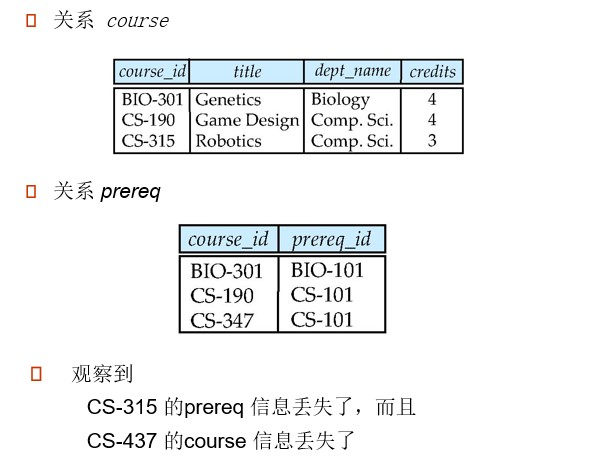

对于该关系，我们有左外连接、右外连接、全外连接和内连接

左外连接如下：

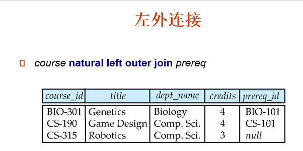

右外连接如下：

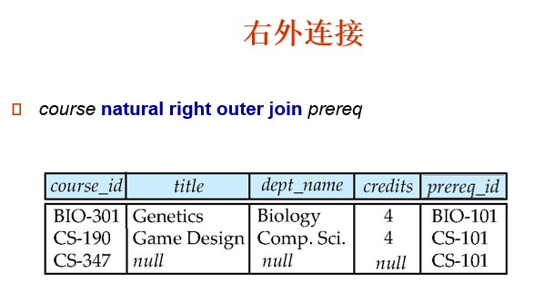

简而言之，往哪连接，被连接的表的主码全部需要保留，然后将其连接的属性有则填入，无则赋`null`

若找不到相应的主码，则将连接的表的那一行丢弃

全外连接如下：

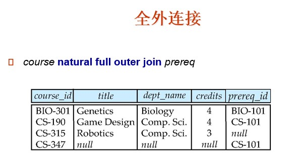


* **连接操作**将两个关系作为输入，返回一个关系作为结果
* **连接条件**：规定了这两个关系中的哪些元组匹配，以及在连接结果中出现了什么属性
* **连接类型**：规定了对每个关系中（基于连接条件）不与其他关系中的元组相匹配的元组怎样处理


对于自然连接，会自动合并相同的列，但是连接会保留列

例子如下：

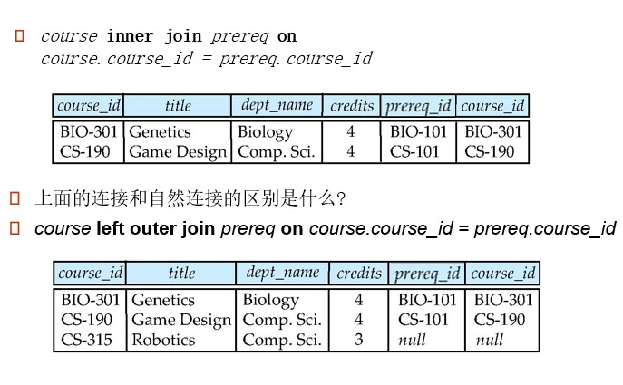

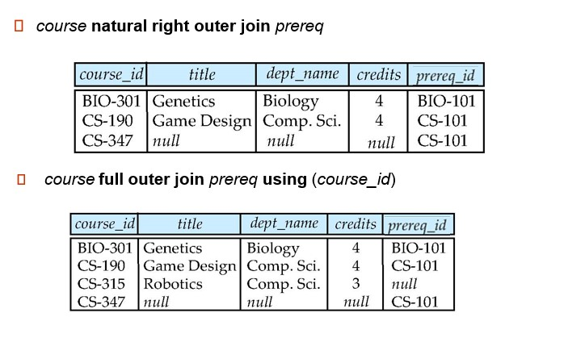


#### 视图


在某些情况下，让所有的用户看到整个逻辑模型（即所有实际存储在数据库中的关系）是不可取的

**视图**提供一个对某些用户从视图中隐藏某些数据的机制

任何不是逻辑模型的一部分，但作为虚关系对用户可见的关系称为**视图**。


##### 定义

```mysql
create	view	v	as	<query expression>
```

其中，`<query expression>`可以是任何合法的SQL表达式，v表示视图名

一旦定义了一个视图，我们就可以用视图指代该视图生成的虚关系

定义视图时并不是由查询表达式的执行结果创造一个新关系，相反，**一个视图的定义导致存储一个查询表达式**，当该视图被使用时，他就被这个已存储的查询表达式**替换**（有点类似C++的宏定义）


##### 特点

* 虚表，是从一个或几个基本表（或视图）导出的关系
* 只存放视图的定义，不会出现数据冗余
* 基表中的数据发生变化，从视图中查询的数据也随之改变
* 查询时，视图名可以出现在任何关系名可以出现的地方


##### 对比

* 视图(view) vs 派生查询(with)：
  * 视图存储在DB数据字典中，是数据库模式的一部分
  * with定义的派生关系，仅在所属的SQL有效，不属于DB模式
* 视图(view) vs 表(table)：
  * 视图和表都是关系，都可以在SQL中直接应用
  * DB中存储表的模式定义和数据
  * DB中值存储视图的定义，不存视图的数据
  * 视图数据实在使用视图时临时计算的
  * 物化视图是提高计算的一种手段，结果等价于临时计算
* 视图的作用：
  * 对外模式的支持
  * 安全性、方便性


```mysql
# 例
# instructor关系的没有salary的属性视图
create	view	faculty	as
			select	ID,name,dept_name
			from	instructor
			
# 找出Biology系的所有教师的姓名
select name
from faculty
where	dept_name = 'Biology'

```


* 视图的属性名缺省为子查询结果中的属性名，也可以是显式指明，在下列情况下，必须指明视图的所有列名：
  * 某个目标列式聚集函数或列表达式
  * 多表连接时，选出了几个同名列作为视图的字段
  * 需要在视图中为某个列启用新的更合适的名字
  * 目标列是*


```mysql
# 例
# 定义一个每个系的工资总和的视图
create view	departments_total_salary(dept_name, total_salary) as
	select	dept_name, sum(salary)
	from	instructor
	group by dept_name
	

```


##### 使用其他视图定义视图

一个视图可以用于定义另一个视图的表达式中

如果一个视图关系v2用于定义另一个视图关系v1的表达式中，则称**v1直接依赖于v2**

如果一个视图关系v1直接依赖于另一个视图v2，或通过其他视图间接依赖于v2，则称**v1依赖于v2**

一个师徒关系如果依赖于它自身，则被称为递归的


##### 视图扩展

一种通过其他视图的定义来定义视图含义的方法

设视图v1由表达式e1定义的，可能它本身就包含对视图关系的使用

一个表达式中的视图扩展重复以下替换步骤

> ```
> repeat
> 	找到e1中的关系vi
> 	使用定义vi的表达式替换vi
> until	在e1中没有视图关系
> ```

是要视图不是递归的，循环就能终止


##### 视图更新

```mysql
update	view_name
set	col = val
where	expression

delete	from	view_name
where	expression
```

视图的更新就是转换为表的更新

```mysql
# 例
create	view	IS_Student	as
	select	Sno,Sname,Sage
	from	Student
	where	Sdept = 'IS';
	
#update
update	IS_Student
set	Sname = 'Alice'
where	Sno = '12315'

#transferTo
update	Student
set Sname = 'Alice'
where	Sno = '12315'	and	Sdept = 'IS';

#insert
insert	into	IS_Student
	values('12306', 'Bob', 18)

#transferTo
insert	into	Studnet(Sno,Sname,Sage,Sdept)
	values('12306','Bob',18,'IS')
	

#delete
delete	from	IS_Student
where	Sno = '12315'

#transferTo
delete	from Student
where	Sno = '12315'	and	Sdept = 'IS'


```

有些更新不能被单独执行，大部分的SQL实现只允许在简单视图上的更新（①`from`子句中只有一个数据库关系；②`select`子句中只包含关系的属性名，不包含任何表达式、聚集函数或`distinct`声明；③任何没有出现`select`子句中的属性可以取空值；④查询中不含有`group by`或`having`子句）

对于行列子集视图可以更新


##### `with check option`

* 视图定义时，指定`with check option`，强制通过视图进行的修改，结果必须在视图中。


```mysql
# 例
'''
Sno	Sname	Sage	Dept
S1	A		21		C
S4	B		20		C
S2	C		19		S
s3	D		21		S
'''
create	view sv1	as
	select	sno,sname,sage	from	s
		where	Dept = 'C'	and	sage>20

update	sv1	set	sage=19	where	sno = 's4'
# 更以更新,更新后,B不再出现在视图中

create	view sv1	as
	select	sno,sname,sage	from	s
		where	Dept = 'C'	and	sage>20
	with check	option;

update	sv1	set	sage=19	where	sno = 's4'
# 不可以更新,update语句将被DBMS拒绝

```


##### 物化视图

定义：创建一个物理表，此表包含定义视图的查询结果的所有元组

如果查询中使用的关系发生了更新，则物化视图中的结果就会过期

每当视图的底层关系进行更新时要更新视图，以此**维护**视图


#### 事务

* 工作单元
* **原子事务**：**要么全部执行，要么回滚**，好像没有发生一样
* 从并发事务中隔离
* 隐式地开始一个任务
  * 以`commit	work`	或	`rollback	work`结束
* 多数数据库的默认情况：每个SQL语句自动提交
  * 可以关闭自动提交了一个会话
  * 在SQL:1999里可以使用`begin atomic ... end`（但这种方式不被多数数据库支持）


#### 完整性约束

* 完整性约束通过保证对数据库的修改不会造成数据的不一致，来防止对数据库数据的意外破坏


> 单个关系上的约束
>
> * **not null**：指定的属性上，不允许出现空值
>   * 限制：任何试图导致某个或某些元组非空属性为空的操作都将被拒绝
> * **primary key**：声明为主码
>   * 主码值不允许为空，也不允许出现重复
>   * 意义：关系对应到现实世界中的实体集，元组对应到实体，实体是相互可区分的，通过主码来唯一标识，若主码为空，则出现不可标识的实体，这是不容许的
> * **unique**：声明候选码
>   * 约束：不允许关系中，有两个元组在指定属性上取值相同
>   * unique本身不限定属性非空
> * **check(P)**，P是一个谓词
>   * 约束：关系上的每一个元组，都必须满足P
>   * check可以针对一个或多个属性
>   * check可以涉及其他表，但需考虑约束检查条件代价


对于check，我们有

```mysql
# 保证semester必须是四季即Spring,Summer,Fall,Winter中的一个
create table section (
    course_id varchar (8),
    sec_id varchar (8),
    semester varchar (6),
    year numeric (4,0),
    building varchar (15),
    room_number varchar (7),
    time slot id varchar (4), 
    primary key (course_id, sec_id, semester, year),
    check (semester in(‘Fall’,‘Winter’,‘Spring’,‘Summer’))
    
```


##### 参照完整性

保证在一个关系中给定属性集上的取值也在另一关系的特定属性集的取值中出现

A是一个属性的集合，R和S是两个包含属性A的关系，并且A是S的主码，如果对于每个而在R中出现的A在S中也出现，则A被称为R的**外码**


##### 参照完整性的级联行为


```mysql
# 参照完整性中的级联行为
create table course (
    course_id	char(5) primary key,
    title	varchar(20),
    dept_name	varchar(20) references department)

create table course (
    		…
    		dept_name varchar(20),
    		foreign key (dept_name) references department
    				on delete cascade
    				on update cascade,
    		. . . 
)


# 级联行为的替代方式: set null,set default
```


* 删除基本关系元组
  * `Restrict`方式：只有当依赖关系中没有一个外码值与要删除的基本关系的主码值相对应时，才可以删除该元组，否则系统拒绝此删除操作
  * `Cascade`方式：将依赖关系中所有外码值与基本关系中要删除的主码值所对应的元组一起删除
  * `Set null`方式：删除基本关系中元组时，将依赖关系中与基本关系中被删主码值相对应的外码值置为空值

```mysql
Foreign	key	(Sno)	References	S(Sno)	[on	delete	[cascade|set null]]
```


* 修改基本关系元组
  * `Restrict`方式：只有当依赖关系中没有一个外码值与要修改的基本关系的主码值相对应时，才可以修改该元组主码，否则系统拒绝此次修改
  * `Cascade`方式：将依赖关系中所有与基本关系中要修改的主码值所对应的外码值一起修改为新值
  * `Set null`方式：修改基本关系中元组主码时，将依赖关系中与基本关系中被修改主码值相对应的外码值置为空值

```mysql
Foreign	key	(Sno)	References	S(Sno)	[on	update	[cascade|set null]]
```


##### 复杂check子句

```mysql
create	assertion	<assertion-name>	check	<predicate>
```


#### SQL的数据类型与模式


##### SQL固有的数据类型

* date：日期，包括年(四位)、月、日，如`date  '2005-7-27'`
* time：时间，包括小时、分、秒，如`time  '09:00:30'`，`time  '09:00:30.75'`
* timestamp：date和time的组合，如`timestamp  '2005-7-27 09:00:30.75'`
* interval：时间段，如`interval  '1' day`
  * 两个 date/time/timestamp 类型值相减产生一个 interval 类型值
  * 可以在 date/time/timestamp 类型的值上加减 interval 类型的值


##### 用户定义的类型

SQL中的`create type`结构创建用户定义的类型

```mysql
# 例
create type	Dollars	as numeric(12,2)	final

create	table	department(
	dept_name	varchar(20),
    building	varchar(15),
    budget	Dollars
);
```

SQL-92中的`create domain`结构创建用户定义的域类型

```mysql
create	domain	person_name	char(20)	not null

create domain	degree_level	varchar(10)
constraint	degree_level_test
check(value in ('Bachelors','Masters','Doctorate'))
```

类型和域相似，但是域本身可以指定约束，比如`not null`


* 用户定义类型
  * 独特类型：`distinct type`：`create type Dollars as numeric(12,2)`
  * 结构化：`structured`：`create type person(pid char(18),name varchar(8))`
  * 用户定义类型，本质上是对RDB的面向对象扩展
* 用户定义域：`create domain Dollar as numeric(12,2)`
  * 自定义域不支持结构


* Type vs Domain
  * Type：进行强类型检查
  * Domain：不进行强类型检查，支持强制类型转换
  * Type由严格的OO理论基础，Domain时纯RDB的概念


##### 大对象类型

大对象类型（照片、视频、CAD文件等）以`large object`类型存储

* blob：二进制数据的大对象数据类型——对象是没有被解释的二进制数据的大集合（对二进制数据的解释由数据库系统以外的应用程序完成）
* clob：字符数据的大对象数据类型——对象是字符数据的大集合

当查询结果是一个大对象时，返回的是指向这个大对象的指针，而不是大对象本身

LOB：Large OBject，用于存储大空间的值，存储由指针加文件实现

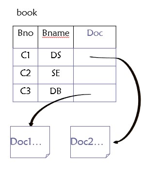

LOB访问：一般使用专用语句访问

```mysql
# Oracle
select Blob doc into ...
from	book
where cno = 'c1'
```


#### 授权


##### 权限的转授和回收

允许用户把已获得的权限转授给其他用户，也可以把已授给其他用户的权限在回收上来

##### 权限图

节点是用户，根节点是DBA，有向边U<sub>i</sub> &rarr; U<sub>j</sub> ，表示用户U<sub>i</sub> 把某权限授给用户U<sub>j</sub> 

一个用户拥有权限的充分必要条件是在权限图有一条从根节点到该用户节点的路径


数据库某些部分的几种授权形式：

* Read：允许读取，但是不能修改数据
* Insert：允许插入新数据，但是不能修改已有的数据
* Update：允许修改，但是不能删除数据
* Delete：允许删除数据


修改数据库模式的几种授权形式：

* Index：允许创建和删除索引
* Resources：允许创建新的关系
* Alteration：允许增加或删除关系的属性
* Drop：允许删除关系


##### SQL中的授权规范

`grant`语句用于授予权限

```mysql
grant	<权限列表>
on	<关系名|视图名> to <用户|角色列表>
```

<用户|角色列表>：**一个用户id** | **public**，所有合法用户持有所授权限 | **一个角色**

对于某个视图授权后，并没有对该视图所基于的关系授权

权限的授予者必须已经持有相应的权限（或者是数据库管理员）


> 权限列表：
>
> * select：允许对关系进行读访问，或者使用视图进行查询的能力
> * insert：插入元组的能力
> * update：更新元组的能力
> * delete：删除元组的能力
> * all privileges：所有允许权限的简写形式
>
> 
>
> ```mysql
> # 例
> # 将对关系instructor的select权限授予用户U1U2U3
> grant select on instructor to User1,User2,User3
> ```
>
> 


`revoke`语句用于收回权限

```mysql
revoke	<权限列表>
on	<关系名|视图名>	from	<用户|角色列表>
```

<权限列表>可以是`all`，表示收回被收回人持有的所有权限

如果<revoke-list> 包含`public`的话，则除了显式地被授予权限的用户外，所有的用户将失去权限

如果同意权限由不同授权人两次授予同一用户，用户在一次权限被回收后，仍保持有权限

收回权限时，若该用户已将权限授予其他用户，也一并收回


##### 角色

```mysql
create	role	instructor
grant	instructor	to Amit
# 角色可以被授以权限
grant select on takes to instructor
# 角色可以授以用户，也可以被授以其他角色
create	role	teaching_assistant
grant	teaching_assistant to instructor
# instructor 继承teaching_assistant的所有权限

```


角色链

```mysql
create role dean
grant instructor to dean
grant dean to Satoshi
```


##### 视图的权限

```mysql
create view geo_instructor as (
	select	*
    from instructor
    where	dept_name = 'Geology'
)
grant	select on geo_instructor to geo_staff
```


`references`权限创造外码

```mysql
grant references (dept_name) on department to Mariano
```


权限的转移：`with grant option`

授予其权限并允许用户可以将此权限授予其他用户

```mysql
grant select on table_name to Alice with grant option
```


### 高级SQL


#### 使用程序设计语言访问数据库


> * 动态SQL
>   * JDBC和ODBC
> * 嵌入式SQL


API（Application-program interface）用于程序和数据库服务器之间的交互

应用程序调用：①与数据库服务器连接；②向数据库服务器发送SQL命令；③逐个取结果元组到程序变量

ODBC（Open Database Connectivity）：用于C，C++，C#和Visual Basic

JDBC（JAVA Database Connective）：用于Java


##### JDBC

JDBC是一个支持SQL的Java API，用于与数据库系统通信

JDBC支持查询和更新数据、检索查询结果等多种功能

JDBC也支持元数据检索，例如查询当前数据库中的关系、关系属性的名字和类型

>  与数据库的通信模型
>
> * 打开一个连接
> * 创建一个statement对象
> * 使用statement对象执行查询，发送查询并取回结果
> * 处理错误的异常处理机制


JDBC的基本工作步骤如下：

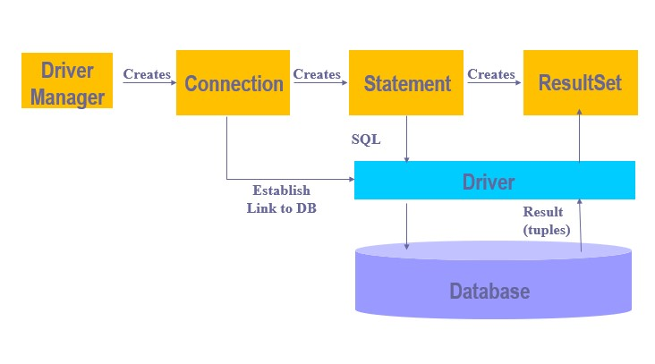

```java

public	static	void	JDBCExample(String dbid,String userid,String passwd){
    
    try{
        //1.Load the JDBC driver class
        Class.forName("oracle.jdbc.driver.OracleDriver");
        //2.Open a database connection
        //	jdbc:database_type:mode:URI
        //	database_type = [mysql,oracle,...]
        //	oracle:URI: @URI
        //	mysql:URI:	//URI
        Connection	conn = DriverManager.getConnection(
            "jdbc:oracle:thin:@URI", userid, passwd);
        //3.Issue SQL statements
        Statement	stmt = conn.createStatement();
        /*
        *	4.Process result set
        *	Do	Actual	Work
        */
        stmt.close();
        conn.close();
    }catch	(SQLException	sqle){
     	System.out.println("SQLException: " + sqle);   
    }
    
}


------------------------------------------------------------------

//Actual Work
//update
stmt.executeUpdate("insert into instructor values('" + a1 + "', 'Kim','Physics',98000)");

//query
Result rset = stmt.executeQuery("Select dept_name ,avg(salary) from instructor group by dept_name");
while(rset.next()){
    System.out.println(rset.getString("dept_name") + "\t" + rset.getFloat(2));
}

//null
rset.wasNull() = true;


```


##### JDBC：立即执行VS预备语句

* 立即执行
  * 使用`Statement`类，将SQL语句直接交给DBMS执行
  * 一次语句执行DBMS进行一次语句编译
* 使用预备语句执行
  * 使用`PreparedStatement`类，SQL语句执行，首先进行编译，编译结果赋予`PreparedStatement`的对象
  * 预编译的结果可被反复多次执行
  * 同嵌入SQL预编译不同（在编译程序时进行），JDBC的预编译时在程序运行中进行的
* 一个SQL多次执行
  * 使用预备语句，仅编译一次
  * 立即执行的模式下，需多次编译
  * 在一SQL多次执行时，使用预备语句比立即执行的


```java
// 预备语句
PreparedStatement	pStmt = conn.prepareStatement(
	"insert into instructor values(?,?,?,?)");
pStmt.setString(1,"88888");
pStmt.setString(2,"Alice");
pStmt.setString(3,"Finance");
pStmt.setInt(4,1250000);
pStmt.executeUpdate();
pStmt.setString(1,"88888");
pStmt.executeUpdate();

```

对于查询，使用`pStmt.executeQuery()`，返回一个结果集（ResultSet）

将一个来自用户的输入添加到查询时，使用预备语句比较好

SQL语句的预编译能够有效防止SQL注入


##### 元数据特性

ResultSet：元数据：描述数据的数据

```java
ResultSet rs;//执行完查询后得到的结果
ResultSetMetaData rsmd = rs。getMetaData();
for(int i = 1;i<=rsmd.getColumnCount();i++){
    System.out.println(rsmd.getColumnName(i));
    System.out.println(rsmd.getColumnTypeName(i));
}
```

如上，就是用java代码获取元数据的代码

查询结果的元数据：①对描述查询结果集的属性类型（结果集的模式）；②对编程时不能确定的结果集模式时非常有用

```java
DatabaseMetaData dbmd = conn.getMetaData();
	ResultSet rs = dbmd.getColumns(null, "univdb", "department", "%");
	// Arguments to getColumns: Catalog, Schema-pattern, Table-pattern,
	// and Column-Pattern
	// Returns: One row for each column; row has a number of attributes
	// such as COLUMN_NAME, TYPE_NAME
while(rs.next()) {
    System.out.println(rs.getString("COLUMN_NAME"),rs.getString("TYPE_NAME"));
}

```

`DatabaseMetaData`类：JDBC的一个类，对DB数据字典进行封装，类方法可以读取数据字典元数据，屏蔽了数据字典的具体实现模式，对应用提供了访问DB数据字典元数据的标准方法

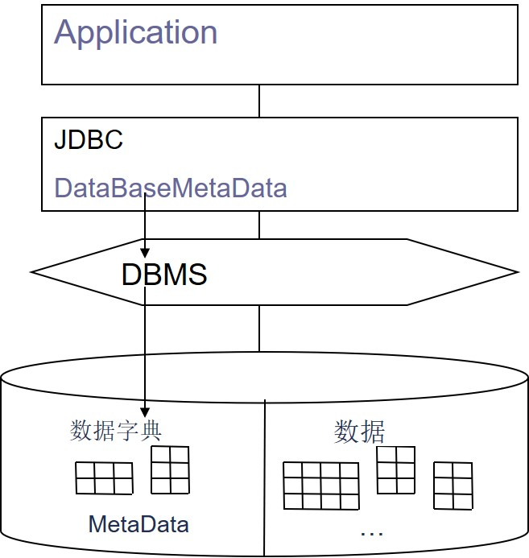


##### JDBC的事务控制

在默认情况下，每个SQL语句都被作为一个被自动提交的独立的事务

对于有多个更新的事务，这种做法并不好

可以通过代码关闭自动提交：`conn.setAutoCommit(false);`

事务必须被显式的提交或回滚：`conn.commit();`或`conn.rollback();`

打开自动提交：`conn.setAutoCommit(true);`


##### 调用函数和过程

```java
CallableStatement cStmt1 = conn.prepareCall("{? = call some function(?)}");
CallableStatement cStmt2 = conn.prepareCall("{call some procedure(?,?)}");

```


##### 处理大型对象类型

`getBlob()`和`getClob()`与`getString()`方法类似，但是分别返回Blob和Clob对象

通过`getBytes()`从这些对象里得到数据

将一个开放的流域Java Blob或Clob对象相连，来更新大对象

```java
blob.setBlob(int parameterIndex, InputStream inputStream);
```


##### SQLJ

由于JDBC的动态化，编译器无法捕捉其错误，因此有SQLJ

SQLJ：在java中的嵌入式SQL

```java
#sql iterator deptInfoIter ( String dept name, int avgSal);
deptInfoIter iter = null;
#sql iter = { select dept_name, avg(salary) from instructor 
    group by dept name };
while (iter.next()) {
	String deptName = iter.dept_name();
	int avgSal = iter.avgSal();
	System.out.println(deptName + " " + avgSal);
}
iter.close();

```


##### ODBC

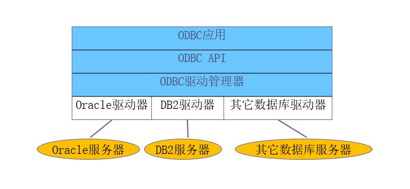

ODBC结构如上图


ODBC：Open Database Connectivity标准：

* 应用程序与数据库服务器通信标准
* 应用程序接口
  * 与数据库建立一个连接
  * 发送查询和更新数据库的语句
  * 取回结果


（略）


##### 嵌入式SQL

SQL标准定义了许多语言的嵌入式SQL，如C，JAVA，Cobol

SQL查询所嵌入的语言被称为宿主语言（host language），宿主语言中使用的SQL结构被称为嵌入式SQL

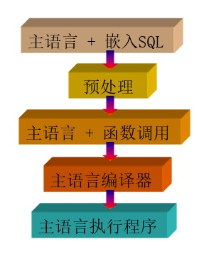

这些语言的基本形式遵循System R的嵌入到PL/I的SQL的形式


（略）


#### 函数和过程和结构

SQL：1999支持函数和过程

* 函数/过程可以用SQL自身写，也可以用外部编程语言写
* 函数对专门的数据类型，如图像和几何对象特别有用
* 许多数据库系统支持**表值函数（table-valued functions）**，表值函数会返回一个关系作为结果


SQL：1999支持许多命令式结构，包括循环（loops）、if-then-else、赋值（assignment）


```mysql
# 定义一个函数,输入一个系的名字,返回该系的教师数量
create	function	dept_count(dept_name	varchar(20))
	returns	integer
	begin
		declare	d_count	integer;
		select	count(*)	into	d_count
		from	instructor
		where	instructor.dept_name = dept_name
		return d_count;
	end
	
# 找出教师数大于12的所有系的名称和预算
select	dept_name,budget
from department
where	dept_count(dept_name) > 12


```


SQL：2003增加了返回关系作为结果的函数

```mysql
# 返回一个包含特定系的所有教师的表
create	function	instructors_of	(dept_name	char(20))
	returns	table	(ID	varchar(5),
                   	 name varchar(20),
                     dept_name varchar(20),
                     salary	numeric(8,2))

return table (select ID,name,dept_name,salary
             	from	instructor
             	where	instructor.dept_name = instructors_of.dept_name)

#use
select * 
from	table	(instructs_or('Music'))


```


`dept_count`函数也可以写成一个过程

```mysql
create procedure dept_count_proc (in dept_name varchar(20),
                                  out d_count integer)
begin
	  select count(*) into d_count
	  from instructor
	  where instructor.dept_name = dept_count_proc.dept_name
end

# 可以在一个SQL过程中或者嵌入式SQL中使用call语句调用过程
declare	d_count	integer;
call	dept_count_proc('Physics',d_count);


```

过程和函数可以通过动态SQL触发

SQL:1999：允许使用多个同名过程/函数（称为名字**重载**），只要参数的个数不同，或对于那些有相同参数个数的函数，至少有一个参数的类型不同


#### 触发器

（略）


## 形式化关系查询语言


### 关系代数


* 关系代数
* 六种基本运算符
  * 选择（Select）：σ
  * 投影（Project）：Π
  * 并（union）：∪
  * 集合差（set difference）：-
  * 笛卡儿积（Cartesian product）：×
  * 更名（rename）：ρ
* 关系代数的运算以一个或两个关系作为输入，产生一个新的关系作为结果


#### 选择运算

* 记法：σ<sub>p</sub>(r)

* p被称为**选择谓词**
* 定义为： σ<sub>p</sub>(r) = { t | t ∈ r and p(t) }，其中p是一个命题演算公式，由连词（∧(and)，∨(or)， ┐(not)）把项连接起来构成每一个项（term）的形式可以为：`<attribute> op <attribute> or <constant>` ，其中op可以是：=，≠，>，≥，<，≤
* 示例：σ<sub> dept_name = "Physics"</sub>(instructor)

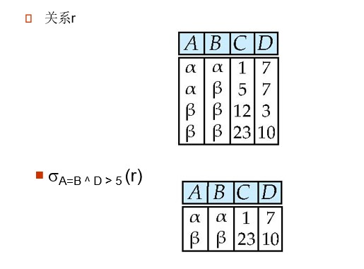

选择运算是从行的角度进行的运算

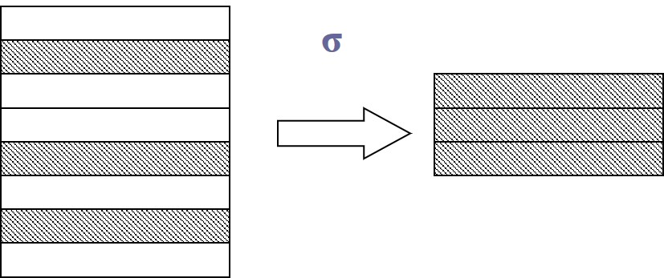


#### 投影运算

* 记法：Π<sub>A<sub>1</sub>,A<sub>2</sub>,...,A<sub>k</sub></sub>(r) ，其中A<sub>1</sub>,A<sub>2</sub>,...,A<sub>k</sub> 是属性名，r是关系名
* 结果由选择的k列组成，删除了没有被选择的其他列
* 因为关系是集合，所以重复的元组从结果中删除
* 示例：Π<sub>ID, name, salary</sub>(instructor) 

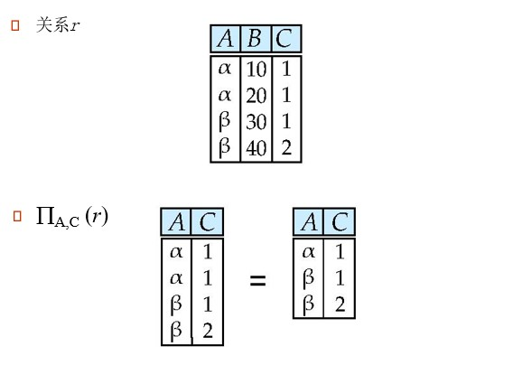

投影操作主要是从列的角度进行运算

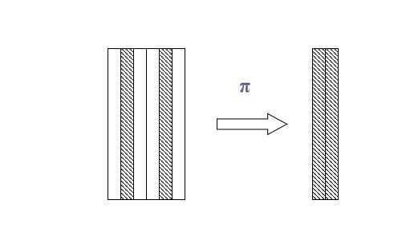


#### 并运算

* 记法：r ∪ s
* 定义为：r ∪ s = { t | t ∈ r or t ∈ s }
* 要使并运算r∪s有意义
  1. r，s必须是**同元**的（属性数目必须相同）
  2. 属性的域必须相容（如r的第二列的属性类型必须和s的第二列类型相同）
* 示例：找出开设在2009年秋季学期或者2010年春季学期或者这二者皆开的所有的课程：  Π<sub>course_id</sub> (σ<sub> semester = “Fall” Λ year=2009</sub> (section) )  ∪
  Π<sub>course_id</sub> (σ<sub> semester=“Spring” Λ year=2010</sub> (section) )

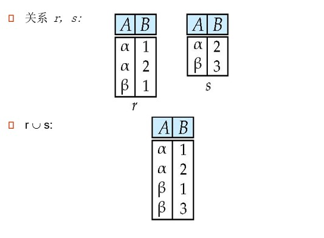


#### 集合差运算

* 记法：r - s
* 定义为：r - s = { t | t ∈ r and t ∉ s }
* 必须保证集合差运算在相容的关系间进行
  * r 和 s必须是同元的
  * r 和 s属性的域必须相容
* 示例：找出开设在2009年秋季学期但是在2010年春季学期不开的课程：
  Π<sub>course_id</sub> (σ<sub> semester = “Fall” Λ year=2009</sub> (section) )  - 
  Π<sub>course_id</sub> (σ<sub> semester=“Spring” Λ year=2010</sub> (section) )

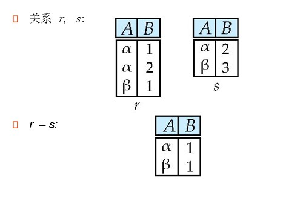


##### 基本运算的分配律

* 投影和并可以分配
  * Π<sub>pid,name</sub>(S∪T) ≡ Π<sub>pid,name</sub>(S)  ∪ Π<sub>pid,name</sub>(T) 
* 投影和差不可分配


#### 笛卡儿积运算

* 记法：r × s

* 定义为：r × s = { tq | t ∈ r and q∈ s }

  * 元组的连串（Concatenation）：若r = (r1,..,rn)，s = (s1,...,sm)，则定义r与s的连串为一个n+m的元组，记作rs = (r1,...,rn,s1,s...,sm)

* 假设关系r(R)和s(S)的属性不相交（即R ∩ S = Φ ）

* 如果关系r(R)和s(S)的属性有相交的，则必须使用更名运算

* 示例：

  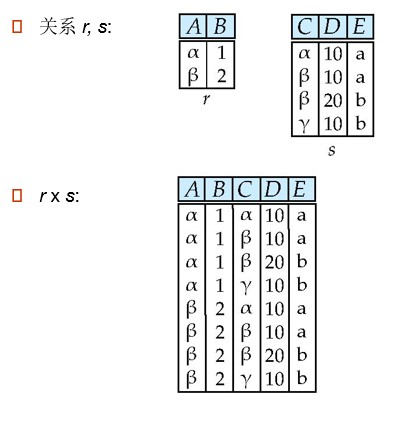


##### 运算的组合

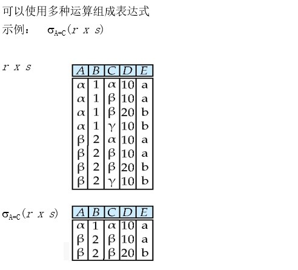

如图为一个例子


#### 更名运算

* 允许通过更名来引用关系代数表达式的结果
* 允许引用一个关系时使用多于一个的名字
* 如： ρ<sub>X</sub>(E) ：返回更名为X的表达式E的结果
* 如果关系代数表达式E时n元的，则 ρ <sub>χ(A1,A2,...,An)</sub>(E) ，返回被更名为X的表达式E的结果，并且属性被更名为A1，A2，...，An

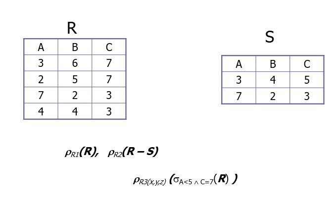


#### 关系代数表达式嵌套

* 关系代数中基本的表达式是如下二者之一：
  * 数据库中的一个关系
  * 一个常数关系
* n设E1 和E2是关系代数表达式，则以下这些都是关系代数表达式：
  * E1 ∪ E2
  * E1 – E2
  * E1 x E2
  * σ<sub>p</sub> (E1), 其中P是E1的属性上的谓词
  * Π<sub>s</sub>(E1),其中S 是E1中某些属性的列表
  * ρ<sub>x</sub> (E1),其中x 是E1结果的新名字


#### 附加关系代数运算

* 附加运输没有实质地扩展关系代数的能力，但是简化了查询的书写
  * 集合交
  * 自然连接
  * 赋值
  * 外连接

#### 

#### 集合交运算

* 记法：r ∩ s
* 定义为： r ∩ s = { t | t ∈ r and t ∈ s }
  * r 和 s 是同元的
  * r 和 s 属性域相容
* 注： r ∩ s = r - ( r - s ) = s - ( s - r )

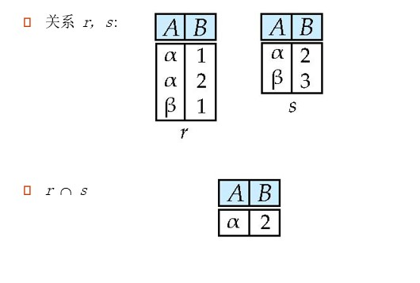

#### θ连接

定义：

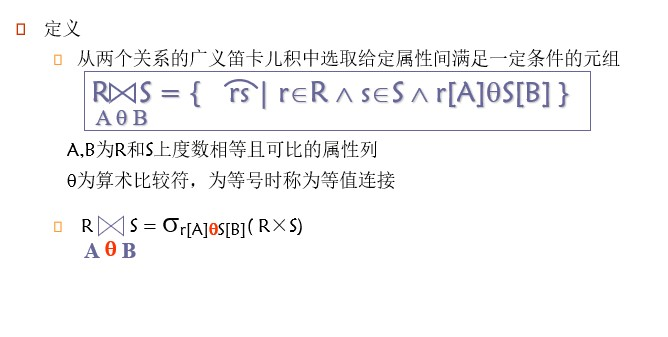

* 所以，θ连接是做笛卡儿积，然后筛选出符合AθB表达式的元组作为结果返回

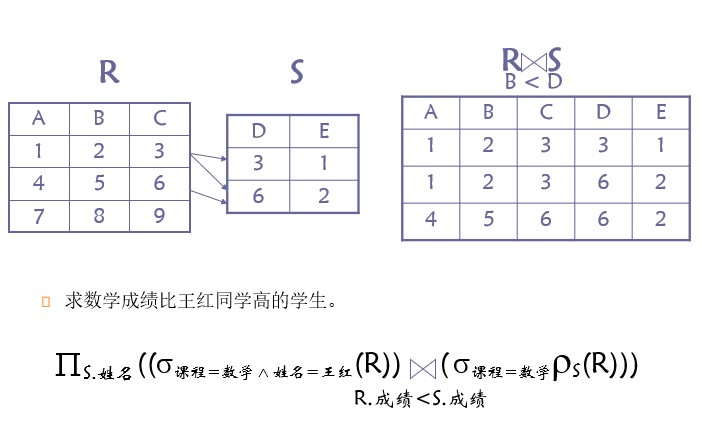


#### 自然连接运算

* 记法：r ⋈ s
* 定义：关系 r 和 s 分别是模式 R 和 S 的关系，则 r ⋈ s 是由如下方式得到的模式 R ∪ S 的关系
  * 对于 r 中的每个元组 t<sub>r</sub> 和 s 中的每个元组 t<sub>s</sub> 所组成的元组对
  * 如果 t<sub>r</sub> 和 t<sub>s</sub> 在 R ∩ S的属性上有相同的值，则在结果中加入一个元组t，并且：
    * t 在r上和 t<sub>r</sub> 有相同的值
    * t 在s上和 t<sub>s</sub> 有相同的值
* 示例：若R = (A,B,C,D) ，S = (E,B,D) ，结果模式 = (A,B,C,D,E) ，则 r ⋈ s = 
  Π<sub>r.A, r.B, r.C, r.D, s.E </sub> ( σ<sub> r.B = s.B Λ r.D = s.D </sub>(r × s ) )


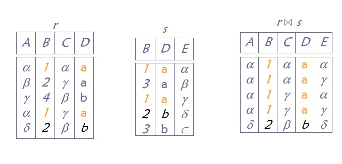

* 自然连接和等值连接的不同

  * 自然连接中相等的分量必须是相同的属性组，并且要在结果中去掉重复的属性，二等值连接则不必

* 当 R 与 S 无相同属性时， R ⋈ S = R × S

* 可交换，可结合

  * s ⋈ sc ≡ sc ⋈ s
  * ( s ⋈ sc ) ⋈ c ≡ s ⋈ ( sc ⋈ c )

  

#### 赋值运算

* 赋值运算（⬅）提供了一种简化关系代数表达式书写的方式
  * 把查询表达为一个顺序程序，由以下构成
    * 一系列赋值
    * 一个其值被作为查询结果显示的表达式
  * 赋值必须是赋给一个临时关系变量


#### 外连接

* 外连接运算是连接运算的扩展，可以处理缺失的信息
* 计算连接，然后一个关系中失配的元组添加到结果中
* 使用空值（null）：
  * `null`代表一个值未知或不存在
  * 所有的包含`null`比较运算都被定义为`false`
* 示例：

现有关系如下图：

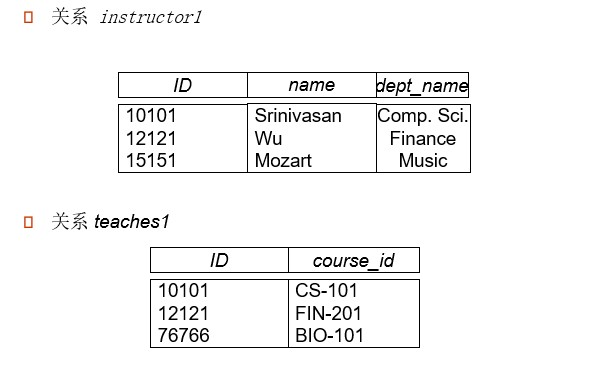

有连接、左外连接、右外连接、全外连接如下：

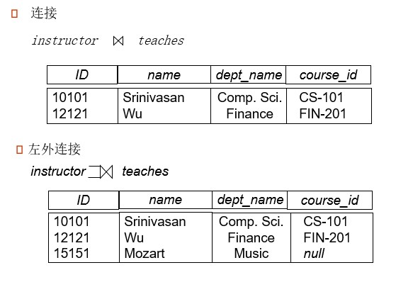

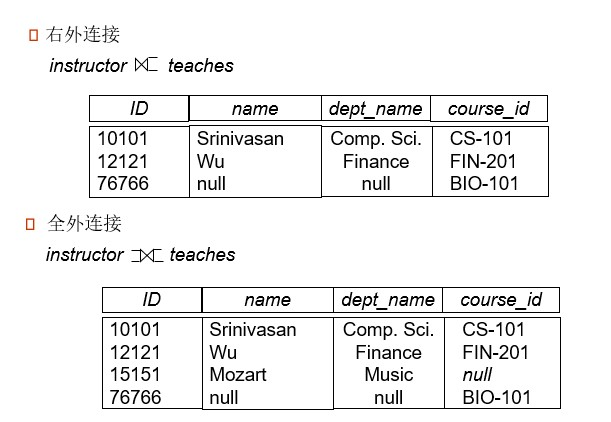


连接即将表做笛卡儿积，筛选出相同属性拥有相同值的元组，将其连接起来成为一个新的元组

左外连接即保证左表的主码完整性，右外连接保证右表的主码完整性

全外连接保证全部数据的不被舍弃

均用空值`null`填补空白的属性

外连接运算可以用基本关系代数表示


#### 空值

* 元组的一些属性可以为空值，用`null`表示
* `null`代表一个值未知或不存在，空值是一种状态，不是一个明确的值
* 含有`null`的算数表达式的结果为`null`
* 聚集函数直接忽略空值（比如在SQL里）
* 在去重和分组运算中，`null`和其他值一样，两个`null`被看作是相同的值


* 含有空值的比较运算的结果是一个特殊的值：`unknown`
  * 如果用 `false` 取代 `unknown`，那么 `not (A < 5)` 和 `A >= 5`不等价
* 使用`unknown`的三值逻辑
  * or：`(unknown or true) = true`，`(unknown or false) = unknown`，`(unknown or unknown) = unknown`
  * and：`(unknown and true) = unknown`，`(unknown and false) = falses`，`(unknown or unknown) = unknown`
  * not：`not unknown = unknown` 
  * 在SQL中，若谓词P的值为unknown，则`P is unknown = true`
* 选择（select）谓词的结果如果是`unknown`，则相当于`false`


#### 除运算

* 定义：给定两个关系 r(R) 和 s(S) ，并且 S ⊂ R，则  r ÷ s 是满足 t × s ⊆ r 的最大关系t(R-S)
* 可以将 r ÷ s 写为：temp1 ⬅ Π<sub>R-S</sub>(r) ，temp2 ⬅ Π<sub>R-S</sub>( (temp1 × s)  - Π<sub>R-S, S</sub>(r) ) ，result = temp1 - temp2
* 示例： r÷s给出的学生ID选了Biology系卡的所有课
  r(ID, course_id) = Π<sub> ID, course_id</sub>(takes) 且 s(course_id) = Π<sub>course_id</sub>(σ<sub>dept_name = "Boilogy" </sub>(course))

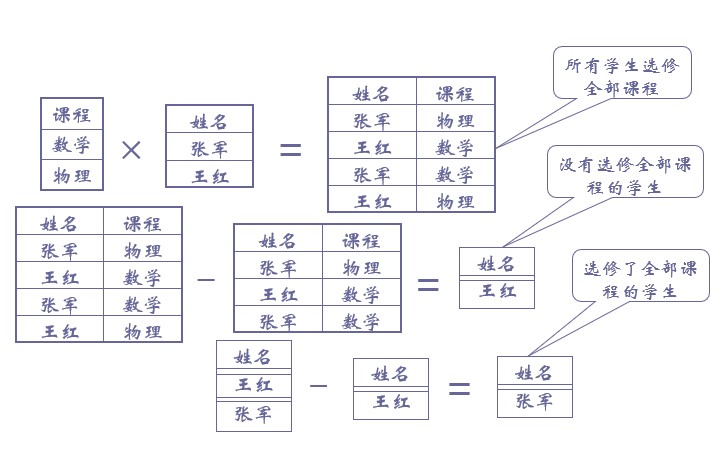

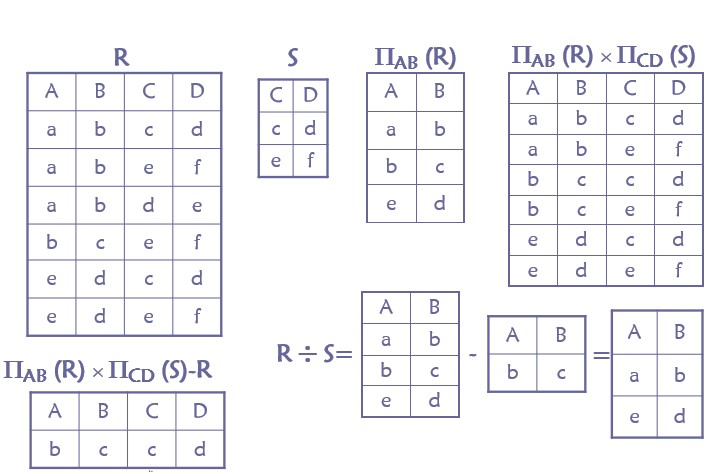


#### 扩展的关系代数运算

* 广义投影
* 聚集函数


#### 广义投影

* 定义：Π<sub>F<sub>1</sub>,F<sub>2</sub>,...,F<sub>n</sub></sub>(E) ，E是任意关系代数表达式，Fi是涉及常量以及E的模式种属性的算术表达式
* 广义投影运算允许在投影列表中使用算术函数来对投影进行扩展
* 示例：给定关系 instructor(ID, name, dept_name, salary) 其中salary 是年薪， 可以得到每个教师的ID、name、dept_name及每月的工资： Π<sub>ID, name, dept_name, salary/12</sub>(instructor)


#### 聚集函数

* 聚集函数：输入值的一个汇集，将单一值作为结果返回

  > * avg：平均值
  > * min：最小值
  > * max：最大值
  > * sum：求和
  > * count：计数

* 示例：

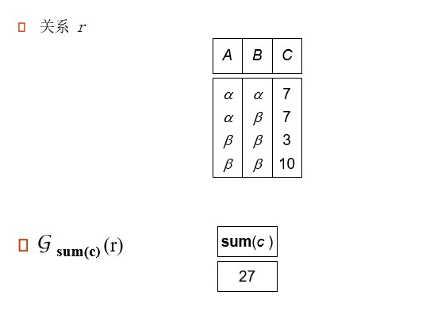


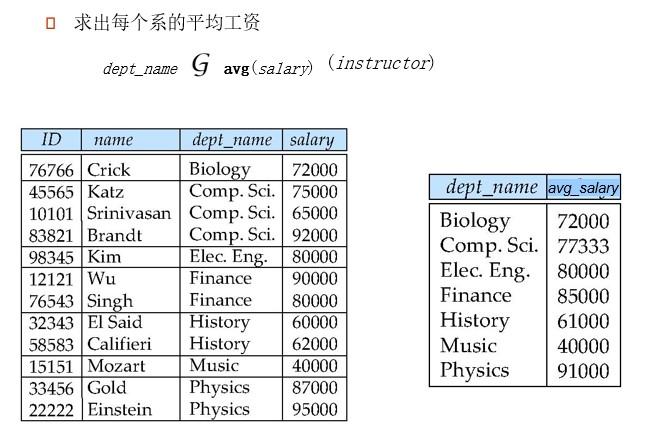


* 聚集的结果没有名称
  * 可以使用更名运算给他命名
  * 为方便起见，我们允许把更名作为聚集运算的一部分


#### 多重关系代数

* 纯关系代数删除所有的重复
* 多重集关系代数保存重复，为了匹配SQL的语义
* 多重集关系代数定义为：
  * 选择：和输入关系中的满足选择条件的元组个数一样多
  * 投影：每个输入元组产生一个元组，即使有重复也保留
  * 叉积：如果关系 *r* 的元组 *t1* 有*m*个副本，关系*s* 的元组 *t2* 有 *n**个*副本，则关系*r*  x *s*的元组*t1.t2*有*m* x *n*个副本
  * 类似的，其他的操作为
  * 示例：并：*m* + *n*个副本，交：min(*m, n*)个副本，差：min(0, *m* – *n*)个副本


具体可以见SQL的多重关系运算==> [#集合运算与重复](####重复)


### 元组关系演算

* 元组关系演算是非过程化的查询语言，查询表达式的形式为：`{ t | P(t) }`

* 表示它是所有使谓词P为真的元组 t 的集合

* t 为元组变量，t[A] 表示元组 t 在属性A上的值

* t ∈ r 表示元组 t 在关系 r 中

* P是一个类似于**谓词演算**的公式，由原子公式和运算符组成

  * 原子公式
    * s ∈ R：s是关系R中的一个元组
    * s[x] θ u[y] ：s[x]与u[y] 为元组分量，他们之间满足比较关系θ
    * s[x] θ c：分量s[x]与常量c之间满足比较关系θ
  * 公示的递归定义
    * 原子公式是公式
    * 如果P是公式，那么  ﹁P 和 (P) 也是公式
    * 如果P1、P2是公式，则 P1 ∧ P2， P1 ∨ P2 ，P1 &rArr; P2也是公式
    * 如果P(t) 是公式，R是关系， 则 ∃ t ∈ R (P(t)) 和 ∀ t ∈ R  (P(t)) 也是公式

  > 谓词演算公式：
  >
  > * 属性和常量的集合
  > * 比较运算符的集合（<，≤，=，≠，>，≥）
  > * 连词的集合（and，or，not）
  > * 蕴含（&rArr; ）： x &rArr; y，如果x为真，则y也为真。 x &rArr; y ≡ ﹁ x &or; y
  > * 量词的集合：∃ 和 ∀ 
  >
  > 


#### 表达式的安全性

* 元组关系演算表达式可能产生一个无线的关系
* 为了避免产生无限关系，我们将限制所允许的表达式集合为安全表达式


### 元组关系演算与关系代数的等价性


* 投影：	Π<sub>A</sub>(R) = { t | ∃s ∈ R，(t[A] = s[A]) }

  

* 选择：    σF(A)(R) = { t | t ∈ R ∧ F(t[A]) }

  

* 广义笛卡尔积：    R(A) × S(B) = { t | ∃u∈R, ∃s∈S ，( t[A] = u[A] ∪ t[B] = s[B])}

  

* 并：    R ∪ S = { t | t ∈ R &or; t ∈ S }

  

* 差：    R - S = { t | t ∈ R &and;  ﹁ t ∈ S }


## 数据库设计与ER模型


## 关系数据库设计


## 数据存储和数据访问


## 查询处理和查询优化


## 事务管理


211.87.227.230:3306

webteach


