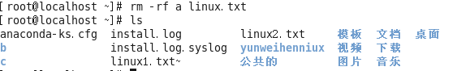

#  Linux Study Note


> 参考：
>
> [黑马程序员-linux从入门到精通](<https://www.bilibili.com/video/av23360560?from=search&seid=11213656872957708813>)
>
> 
>
> 


## Linux系统的文件


linux一切皆文件

文件操作种类：创建文件、编辑文件、保存文件、关闭文件、重命名文件、删除文件、恢复文件


### 文件目录结构

Bin：全称binary，含义是二进制。该目录中存储的都是一些二进制文件，文件都是可以被运行的。

Dev：该目录中主要存放的是外接设备，例如盘、其他的光盘等。在其中的外接设备是不能直接被使用的，需要**挂载（类似windows下的分配盘符**。

Etc：该目录主要存储一些配置文件。

Home：表示“家”，表示**除了root用户以外其他用户的家目录**，类似于windows下的User/用户目录。

Proc：process，表示进程，该目录中存储的是Linux运行时候的进程。

Root：该目录是root用户自己的家目录。

Sbin：全称super binary，该目录也是存储一些可以被执行的二进制文件，但是必须得有super权限的用户才能执行。

Tmp：表示“临时”的，当系统运行时候产生的临时文件会在这个目录存着。

Usr：全称是User Software Resource，注意不是user的缩写。存放的是用户自己安装的软件。类似于windows下的program files。

Var：存放的程序/系统的日志文件的目录。

Mnt：当外接设备需要挂载的时候，就需要挂载到mnt目录下。


## Linux的基本指令


linux指令指在linux终端（命令行）中输入的内容。

一个完整的指令的标准格式：Linux通用的格式

```shell
#指令主体 (空格) [选项] (空格) [操作对象]
```

一个指令可以包含多个选项，操作对象也可以是多个。


#### 1.`ls`指令

含义：ls（list）

##### 用法1：#ls

含义：列出当前工作目录下的所有文件/文件夹的名称


##### 用法2：#ls	路径

含义：列出指定路径下的所有文件/文件夹的名称

路径分为相对路径和绝对路径


##### 用法3：#ls	选项	路径

含义：在列出指定路径下的文件/文件夹的名称，并以指定的格式进行显示。

常见的语法：

```shell
#ls -l 路径
#ls -la 路径
```


选项解释：

​         -l：表示list，表示以详细列表的形式进行展示

​         -a：表示all，显示所有的文件/文件夹（包含了隐藏文件/文件夹）


上述列表中的第一列表示文档类型，**其中 “ - ” 表示改行对应的文档类型为文件，“ d ” 表示文档类型为文件夹**。


**在Linux中，隐藏文档一般以 “ . ” 开头。** 


##### 用法4：#ls	-lh	路径

含义：列出指定路径下的所有文件/文件夹的名称，以列表的形式并且在显示文档大小的时候以**可读性较高的形式显示**


ls列出的结果颜色说明，**其中蓝色的名称表示文件夹，黑色的表示文件，绿色的其权限为拥有所有权限**


#### 2.`pwd`指令

用法：#pwd					（print working directory，打印当前工作目录）


#### 3.`cd`指令

命令：#cd			（change directory，改变目录）

作用：用于切换当前的工作目录

##### 语法：#cd	路径

P.S. 在linux中有一个特殊符号~，用于表示当前用户的家目录


#### 4.`mkdir`指令

指令：mkdir		（make directory，创建目录）

##### 语法1：#mkdir	路径			

路径，可以是文件夹名称也可以是包含名称的一个完整路径

假如是文件夹名称，则在当前目录下创建该文件夹


##### 语法2：#mkdir	-p	路径

含义：**当一次性创建多层不存在的目录的时候**，添加-p参数，否则会报错


##### 语法3：#mkdir	路径1	路径2	路径3	...

表示一次性创建多个目录


#### 5.`touch`指令

作用：创建文件

语法：#touch	文件路径

路径可以是直接的文件名也可以是路径


一次性创建多个文件


#### 6.`cp`指令


指令含义：cp		（copy，复制）

作用：复制文件/文件夹到指定位置

##### 语法：#cp	被复制的文档路径	文档被复制到的路径

简单来说就是#cp	源地址	目的地址


**注意：Linux在复制过程中是可以重新对新位置的文件进行重命名的，但是如果不是必须的需要，则建议保持前后名称一致。**

**当使用cp命令进行文件夹复制操作的时候需要添加选项“-r”（-r表示递归复制），否则目录将被忽略**


#### 7.`mv`指令

指令含义：mv		（move，移动，剪切）

作用：移动文档到新的位置

##### 语法：#mv	需要移动的文件路径	需要保存的位置路径


注：在Linux中重命名的命令也是mv，语法和移动语法一样。


#### 8.`rm`指令

指令含义：rm		（remove，移除，删除）

##### 语法：#rm	选项	需要移除的文件路径

选项：	-f：force，强制删除，不提示是否删除

​				-r：表示递归

在删除的时候如果不带选项，会提示是否删除，如果需要确认则输入“y/yes”，否则输入

**注意：如果在删除的时候不想频繁的确认，则可以在指令中添加选项“-f”，表示force（强制）。**


删除一个文件夹：


**注意：删除一个目录的时候需要做递归删除，并且一般也不需要进行删除确认询问，所以移除目录的时候一般需要使用-rf选项。**

删除多个文件：



删除一个目录下具有公共特性的文件，例如都以Linux开头


其中**\*称之为通配符，意思表示任意的字符，Linux\*，则表示只要文件以Linux开头，后续字符则不管**。


#### 9.`vim`指令

指令：vim	（Vim是一款文本编辑器，号称编辑器之神）

##### 语法：#vim	文件路径

作用：可以打开一个文件，文件不存在时，可以创建该文件

vim其他用法参考本文后续。


#### 10.输出重定向

**一般命令的输出都会显示在终端中，有些时候需要将一些命令的执行结果想要保存到文件中进行后续的分析/统计，则这时候需要使用到的输出重定向技术。**

\>：覆输出，会覆盖掉原先的文件内容

\>>：追加输出，不会覆盖原始文件内容，会在原始内容末尾继续添加

##### 语法：#正常执行的指令 > / >>文件的路径

注意：文件可以不存在，不存在则新建


#### 11.`cat`指令

作用1：cat有直接打开一个文件的功能。

##### 语法1：#cat	文件的路径


作用2：cat还可以对文件惊醒合并

##### 语法2：#cat	待合并的文件路径1	待合并的文件路径2	...	文件路径n	>	合并之后的文件路径


