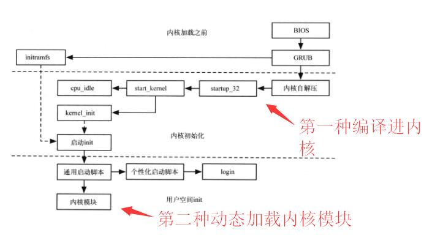

# Linux 内核编程入门


> Linux可加载内核模块是 Linux 内核的最重要创新之一。它们提供了可伸缩的、动态的内核。其它开发者可以不用重新编译整个内核便可以开发内核层的程序，极大方便了驱动程序等的开发速度。


> 参考：
>
> [小白学Linux之内核模块编程](https://blog.csdn.net/tigerjibo/article/details/6010997)
>
> [linux内核编程](https://blog.csdn.net/qq_15437667/article/details/69490325)
>
> [黑客内核：编写属于你的第一个Linux内核模块](https://linux.cn/article-3251-1.html)
>
> [linux mod相关命令&内核模块化](https://www.cnblogs.com/MYSQLZOUQI/p/5318809.html)
>
> [linux内核编程入门 hello world](https://www.cnblogs.com/bitor/p/9608725.html)
>
> 


由于系统安全这门课刚上来，就给了一个内核编程的实例，我不得不找些资料学习学习


* 什么是内核模块：内核模块是具有独立功能的程序。它可以被单独编译，但是不能单独运行，它的运行必须被链接到内核作为内核的一部分在内核空间中运行。模块编程和内核版本密切相连，因为不同的内核版本中某些函数的函数名会有变化（所以我在编译老师给的实例时报错了），因此模块编程也可以说是内核编程。


> https://lxr.missinglinkelectronics.com/linux：这个网址里可以查到所需用的linux内核函数所在位置
>
> 当然，也可以在linux源码下找到，可能比较慢：https://github.com/torvalds/linux（github，search this repository）
>
> 


* 内核模块编程**特点**： 模块本身不被编译进内核映像，从而控制了内核的大小；模块一旦被加载，就和内核中的其他部分完全一样。


> Linux驱动程序有两种加载方式：一种是静态地编译进内核，内核启动时自动加载，另一种是编写为内核/驱动模块，使用insmod命令将模块动态加载到正在运行的内核，不需要时用rmmod命令将模块卸载。



上图为linux内核加载过程


#### 用户层编程和内核模块编程的区别


|          | 应用程序              | 内核模块程序        |
| -------- | --------------------- | ------------------- |
| 使用函数 | libc库                | 内核函数            |
| 运行空间 | 用户空间              | 内核空间            |
| 运行权限 | 普通用户              | 超级用户(superuser) |
| 入口函数 | main()                | module_init()       |
| 出口函数 | exit()                | module_exit()       |
| 编译     | gcc                   | makefile            |
| 链接     | gcc                   | insmod              |
| 运行     | 直接运行生成的./a.out | insmod              |
| 调试     | gdb                   | kdbug、kdb、kgdb    |


### 内核编程：Hello World


```c
#include <linux/init.h>
#include <linux/module.h>
#include <linux/kernel.h>

//模块许可证声明,必须
MODULE_LICENSE("GPL");

//模块加载函数,必须
static int hello_init(void){
    printk(KERN_ALERT "Hello Kernel!");
    return 0;
}

//模块卸载函数,必须
static void hello_exit(void){
	printk(KERN_ALERT "goodbye,kernel/n");
}

//模块的注册
module_init(hello_init);
module_exit(hello_exit);

// 以下可选
//声明模块的作者
MODULE_AUTHOR("Magic");
//声明模块的描述
MODULE_DESCRIPTION("This is a simple example!/n");
//声明模块的别名
MODULE_ALIAS("A simplest example");

```


在内核编程时，与往常应用编程时类似而又有所不同

开头为内核编程所必须的三个头文件

最明显的就是函数入口由`main()`变成了`module_init`，又或者像下面直接写出`init_module()`

在内核编程中，`module_init(begin_func);`是指定`begin_func`为该模块的入口，而相对应的`module_exit(exit_func)`指定了模块退出时的出口函数为`exit_func`，这两者皆为模块加载函数


* 模块加载函数，这部分是必须的。模块加载函数必须以`module_init(func)`的形式被指定。它返回整形值，**若初始化成功，应返回0**。在上面那个例子当中，`hello_init()`函数就是模块加载函数需要执行的，主要是打印一条信息。
* 跟模块加载函数相对应的就是模块卸载函数，这部分也是必须的。模块卸载函数在模块卸载的时候执行，**不返回任何值**，必须以`module_exit(func)`的形式来指定。在上面的例子中，`hello_exit()`函数就是模块卸载函数需要执行的，只要是打印了一条退出信息。


* 模块许可证声明，这部分是必须有的。模块许可证（LICENSE）声明描述内核模块的许可权限，**如果不声明LICENSE，模块被加载时，将收到内核被污染（kernel tainted）的警告**。大多数情况下，内核模块应遵守GPL兼容许可权。Linux2.6内核模块最常见的是以`MODULE_LICENSE（"Dual BSD/GPL")`语句声明模块采用BSD/GPL双LICENSE。

再者，其中的函数有所不同，比如`printk()`是由内核定义的，把要打印的信息输入到系统日志中，可以用`dmesg`命令查看


```c
#include <linux/kernel.h>
#include <linux/module.h>
#include <linux/sched.h>
#include <linux/sched/signal.h>
#include <linux/sched/task.h>

int init_module(){
   printk("Hello world\n");
   extern unsigned long volatile jiffies;
   struct task_struct *p = &init_task;
   do{
		printk("%d %s\n", p->pid, p->comm);
       	p = next_task(p);
   }
   while (p!=&init_task);
   return 0;
}
void cleanup_module(){
	printk("bye\n");
}
MODULE_LICENSE("GPL");
```


之后，编写完C文件之后就要对其进行相对应的操作，把他编译成内核文件。

要知道不同环境下，内核版本不一样的可能性极高，再考虑到路径等问题，为了编译方便，一般都采用Makefile的文件形式，来简化内核版本号、路径、以及编写模块的路径和信息

```makefile
obj-m += hello.o
#generate the path
CURRENT_PATH:=$(shell pwd)
#the current kernel version number
LINUX_KERNEL:=$(shell uname -r)
#the absolute path
LINUX_KERNEL_PATH:=/usr/src/linux-headers-$(LINUX_KERNEL)
#complie object
all:
    make -C $(LINUX_KERNEL_PATH) M=$(CURRENT_PATH) modules
#clean
clean:
    make -C $(LINUX_KERNEL_PATH) M=$(CURRENT_PATH) clean
```


> 一些常用的linux内核函数：https://blog.csdn.net/guowenyan001/article/details/43342301


### 内核模块的操作


```sh
$ insmod xxx.ko #将模块装入内核种
$ rmmod xxx.ko #将模块从内核种删除
$ lsmod | grep xxx #列表显示所有的内核模块，类似ls命令
$ modprobe -v xxx.ko #自动处理载入模块，一般用于载入指定的个别模块或一组相依赖的模块
$ depmod /PATH/TO/MODULES_DIR #查看模块依赖
$ modinfo #查看模块的具体信息
```


