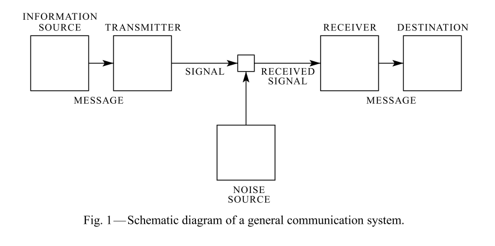

# 【论文阅读笔记】A Mathematical Theory of Communication

本篇博客针对这篇论文，做翻译笔记，以及相关概念学习笔记

找到有关的阅读笔记&资料也放在这里做备用参考

> [信息论 By jasonxty From CSDN](https://blog.csdn.net/xtydtc/category_6388781.html)
>
> [A mathmatical theory of communication阅读笔记（1）](https://blog.csdn.net/xtydtc/article/details/77645337)

------

### Introduction

近来关于调制（modulation）方法的多样化发展，如PCM和PPM（将带宽转化为信噪比），使得人们对通信理论有了更大的兴趣。这个理论基础被包含在Nyquist和Hartley在这项主题的重要paper中。在本论文中，我们将其理论扩展为一系列新的因素，特别是噪声在信道中的影响、以及可能由原始消息的统计结构和最终目的地的性质所导致的节省物(savings)（？暂时不知道省了啥）

> PPM： Pulse Position Modulation，脉冲位置调制：如果调制信号只使载波脉冲系列中每一个脉冲产生的时间发生改变，而不改变其形状和幅度，且每一个脉冲产生时间的变化量比例于调制信号电压的幅度，与调制信号的频率无关，这种调制称为脉冲位置调制，简称脉位调制。
>
> 相当于对脉冲的波形`y=a*sin(bx)` 来说，取任意区间，而a、b不变
>
> > [脉冲位置调制-百度百科](https://baike.baidu.com/item/%E8%84%89%E5%86%B2%E4%BD%8D%E7%BD%AE%E8%B0%83%E5%88%B6/5923661?fromtitle=ppm&fromid=22311665)
>
> PCM： Pulse Code Modulation，脉冲编码调制 ：**脉冲编码调制**是把模拟信号变换为数字信号的一种调制方式，其最大的特点是把连续输入的模拟信号变换为在时域和振幅上都离散的量，然后将其转化为代码形式传输，一种将模拟信号经过**抽样、量化和编码**变换成数字信号的编码方式
>
> > 抽样是将时间上连续的模拟信号变为时间上离散的抽样信号的过程；量化是把抽样信号变为幅度离散的数字信号；编码则是将量化后的数字信号(多进制)表示为二进制码组输出的过程。从调制的角度来看，PCM编码过程可以认为是一种特殊的调制方式，即用模拟信号去改变脉冲载波序列的有无，所以PCM称为脉冲编码调制。
>
> 
>
> > [脉冲编码调制-百度百科](https://baike.baidu.com/item/PCM/1568054?fr=aladdin)
> >
> > [脉冲编码调制-MBA百科](https://wiki.mbalib.com/wiki/%E8%84%89%E5%86%B2%E7%BC%96%E7%A0%81%E8%B0%83%E5%88%B6)
>
> PCM、PPM、PWM三个都属于脉冲调制技术，应用领域不同。PCM:脉冲编码调制，以约定好的二进制码流传递信息，可以时分复用； PPM：脉冲位置调制，以不同时刻出现的脉冲位置传递信息，可以时分复用；PWM：脉冲宽度调制，以脉冲占空比传递信息，不可以时分复用；PWM以及其变种SPWM广泛用于电机调频调速控制。PPM和PCM都用于遥控设备无线传输上，PCM属于数字调制，需要利用高速AD和DA；PPM利用积分器和滤波器，属于模拟调制

通讯的基本问题是在一端准确或近似重现从另一端**选择**的消息。通常消息都会有语义，（应该指语义）即与一些物理实体系统或概念实体系统相关联的东西。通信的语义层面与具体的工程问题是无关。通信重要层面是实际信息是一种**从一个可能的集合里选择所得到**的信息。这个系统必须是被设计为对每个可能的选择进行操作，而不仅仅是处理实际选择的系统，因为信息在设计时是未知的。

> 这里提及到了信息论中信息的概念：
>
> 信息：指各个事物运动的状态及状态变化的方式，是抽象的意识或知识。
>
> 而信息的基本概念在于他的不确定性，任何已确定的事物都不含有信息。信息是能使认识主题对某一事物的未执行或不确定性减少的有用知识。
>
> 因而在该段中，通信系统需要为信息的每个可能进行操作的设计，

假如在消息集合中的元素个数是有限的，那么当一个消息从集合中被选中时（所有的选择是等可能的），这个元素的数目或者其对应的单调函数可以被看作一种信息生成的量度。正如Hartley所指出，对数函数是最自然（合适）的选择。尽管当我们考虑消息的统计学影响时以及当我们有一系列连续范围的消息时，这个定义需要得到相当广泛的推广，我们将在所有情况下使用对数函数进行本质上的度量

> 涉及到了信息熵的概念
>
> 这里利用如何去测量信息的多少去侧面定义信息

上述使用对数函数更方便的原因如下

1.对数函数实际上非常好用。关于工程的重要参数（例如时间、带宽、时延等等）在取对数的情况下趋向于不同的线性关系。举个例子，在一个组中添加一个中继可以使中继的可能状态数加倍，然而在取以2为底的对数的情况下只加了1。将时间加倍有可能使消息数量成平方的增长，但在取对数的情况下仅仅是乘以2倍，等等。

2.合适的方法能够使数据让我们有更加直观的感受。我们通过与普通标准的线性比较直观地测量实体（这与Nyquist的一篇论文密切相关）。例如我们认为，两副扑克的信息存储容量是一副扑克的两倍，两个相同的信道传输的信息的容量应该是一个信道容量的两倍。

3.这在数学上更加合适。许多限制性的操作在取对数后很简单，但可能在数量级上令人难以想象

> 讲述了为什么在通信领域采用对数函数进行衡量

对数函数底数的选择应该和测量信息的单位的选择相符合。二进制数字，或者更简单地称之为bit，会使用底数为2的对数函数。一个具有两个稳定位置的设备，如继电器或触发器电路，可以存储一位信息。N个这样的设备能存储N bit信息（所有可能的状态为2^N，然后取对数的`N = Log2(2^N)` ）。十进制的数字可能会使用以10为底的对数函数。正如 `Log2(M) = Log10(M) / Log10(2) = 3.32Log10(M) `，一个十进制数字大约为`10/3` bits。台式机上的数字轮有10个位置，因此有一个可以存储一个数字容量。在涉及积分和微分的分析工作中，底数e是非常有用的，由此产生的信息单位称之为自然单位(natural units)。把底数为a的对数转换成底数为b的对数只需要将其乘以`logb(a)`。

> 大概是在讲对数底数不同和信息度量单位的关系，讲述了不同底的对数的不同展现

