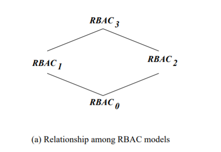
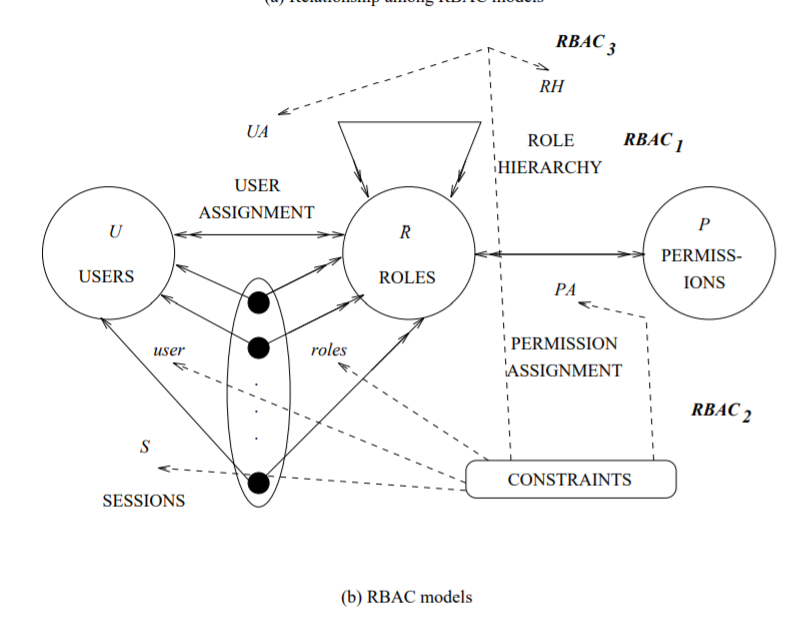
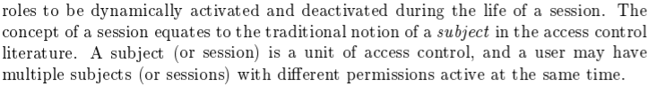
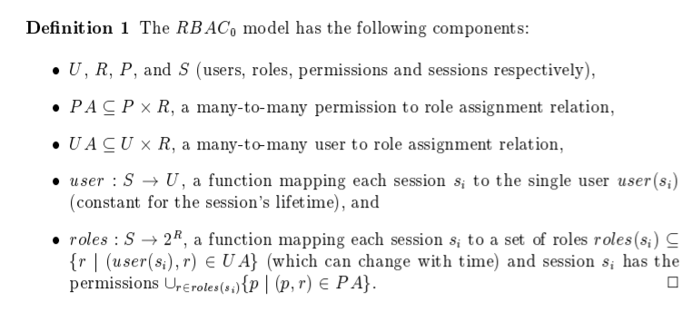
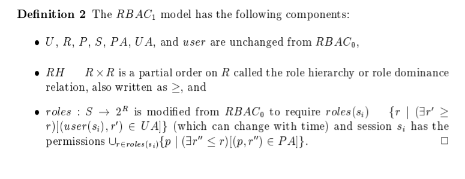
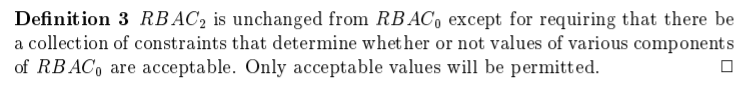
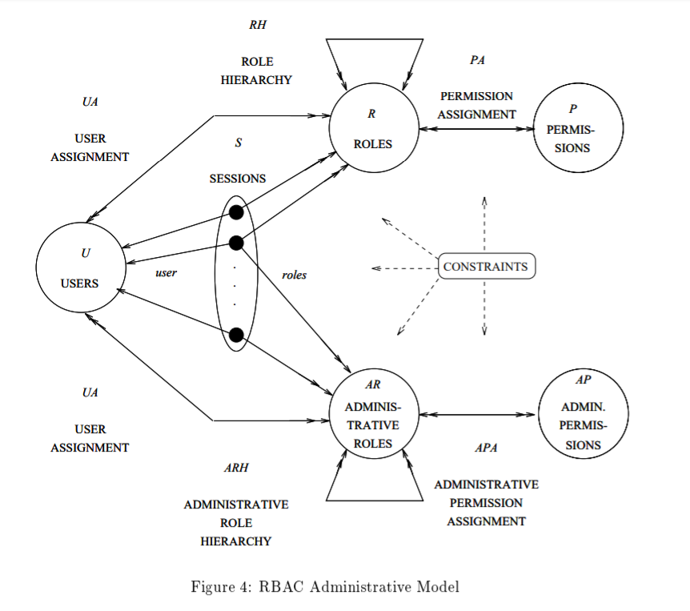

# 
Role Based Access Control

> 参考：
>
> [Spring Security 实战干货： RBAC权限控制概念的理解](https://zhuanlan.zhihu.com/p/91898362)
>
> [Role-Based-Access-Control__sandhu96.pdf](https://csrc.nist.gov/CSRC/media/Projects/Role-Based-Access-Control/documents/sandhu96.pdf)
>
> [什么是 Azure 资源的基于角色的访问控制 (RBAC)?](https://docs.microsoft.com/zh-cn/azure/role-based-access-control/overview)
>
> [Role Based Access Control](https://csrc.nist.gov/projects/role-based-access-control)
>
> 

------

### RBAC的简介

* RBAC：Role Based Access Control：基于角色的访问控制

RBAC的概念起源于早期的多用户计算机系统，他的兴起是因为人们需要通用的多用途的可定制工具

RBAC简化了权限管理，与用户组的概念相近

RBAC支持三个著名的安全性原则：最少特权、权限分离、数据抽象

> * 最小特权原则，只有该角色完成任务所需的权利被赋予该角色
> * 职责分离原则，确保互斥角色来完成一项敏感任务，例如比赛中，裁判不能同时是参赛选手
> * 数据抽象原则，权利依靠抽象完成，例如借记卡和信用卡对于一个账户，而不是用操作系统提供的读写执行的权利

对于RBAC，简单来说，就是将用户对应一个身份，而一个身份拥有相应的权限，如下图所示

就如同公司的项目经理，人事经理，上到CEO，CTO等等，每个职位有着相应的权限，而且在每个公司的CTO可以拥有不同的权限，同时CTO也可以由不同人来担任。把这个关系映射到计算机系统来，就是基于角色的访问控制。

相较于直接将权限分配给用户，这种RBAC的机制有着较强的扩展性，也便于权限管理：在权限更改时，无需遍历所有用户，增加了提权的效率，以及降低了漏调权限的概率，这样用户和资源权限解除了耦合性，这就是 **RBAC** 模型的优势所在。

### RBAC的分类

**RBAC模型**可以分为：**RBAC0**，**RBAC1**，**RBAC2**，**RBAC3** 四种。其中**RBAC0为基础**，其他都是因RBAC为基础的变种。其中他们的关系可以由下图所示。

RBAC0是最低层的基本模型。RBAC1和RBAC2都包含的RBAC0的所有特征，并且在此基础上添加了一些独立的功能，同时也被称为advanced models

RBAC1相较于RBAC0添加了角色继承的概念，即角色可以从其他角色中继承权限，感觉有点类似面向对象中类的继承

RBAC2添加了一些限定条件，简单来说就是为了职责分离，防止既是参赛选手又是裁判的情况出现

RBAC3合并了RBAC1和RBAC2，由于传递性，肯定也包含了RBAC0的特征

RBAC模型的基本特征由下图所示

#### RBAC0 ——Base model

这个模型中，有三组实体：**User(用户)，Roles(角色)，Permission(权限)**，上图中也有**Sessions(会话)**的集合

用户：可以是智能的自治代理，例如机器人、静止的电脑甚至是电脑中的网络，简单的，我们可以认为一个用户就是一个人

角色：一个角色就是一个工作职能或工作名(职务名)，具有与授予角色成员的权限和责任的相关联的语义

权限：是一种对系统内一个或多个对象访问的模式的许可，授权条款、访问权限、优先级都象征着权限，权限的概念可以是多样化的

在这个框架里，拒绝访问被认为是一种约束，而不是一种拒绝的权限

权限的性质使其依赖于系统的实现细节和系统本身，因此一个访问控制的通用模型将权限看作为一个扩展的没有解释的符号。每个系统保护着他自己实现的抽象对象，因此操作系统维护着像文件、目录、设备、端口等以及其读写执行的权限。一个关系型数据库管理系统维护着关系、元组、属性、视图以及其insert、update、delete、select等操作

权限可以应用于单个或多个对象

正如上图所说，**用户和角色，角色和权限都是多对多的关系。**一个用户可以拥有多个角色，一个角色也可以拥有多个用户，相似的，一个角色可以拥有多个权限，一个权限也可以被多个角色所拥有。RBAC的关键性设计就在这两个多对多的关系。这种对应关系最后使得一个用户可以行使一种权利。把角色当作用户和权限的中间人提供了更好的访问控制设置，更加直接的将用户和权限联系起来

对话(Session)：是一种一个用户和多种角色的映射。当用户想要激活他所属的一些角色时，一个用户将会建立起一个对话。在对话里，对话和角色是一对多的关系，用户对应的多种角色在对话里同时被启用，对话里所有角色所拥有的权限都可以被用户所使用。每个对话和一个单一的用户绑定，这种绑定在一个对话的生命周期内保持不变。

在同一时间内，一个用户可能有多个对话，每个对话都在一个不同的工作窗口。每个对话有可能有不同的角色绑定。这个RBAC0的功能支持最小特权原则。一个用户可以激活他所拥有角色集合的任意子集，保证其在一个对话中对于一个任务最合适。因此，拥有一个强大权限的角色一般为不激活，当他被需要时，才去激活他。在一个对话的生命周期内，RBAC0也允许角色的动态激活和失效。

假如将RBAC0以形式化语言说明，那么可以看看下图所示

#### RBAC1 ——Role hierarchies

角色继承是一种结构化角色的方法，去反应组织的权限和责任的结构

这边继承的概念就如面向对象中继承的特性一样，论文中的例子我就不再复述了。

直接在此给出论文中形式化语言的描述

#### RBAC2 ——Constraints

实际上，RBAC1和RBAC2没有包含关系，虽然他们在数字版本上是相邻的。正如RBAC模型的关系里，这两个是属于并列关系的。

约束(Constraints)也是RBAC模型中重要的一方面。

在论文中，是采购经理和财务经理的关系，这两个职责明显不能由同一个人来担任，因为这回造成欺诈。这是一个历史悠久的原则——**职责分离**。不过对于例子，我更喜欢在博客中看到的这个例子：一个人不能再比赛中同时担任参赛选手和裁判，这明显的会造成比赛公平性缺失，虽然这在现实中几乎不可能发生，但我觉得这是对于这个方面最直观的体现。

约束是在更高等级组织政策中一种有力的机制。确定的角色需要被定义为相互排斥的，即职责分离。

只要RBAC的管理是被一个高级安全官员完全中心化管理的，约束就是非常的方便，同时也体现了高级安全官员的决策影响十分重大。但假如RBAC的管理去中心化，约束就变成了一种机制，使得级别高的安全官员可以限制用户行使管理权限

约束应用于User Assignment和Permission Assignment的关系，使得返回一个函数值为接收或者不接受。

以下是论文中对约束的定义

在这个定义下，权限必须具有原子性

有些角色产生的历史原因就是为了制约另一个角色，裁判员就是为了制约运动员从而让运动员按照规范去比赛。如果一个人兼任这两个角色，比赛必然容易出现不公正的情况从而违背竞技公平性准则。还有就是我们每个人在不同的场景都会充当不同的角色，在公司你就是特定岗位的员工，在家庭中你就是一名家庭成员。随着场景的切换，我们的角色也在随之变化。所以 **RBAC2** 在 **RBAC0** 的基础上引入了静态职责分离（Static Separation of Duty，简称SSD）和动态职责分离（Dynamic Separation of Duty，简称DSD）两个约束概念。他们两个作用的生命周期是不同的;

- **SSD** 作用于约束用户和角色绑定时。 1.互斥角色：就像上面的例子你不能既是A又是B，互斥的角色只能二选一 ; 2. 数量约束：用户的角色数量是有限的不能多于某个基数； 3. 条件约束：只能达到某个条件才能拥有某个角色。经常用于用户等级体系，只有你充钱成为VIP才能一刀999。

- **DSD** 作用于会话和角色交互时。当用户持有多个角色，在用户通过会话激活角色时加以条件约束，根据不同的条件执行不同的策略。

#### RBAC3 ——Consolidated Model

RBAC3将RBAC1和RBAC2的特性结合起来，也就是在RBAC0的基础上同时拥有了角色继承和约束的两个特性。

约束可以被应用于角色继承中。例如约束可以限制一个角色的数量，比如一个公司只能有1个ceo；在此模型中，约束可以是多样化的，不仅可以约束角色的数量，也可以约束角色的关系。

约束在某些情况下非常有用，尤其是在更改角色层次结构的权限已经被分散的情况下

#### 管理模型——Management models

以上的管理模型都是基于单个安全管理员，在大型系统中，一般都有一个安全管理团队

那么问题就来了，RBAC如何管理自己呢？

作者给出了如图下这样一种模型

在此模型中，约束应用于RBAC中的任一部分，图中上半部分与和RBAC0的基本模型的类似，增加了下半部分，用于对管理角色(AR)和管理权力(AP)的说明，普通权限只能给普通角色，而管理权限只能给管理角色，这是个内在约束。
作者认为在管理管理层次时，只需要一个主要的安全管理员就够了，不需要第二个管理层次来管理第一个。

> 管理者的权力包括：
>
> * 修改UA
> * 修改PA
> * 修改角色层次关系

RBAC中的管理权限可以看作是修改用户分配，权限分配和角色层次关系的功能。在管理模型中，必须**显式定义**这些管理操作的权限。这些权限的确切性质是具体实现，但是他们的一般性质几乎相同。

一般地，每个管理角色都将映射到她负责管理的角色层次结构的某个子集。管理的其他方面也需要限定范围，比如删除行为和修改行为就不一样，可以在此限定范围。

### 概念理解

#### 角色（Role）

角色是一个组织中的一个职务职能或职称

角色的概念与在访问控制中的用户组的概念相近，但是一个角色是把一组用户和一些权限关联在一起，而用户组却只能代表一组的用户

多角色分配：假如有一个用户被分配到了多种角色，那么会怎么样呢？RBAC是一个加法模型，因此，该用户会拥有其所分配到的所有角色所具有的权限。

#### 权限（Permission）

权限具有原子性，不可再分

在RBAC框架里，拒绝访问被建模为一个约束，而不是一个否定的权限。

