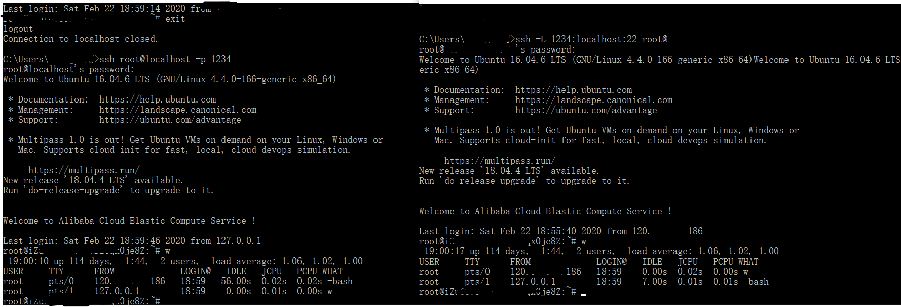
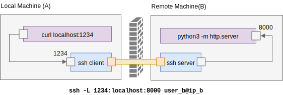
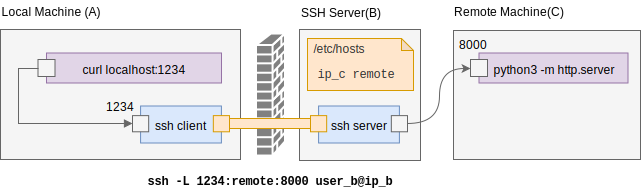
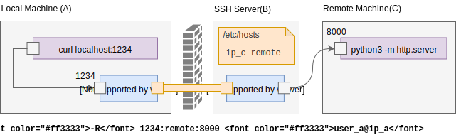

# <center>SSH端口转发</center>


> 参考：
>
> [ssh端口转发的三种方式](https://juejin.im/post/5dabc760518825040063205e)
>
> [SSH 端口转发教程](https://lotabout.me/2019/SSH-Port-Forwarding/)
>
> [[玩转SSH端口转发](https://blog.fundebug.com/2017/04/24/ssh-port-forwarding/)](https://blog.fundebug.com/2017/04/24/ssh-port-forwarding/)
>
> [实战 SSH 端口转发](https://www.ibm.com/developerworks/cn/linux/l-cn-sshforward/index.html)
>
> 


课上看老师演示过，感觉端口转发这个操作真的是贼好用，直接利用外部公网ip连接到了他的虚拟机内网，便想具体学习学习

总所皆知，ssh是我们常用的工具之一，基本快赶上vim的使用频率。我们一般都会使用ssh来进行远程连接服务器，但是这次来学习一次ssh骚操作——ssh端口转发


SSH端口转发也被称作SSH隧道(SSH Tunnel)，因为它们都是通过SSH登陆之后，在**SSH客户端**与**SSH服务端**之间建立了一个隧道，从而进行通信。SSH隧道是非常安全的，因为SSH是通过加密传输数据的(SSH全称为Secure Shell)。

SSH有三种端口转发模式，**本地端口转发(Local Port Forwarding)**，**远程端口转发(Remote Port Forwarding)**以及**动态端口转发(Dynamic Port Forwarding)**。对于本地/远程端口转发，两者的方向恰好相反。**动态端口转发**则可以用于科学上网。


## 本地端口转发


本地端口转发（**Local Port Forwarding**），是将本地主机某个端口流量转发到远程主机的指定端口。其命令行语法是：`ssh -L [bind_address]:localport:remote_host:remote_port`。

`ssh -L 本地网卡地址:本地端口:目标地址:目标端口`

也可以是：`ssh -L [bind_address]:port_a:remote_host:port_b user@host`

将本地绑定的地址的a端口的流量转发至`user@host`主机的`remote_host`的`port_b`端口



```sh
$ ssh -L 1234:localhost:22 root@remote_ip
```

如上所示，我们在本地将1234端口的数据转发到远程主机的22端口，访问我本地localhost的1234端口(左)，等于以localhost的身份访问我远程主机22端口 



上图中，远程的机器上起了一个服务 `python3 -m http.server`，它监听端口 `8000`，现在我们想在本机访问这个服务，但由于防火墙的存在，`8000` 端口无法直接访问，于是我们使用 ssh 端口转发。首先在 A 上执行 `ssh -L 1234:localhost:8000 user_b@ip_b` 建立 ssh 隧道，它表示：所有对 `A:1234` 端口的请求，相当于在 `B` 机器上对 `localhost:8000` 的请求。因此在 A 上执行 `curl localhost:1234` 就相当于访问 B 机器上的 python 服务。



假如web服务部署在其他机器上(Remote Machine C)，可以看到我们只是把上例中的 `localhost` 换成了 C 机器的 hostname/IP 就可以了。此时，发送到 `A:1234` 的请求相当于从 B 机器上对 `remote:8000` 的请求，图中在 `/etc/hosts` 中设置了 hostname 和 IP 的对应关系，直接用机器 C 的 IP 也是可以的。

同时可以看到，机器 A 由于防火墙无法访问内网的服务，但是由于①机器A可以ssh到内网机器B②B有权限访问到内网的其他服务，通过本地端口转发可以实现从A访问内网的服务。

机器A通过ssh隧道访问本地端口，相当于机器B访问remote:port。


## 远程端口转发

远程端口转发（**Remote Port Forwarding**），是将将发送到远程端口的请求，转发到目标端口。其命令行语法是：`ssh -R 远程网卡地址:远程端口:目标地址:目标端口`。

当然也可以是：`ssh -R <prot_a>:<remote_host>:<port_a> user_a@ip_a`

远程转发最常用的功能是**内网穿透**。有一个公网ip的主机，便可以借助ssh隧道的远程转发实现内网渗透，达到外网访问内网资源的目的。需要注意的是ssh远程转发**默认只能绑定远程主机的本地地址**，即`127.0.0.1`。如果想要监听来自其他主机的连接，需要修改远程主机ssh的配置,将"GatewayPorts"改成“yes”，重启ssh后生效。



如图，假如A可以联网且有公网ip，B可以联网（即可以远程连接A），此时执行命令的是属于内网里且没用公网ip的机器B

我们可以通过访问A的公网ip达到访问内网BC所部署的服务

简单来说在本地执行ssh命令称为本地转发，在远程机器中执行命令就属于远程转发


## 动态端口转发