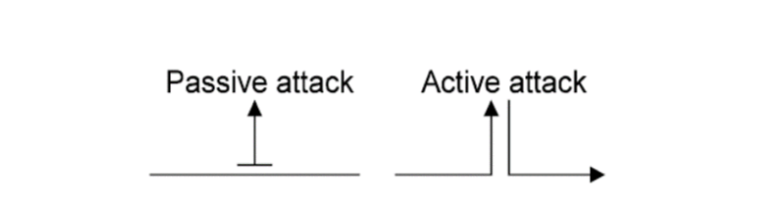
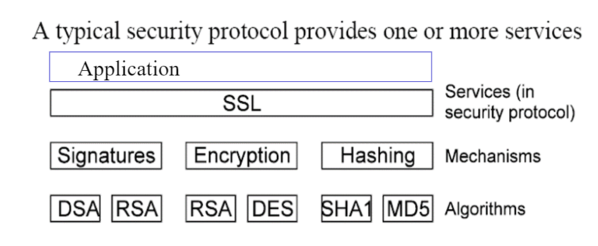
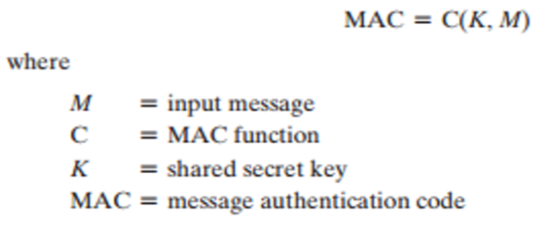
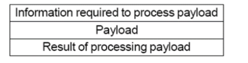
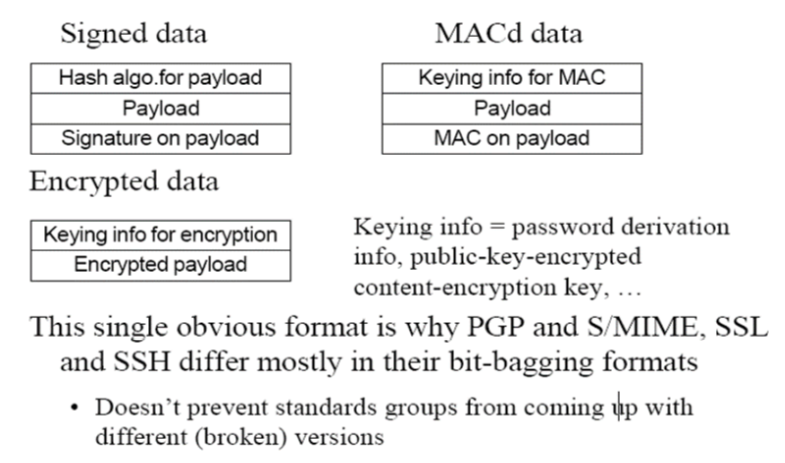
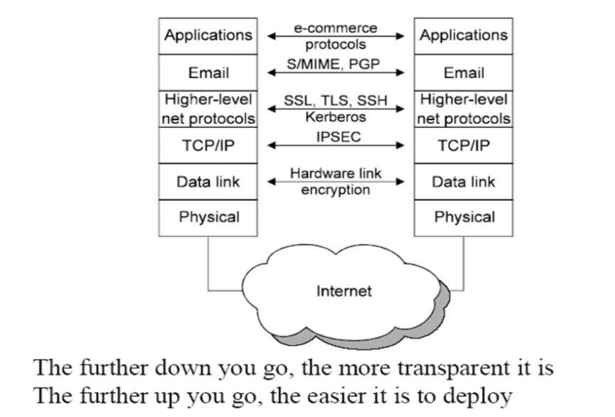

# 
Security Protocols and Standards
 
--PKI Principles and technology

安全协议与标准

* PKI concepts/content/significance
* Core PKI Service
* Certificate and CRL(证书吊销列表)
* Trust Model
* PKCS：The Public-Key Cryptography Standards
* CA(证书认证中心：Certificate Authority) Standards
* PKI Security Protocols：SMIME，SSL，SET(安全电子交易协议)，VPN
* PKI/CA Design and Implementation
* Related Laws
* \* Bitcoin & BlockChain

## 1.Review to Cryptography

> #### Security Requirment(安全需求)
>
> * Confidentiality(机密性)：防止被未授权人员读取信息
> * Integrity(完整性)：保持数据一致完整
> * Availability(可用性)：保持数据可用
> * Authentication(认证性)：保证人的身份正确
> * Non-repudiation(抗抵赖性)：确保数据不会被否定
> * Access control(访问控制)：防止未授权人员访问
>
> 
>
> 前三个被称为信息安全的CIA三要素
>
> 

#### 攻击的类型

攻击分为两种类型：主动攻击和被动攻击

* 被动攻击(Passive attack)：只能观察到流量或数据
* 主动攻击(Active attack)：可以主动修改流量或数据，比如中间人攻击。通常比较难实现，但是攻击十分有效，比如邮件的伪造，TCP/IP spoofing（IP欺骗），session hijacking（会话劫持）

#### 安全服务

ISO7498-2中定义了5大类可选的安全服务：

* 认证性
* 访问控制
* 数据保密性
* 数据完整性
* 不可否认性

#### 安全机制

三大基本设施

* Encryption(加密)
* Digital signatures(数字签名)
* Checksums/hash algorithm(校验码/哈希算法)

一种安全服务可能结合多种安全机制

### Security Protocol

一种安全协议里包含一个或多个安全服务，而安全服务提供多种安全机制，在一个安全机制里可能用到多种算法（机制由算法实现），这就是**协议与服务、机制、算法之间的关系**

对称加密由加密过程可分为：流加密(Stream cipher)和块加密(Block cipher)

Key Distribution Center(KDC)：密钥分发中心

#### 块加密方式

* Electronic Code Book(ECB)
* Cipher Block Chain(CBC)
* Cipher Feed Back(CFB)
* Output Feed Back(OFB)
* Counter(CTR)

#### 公钥应用

* 加解密
* 数字签名
* 密钥交换

##### 算法

* RSA
* DH：key exchange algorithm
* Elgamal
* DSA

### 对称加密vs非对称加密

#### 对称加密

* 优点
  * 速度快、处理量大，适用于对应用数据的直接加密
  * 加密密钥长度短，一般为40bit至128bit
  * 还可以构造各种加密体制，如产生伪随机数、hash函数
* 缺点
  * 密钥在双方都要一致、保密，传递较难
  * 大型网络中密钥量大，难以管理，一般需要TTP
  * 密钥需要经常更换

#### 非对称加密

* 优点
  * 只有私钥保密，公钥公开
  * 网络上的密钥管理只需要一个功能性TTP，而不是一个绝对安全的TTP，不需在线，可以离线
  * 密钥生命周期相对较长
  * 许多公钥方案可以产生数字签名机制
  * 在大型网络上，所需的密钥相对较少
* 缺点
  * 速度慢、处理量少，适用于密钥交换
  * 密钥长度相对较长
  * 安全性没有得到理论性证明
  * 历史较短

#### 哈希函数

弱碰撞：给定x，寻找y，使得`H(y) =  H(x)`

强碰撞：寻找x，y，使得`H(y) = H(x)`

#### Message Authertication Code(MAC)

消息认证码MAC

#### 数字签名（Digital Signature）

#### Key Management

密码学最难的部分

密钥分为两种

* Short-term session keys(ephemeral keys)
* Long-term keys
  * 认证
  * 加密

##### 主要问题

* Distributing keys(分发密钥)
  * 获取其他人的公钥
  * 分发自己的公钥
* Establishing a shared key with another party(与另一方建立共享密钥)
  * 保密性
  * 认证性
* Key storage
  * 安全存储密钥
* Revocation
  * Revoking published keys：撤销公钥
  * Determining whether a published key is still valid：验证公钥的可用性

##### Key Lifetime and Key Compromise

公钥有着更长的生命周期(decades)

私钥或者传统密钥有着更短的生命周期(a year or two)

##### Key Distribution Problem

！中间人攻击

解决办法：CA（Certification authority）

* 对称加密密钥管理认证：KDC/KEY DISTRIBUTION CENTER
* 非对称加密密钥管理认证：CA/CERTIFICATE AUTHORITY

#### Data Format

一种正确的加密内容的格式如下图所示

PGP和S/MIME，SSL，SSH的格式不同于他们的 bit-bagging format

#### Security Protocol：Layers

层次越高，就越容易部署应用；层次越低，数据就越透明

#### PKI（Public Key Infrastructure）

Internet安全系统解决方案，PKI采用数字证书机制管理公钥，通过第三方可信机构CA，把用户的公钥和身份信息进行有效捆绑，在Internet上有效验证用户的身份

国际标准PKIX：系统化、标准化

PKIX系列标准(Public Key Infrastructure on X.509)是由因特网网络工程技术小组的PKI小组制定，PKIX的标准化是建立互操作的基础。标准主要定义基于X.509的PKI框架模型，并以RFC形式发布

------

安全：可靠性==》可靠性（网课的可靠性和安全性，没有可靠性，安全性没用）

安全协议与标准

协议：至少两方参与

网络协议的三要素：语法、语义、同步

围绕PKI的相关协议和理论

PKI：安全基础设施：Public Key Infrastructure

* 基础设施协议
* 应用的协议

> 参考书：
>
> PKI技术，荆继武，冯登国，科学出版社（偏理论
>
> PKI原理与技术，谢冬青，清华大学出版社
>
> PKI/CA与数字证书技术大全，张明德，刘伟，电子工业出版社（偏实践
>
> 

