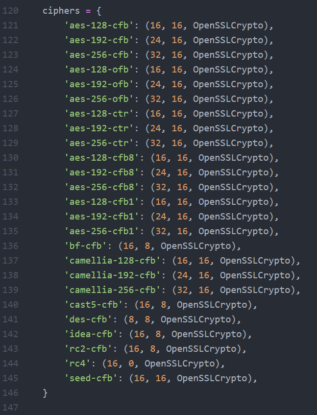

# 关于ShadowSocks的学习


对待科学上网的工具，既然开源的话，就要有科学的精神对其进行学习。


其GitHub官方网址：https://github.com/shadowsocks

本文学习的源码来自：https://github.com/shadowsocks/shadowsocks

版本是2.9.1的python版本


> 参考：
>
> [shadowsocks 源码分析：整体结构](https://bitmingw.com/2017/03/25/shadowsocks-code-analysis-overview/)
>
> [你也能写个 Shadowsocks](https://segmentfault.com/a/1190000011862912)
>
> [shadowsocks源码分析：ssserver](https://huiliu.github.io/2016/03/19/shadowsocks.html)
>
> [shadowsocks 源码阅读](https://0x01.io/2016/02/28/shadowsocks-源码阅读/)
>
> [Shadowsocks 源码分析——协议与结构](https://loggerhead.me/posts/shadowsocks-yuan-ma-fen-xi-xie-yi-yu-jie-gou.html)
>
> [shadowsocks客户端源码分析]([https://blog.gfkui.com/2018/04/29/shadowsocks%E5%AE%A2%E6%88%B7%E7%AB%AF%E6%BA%90%E7%A0%81%E5%88%86%E6%9E%90/index.html](https://blog.gfkui.com/2018/04/29/shadowsocks客户端源码分析/index.html))
>
> 


## 关于SOCKS协议


ShadowSocks的数据传输时建立在SOCK5协议之上，SOCKS5 是 TCP/IP 层面的网络代理协议。

ss-server 端解密出来的数据就是采用 SOCKS5 协议封装的，通过 SOCKS5 协议 ss-server 端能读出本机软件想访问的服务的真正地址以及要传输的原数据


> 关于Socks5学习：
>
> [socks5 协议简介](http://zhihan.me/network/2017/09/24/socks5-protocol/)
>
> [HTTP协议和SOCKS5协议](https://www.cnblogs.com/yinzhengjie/p/7357860.html)
>
> [socks-wiki](https://zh.wikipedia.org/wiki/SOCKS)
>
> 


socks是一种网络传输协议，主要用于客户端与外网服务器之间通讯的中间传递。根据OSI七层模型来划分，SOCKS属于会话层协议，位于表示层与传输层之间。

socks5协议将socks4协议扩展：

* 对UDP连接的支持
* 多种用户身份验证方式和通信加密方式
* 将寻址方式扩展为包含域名和v6 IP地址（即IPv6）


socks协议的设计初衷是在保证网络隔离的情况下，提高部分人员的网络访问权限。但是他却被发现了新的用途：突破网络通信限制，这和该协议的设计初衷正好相反。


#### Socks5协议流程


建立TCP连接后，客户端需要先发送请求来协商版本及认证方式，详细可见[rfc1928](https://www.ietf.org/rfc/rfc1928.txt)


## Shadowsocks原理


- **PC**是需要利用shadowsocks代理的应用；
- **SS Local**：为shadowsocks客户端，通常运行在PC/手机上（也可以运行在任务PC可 以到达的位置），用于与shadowsocks服务端建立连接。
- **GFW**：你懂的
- **ss server**：shadowsocks服务端，与ss local通讯，完成ss local请 求的访问，并将返回数据加密返回给ss local


混淆时实在ClientHello阶段，即第1阶段时进行混淆，加入jiade目标网址


## shadowsocks源码分析


shadowsocks文件树形结构图如下

```

├── .gitignore
├── .travis.yml
├── CHANGES
├── CONTRIBUTING.md
├── debian
│   ├── changelog
│   ├── compat
│   ├── config.json
│   ├── control
│   ├── copyright
│   ├── docs
│   ├── init.d
│   ├── install
│   ├── rules
│   ├── shadowsocks.default
│   ├── shadowsocks.manpages
│   ├── source
│   │   └── format
│   ├── sslocal.1
│   └── ssserver.1
├── Dockerfile
├── LICENSE
├── MANIFEST.in
├── README.md
├── README.rst
├── setup.py
├── shadowsocks
│   ├── asyncdns.py
│   ├── common.py
│   ├── crypto
│   │   ├── __init__.py
│   │   ├── openssl.py
│   │   ├── rc4_md5.py
│   │   ├── sodium.py
│   │   ├── table.py
│   │   └── util.py
│   ├── daemon.py
│   ├── encrypt.py
│   ├── eventloop.py
│   ├── __init__.py
│   ├── local.py
│   ├── lru_cache.py
│   ├── manager.py
│   ├── server.py
│   ├── shell.py
│   ├── tcprelay.py
│   └── udprelay.py
├── tests
├─tests
│  ├──  aes-cfb1.json
│  ├──  aes-cfb8.json
│  ├──  aes-ctr.json
│  ├──  aes.json
│  ├──  assert.sh
│  ├──  chacha20-ietf.json
│  ├──  chacha20.json
│  ├──  client-multi-server-ip.json
│  ├──  coverage_server.py
│  ├──  fastopen.json
│  ├──  gen_multiple_passwd.py
│  ├──  graceful.json
│  ├──  graceful_cli.py
│  ├──  graceful_server.py
│  ├──  ipv6-client-side.json
│  ├──  ipv6.json
│  ├──  jenkins.sh
│  ├──  nose_plugin.py
│  ├──  rc4-md5-ota.json
│  ├──  rc4-md5.json
│  ├──  salsa20-ctr.json
│  ├──  salsa20.json
│  ├──  server-dnsserver.json
│  ├──  server-multi-passwd-client-side.json
│  ├──  server-multi-passwd-empty.json
│  ├──  server-multi-passwd-performance.json
│  ├──  server-multi-passwd-table.json
│  ├──  server-multi-passwd.json
│  ├──  server-multi-ports.json
│  ├──  setup_tc.sh
│  ├──  table.json
│  ├──  test.py
│  ├──  test_command.sh
│  ├──  test_daemon.sh
│  ├──  test_graceful_restart.sh
│  ├──  test_large_file.sh
│  ├──  test_udp_src.py
│  ├──  test_udp_src.sh
│  ├──  workers.json
│  │
│  ├─libsodium
│  │    └── install.sh
│  │
│  └─socksify
│       ├── install.sh
│       └── socks.conf
|
└── utils
    ├── autoban.py
    ├── fail2ban
    │   └── shadowsocks.conf
    └── README.md
```


有过python工程经验（类似于Flask）很明显得知，工程核心代码位于`shadowsocks`里，其他提供了打包测试功能。


对于核心代码：

```
├── shadowsocks
│   ├── asyncdns.py
│   ├── common.py
│   ├── crypto
│   │   ├── __init__.py
│   │   ├── openssl.py
│   │   ├── rc4_md5.py
│   │   ├── sodium.py
│   │   ├── table.py
│   │   └── util.py
│   ├── daemon.py
│   ├── encrypt.py
│   ├── eventloop.py
│   ├── __init__.py
│   ├── local.py
│   ├── lru_cache.py
│   ├── manager.py
│   ├── server.py
│   ├── shell.py
│   ├── tcprelay.py
│   └── udprelay.py
```


- **tcprelay.py**提供了类TCPRelay, TCPRelayHandler来处理TCP代理连接
- **udprelay.py**提供了类UDPRelay，UDPRelayHandler来处理UDP代理连接
- **eventloop.py**提供了类EventLoop对`epoll`, `kqueue`, `select`方法的包装，提供统一的IO复用接口
- **encrypt.py**提供加密解密相关接口
  - 具体的加密实现在crypto文件夹中实现
- **daemon.py**：用于实现守护进程；
- **shell.py**：读取命令行参数，检查配置
- **common.py**包含一些通用接口
- **lru_cache.py**：实现了LRU缓存
- **server.py**是服务端入口ssserver；
- **local.py**是客户端入口sslocal；


可以看到，基本每个文件中，都有这一行的引入模块

```python
from __future__ import absolute_import, division, print_function, \
    with_statement
```

这个模块是为了引入下一版本的python特性，提高代码对最新python版本的兼容性。

在`setup.py`中可见，该代码可在python2.6，python2.7以及python3.3，python3.4及以上版本运行，因此会引入该库来解决兼容性问题

主要是为了兼容`import `，除法`/`，`print`，`with`

> > about `__future__`：
> >
> > https://www.liaoxuefeng.com/wiki/897692888725344/923030465280480
>
> * import
>
> https://blog.csdn.net/caiqiiqi/article/details/51050800
>
> Python 2.4或之前, Python会先查找当前目录下有没有string.py, 若找到了，则引入该模块，然后你在main.py中可以直接用string了。
>
> 而引入absolute_import 可以先从系统库中引用。
>
> * `/`
>
> python2中，`/`为整除，而python3中，整除是`//`。
>
> * print
>
> python2中，print是一个语法结构，而python3中，print是一个内置函数，有多个参数
>
> 即明显地，python2中，`print 'hello world'`；而在python3中，`print('hello world')`
>
> * with
>
> http://www.voidcn.com/article/p-wrgsfqdl-boq.html
>
> python2.5需要引入的语法，没有看到2和3有什么区别，应该是为了兼容所引入的。
>
> 在stackoverflow的一个问题里说的很清楚了：https://stackoverflow.com/questions/3791903/which-python-version-needs-from-future-import-with-statement
>
> version<=2.4不支持，version2.5需要这个import with_statement，在version>=2.6的时候，python已经将with内嵌进去了。
>
> 


### Crypto


#### openssl.py


`from ctypes import ...`：ctypes是python和C的桥梁，ctypes是python标准库之一，里面引入了许多C的函数以及变量类型

> https://www.cnblogs.com/gaowengang/p/7919219.html


`__all__ = ['cipher']`规定了对外暴露的接口

> https://www.cnblogs.com/wxlog/p/10566628.html


由此直接看到下面的`cipher`，里面定义了ss的加密方法



这也就是crypto模块对外提供的所有加密方法

`def load_openssl()`方法用来寻找运行系统中的openssl库

全局变量`libcrypto`用来存放打开的openssl对象

定义了一个`OpenSSLCrypto`对象用来加密

函数`def run_method(method)`用来调用该对象进行加解密


