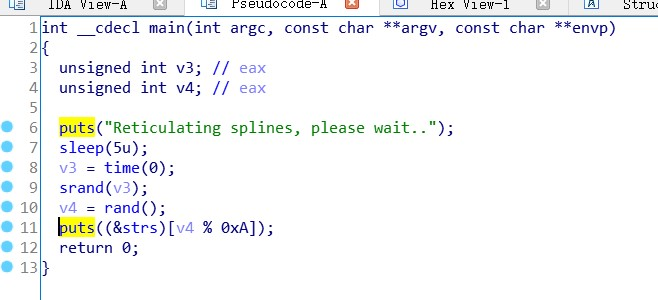
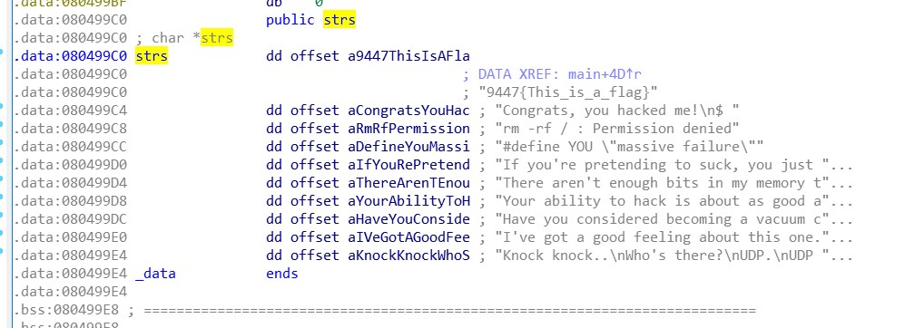
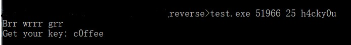

# <center>Reverse&WriteUp</center>


开始入坑逆向，请多多指教！


# <center>攻防世界&Crypto新手练习区</center>


## 0x01 insanity


> 题目描述：菜鸡觉得前面的题目太难了，来个简单的缓一下


下下来一个文件，本着好奇心直接用notepad打开，就看到了FLAG：`9447{This_is_a_flag}`？？？

原本我只想看看文件头的，没想到直接看到了FLAG

看到文件头得知，这是一个ELF文件

拖进IDA逆向，直接看main函数，没啥发现，然后F5得源码



心想着这哪有关于flag得信息，于是点v4到字符串到，看到了静态flag字符串，得到flag



看着这个字符串，应该是一个挺好玩得游戏


## 0x02 Open-source


> 题目描述：菜鸡学逆向学得头皮发麻，终于它拿到了一段源代码


如题，直接拿到源码

```c++
#include <stdio.h>
#include <string.h>

int main(int argc, char *argv[]) {
    if (argc != 4) {
    	printf("what?\n");
    	exit(1);
    }

    unsigned int first = atoi(argv[1]);
    if (first != 0xcafe) {
    	printf("you are wrong, sorry.\n");
    	exit(2);
    }

    unsigned int second = atoi(argv[2]);
    if (second % 5 == 3 || second % 17 != 8) {
    	printf("ha, you won't get it!\n");
    	exit(3);
    }

    if (strcmp("h4cky0u", argv[3])) {
    	printf("so close, dude!\n");
    	exit(4);
    }

    printf("Brr wrrr grr\n");

    unsigned int hash = first * 31337 + (second % 17) * 11 + strlen(argv[3]) - 1615810207;

    printf("Get your key: ");
    printf("%x\n", hash);
    return 0;
}

```

推测得知，hash应该就是所得字符串

该函数有4个判断，因为每个判断都和后面的hash计算有关，因此阅读每个if判断

第一个判断是否为四个参数，第二个判断first是否为`0xcafe`，因为first被强转为int，因此需将十六进制转化为十进制，这边用python偷懒，算出为51966，第二个判断要过，即或运算两边都需要false，因此 second满足的条件为：`second %5 != 3 && second %17 == 8`，最后一个判断即是c++的字符串比较，直接输入`h4cky0u`。

用gcc将程序编译，得到可执行文件，运行以上结果，得到flag：`c0ffee`




## 0x03 simple-unpack


> 题目描述：菜鸡拿到了一个被加壳的二进制文件


获得一个加壳的ELF文件，拖入IDA64bit里，果然没法分析

学一波脱壳

> 参考：
>
> https://bbs.ichunqiu.com/thread-22463-1-1.html?from=beef
>
> https://www.jianshu.com/p/0880bcb6fed6

用DetectItEasy查出这是upx壳


> 上52pojie.cn找ELF64脱UPX壳
>
> https://www.52pojie.cn/thread-1048649-1-1.html
>
> https://www.52pojie.cn/forum.php?mod=viewthread&tid=730499&page=1
>
> 


透了，之后补充upx手脱

发现可以用命令脱壳，然后拖入IDA即可看到源码

```sh
$ upx -d simple-unpack
```


