# <center>Web&WriteUp</center>


Web如同一座正三角冰山，等着去探索。。。


# <center>攻防世界&Web新手练习区</center>


## 0x01  view_source 

>  题目描述：X老师让小宁同学查看一个网页的源代码，但小宁同学发现鼠标右键好像不管用了。 

利用view-source://url或者f12或者右键查看源码，flag就在源码里


## 0x02  get_post 

>  题目描述：X老师告诉小宁同学HTTP通常使用两种请求方法，你知道是哪两种吗？ 

利用burp suite 发包得到flag

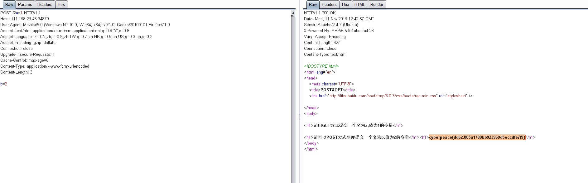


另一种思路是利用python的requests库发送请求。


## 0x03  robots

> 题目描述：X老师上课讲了Robots协议，小宁同学却上课打了瞌睡，赶紧来教教小宁Robots协议是什么吧。 


查看源码肯定是没有flag的，根据题目robots可联想到web的robots.txt协议

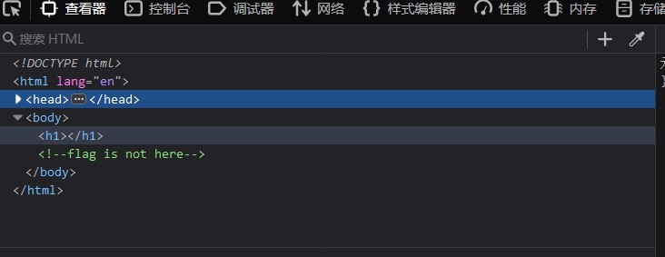


> robots.txt协议是在Web站点的根目录下设置一个robots.txt文件，规定站点上的哪些区域或者哪些页面是限制搜索的。搜索程序将参考该文件，决定站点中的哪些区域是不允许搜索的，并在接下来的搜索过程中跳过这些区域。
>
> 下面是一个例子：
>
> ```
> #robots.txt for http://somehost.com
> 
>User-agent: *
> Disallow: /cgi-bin
> Disallow: /registration
> ```
>
> 示例中第一行是一行注释，注释以一个#开头。
>
> * User-agent：指访问站点的程序，每个浏览器都有一个唯一的User-agent值，浏览器在向Web服务器发送请求时会在每个请求中都附加这个值。Web站点通过在robots.txt中使用User-agent就可以针对不同的User-agent设置不同的规则。
> * Disallow是拒绝语句，定义了搜索程序不允许访问的Web站点路径。拒绝语句只针对路径进行设置，不针对具体的文件。


直接访问http://xxx.xxx.xxx.xxx/robots.txt

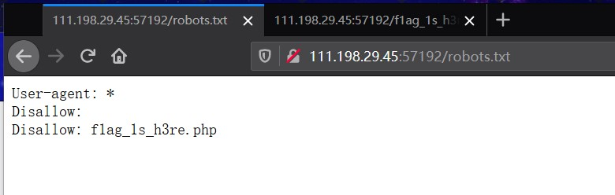

得到一个php路径，直接访问得到flag

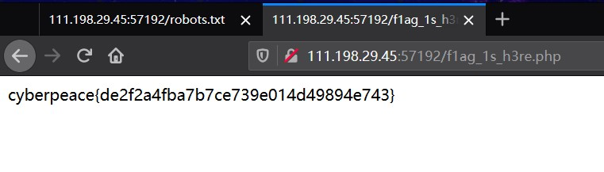


## 0x04 backup


>  题目描述：X老师忘记删除备份文件，他派小宁同学去把备份文件找出来,一起来帮小宁同学吧！ 


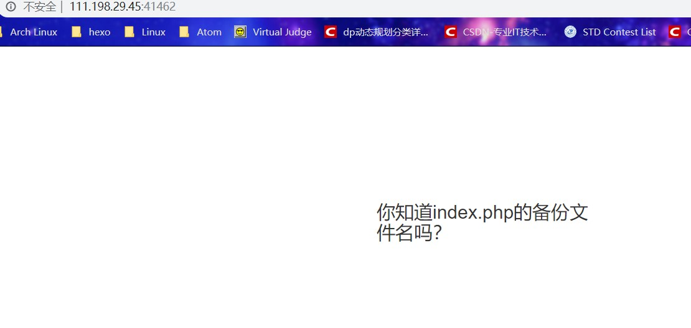

 php的备份有两种：*.php~和*.php.bak 

 如果网站存在备份文件，在地址栏最末加上/index.php~或/index.php.bak，即可得到备份文件 `index.php.bak`

访问 http://url/index.php.bak 即自动下载了index.php.bak，打开查看flag就在里面


## 0x05  cookie 


> 题目描述：X老师告诉小宁他在cookie里放了些东西，小宁疑惑地想：‘这是夹心饼干的意思吗？’ 


chrome在console中输入命令` javascript:alert(document.cookie)  `

其实在地址栏输入也可以实现

弹出 `look-here=cookie.php`

访问`url/cookie.php`看到`See the http response`

打开F12开发者模式的Network，查看`cookie.php`的回应，Response里没找到flag，最后在Response Headers里找到flag


## 0x06 disabled button

>  题目描述：X老师今天上课讲了前端知识，然后给了大家一个不能按的按钮，小宁惊奇地发现这个按钮按不下去，到底怎么才能按下去呢？ 


明显是一个灰色的按钮，查看源码有`<button disabled>`跟hackergame2019的签到题一样，把disabled删掉点击按钮即可。


## 0x07  simple_js 


>  题目描述：小宁发现了一个网页，但却一直输不对密码。(Flag格式为 Cyberpeace{xxxxxxxxx} ) 


先输入任意字符进入页面查看源码

```javascript
<script>
    function dechiffre(pass_enc){
        var pass = "70,65,85,88,32,80,65,83,83,87,79,82,68,32,72,65,72,65";
        var tab  = pass_enc.split(',');
                var tab2 = pass.split(',');var i,j,k,l=0,m,n,o,p = "";i = 0;j = tab.length;
                        k = j + (l) + (n=0);
                        n = tab2.length;
                        for(i = (o=0); i < (k = j = n); i++ ){o = tab[i-l];p += String.fromCharCode((o = tab2[i]));
                                if(i == 5)break;}
                        for(i = (o=0); i < (k = j = n); i++ ){
                        o = tab[i-l];
                                if(i > 5 && i < k-1)
                                        p += String.fromCharCode((o = tab2[i]));
                        }
        p += String.fromCharCode(tab2[17]);
        pass = p;return pass;
    }
    String["fromCharCode"](dechiffre("\x35\x35\x2c\x35\x36\x2c\x35\x34\x2c\x37\x39\x2c\x31\x31\x35\x2c\x36\x39\x2c\x31\x31\x34\x2c\x31\x31\x36\x2c\x31\x30\x37\x2c\x34\x39\x2c\x35\x30"));

    h = window.prompt('Enter password');
    alert( dechiffre(h) );
</script>
```

看源码得知不论输入什么都会跳转至假密码然后失败，于是直接处理`fromCharCode`，得到flag

```python
>>> s = "\x35\x35\x2c\x35\x36\x2c\x35\x34\x2c\x37\x39\x2c\x31\x31\x35\x2c\x36\x39\x2c\x31\x31\x34\x2c\x31\x31\x36\x2c\x31\x30\x37\x2c\x34\x39\x2c\x35\x30"
>>> print(s)
"55,56,54,79,115,69,114,116,107,49,50"
>>> a = [55,56,54,79,115,69,114,116,107,49,50]
>>> s = ""
>>> for i in a:
...    	b =chr(i)
...     s += b
>>> print(s)
786OsErtk12

```


## 0x08 xff referer


> 题目描述：X老师告诉小宁其实xff和referer是可以伪造的 

直接访问网站，提示需要特定ip访问

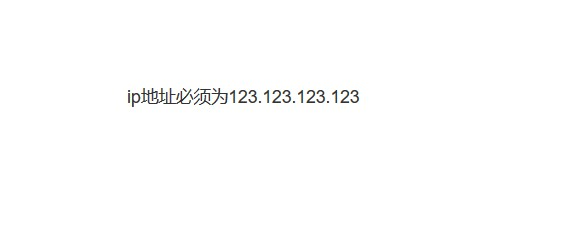

由题目描述猜想是改http请求，进行下一步.

百度xff可知

> X-Forwarded-For位于HTTP协议的请求头， 是一个 HTTP 扩展头部。HTTP/1.1（RFC 2616）协议并没有对它的定义，它最开始是由 Squid 这个缓存代理软件引入，用来表示 HTTP 请求端真实 IP。如今它已经成为事实上的标准，被各大 HTTP 代理、负载均衡等转发服务广泛使用，并被写入RFC 7239（Forwarded HTTP Extension）标准之中。


利用burpsuite直接伪造http header 的 `X-Forwarded-For`， X-Forwarded-For 请求头格式如下

```
X-Forwarded-For: client, proxy1, proxy2
```

 可以看到，XFF 的内容由「英文逗号 + 空格」隔开的多个部分组成，最开始的是离服务端最远的设备 IP，然后是每一级代理设备的 IP 

如果一个 HTTP 请求到达服务器之前，经过了三个代理 Proxy1、Proxy2、Proxy3，IP 分别为 IP1、IP2、IP3，用户真实 IP 为 IP0，那么按照 XFF 标准，服务端最终会收到以下信息`X-Forwarded-For: IP0, IP1, IP2`


> PS： Remote Address 无法伪造，因为建立 TCP 连接需要三次握手，如果伪造了源 IP，无法建立 TCP 连接，更不会有后面的 HTTP 请求 


然后得到如下页面

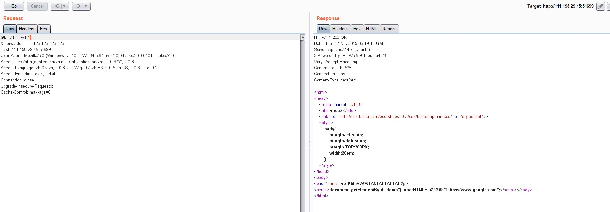


百度Refer可知


> HTTP_REFERER提供了引导用户代理到当前页的前一页的地址信息，常见的一些应用场景有防盗链，统计文章有多少次是来自谷歌搜索结果，多少次来自百度搜索结果等。 


> * 什么时候获取不到HTTP_REFERER值
>
>
> 综上所述，HTTP_REFERER存在需要两个条件：
>
> 浏览器（客户端）请求（服务器端请求的情况下，是不存在HTTP_REFERER的，但是可以伪造header，这在下一节中将提及）；
> 存在前导页；
>
> ​	以下是一些获取不到HTTP_REFERER值的情况：
>
> - 在浏览器内直接敲URL
>
> - windows桌面上的超链接图标
>
> - 浏览器内书签
>
> - 第三方软件（如Word，Excel等）内容中的链接
>
> - SSL认证网站跳入
>
> - < http://example.com/“> meta页面设置自动跳转时，在example.com将取不到REFERER URL
>
> - 使用JavaScript的Location.href或者是Location.replace()
>
>   
>
>   在以下情况下可以获取HTTP_REFERER值：
>
> - 直接用form提交的表单(POST或GET)
>
> - src请求（如js的script标签及html中img标签的src属性）


直接伪造header的`Referer`属性

但是没有得到结果

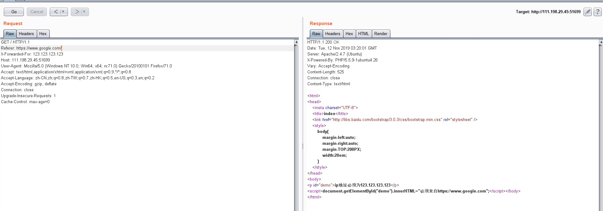


后面百度发现，`url/xxx`和`url/xxx/`是不一样的，`url/xxx`是直接访问xxx的文件，而`url/xxx/`是访问xxx目录，因此我们刚才得不到flag，将Referer的后面的斜杠去掉，再次请求，得到flag


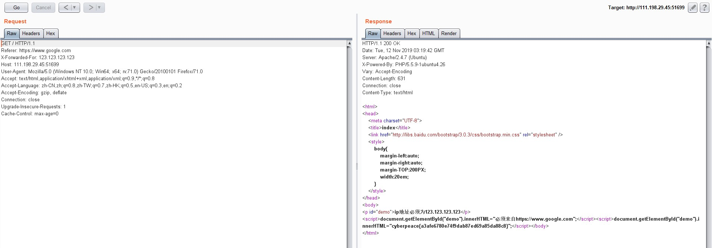


## 0x09  weak_auth 


>  题目描述：小宁写了一个登陆验证页面，随手就设了一个密码。 


直接点login跳转到了check.php，提示：please login as admin

用admin空密码去登陆，显示：password error

点确认，F12查看源码`<script>alert('password error');</script><!--maybe you need a dictionary-->`提示可能需要一个字典，肯定是**爆破**了


因此，我去学习了BurpSuite的Intruder功能——用于爆破的一个工具。

关于Burp Suite 的Intruder模块的四种选项的解释 https://howiezhao.github.io/2018/05/01/burpsuite-intruder-attack-type/ 

关于BurpSuite的Intruder模块的解释： https://www.cnblogs.com/yufusec/p/9179625.html 


然后爆破得到密码123456，进入系统得到flag


## 0x0a webshell


>  题目描述：小宁百度了php一句话,觉着很有意思,并且把它放在index.php里。 


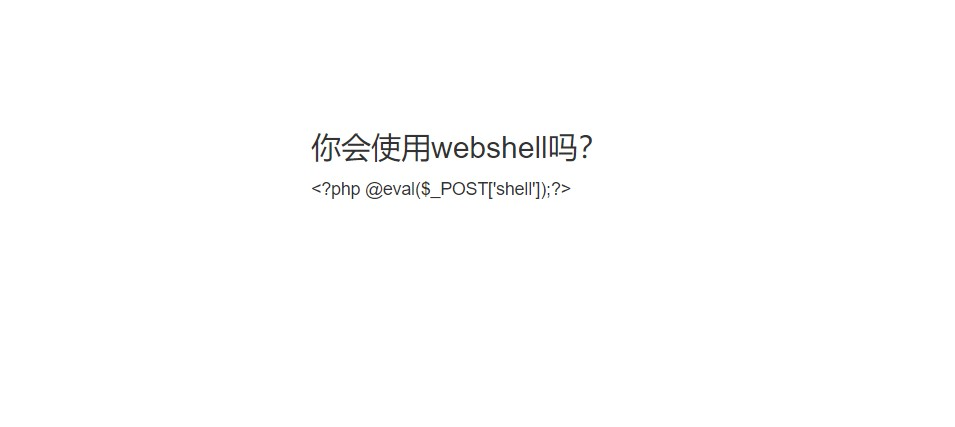

>  webshell就是以asp、php、jsp或者cgi等网页文件形式存在的一种命令执行环境，也可以将 其称做为一种网页后门。黑客在入侵了一个网站后，通常会将asp或php后门文件与网站服 务器WEB目录下正常的网页文件混在一起，然后就可以使用浏览器来访问asp或者php后门，得到一个命令执行环境，以达到控制网站服务器的目的。 顾名思义，"web"的含义是显然需要服务器开放web服务，"shell"的含义是取得对服务器某 种程度上操作权限。webshell常常被称为入侵者通过网站端口对网站服务器的某种程度上操 作的权限。由于webshell其大多是以动态脚本的形式出现，也有人称之为网站的后门工具。 首先新建一个index.php文件，把PHP代码输入到里面，电脑可能会自动识别它为病毒，并 删除，可以恢复后使用  


正如题目提示：php一句话——即**php一句话木马**： https://my.oschina.net/programs/blog/1649544 


了解之后，想用burpsuite的post请求发送也没能获取数据，于是看了wp，用中国蚁剑连了webshell，然后直接发现目录底下就有flag.txt。

~~做完之后，查看官方wp，我也没弄懂他wp怎么用burpsuite去post数据来获取webshell（我回显不了数据~~

update：post没有回显是因为我少了分号，还有就是hackbar的post没有发出去。后面成功用burpsuite发送post请求，成功执行命令。


## 0x0b command execution


>  题目描述：小宁写了个ping功能,但没有写waf,X老师告诉她这是非常危险的，你知道为什么吗。 


进入页面有个输入框，尝试输入127.0.0.1发现能够ping通并显示命令

于是联想到**命令拼接**利用&或|或；让我们的命令和ping一起执行，发现flag在`/home/flag.txt`里

用find命令的时候，不知道为什么在他的shell里搜索的时候要带引号，即`find / -name "flag*"`才能成功执行命令回显，去掉引号即失败了。


## 0x0c simple php 


>  题目描述：小宁听说php是最好的语言,于是她简单学习之后写了几行php代码。 


```php
<?php
show_source(__FILE__);
include("config.php");
$a=@$_GET['a'];
$b=@$_GET['b'];
if($a==0 and $a){
    echo $flag1;
}
if(is_numeric($b)){
    exit();
}
if($b>1234){
    echo $flag2;
}
?>

```

进入页面，见到如上php代码，应该是**代码审计**。

即让a满足`$a==0 and $a`且b满足`is_numeric($b)==flase&$b>1234`得到两个flag

>  php中的弱类型比较会使'abc' == 0为真，所以输入a=abc时，可得到flag1。（abc可换成任意字符）。 

>  is_numeric() 函数会判断如果是数字和数字字符串则返回 TRUE，否则返回 FALSE,且php中弱类型比较时，会使('1234a' == 1234)为真，所以当输入a=abc&b=1235a，可得到flag2。


>  发现“0”为 true，所以可以把参数 a 构造为’0’或者‘alph’这种转换后为 0 但本身不为 False 的 形式 数字和字符混合的字符串转换为整数后只保留数字 

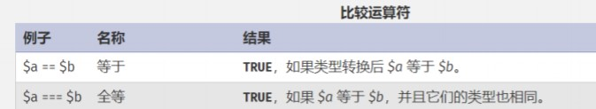


