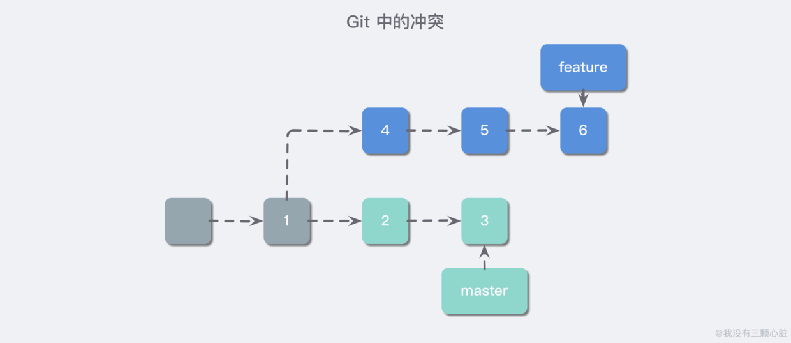
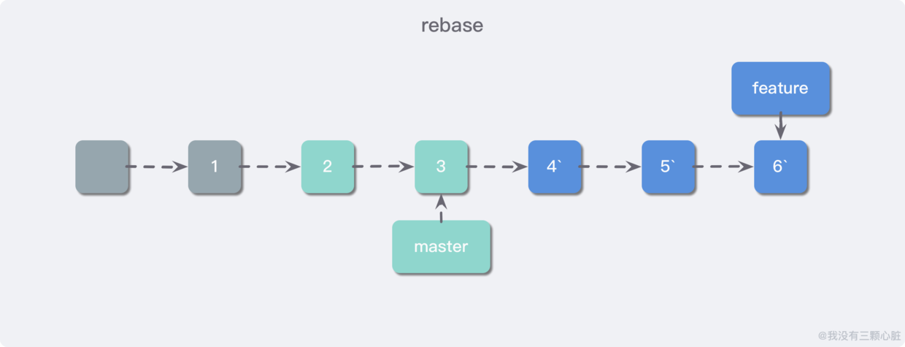
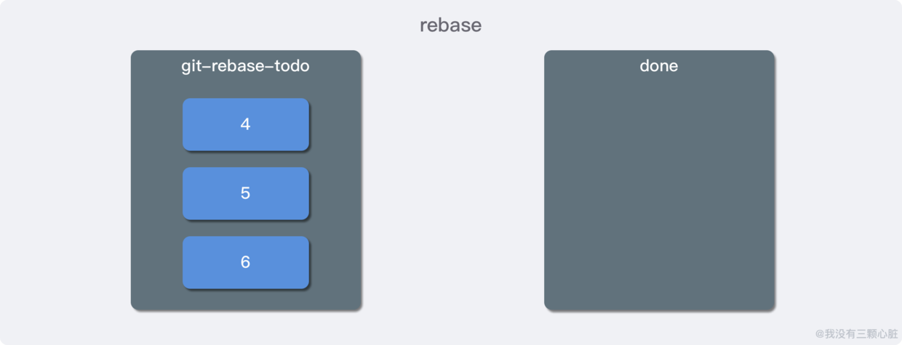
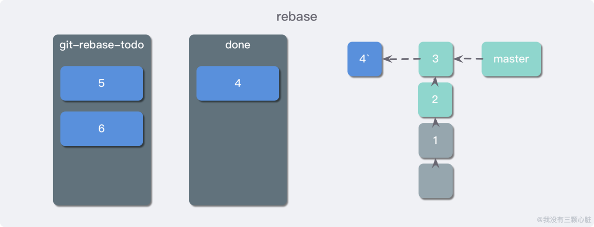
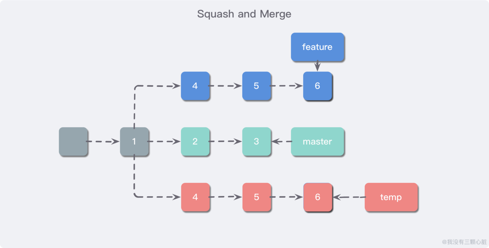
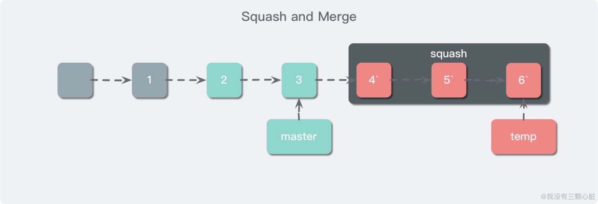
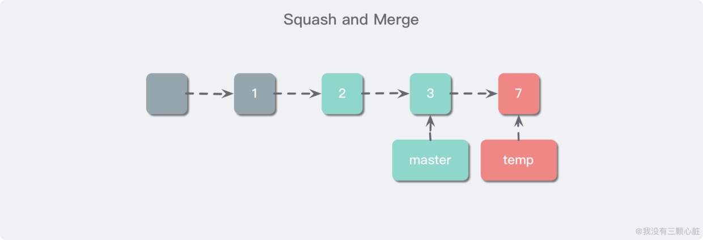
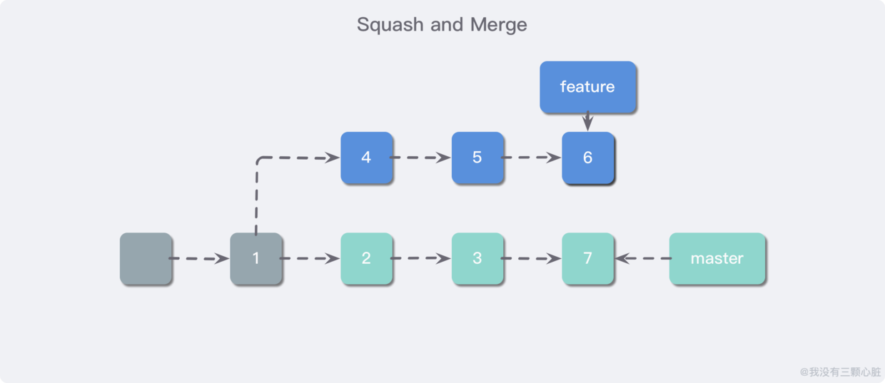

# <center>Git</center> 


> 引用：
>
> [Git详细使用教程](https://blog.csdn.net/tgbus18990140382/article/details/52886786)
>
> [Git教程](https://www.liaoxuefeng.com/wiki/896043488029600)
>
> [Git本地服务器搭建及使用方法](https://blog.csdn.net/yufeng1108/article/details/80619547)
>
> [Git原理入门解析](https://www.wmyskxz.com/2019/08/16/git-yuan-li-ru-men-jian-xi/)
>
> [使用原理视角看Git](https://coding.net/help/doc/practice/git-principle.html)
>
> 


------


>  **Git 的诞生：**
> 
> 很多人都知道，Linus 在 1991 年创建了开源的 Linux，从此，Linux 系统不断发展，已经成为最大的服务器系统软件了。
> 
> Linus 虽然创建了 Linux，但 Linux 的壮大是靠全世界热心的志愿者参与的，这么多人在世界各地为 Linux 编写代码，那 Linux 的代码是如何管理的呢？
> 
> 事实是，在 2002 年以前，世界各地的志愿者把源代码文件通过 diff 的方式发给 Linus，然后由 Linus 本人通过手工方式合并代码！
> 
> 你也许会想，为什么 Linus 不把 Linux 代码放到版本控制系统里呢？不是有 CVS、SVN 这些免费的版本控制系统吗？因为 Linus 坚定地反对 CVS 和 SVN，这些集中式的版本控制系统不但速度慢，而且必须联网才能使用。有一些商用的版本控制系统，虽然比 CVS、SVN 好用，但那是付费的，和 Linux 的开源精神不符。
> 
> 不过，到了 2002 年，Linux 系统已经发展了十年了，代码库之大让 Linus 很难继续通过手工方式管理了，社区的弟兄们也对这种方式表达了强烈不满，于是 Linus 选择了一个商业的版本控制系统 BitKeeper，BitKeeper 的东家 BitMover 公司出于人道主义精神，授权 Linux 社区免费使用这个版本控制系统。
> 
> 安定团结的大好局面在 2005 年就被打破了，原因是 Linux 社区牛人聚集，不免沾染了一些梁山好汉的江湖习气。开发 Samba 的 Andrew 试图破解 BitKeeper 的协议（这么干的其实也不只他一个），被 BitMover 公司发现了（监控工作做得不错！），于是 BitMover 公司怒了，要收回 Linux 社区的免费使用权。
> 
> Linus 可以向 BitMover 公司道个歉，保证以后严格管教弟兄们，嗯，这是不可能的。实际情况是：Linus 花了两周时间自己用 C 写了一个分布式版本控制系统，这就是 Git！一个月之内，Linux 系统的源码已经由 Git 管理了！牛是怎么定义的呢？大家可以体会一下。
> 
> Git 迅速成为最流行的分布式版本控制系统，尤其是 2008 年，GitHub 网站上线了，它为开源项目免费提供 Git 存储，无数开源项目开始迁移至 GitHub，包括 jQuery，PHP，Ruby 等等。
> 
> 历史就是这么偶然，如果不是当年 BitMover 公司威胁 Linux 社区，可能现在我们就没有免费而超级好用的 Git 了。


## Git是什么

Git是一个开源的分布式版本控制系统，用于敏捷高效地处理任何或小或大的项目。
Git是 Linus Torvalds 为了帮助管理 Linux 内核开发而开发的一个开放源码的版本控制软件。
Git与常用的版本控制工具 CVS, Subversion 等不同，它采用了分布式版本库的方式，不必服务器端软件支持。

先说集中式版本控制系统，版本库是集中存放在中央服务器的，而干活的时候，用的都是自己的电脑，所以要先从中央服务器取得最新的版本，然后开始干活，干完活了，再把自己的活推送给中央服务器。中央服务器就好比是一个图书馆，你要改一本书，必须先从图书馆借出来，然后回到家自己改，改完了，再放回图书馆。

那分布式版本控制系统与集中式版本控制系统有何不同呢？首先，**分布式版本控制系统根本没有 “中央服务器”，每个人的电脑上都是一个完整的版本库，**这样，你工作的时候，就不需要联网了，因为版本库就在你自己的电脑上。既然每个人电脑上都有一个完整的版本库，那多个人如何协作呢？比方说你在自己电脑上改了文件 A，你的同事也在他的电脑上改了文件 A，这时，你们俩之间只需把各自的修改推送给对方，就可以互相看到对方的修改了。集中式版本控制系统最大的毛病就是必须联网才能工作。


>**Git与SVN的区别**
>GIT不仅仅是个版本控制系统，它也是个内容管理系统(CMS),工作管理系统等。
>Git 与 SVN 区别点：
>
>1. GIT是分布式的，SVN不是：这是GIT和其它非分布式的版本控制系统，例如SVN，CVS等，最核心的区别。
>2. 2.GIT把内容按元数据方式存储，而SVN是按文件：所有的资源控制系统都是把文件的元信息隐藏在一个类似.svn,.cvs等的文件夹里。
>3. GIT分支和SVN的分支不同：分支在SVN中一点不特别，就是版本库中的另外的一个目录。
>4. GIT没有一个全局的版本号，而SVN有：目前为止这是跟SVN相比GIT缺少的最大的一个特征。
>5. GIT的内容完整性要优于SVN：GIT的内容存储使用的是SHA-1哈希算法。这能确保代码内容的完整性，确保在遇到磁盘故障和网络问题时降低对版本库的破坏。
>   
>
>


## Git原理


详细图文解释可参考此篇文章[使用原理视角看Git](https://coding.net/help/doc/practice/git-principle.html)，里面详细用图文解释了git的版本控制原理


git的工作流程大概如下：

1. 克隆 Git 资源作为工作目录。
2. 在克隆的资源上添加或修改文件。
3. 如果其他人修改了，你可以更新资源。
4. 在提交前查看修改。
5. 提交修改。
6. 在修改完成后，如果发现错误，可以撤回提交并再次修改并提交。


基本概念
我们先来理解下Git 工作区、暂存区和版本库概念

* 工作区：就是你项目的目录（可见目录）。

* 缓存区：英文叫stage, 或index。一般存放在”git目录”下的index文件（.git/index）中，所以我们把暂存区有时也叫作索引（index）。

* 版本库：工作区有一个隐藏目录.git，这个不算工作区，而是Git的版本库。

  

下面这个图展示了工作区、版本库中的暂存区和版本库之间的关系：


如果我们要对项目进行管理，就切换到该项目目录底下，使用`git init`命令，进行初始化

```sh
$git init
```

`git init` 命令只会做一件事，就是在项目的根目录下创建一个 `.git` 的子目录，用来保存当前项目的一些版本信息，我们可以继续使用 `tree -a` 命令查看该目录的完整结构，如下：

```sh
$tree -a
.
└── .git
    ├── HEAD                                      
    ├── branches
    ├── config
    ├── description
    ├── hooks
    │   ├── applypatch-msg.sample
    │   ├── commit-msg.sample
    │   ├── fsmonitor-watchman.sample
    │   ├── post-update.sample
    │   ├── pre-applypatch.sample
    │   ├── pre-commit.sample
    │   ├── pre-push.sample
    │   ├── pre-rebase.sample
    │   ├── pre-receive.sample
    │   ├── prepare-commit-msg.sample
    │   └── update.sample
    ├── index
    ├── info
    │   └── exclude
    ├── objects
    │   ├── .DS_Store
    │   ├── info
    │   └── pack
    └── refs
        ├── heads
        └── tags

```


### Git目录解析

#### config 目录

config 是仓库的配置文件，一个典型的配置文件如下，我们创建的远端，分支都在等信息都在配置文件里有表现；`fetch` 操作的行为也是在这里配置的：

```
[core]
    repositoryformatversion = 0
    filemode = false
    bare = false
    logallrefupdates = true
    symlinks = false
    ignorecase = true
[remote "origin"]
    url = git@github.com:yanhaijing/zepto.fullpage.git
    fetch = +refs/heads/*:refs/remotes/origin/*
[branch "master"]
    remote = origin
    merge = refs/heads/master
[branch "dev"]
    remote = origin
    merge = refs/heads/dev

```

#### objects 目录

Git 可以通过一种算法可以得到任意文件的 **“指纹”**（40 位 16 进制数字），然后通过文件指纹存取数据，存取的数据都位于 objects 目录。

例如我们可以手动创建一个测试文本文件并使用 `git add .` 命令来观察 `.git` 文件夹出现的变化：

```sh
$ touch test.txt
$ git add .
```

`git add .` 命令就是用于把当前新增的变化添加进 Git 本地仓库的，在我们使用后，我们惊奇的发现 `.git` 目录下的 `objects/` 目录下多了一个目录：

```sh
$ tree -a
.
├── .git
│   ├── HEAD
│   ├── branches
│   ├── config
│   ├── description
│   ├── hooks
│   │   ├── 节省篇幅..省略..
│   ├── index
│   ├── info
│   │   └── exclude
│   ├── objects
│   │   ├── .DS_Store
│   │   ├── e6
│   │   │   └── 9de29bb2d1d6434b8b29ae775ad8c2e48c5391
│   │   ├── info
│   │   └── pack
│   └── refs
│       ├── heads
│       └── tags
└── test.txt

```

我们可以使用 `git hash-object test.txt` 命令来看看刚才我们创建的 `test.txt` 的 “文件指纹”：

```sh
$ git hash-object test.txt
e69de29bb2d1d6434b8b29ae775ad8c2e48c5391
```

这时候我们可以发现，新创建的目录 `e6` 其实是该文件哈希值的前两位，这其实是 Git 做的一层类似于索引一样的东西，并且默认采用 16 进制的两位数来当索引，是非常合适的。

这边其实引入了Sha-1算法

SHA-1将文件中的内容通过通过计算生成一个 40 位长度的hash值。

Sha-1的非常有特点：

- 由文件内容计算出的hash值
- hash值相同，文件内容相同

对于添加的内容，无论我们执行多少次，都会得到相同的结果。因此，文件的sha-1值是可以作为文件的唯一 id 。同时，它还有一个额外的功能，校验文件完整性。

**objects 目录下有 3 种类型的数据：**

- Blob；
- Tree;
- Commit；

文件都被存储为 blob 类型的文件，文件夹被存储为 tree 类型的文件，创建的提交节点被存储为 Commit 类型的数据；

一般我们系统中的目录(tree)，在 Git 会像下面这样存储：


而 Commit 类型的数据则整合了 tree 和 blob 类型，保存了当前的所有变化，例如我们可以再在刚才的目录下新建一个目录，并添加一些文件试试：

```sh
$ mkdir test
$ touch test/test.file
$ tree -a
.
├── .git
│   ├── HEAD
│   ├── branches
│   ├── config
│   ├── description
│   ├── hooks
│   │   ├── 节省篇幅..省略..
│   ├── index
│   ├── info
│   │   └── exclude
│   ├── objects
│   │   ├── .DS_Store
│   │   ├── e6
│   │   │   └── 9de29bb2d1d6434b8b29ae775ad8c2e48c5391
│   │   ├── info
│   │   └── pack
│   └── refs
│       ├── heads
│       └── tags
├── test
│   └── test.file
└── test.txt

```


提交完Commit在观察变化


```sh
$ git commit -a -m "test: 新增测试文件夹和测试文件观察.git文件的变化"
[master (root-commit) 30d51b1] test: 新增测试文件夹和测试文件观察.git文件的变化
 1 file changed, 0 insertions(+), 0 deletions(-)
 create mode 100644 test.txt
$ tree -a
.
├── .git
│   ├── COMMIT_EDITMSG
│   ├── HEAD
│   ├── branches
│   ├── config
│   ├── description
│   ├── hooks
│   │   ├── ...省略...
│   ├── index
│   ├── info
│   │   └── exclude
│   ├── logs
│   │   ├── HEAD
│   │   └── refs
│   │       └── heads
│   │           └── master
│   ├── objects
│   │   ├── .DS_Store
│   │   ├── 30
│   │   │   └── d51b1edd2efd551dd6bd52d4520487b5708c0e
│   │   ├── 5e
│   │   │   └── fb9bc29c482e023e40e0a2b3b7e49cec842034
│   │   ├── e6
│   │   │   └── 9de29bb2d1d6434b8b29ae775ad8c2e48c5391
│   │   ├── info
│   │   └── pack
│   └── refs
│       ├── heads
│       │   └── master
│       └── tags
├── test
│   └── test.file
└── test.txt

```

首先我们可以观察到我们提交了一个 Commit 的时候在第一句话里面返回了一个短的像是哈希值一样的东西： `[master (root-commit) 30d51b1]` 中 的 `30d51b1`，对应的我们也可以在 objects 找到刚才 commit 的对象，我们可以使用 `git cat-file -p` 命令输出一下当前文件的内容：

```sh
$ git cat-file -p 30d5
tree 5efb9bc29c482e023e40e0a2b3b7e49cec842034
author 我没有三颗心脏  1565742122 +0800
committer 我没有三颗心脏  1565742122 +0800

test: 新增测试文件夹和测试文件观察.git文件的变化

```

我们发现这里面有提交的内容信息、作者信息、提交者信息以及 commit message，当然我们可以进一步看到提交的内容具体有哪些：

```sh
$ git cat-file -p 5efb
100644 blob e69de29bb2d1d6434b8b29ae775ad8c2e48c5391    test.txt
```

我们再试着提交一个 commit 来观察变化:

```sh
$ touch test/test2.file
$  git commit -a -m "test: 新增加一个 commit 以观察变化."
[master 9dfabac] test: 新增加一个 commit 以观察变化.
 2 files changed, 0 insertions(+), 0 deletions(-)
 create mode 100644 test/test.file
 create mode 100644 test/test2.file
$ git cat-file -p 9dfabac
tree c562bfb9441352f4c218b0028148289f1ea7d7cd
parent 30d51b1edd2efd551dd6bd52d4520487b5708c0e
author 龙滔  1565878699 +0800
committer 龙滔  1565878699 +0800

test: 新增加一个 commit 以观察变化.

```

可以观察到这一次的 commit 多了一个 parent 的行，其中的 **“指纹”** 和上一次的 commit 一模一样，当我们提交两个 commit 之后我们的 Git 仓库可以简化为下图：


- 说明：其中因为我们 test 文件夹新增了文件，也就是出现了变化，所以就被标识成了新的 tree 类型的对象；

#### refs 目录

refs 目录存储都是引用文件，如本地分支，远端分支，标签等

- refs/heads/xxx 本地分支
- refs/remotes/origin/xxx 远端分支
- refs/tags/xxx 本地tag

引用文件的内容都是 40 位长度的 commit

```sh
$ cat .git/refs/heads/master
9dfabac68470a588a4b4a78742249df46438874a
```


这就像是一个指针一样，它指向了你的最后一次提交（例如这里就指向了第二次提交的 commit），我们补充上分支信息，现在的 Git 仓库就会像下图所示：


#### HEAD 目录

HEAD 目录下存储的是当前所在的位置，其内容是分支的名称：

```sh
$ cat HEAD
ref: refs/heads/master
```


我们再补充上 HEAD 的信息，现在的 Git 仓库如下图所示：


### git的冲突处理


以下主要参考以下两篇文章

> [git冲突处理图解](https://www.wmyskxz.com/2019/08/16/git-yuan-li-ru-men-jian-xi/#toc-heading-11)
>
> [使用原理视角看 Git](https://coding.net/help/doc/practice/git-principle.html)
>
> 


讲完git的目录结构，我们可知道分支在git中仅是一个指针，但是在分布式工作中，无可避免的会遇见冲突（分支的合并）


图上的情况，并不是移动分支指针就能够解决问题的，它需要一种合并策略。首先我们需要明确的是谁与谁的合并，是 2，3 与 4， 5， 6 两条线的合并吗？其实并不是的，**真实合并的其实只有 3 和 6，因为每一次的提交都包含了项目完整的快照，即合并只是 tree 与 tree 的合并。**

这可能说起来有点绕，我们可以先来想一个简单的算法，用来比较 3 和 6 的不同。如果我们只是单纯的比较 3 和 6 的信息，其实并没有意义，因为它们之间并不能确切的表达出当前的冲突状态。因此我们需要选取它们两个分支的分歧点（merge base）作为参考点，进行比较。

首先我们把 1 作为基础，然后把 1、3、6 中所有的文件做一个列表，然后依次遍历这个列表中的文件。我们现在拿列表中的一个文件进行举例，把在提交在 1、3、6 中的该文件分别称为版本1、版本3、版本6，可能出现如下几种情况：

**1. 版本 1、版本 3、版本 6 的 “指纹” 值都相同：**这种情况则说明没有冲突；
**2. 版本 3 or 版本 6 至少有一个与版本 1 状态相同（指的是指纹值相同或都不存在）：**这种情况可以自动合并，比如版本 1 中存在一个文件，在版本 3 中没有对该文件进行修改，而版本 6 中删除了这个文件，则以版本 6 为准就可以了；
**3. 版本 3 or 版本 6 都与版本 1 的状态不同：**这种情况复杂一些，自动合并策略很难生效了，所以需要手动解决；


#### merge 操作

在解决完冲突后，我们可以将修改的内容提交为一个新的提交，这就是 merge。





可以看到 merge 是一种不修改分支历史提交记录的方式，这也是我们常用的方式。但是这种方式在某些情况下使用起来不太方便，比如我们创建了一些提交发送给管理者，管理者在合并操作中产生了冲突，还需要去解决冲突，这无疑增加了他人的负担。

而我们使用 rebase 可以解决这种问题。

#### rebase 操作

假设我们的分支结构如下：


rebase 会把从 Merge Base 以来的所有提交，以补丁的形式一个一个重新打到目标分支上。这使得目标分支合并该分支的时候会直接 **Fast Forward**（可以简单理解为直接后移指针），即不会产生任何冲突。提交历史是一条线，这对强迫症患者可谓是一大福音。





其实 rebase 主要是在 .git/rebase-merge 下生成了两个文件，分别为 git-rebase-todo 和 done 文件，这两个文件的作用光看名字就大概能够看得出来。git-rebase-todo 中存放了 rebase 将要操作的 commit，而 done 存放正操作或已操作完毕的 commit，比如我们这里，git-rebase-todo 存放了 4、5、6 三个提交。





首先 Git 会把 4 这个 commit 放入 done，表示正在操作 4，然后将 4 以补丁的方式打到 3 上，形成了新的 4`，这一步是可能产生冲突的，如果有冲突，需要解决冲突之后才能继续操作。





接着按同样的方式把 5、6 都放入 done，最后把指针移动到最新的提交 6 上，就完成了 rebase 的操作。

**从刚才的图中，我们就可以看到 rebase 的一个缺点，那就是修改了分支的历史提交。**如果已经将分支推送到了远程仓库，会导致无法将修改后的分支推送上去，必须使用 -f 参数（force）强行推送。

**所以使用 rebase 最好不要在公共分支上进行操作。**

#### Squash and Merge 操作

简单说就是压缩提交，把多次的提交融合到一个 commit 中，这样的好处不言而喻，我们着重来讨论一下实现的技术细节，还是以我们上面最开始的分支情况为例，首先，Git 会创建一个临时分支，指向当前 feature 的最新 commit。





然后按照上面 rebase 的方式，变基到 master 的最新 commit 处。





接着用 rebase 来 squash 之，压缩这些提交为一个提交。





最后以 fast forward 的方式合并到 master 中。





可见此时 master 分支多且只多了一个描述了这次改动的提交，这对于大型工程，保持主分支的简洁易懂有很大的帮助。


## git基本操作


### git配置

Git 提供了一个叫做 git config 的工具，专门用来配置或读取相应的工作环境变量。
这些环境变量，决定了 Git 在各个环节的具体工作方式和行为。这些变量可以存放在以下三个不同的地方：

>/etc/gitconfig 文件：系统中对所有用户都普遍适用的配置。若使用 git config 时用 –system 选项，读写的就是这个文件。
>~/.gitconfig 文件：用户目录下的配置文件只适用于该用户。若使用 git config 时用 –global 选项，读写的就是这个文件。
>当前项目的 Git 目录中的配置文件（也就是工作目录中的 .git/config 文件）：这里的配置仅仅针对当前项目有效。每一个级别的配置都会覆盖上层的相同配置，所以 .git/config 里的配置会覆盖 /etc/gitconfig 中的同名变量。
>
>在 Windows 系统上，Git 会找寻用户主目录下的 .gitconfig 文件。主目录即 $HOME 变量指定的目录，一般都是 C:\Documents and Settings\$USER。
>
>此外，Git 还会尝试找寻 /etc/gitconfig 文件，只不过看当初 Git 装在什么目录，就以此作为根目录来定位。
>
>
>


#### 1.用户信息	`git config user`

在使用git提交前，一定要配置提交者个人的用户名称和电子邮件

```sh
$ git config --global user.name "wyndam"
$ git config --global user.email "only.night@qq.com"
```

如果用了*`--global`*选项，那么更改的配置文件就是位于你用户主目录下的那个，以后你所有的项目都会默认使用这里配置的用户信息。
如果要在某个特定的项目中使用其他名字或者电邮，只要去掉*–global*选项重新配置即可，新的设定保存在当前项目的 .git/config 文件里。


#### 2.文本编辑器

设置Git默认使用的文本编辑器, 一般可能会是 Vi 或者 Vim。如果你有其他偏好，比如 Emacs 的话，可以重新设置：

```sh
$ git config --global core.editor emacs
```


#### 3.差异分析工具

还有一个比较常用的是，在解决合并冲突时使用哪种差异分析工具。比如要改用 vimdiff 的话：

```sh
$ git config --global merge.tool vimdiff
```

Git 可以理解 kdiff3，tkdiff，meld，xxdiff，emerge，vimdiff，gvimdiff，ecmerge，和 opendiff 等合并工具的输出信息。
当然，你也可以指定使用自己开发的工具。


#### 4.查看配置信息	`git config --list`

要检查已有的配置信息，可以使用 git config –list 命令：

```sh
$ git config --list

core.symlinks=false
core.autocrlf=true
color.diff=auto
color.status=auto
color.branch=auto
color.interactive=true
pack.packsizelimit=2g
help.format=html
http.sslcainfo=E:/Platform/Git/mingw32/ssl/certs/ca-bundle.crt
diff.astextplain.textconv=astextplain
rebase.autosquash=true
filter.lfs.clean=git-lfs clean %f
filter.lfs.smudge=git-lfs smudge %f
filter.lfs.required=true
user.name=Wyndam
user.email=only.night@qq.com
core.editor=subl

```


有时候会看到重复的变量名，那就说明它们来自不同的配置文件（比如 /etc/gitconfig 和 ~/.gitconfig），不过最终 Git 实际采用的是最后一个。
这些配置我们也可以在 ~/.gitconfig 或 /etc/gitconfig 看到，如下所示：


```
[filter "lfs"]
    clean = git-lfs clean %f
    smudge = git-lfs smudge %f
    required = true
[user]
    name = Wyndam
    email = only.night@qq.com
[core]
    editor = subl

```

也可以直接查阅某个环境变量的设定，只要把特定的名字跟在后面即可，像这样：

```sh
$ git config user.email

magic@outlook.com
```


### 新建git本地仓库


Git 使用 git init 命令来初始化一个 Git 仓库，Git 的很多命令都需要在 Git 的仓库中运行，所以 git init 是使用 Git 的第一个命令。
在执行完成 git init 命令后，Git 仓库会生成一个 .git 目录，该目录包含了资源的所有元数据，其他的项目目录保持不变（不像 SVN 会在每个子目录生成 .svn 目录，Git 只在仓库的根目录生成 .git 目录）。

在工作目录下使用命令`git init`

```sh
$git init (path)
```

若没有指定path，则默认当前目录下建立git仓库。

初始化后，会在工作目录下会出现一个名为 .git 的目录，所有 Git 需要的数据和资源都存放在这个目录中。
如果当前目录下有几个文件想要纳入版本控制，需要先用 git add 命令告诉 Git 开始对这些文件进行跟踪，然后提交：

```sh
$ git add . (path|file)
$ git commit -m "inital commit"
```

以上命令就是把文件/文件夹提交至仓库中，若是远程仓库，还需要命令`git	push`


### 复制远程仓库 git clone

我们使用 git clone 从现有 Git 仓库中拷贝项目（类似 svn checkout）。
克隆仓库的命令格式为:

```sh
$ git clone <repo|url> (<directory>)
```


参数说明：

\<repo|url>：为Git仓库的地址url

\<directory>：为将git储存至目标目录，若为空，则默认本地目录


Git支持ssh，git，http和https协议（此外，可以使用ftp和ftps进行获取，但这效率低下且不建议使用；请勿使用它）。

- ssh://[user@]host.xz[:port]/path/to/repo.git/
- git://host.xz[:port]/path/to/repo.git/
- http[s]://host.xz[:port]/path/to/repo.git/
- ftp[s]://host.xz[:port]/path/to/repo.git/

也可以用类似scp的语法进行clone（实际上是ssh协议）

- [user@]host.xz:path/to/repo.git/


### 查看状态`git	status `

git status 以查看在你上次提交之后是否有修改。
我演示该命令的时候加了 -s 参数，以获得简短的结果输出。如果没加该参数会详细输出内容：

```sh
$ git status
On branch master

Initial commit

Changes to be committed:
  (use "git rm --cached <file>..." to unstage)

        new file:   README.md

```


### 从缓存中移除文件 git reset HEAD

git reset HEAD 命令用于取消已缓存的内容。
我们先改动文件 README 文件，内容如下：

```markdown
#README.md

##This is readme markdown file
```

HelloWorld.java 文件修改为：

```java
public class HelloWorld {
    public static void main(String[] args) {
        System.out.println("Hello World!");
    }
}
```

现在两个文件修改后，都提交到了缓存区，我们现在要取消其中一个的缓存，操作如下：

```sh
$ git status -s
 M HelloWorld.java
 M README.md
$ git add .
$ git status -s
M  HelloWorld.java
M  README.md
$ git reset HEAD -- HelloWorld.java
Unstaged changes after reset:
M       HelloWorld.java
$ git status -s
 M HelloWorld.java
M  README.md

```

现在执行 git commit，只会将 README.md 文件的改动提交，而 HelloWorld.java 是没有的。

```sh
$ git commit -m "change"
[master ad5f6fe] change
 1 file changed, 1 insertion(+), 1 deletion(-)
$ git status -s
 M HelloWorld.java
```


可以看到 HelloWorld.java 文件的修改并为提交。
这时我们可以使用以下命令将 HelloWorld.java 的修改提交：

```sh
$ git commit -am "修改 HelloWorld.java 文件"
[master a055c08] 修改 HelloWorld.java 文件
 1 file changed, 1 insertion(+), 1 deletion(-)
$ git status
On branch master
nothing to commit, working directory clean

```

简而言之，执行 git reset HEAD 以取消之前 git add 添加，但不希望包含在下一提交快照中的缓存。


### 从缓存以及工作目录删除文件 git rm

git rm 会将条目从缓存区中移除。这与 git reset HEAD 将条目取消缓存是有区别的。 “取消缓存”的意思就是将缓存区恢复为我们做出修改之前的样子。
默认情况下，git rm file 会将文件从缓存区和你的硬盘中（工作目录）删除。
如果你要在工作目录中留着该文件，可以使用 git rm –cached：
如我们删除 hello.java文件：(包括在本地目录下的文件，可能需要选项**-f**)

```sh
$ git rm HelloWorld.java
rm 'HelloWorld.java'
$ ls
README.md
```

不从工作区中删除文件：

```sh
$ git rm README.md --cached
rm 'README.md'
$ ls
README.md
```


### 修改缓存中文件名 git mv

git mv 命令做得所有事情就是 git rm –cached 命令的操作， 重命名磁盘上的文件，然后再执行 git add 把新文件添加到缓存区。
我们先把刚移除的 README 添加回来：

```sh
$ git add README.md
$ git mv README.md README
$ ls
README
```


------


### Git分支管理


几乎每一种版本控制系统都以某种形式支持分支。使用分支意味着你可以从开发主线上分离开来，然后在不影响主线的同时继续工作。
有人把 Git 的分支模型称为”必杀技特性”，而正是因为它，将 Git 从版本控制系统家族里区分出来。
创建分支命令：

```sh

#创建分支
$ git branch [branch name]
#切换分支
$ git checkout [branch name]
#创建并切换分支
$ git checkout -b [branch name]
#合并分支
$ git merge
#删除分支
$ git branch -d [branch name]

```


### Git分支管理


```sh

#列出问题
$ git branch
#无参数时，该命令会列出本地分支
$ git branch
* master
#创建分支
$ git branch testbranch
$ git branch
*	branch
	testbranch
$ git branch testing
$ git branch -D testing
Deleted branch testing (was 84b13b9).
#合并分支,将分支[branch name] 合并到当前分支
$ git merge [branch name]
$ git merge test
Updating b04e1bb..d3c2604
Fast-forward
 testB | 0
 1 file changed, 0 insertions(+), 0 deletions(-)
 create mode 100644 testB


```


### Git 查看提交历史	`git log`

```sh
$ git log
commit d3c26045edb80258c9b785f5cd70cff6c7130003 (HEAD -> master, origin/test, test)
Author: Magic <xxx@qq.com>
Date:   Sat Sep 28 23:41:42 2019 +0800

    ff

commit b04e1bba77e04dde1e5649aaf32ef7029a1dbd5f (origin/master)
Author: Magic <xxx@qq.com>
Date:   Sat Sep 28 23:40:34 2019 +0800

    fuck


#可以用 --oneline 选项来查看历史记录的简洁的版本
$ git log --oneline
d3c2604 (HEAD -> master, origin/test, test) ff
b04e1bb (origin/master) fuck


#可以用 --graph 选项，查看历史中什么时候出现了分支、合并。以下为相同的命令，开启了拓扑图选项：
$  git log --graph
* commit d3c26045edb80258c9b785f5cd70cff6c7130003 (HEAD -> master, origin/test, test)
| Author: Magic-King <xxx@qq.com>
| Date:   Sat Sep 28 23:41:42 2019 +0800
|
|     ff
|
* commit b04e1bba77e04dde1e5649aaf32ef7029a1dbd5f (origin/master)
  Author: Magic-King <xxx@qq.com>
  Date:   Sat Sep 28 23:40:34 2019 +0800

      fuck
      
#可以用 ‘--reverse’参数来逆向显示所有日志
$ git log --reverse
commit b04e1bba77e04dde1e5649aaf32ef7029a1dbd5f (origin/master)
Author: Magic-King <xxx@qq.com>
Date:   Sat Sep 28 23:40:34 2019 +0800

    fuck

commit d3c26045edb80258c9b785f5cd70cff6c7130003 (HEAD -> master, origin/test, test)
Author: Magic-King <xxx@qq.com>
Date:   Sat Sep 28 23:41:42 2019 +0800

    ff

```


### Git 标签  `git tag`

如果达到一个重要的阶段，并希望永远记住那个特别的提交快照，可以使用 git tag 给它打上标签。
比如说，我们想为我们的项目发布一个”1.0”版本。 可以用 git tag -a v1.0 命令给最新一次提交打上（HEAD）”v1.0”的标签。
-a 选项意为”创建一个带注解的标签”。 不用 -a 选项也可以执行的，但它不会记录这标签是啥时候打的，谁打的，也不会让你添加个标签的注解。 我推荐一直创建带注解的标签。

```sh
$ git log --oneline --graph --decorate
*   2b5970d (HEAD -> master, tag: v1.0) Merge branch 'change_site'
|\
| * d17a0a0 (change_site) change the site
* | e2714c9 新增加一行
|/
* 202199d (newtest) add test.txt file
* a055c08 修改 HelloWorld.java 文件
* ad5f6fe 修改
* c2c167c 修改HelloWorld.java文件
* f9393bf third commit ``
* 316fafc second commit
* fdd5c53 inital commit

```


如果我们忘了给某个提交打标签，又将它发布了，我们可以给它追加标签。
例如，假设我们发布了提交 85fc7e7(上面实例最后一行)，但是那时候忘了给它打标签。 我们现在也可以：

```sh
$ git tag -a v0.9 a055c08
$ git log --oneline --graph --decorate
*   2b5970d (HEAD -> master, tag: v1.0) Merge branch 'change_site'
|\
| * d17a0a0 (change_site) change the site
* | e2714c9 新增加一行
|/
* 202199d (newtest) add test.txt file
* a055c08 (tag: v0.9) 修改 HelloWorld.java 文件
* ad5f6fe 修改
* c2c167c 修改HelloWorld.java文件
* f9393bf third commit ``
* 316fafc second commit
* fdd5c53 inital commit

```


如果要查看所有标签可以使用以下命令：

```sh
$ git tag
```

指定标签信息命令：

```bash
git tag -a <tagname> -m "标签"
```

PGP签名标签命令：

```bash
git tag -s <tagname> -m "标签"
```


### Git 远程仓库的操作


#### 查看当前远程库

```sh
$ git remote
origin
$ git remote -v
origin  git@xx.xx.xxx.xxx:/test.git (fetch)
origin  git@xx.xx.xxx.xxx:/test.git (push)
```


#### 提取远程库

```sh
$ git pull
```

该命令就是在执行 git fetch 之后紧接着执行 git merge 远程分支到你所在的任意分支。
假设你配置好了一个远程仓库，并且你想要提取更新的数据，你可以首先执行 git fetch [alias] 告诉 Git 去获取它有你没有的数据，然后你可以执行 git merge [alias]/[branch] 以将服务器上的任何更新（假设有人这时候推送到服务器了）合并到你的当前分支。

接下来我们在 Github 上点击”test.txt” 并在线修改它。之后我们在本地更新修改。


```sh
$ git fetch origin
remote: Counting objects: 3, done.
remote: Compressing objects: 100% (3/3), done.
remote: Total 3 (delta 0), reused 0 (delta 0), pack-reused 0
Unpacking objects: 100% (3/3), done.
From github.com:onlynight/GitAdd
   774112b..37be49b  master     -> origin/master
$ git merge origin/master
Updating 774112b..37be49b
Fast-forward
 test.txt | 1 +
 1 file changed, 1 insertion(+)

```


#### 推送远程库

推送你的新分支与数据到某个远端仓库命令

```sh
#该命令将你的 [branch] 分支推送成为 [alias] 远程仓库上的 [branch] 分支
$ git push [alias] [branch]

$ git push origin master
Everything up-to-date
```


#### 删除远程分支

注意：如果要*删除远程分支*同样也是使用push命令，在分支前加上”:”表示*删除远程分支*，代码如下

```sh
$ git push origin :<branch name>
```


#### 删除本地仓库的远程仓库链接

删除远程仓库你可以使用命令

```sh
git remote rm [alias]

$ git remote -v
origin  git@github.com:onlynight/GitAdd.git (fetch)
origin  git@github.com:onlynight/GitAdd.git (push)
$ git remote -v
origin  git@github.com:onlynight/GitAdd.git (fetch)
origin  git@github.com:onlynight/GitAdd.git (push)
origin2 git@github.com:onlnynight/GitAdd.git (fetch)
origin2 git@github.com:onlnynight/GitAdd.git (push)
$ git remote rm origin2
$ git remote -v
origin  git@github.com:onlynight/GitAdd.git (fetch)
origin  git@github.com:onlynight/GitAdd.git (push)


```


### 忽略特殊文件

有些时候，你必须把某些文件放到Git工作目录中，但又不能提交它们，比如保存了数据库密码的配置文件啦，等等，每次`git status`都会显示`Untracked files ...`，有强迫症的童鞋心里肯定不爽。

好在Git考虑到了大家的感受，这个问题解决起来也很简单，在Git工作区的根目录下创建一个特殊的`.gitignore`文件，然后把要忽略的文件名填进去，Git就会自动忽略这些文件。

不需要从头写`.gitignore`文件，GitHub已经为我们准备了各种配置文件，只需要组合一下就可以使用了。所有配置文件可以直接在线浏览：https://github.com/github/gitignore

忽略文件的原则是：

1. 忽略操作系统自动生成的文件，比如缩略图等；
2. 忽略编译生成的中间文件、可执行文件等，也就是如果一个文件是通过另一个文件自动生成的，那自动生成的文件就没必要放进版本库，比如Java编译产生的`.class`文件；
3. 忽略你自己的带有敏感信息的配置文件，比如存放口令的配置文件。

举个例子：

假设你在Windows下进行Python开发，Windows会自动在有图片的目录下生成隐藏的缩略图文件，如果有自定义目录，目录下就会有`Desktop.ini`文件，因此你需要忽略Windows自动生成的垃圾文件：

```sh
# Windows:
Thumbs.db
ehthumbs.db
Desktop.ini
# Python:
*.py[cod]
*.so
*.egg
*.egg-info
dist
build
# My configurations:
db.ini
deploy_key_rsa
```


最后一步就是把`.gitignore`也提交到Git，就完成了！当然检验`.gitignore`的标准是`git status`命令是不是说`working directory clean`。

使用Windows的童鞋注意了，如果你在资源管理器里新建一个`.gitignore`文件，它会非常弱智地提示你必须输入文件名，但是在文本编辑器里“保存”或者“另存为”就可以把文件保存为`.gitignore`了。

有些时候，你想添加一个文件到Git，但发现添加不了，原因是这个文件被`.gitignore`忽略了：

```sjh
$ git add App.class
The following paths are ignored by one of your .gitignore files:
App.class
Use -f if you really want to add them.
```

如果你确实想添加该文件，可以用`-f`强制添加到Git：

```
$ git add -f App.class
```

或者你发现，可能是`.gitignore`写得有问题，需要找出来到底哪个规则写错了，可以用`git check-ignore`命令检查：

```
$ git check-ignore -v App.class
.gitignore:3:*.class	App.class
```

Git会告诉我们，`.gitignore`的第3行规则忽略了该文件，于是我们就可以知道应该修订哪个规则。


* 后续：搭建git服务器


