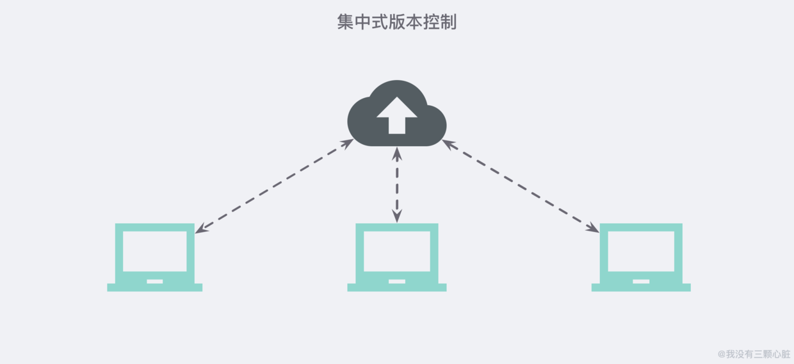
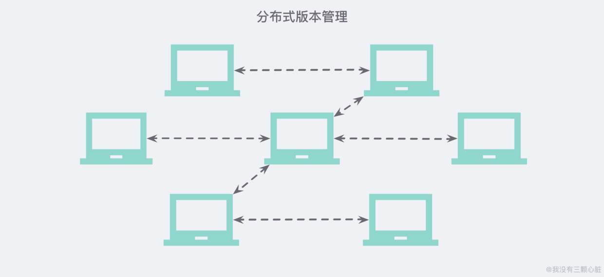
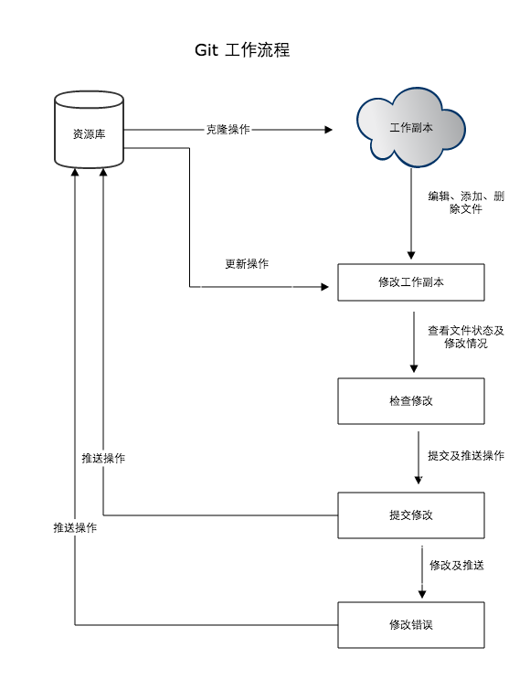
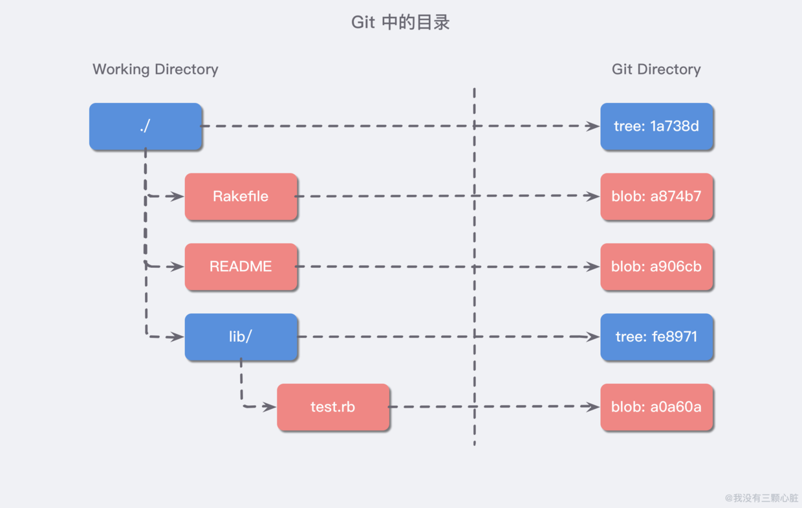
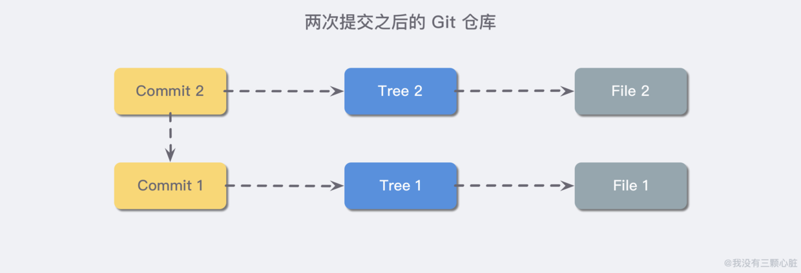
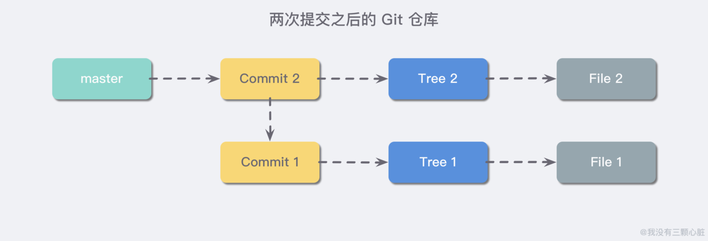
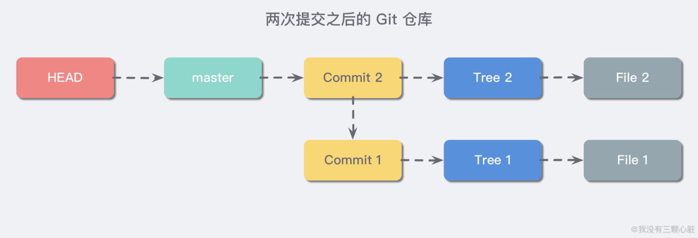

# <center>Git</center> 


> 引用：
>
> [Git详细使用教程](https://blog.csdn.net/tgbus18990140382/article/details/52886786)
>
> [Git教程](https://www.liaoxuefeng.com/wiki/896043488029600)
>
> [Git本地服务器搭建及使用方法](https://blog.csdn.net/yufeng1108/article/details/80619547)
>
> [Git原理入门解析](https://www.wmyskxz.com/2019/08/16/git-yuan-li-ru-men-jian-xi/)
>
> [使用原理视角看Git](https://coding.net/help/doc/practice/git-principle.html)
>
> 


------


>  **Git 的诞生：**
> 
> 很多人都知道，Linus 在 1991 年创建了开源的 Linux，从此，Linux 系统不断发展，已经成为最大的服务器系统软件了。
> 
> Linus 虽然创建了 Linux，但 Linux 的壮大是靠全世界热心的志愿者参与的，这么多人在世界各地为 Linux 编写代码，那 Linux 的代码是如何管理的呢？
> 
> 事实是，在 2002 年以前，世界各地的志愿者把源代码文件通过 diff 的方式发给 Linus，然后由 Linus 本人通过手工方式合并代码！
> 
> 你也许会想，为什么 Linus 不把 Linux 代码放到版本控制系统里呢？不是有 CVS、SVN 这些免费的版本控制系统吗？因为 Linus 坚定地反对 CVS 和 SVN，这些集中式的版本控制系统不但速度慢，而且必须联网才能使用。有一些商用的版本控制系统，虽然比 CVS、SVN 好用，但那是付费的，和 Linux 的开源精神不符。
> 
> 不过，到了 2002 年，Linux 系统已经发展了十年了，代码库之大让 Linus 很难继续通过手工方式管理了，社区的弟兄们也对这种方式表达了强烈不满，于是 Linus 选择了一个商业的版本控制系统 BitKeeper，BitKeeper 的东家 BitMover 公司出于人道主义精神，授权 Linux 社区免费使用这个版本控制系统。
> 
> 安定团结的大好局面在 2005 年就被打破了，原因是 Linux 社区牛人聚集，不免沾染了一些梁山好汉的江湖习气。开发 Samba 的 Andrew 试图破解 BitKeeper 的协议（这么干的其实也不只他一个），被 BitMover 公司发现了（监控工作做得不错！），于是 BitMover 公司怒了，要收回 Linux 社区的免费使用权。
> 
> Linus 可以向 BitMover 公司道个歉，保证以后严格管教弟兄们，嗯，这是不可能的。实际情况是：Linus 花了两周时间自己用 C 写了一个分布式版本控制系统，这就是 Git！一个月之内，Linux 系统的源码已经由 Git 管理了！牛是怎么定义的呢？大家可以体会一下。
> 
> Git 迅速成为最流行的分布式版本控制系统，尤其是 2008 年，GitHub 网站上线了，它为开源项目免费提供 Git 存储，无数开源项目开始迁移至 GitHub，包括 jQuery，PHP，Ruby 等等。
> 
> 历史就是这么偶然，如果不是当年 BitMover 公司威胁 Linux 社区，可能现在我们就没有免费而超级好用的 Git 了。


## Git是什么

Git是一个开源的分布式版本控制系统，用于敏捷高效地处理任何或小或大的项目。
Git是 Linus Torvalds 为了帮助管理 Linux 内核开发而开发的一个开放源码的版本控制软件。
Git与常用的版本控制工具 CVS, Subversion 等不同，它采用了分布式版本库的方式，不必服务器端软件支持。

先说集中式版本控制系统，版本库是集中存放在中央服务器的，而干活的时候，用的都是自己的电脑，所以要先从中央服务器取得最新的版本，然后开始干活，干完活了，再把自己的活推送给中央服务器。中央服务器就好比是一个图书馆，你要改一本书，必须先从图书馆借出来，然后回到家自己改，改完了，再放回图书馆。

那分布式版本控制系统与集中式版本控制系统有何不同呢？首先，**分布式版本控制系统根本没有 “中央服务器”，每个人的电脑上都是一个完整的版本库，**这样，你工作的时候，就不需要联网了，因为版本库就在你自己的电脑上。既然每个人电脑上都有一个完整的版本库，那多个人如何协作呢？比方说你在自己电脑上改了文件 A，你的同事也在他的电脑上改了文件 A，这时，你们俩之间只需把各自的修改推送给对方，就可以互相看到对方的修改了。集中式版本控制系统最大的毛病就是必须联网才能工作。








>**Git与SVN的区别**
>GIT不仅仅是个版本控制系统，它也是个内容管理系统(CMS),工作管理系统等。
>Git 与 SVN 区别点：
>
>1. GIT是分布式的，SVN不是：这是GIT和其它非分布式的版本控制系统，例如SVN，CVS等，最核心的区别。
>2. 2.GIT把内容按元数据方式存储，而SVN是按文件：所有的资源控制系统都是把文件的元信息隐藏在一个类似.svn,.cvs等的文件夹里。
>3. GIT分支和SVN的分支不同：分支在SVN中一点不特别，就是版本库中的另外的一个目录。
>4. GIT没有一个全局的版本号，而SVN有：目前为止这是跟SVN相比GIT缺少的最大的一个特征。
>5. GIT的内容完整性要优于SVN：GIT的内容存储使用的是SHA-1哈希算法。这能确保代码内容的完整性，确保在遇到磁盘故障和网络问题时降低对版本库的破坏。
>   
>
>


## Git原理


详细图文解释可参考此篇文章[使用原理视角看Git](https://coding.net/help/doc/practice/git-principle.html)，里面详细用图文解释了git的版本控制原理


git的工作流程大概如下：

1. 克隆 Git 资源作为工作目录。
2. 在克隆的资源上添加或修改文件。
3. 如果其他人修改了，你可以更新资源。
4. 在提交前查看修改。
5. 提交修改。
6. 在修改完成后，如果发现错误，可以撤回提交并再次修改并提交。




基本概念
我们先来理解下Git 工作区、暂存区和版本库概念

* 工作区：就是你项目的目录（可见目录）。

* 缓存区：英文叫stage, 或index。一般存放在”git目录”下的index文件（.git/index）中，所以我们把暂存区有时也叫作索引（index）。

* 版本库：工作区有一个隐藏目录.git，这个不算工作区，而是Git的版本库。

  

下面这个图展示了工作区、版本库中的暂存区和版本库之间的关系：


如果我们要对项目进行管理，就切换到该项目目录底下，使用`git init`命令，进行初始化

```sh
$git init
```

`git init` 命令只会做一件事，就是在项目的根目录下创建一个 `.git` 的子目录，用来保存当前项目的一些版本信息，我们可以继续使用 `tree -a` 命令查看该目录的完整结构，如下：

```sh
$tree -a
.
└── .git
    ├── HEAD                                      
    ├── branches
    ├── config
    ├── description
    ├── hooks
    │   ├── applypatch-msg.sample
    │   ├── commit-msg.sample
    │   ├── fsmonitor-watchman.sample
    │   ├── post-update.sample
    │   ├── pre-applypatch.sample
    │   ├── pre-commit.sample
    │   ├── pre-push.sample
    │   ├── pre-rebase.sample
    │   ├── pre-receive.sample
    │   ├── prepare-commit-msg.sample
    │   └── update.sample
    ├── index
    ├── info
    │   └── exclude
    ├── objects
    │   ├── .DS_Store
    │   ├── info
    │   └── pack
    └── refs
        ├── heads
        └── tags

```


### Git目录解析

#### config 目录

config 是仓库的配置文件，一个典型的配置文件如下，我们创建的远端，分支都在等信息都在配置文件里有表现；`fetch` 操作的行为也是在这里配置的：

```
[core]
    repositoryformatversion = 0
    filemode = false
    bare = false
    logallrefupdates = true
    symlinks = false
    ignorecase = true
[remote "origin"]
    url = git@github.com:yanhaijing/zepto.fullpage.git
    fetch = +refs/heads/*:refs/remotes/origin/*
[branch "master"]
    remote = origin
    merge = refs/heads/master
[branch "dev"]
    remote = origin
    merge = refs/heads/dev

```

#### objects 目录

Git 可以通过一种算法可以得到任意文件的 **“指纹”**（40 位 16 进制数字），然后通过文件指纹存取数据，存取的数据都位于 objects 目录。

例如我们可以手动创建一个测试文本文件并使用 `git add .` 命令来观察 `.git` 文件夹出现的变化：

```sh
$ touch test.txt
$ git add .
```

`git add .` 命令就是用于把当前新增的变化添加进 Git 本地仓库的，在我们使用后，我们惊奇的发现 `.git` 目录下的 `objects/` 目录下多了一个目录：

```sh
$ tree -a
.
├── .git
│   ├── HEAD
│   ├── branches
│   ├── config
│   ├── description
│   ├── hooks
│   │   ├── 节省篇幅..省略..
│   ├── index
│   ├── info
│   │   └── exclude
│   ├── objects
│   │   ├── .DS_Store
│   │   ├── e6
│   │   │   └── 9de29bb2d1d6434b8b29ae775ad8c2e48c5391
│   │   ├── info
│   │   └── pack
│   └── refs
│       ├── heads
│       └── tags
└── test.txt

```

我们可以使用 `git hash-object test.txt` 命令来看看刚才我们创建的 `test.txt` 的 “文件指纹”：

```sh
$ git hash-object test.txt
e69de29bb2d1d6434b8b29ae775ad8c2e48c5391
```

这时候我们可以发现，新创建的目录 `e6` 其实是该文件哈希值的前两位，这其实是 Git 做的一层类似于索引一样的东西，并且默认采用 16 进制的两位数来当索引，是非常合适的。

这边其实引入了Sha-1算法

SHA-1将文件中的内容通过通过计算生成一个 40 位长度的hash值。

Sha-1的非常有特点：

- 由文件内容计算出的hash值
- hash值相同，文件内容相同

对于添加的内容，无论我们执行多少次，都会得到相同的结果。因此，文件的sha-1值是可以作为文件的唯一 id 。同时，它还有一个额外的功能，校验文件完整性。

**objects 目录下有 3 种类型的数据：**

- Blob；
- Tree;
- Commit；

文件都被存储为 blob 类型的文件，文件夹被存储为 tree 类型的文件，创建的提交节点被存储为 Commit 类型的数据；

一般我们系统中的目录(tree)，在 Git 会像下面这样存储：



而 Commit 类型的数据则整合了 tree 和 blob 类型，保存了当前的所有变化，例如我们可以再在刚才的目录下新建一个目录，并添加一些文件试试：

```sh
$ mkdir test
$ touch test/test.file
$ tree -a
.
├── .git
│   ├── HEAD
│   ├── branches
│   ├── config
│   ├── description
│   ├── hooks
│   │   ├── 节省篇幅..省略..
│   ├── index
│   ├── info
│   │   └── exclude
│   ├── objects
│   │   ├── .DS_Store
│   │   ├── e6
│   │   │   └── 9de29bb2d1d6434b8b29ae775ad8c2e48c5391
│   │   ├── info
│   │   └── pack
│   └── refs
│       ├── heads
│       └── tags
├── test
│   └── test.file
└── test.txt

```


提交完Commit在观察变化


```sh
$ git commit -a -m "test: 新增测试文件夹和测试文件观察.git文件的变化"
[master (root-commit) 30d51b1] test: 新增测试文件夹和测试文件观察.git文件的变化
 1 file changed, 0 insertions(+), 0 deletions(-)
 create mode 100644 test.txt
$ tree -a
.
├── .git
│   ├── COMMIT_EDITMSG
│   ├── HEAD
│   ├── branches
│   ├── config
│   ├── description
│   ├── hooks
│   │   ├── ...省略...
│   ├── index
│   ├── info
│   │   └── exclude
│   ├── logs
│   │   ├── HEAD
│   │   └── refs
│   │       └── heads
│   │           └── master
│   ├── objects
│   │   ├── .DS_Store
│   │   ├── 30
│   │   │   └── d51b1edd2efd551dd6bd52d4520487b5708c0e
│   │   ├── 5e
│   │   │   └── fb9bc29c482e023e40e0a2b3b7e49cec842034
│   │   ├── e6
│   │   │   └── 9de29bb2d1d6434b8b29ae775ad8c2e48c5391
│   │   ├── info
│   │   └── pack
│   └── refs
│       ├── heads
│       │   └── master
│       └── tags
├── test
│   └── test.file
└── test.txt

```

首先我们可以观察到我们提交了一个 Commit 的时候在第一句话里面返回了一个短的像是哈希值一样的东西： `[master (root-commit) 30d51b1]` 中 的 `30d51b1`，对应的我们也可以在 objects 找到刚才 commit 的对象，我们可以使用 `git cat-file -p` 命令输出一下当前文件的内容：

```sh
$ git cat-file -p 30d5
tree 5efb9bc29c482e023e40e0a2b3b7e49cec842034
author 我没有三颗心脏  1565742122 +0800
committer 我没有三颗心脏  1565742122 +0800

test: 新增测试文件夹和测试文件观察.git文件的变化

```

我们发现这里面有提交的内容信息、作者信息、提交者信息以及 commit message，当然我们可以进一步看到提交的内容具体有哪些：

```sh
$ git cat-file -p 5efb
100644 blob e69de29bb2d1d6434b8b29ae775ad8c2e48c5391    test.txt
```

我们再试着提交一个 commit 来观察变化:

```sh
$ touch test/test2.file
$  git commit -a -m "test: 新增加一个 commit 以观察变化."
[master 9dfabac] test: 新增加一个 commit 以观察变化.
 2 files changed, 0 insertions(+), 0 deletions(-)
 create mode 100644 test/test.file
 create mode 100644 test/test2.file
$ git cat-file -p 9dfabac
tree c562bfb9441352f4c218b0028148289f1ea7d7cd
parent 30d51b1edd2efd551dd6bd52d4520487b5708c0e
author 龙滔  1565878699 +0800
committer 龙滔  1565878699 +0800

test: 新增加一个 commit 以观察变化.

```

可以观察到这一次的 commit 多了一个 parent 的行，其中的 **“指纹”** 和上一次的 commit 一模一样，当我们提交两个 commit 之后我们的 Git 仓库可以简化为下图：



- 说明：其中因为我们 test 文件夹新增了文件，也就是出现了变化，所以就被标识成了新的 tree 类型的对象；

#### refs 目录

refs 目录存储都是引用文件，如本地分支，远端分支，标签等

- refs/heads/xxx 本地分支
- refs/remotes/origin/xxx 远端分支
- refs/tags/xxx 本地tag

引用文件的内容都是 40 位长度的 commit

```sh
$ cat .git/refs/heads/master
9dfabac68470a588a4b4a78742249df46438874a
```


这就像是一个指针一样，它指向了你的最后一次提交（例如这里就指向了第二次提交的 commit），我们补充上分支信息，现在的 Git 仓库就会像下图所示：




#### HEAD 目录

HEAD 目录下存储的是当前所在的位置，其内容是分支的名称：

```sh
$ cat HEAD
ref: refs/heads/master
```


我们再补充上 HEAD 的信息，现在的 Git 仓库如下图所示：




