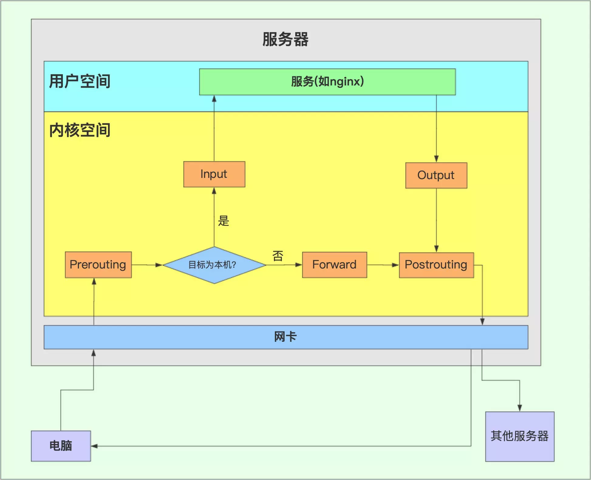
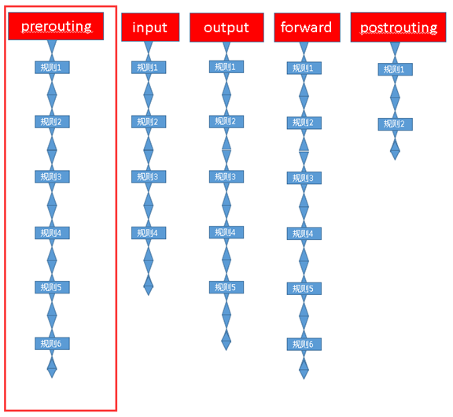
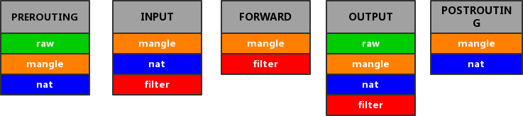
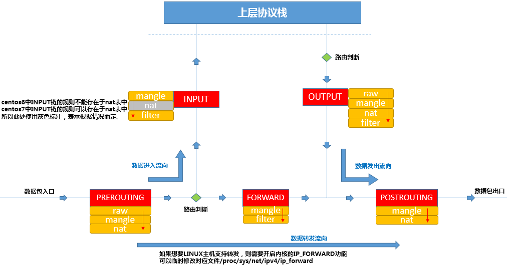
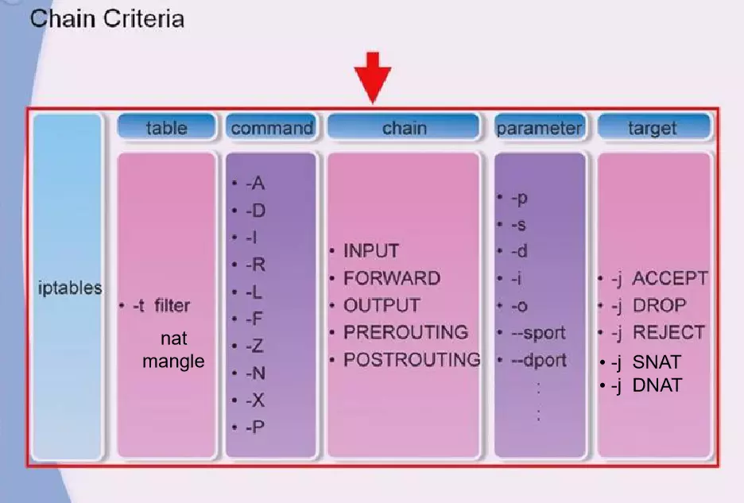
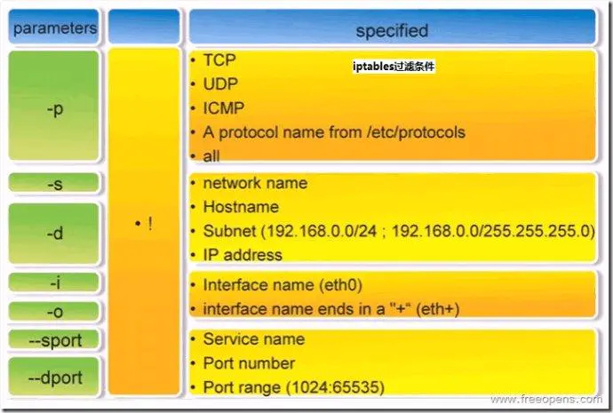
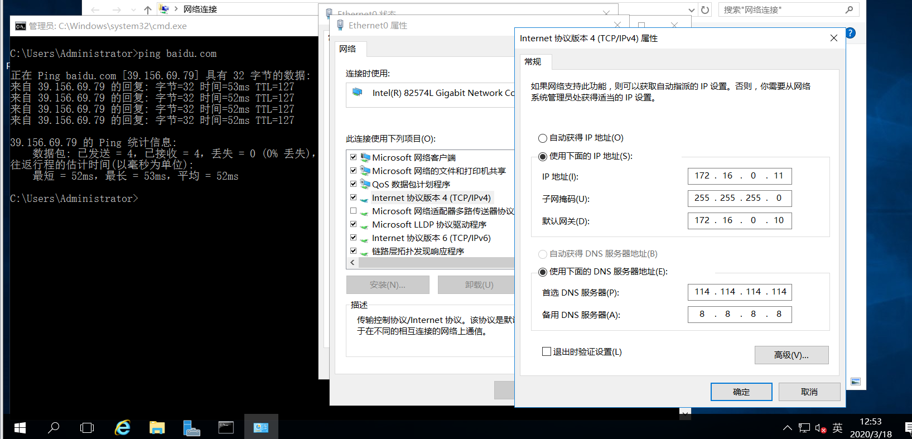

# <center>iptables</center>


> 参考：
>
> [iptables - Linux man page](https://linux.die.net/man/8/iptables)
>
> [iptables_command](https://www.jianshu.com/p/6af4eb08eac2)
>
> [iptables详解](https://www.xiebruce.top/1071.html)
>
> [iptables详解](https://www.zsythink.net/archives/1199)
>
> [iptables详解及一些常用规则](https://www.jianshu.com/p/ee4ee15d3658)
>
> 


### 简介


netfilter/iptables（简称为iptables）组成Linux平台下的包过滤防火墙，与大多数的Linux软件一样，这个包过滤防火墙是免费的，它可以代替昂贵的商业防火墙解决方案，完成封包过滤、封包重定向和网络地址转换（NAT）等功能。

iptables分为2部分，一部分位于内核中，用来存放规则，称为NetFilter。还有一段在用户空间中，用来定义规则，并将规则传递到内核中，这段在用户空间中的程序就叫做iptables。 所以对于用户空间来说，就是按照需要生成一条条规则，然后向内核中提交，存放到NetFilter，让这些规则在数据传输与处理的过程中起作用。形象化地理解来说就是，把iptables看作是一个客户端代理，用户通过iptables这个代理，与内核中的安全框架netfilter进行交互。netfilter才是防火墙真正的安全框架，处于内核空间内。

Netfilter是linux操作系统核心层内部的一个数据包处理模块，拥有如下功能：

* 网络地址转换(Network Address Translate)
* 数据包内容修改
* 数据包过滤的防火墙功能


#### 链

iptables开启后，数据报文从进入服务器到出来经过5条链，分别为 `prerouting` 、 `input` 、`output` 、 `forward` 、 `postrouting`

如下图，即数据报文的可能经过的路径



每条链上设有多种规则，数据报文必须按照顺序一个个匹配这些规则

正如图中，数据报文经过的5条链上，必须逐一经过每一条链，而在链上，数据报文必须逐一通过(符合)每一个规则的限制，方能到下一条链上




* **INPUT链**：当接收到防火墙本机地址的数据包(入站)时，应用此链的规则
* **OUTPUT链**：当防火墙本机向外发送数据包(出站)时，应用此链的规则
* **FORWARD链**：当接收到需要通过防火墙发送给其他地址的数据包(转发)时，应用此链的规则
* **PREROUTING链**：在对数据包作路由选择之前，应用此链的规则，如DNAT
* **POSTROUTING链**：在对数据包作路由选择之后，应用此链的规则，如SNAT


在链的第一张图中，我们可以形象地看出数据包在哪些条件下需要经过哪些链

input和output链更多应用在主机防火墙中，主要针对本机进出的数据安全控制，而prerouting、postrouting、forward链更多应用在网络防火墙中，特别是防火墙服务器作为网关时使用的情况


#### 表的概念


虽然一条链上有多条规则，但是基于某些规则的作用功能很相似，因此有多个相似功能的规则组成了表，iptables为我们提供了四种表

* **filter表**：主要用于对数据包进行过滤，根据具体的规则决定是否放行该数据包(如`DROP`、`ACCEPT` 、`REJECT` 、 `LOG ` )，所谓防火墙其实基本上是指这张表上的过滤规则，对应内核模块的`iptables_filter`
* **nat表**：Network Address Translation，网络地址转换功能，主要用于修改数据包的ip地址、端口号信息等 ( 如 `SNAT` 、 `DNAT` 、 `MASQUERADE` 、`REDIRECT` )。属于一个流的包只会经过这个表一次，如果第一个包被允许做NAT或Masqueraded，那么余下的包都会自动做相同的操作，对应内核模块的`iptables_nat` 
* **mangle表**：拆解报文，做出修改，并重新封装，主要用于修改数据包的TOS(Type of Service，服务类型)、TTL( Time To Live，生存周期)以及为数据包设置Mark标记，以实现QoS(Quality Of Service ，服务质量)调整以及策略路由等应用，由于需要相应的路由设备支持，因此应用并不广泛，对应内核模块`iptables_mangle`
* **raw表**：从iptables 1.2.9版本后新添加的表，主要用于决定数据包是否被状态跟踪机制处理，在匹配数据包时，raw表规则要有优先于其他表，对应内核模块`iptables_raw`


我们自定义的所有规则，都会添加到四张表中的其中一张表中

规则表之间的优先顺序：Raw >> mangle >> nat >> filter


#### 表链关系


5条链中，并不是每条链都能应用所有类型的表，事实上除了Output链上能同时拥有四种表以外，其他都只能有两到三种表



上图即为每种链能应用的表，实际上，在各表中还有匹配顺序，每条链上的各个表的匹配顺序为：
**raw &rarr; mangle &rarr; nat &rarr; filter**

把上图转换成表，可直观地看出来，表链的关系

|             | raw  | mangle | nat  | filter |
| ----------- | ---- | ------ | ---- | ------ |
| prerouting  | 1    | 1      | 1    | 0      |
| input       | 0    | 1      | 1    | 1      |
| forward     | 0    | 1      | 0    | 1      |
| output      | 1    | 1      | 1    | 1      |
| postrouting | 0    | 1      | 0    | 1      |

数据包通过防火墙流程可以总结如下：




#### 规则的概念

iptables规则主要包含了“条件&动作”，即匹配出符合什么条件(规则)后，对它采取怎样的动作


##### 匹配条件

* **S_IP**：source ip，即源ip
* **S_PORT**：source port，源端口
* **D_IP**：destination ip，目标ip
* **D_PORT**：destination port，目标端口
* **TCP/UDP**：第四层协议(传输层)


##### 处理的动作

* **ACCEPT**：允许数据包通过
* **DROP**：直接丢弃数据包，不回应任何信息，客户端只有当该链超时后才会有反应
* **REJECT**：拒绝数据包，会给客户端发送一个数据包被丢弃的相应信息
* **SNAT**：S指Source，源NAT（源地址转换），再进入路由层面的route之后，出本地的网络线之前，改写源地址，目标地址不变，并在本机建立NAT表项，当数据返回时，根据NAT表将目的地址数据改写为数据发送出去的源地址，并发给主机，解决私网用户用同一个公网ip上网的问题
* **MASQUERADE**：是SNAT的一种特殊形式，适用于动态的、临时会变的IP上；
* **DNAT**：D指Destination，目的NAT，解决私网服务端，接收公网请求的问题。和SNAT相反，IP包经过route之前，重新修改目标地址，源地址不变，在本机建立NAT表项，当数据返回时，根据NAT表将源地址修改为数据发送过来时的目标地址，并发给远程主机。可以隐藏后端服务器的真实地址
* **REDIRECT**：在本机做端口映射；
* **LOG**：在`/var/log/messages`文件中记录日志信息，然后将数据包传递给下一条规则


除去最后一个LOG，前三条规则匹配数据包后，该数据包就不会再往下继续匹配了，所以编写规则的顺序极其关键


> 关于DNAT和SNAT：
>
> https://blog.51cto.com/sxj007/110924
>
> 简单来说，SNAT是替换接收到的数据包的源地址，一般用在postrouting
>
> 而DNAT是替换数据包中的目的地址，一般用在prerouting


### 命令


有关 `iptables` 的命令可以用下图来解释

```sh
$ iptables [-t table_name] command [chain_name] [parameter] [-j target&action]
```

`parameter` 是用于条件匹配




* 所有表名必须小写
   `filter` / `nat` / `mangle` / `raw`

* 所有链名必须大写
   `INPUT` / `OUTPUT` / `FORWARD` / `PREROUTING` / `POSTROUTING`

* 所有匹配必须小写
   `-s` / `-d` / `-m <module_name>` / `-p`

* 所有动作必须大写
   `ACCEPT` / `DROP` / `SNAT` / `DNAT` / `MASQUERADE`


**对于parameter条件匹配**，如下图所示：




##### 对于Command选项：

`-A` 在指定链末尾添加(append)一条新规则

`-D` 删除（delete）指定链中的某一条规则，可以按规则序号和内容删除

`-I` 在指定链中插入（insert）一条新的规则，默认在第一行添加

`-R` 修改、替换（replace）指定链中的某一条规则，可以按规则序号和内容替换

`-L` 列出（list）指定链中所有的规则进行查看

`-E` 重命名用户定义的链，不改变链本身

`-F` 清空（flush）

`-N` 新建（new-chain）一条用户自己定义的规则链

`-X` 删除指定表中用户自定义的规则链（delete-chain）

`-P` 设置指定链的默认策略（policy）

`-Z` 将所有表的所有链的字节和数据包计数器清零

`-n` 使用数字形式（numeric）显示输出结果

`-v` 查看规则表详细信息（verbose）的信息

`-V` 查看版本(version)

`-h` 获取帮助（help）


> 打开linux转发功能：`echo 1 > /proc/sys/net/ipv4/ip_forward`


删除input链的第一条规则：`iptables -D INPUT 1`


#### iptables防火墙常用的策略


```sh
# 1.拒绝进入防火墙的所有ICMP协议数据包
$ iptables -I INPUT -p icmp -j REJECT


# 2.允许防火墙转发除ICMP协议以外的所有数据包
# 说明：使用“！”可以将条件取反。
$ iptables -A FORWARD -p ! icmp -j ACCEPT


# 3.拒绝转发来自192.168.1.10主机的数据，允许转发来自192.168.0.0/24网段的数据
# 说明：注意要把拒绝的放在前面,不然拒绝语句就没有用了就不起作用了啊。
$ iptables -A FORWARD -s 192.168.1.11 -j REJECT
$ iptables -A FORWARD -s 192.168.0.0/24 -j ACCEPT


# 4.丢弃从外网接口（eth1）进入防火墙本机的源地址为私网地址的数据包
$ iptables -A INPUT -i eth1 -s 192.168.0.0/16 -j DROP
$ iptables -A INPUT -i eth1 -s 172.16.0.0/12 -j DROP
$ iptables -A INPUT -i eth1 -s 10.0.0.0/8 -j DROP

# 5.封堵网段（192.168.1.0/24），两小时后解封。
# 说明：这个策略咱们借助crond计划任务来完成，就再好不过了。
$ iptables -I INPUT -s 10.20.30.0/24 -j DROP
$ iptables -I FORWARD -s 10.20.30.0/24 -j DROP
$ at now 2 hours at> iptables -D INPUT 1 at> iptables -D FORWARD 1

[1]   Stopped     at now 2 hours


# 6.只允许管理员从202.13.0.0/16网段使用SSH远程登录防火墙主机。
# 说明：这个用法比较适合对设备进行远程管理时使用
# 比如位于分公司中的SQL服务器需要被总公司的管理员管理时。
$ iptables -A INPUT -p tcp --dport 22 -s 202.13.0.0/16 -j ACCEPT
$ iptables -A INPUT -p tcp --dport 22 -j DROP


# 7.允许本机开放从TCP端口20-1024提供的应用服务。
$ iptables -A INPUT -p tcp --dport 20:1024 -j ACCEPT
$ iptables -A OUTPUT -p tcp --sport 20:1024 -j ACCEPT


# 8.允许转发来自192.168.0.0/24局域网段的DNS解析请求数据包。
$ iptables -A FORWARD -s 192.168.0.0/24 -p udp --dport 53 -j ACCEPT
$ iptables -A FORWARD -d 192.168.0.0/24 -p udp --sport 53 -j ACCEPT

# 9.禁止其他主机ping防火墙主机，但是允许从防火墙上ping其他主机
$ iptables -I INPUT -p icmp --icmp-type Echo-Request -j DROP
$ iptables -I INPUT -p icmp --icmp-type Echo-Reply -j ACCEPT
$ iptables -I INPUT -p icmp --icmp-type destination-Unreachable -j ACCEPT


# 10.禁止转发来自MAC地址为00：0C：29：27：55：3F的和主机的数据包
# 说明：iptables中使用“-m 模块关键字”的形式调用显示匹配。这里用“-m mac –mac-source”来表示数据包的源MAC地址。
$ iptables -A FORWARD -m mac --mac-source 00:0c:29:27:55:3F -j DROP


# 11.允许防火墙本机对外开放TCP端口20、21、25、110以及被动模式FTP端口1250-1280
# 说明：这里用“-m multiport –dport”来指定目的端口及范围
$ iptables -A INPUT -p tcp -m multiport --dport 20,21,25,110,1250:1280 -j ACCEPT


# 12.禁止转发源IP地址为192.168.1.20-192.168.1.99的TCP数据包。
# 说明：此处用“-m –iprange –src-range”指定IP范围。
$ iptables -A FORWARD -p tcp -m iprange --src-range 192.168.1.20-192.168.1.99 -j DROP


# 13.禁止转发与正常TCP连接无关的非—syn请求数据包。
# 说明：“-m state”表示数据包的连接状态，“NEW”表示与任何连接无关的，新的嘛！
$ iptables -A FORWARD -m state --state NEW -p tcp ! --syn -j DROP


# 14.拒绝访问防火墙的新数据包，但允许响应连接或与已有连接相关的数据包
# 说明：“ESTABLISHED”表示已经响应请求或者已经建立连接的数据包
# “RELATED”表示与已建立的连接有相关性的，比如FTP数据连接等。
$ iptables -A INPUT -p tcp -m state --state NEW -j DROP
$ iptables -A INPUT -p tcp -m state --state ESTABLISHED,RELATED -j ACCEPT


# 15.只开放本机的web服务（80）、FTP(20、21、20450-20480)，放行外部主机发住服务器其它端口的应答数据包，将其他入站数据包均予以丢弃处理。
$ iptables -I INPUT -p tcp -m multiport --dport 20,21,80 -j ACCEPT
$ iptables -I INPUT -p tcp --dport 20450:20480 -j ACCEPT
$ iptables -I INPUT -p tcp -m state --state ESTABLISHED -j ACCEPT
$ iptables -P INPUT DROP

```


#### 常用iptables规则


```sh
# 1. 删除所有现有规则
$ iptables -F


# 2. 设置默认的 chain 策略
$ iptables -P INPUT DROP
$ iptables -P FORWARD DROP
$ iptables -P OUTPUT DROP


# 3. 阻止某个特定的 IP 地址
$ BLOCK_THIS_IP="x.x.x.x"
$ iptables -A INPUT -s "$BLOCK_THIS_IP" -j DROP


# 4. 允许全部进来的（incoming）SSH
$ iptables -A INPUT -i eth0 -p tcp --dport 22 -m state --state NEW,ESTABLISHED -j ACCEPT
$ iptables -A OUTPUT -o eth0 -p tcp --sport 22 -m state --state ESTABLISHED -j ACCEPT


# 5. 只允许某个特定网络进来的 SSH
$ iptables -A INPUT -i eth0 -p tcp -s 192.168.200.0/24 --dport 22 -m state --state NEW,ESTABLISHED -j ACCEPT
$ iptables -A OUTPUT -o eth0 -p tcp --sport 22 -m state --state ESTABLISHED -j ACCEPT


# 6. 允许进来的（incoming）HTTP
$ iptables -A INPUT -i eth0 -p tcp --dport 80 -m state --state NEW,ESTABLISHED -j ACCEPT
$ iptables -A OUTPUT -o eth0 -p tcp --sport 80 -m state --state ESTABLISHED -j ACCEPT


# 7. 多端口（允许进来的 SSH、HTTP 和 HTTPS）
$ iptables -A INPUT -i eth0 -p tcp -m multiport --dports 22,80,443 -m state --state NEW,ESTABLISHED -j ACCEPT
$ iptables -A OUTPUT -o eth0 -p tcp -m multiport --sports 22,80,443 -m state --state ESTABLISHED -j ACCEPT


# 8. 允许出去的（outgoing）SSH
$ iptables -A OUTPUT -o eth0 -p tcp --dport 22 -m state --state NEW,ESTABLISHED -j ACCEPT
$ iptables -A INPUT -i eth0 -p tcp --sport 22 -m state --state ESTABLISHED -j ACCEPT


# 9. 允许外出的（outgoing）SSH，但仅访问某个特定的网络
$ iptables -A OUTPUT -o eth0 -p tcp -d 192.168.101.0/24 --dport 22 -m state --state NEW,ESTABLISHED -j ACCEPT
$ iptables -A INPUT -i eth0 -p tcp --sport 22 -m state --state ESTABLISHED -j ACCEPT


# 10. 允许外出的（outgoing） HTTPS
$ iptables -A OUTPUT -o eth0 -p tcp --dport 443 -m state --state NEW,ESTABLISHED -j ACCEPT
$ iptables -A INPUT -i eth0 -p tcp --sport 443 -m state --state ESTABLISHED -j ACCEPT


# 11. 对进来的 HTTPS 流量做负载均衡
$ iptables -A PREROUTING -i eth0 -p tcp --dport 443 -m state --state NEW -m nth --counter 0 --every 3 --packet 0 -j DNAT --to-destination 192.168.1.101:443
$ iptables -A PREROUTING -i eth0 -p tcp --dport 443 -m state --state NEW -m nth --counter 0 --every 3 --packet 1 -j DNAT --to-destination 192.168.1.102:443
$ iptables -A PREROUTING -i eth0 -p tcp --dport 443 -m state --state NEW -m nth --counter 0 --every 3 --packet 2 -j DNAT --to-destination 192.168.1.103:443


# 12. 从内部向外部 Ping
$ iptables -A OUTPUT -p icmp --icmp-type echo-request -j ACCEPT
$ iptables -A INPUT -p icmp --icmp-type echo-reply -j ACCEPT


# 13. 从外部向内部 Ping
$ iptables -A INPUT -p icmp --icmp-type echo-request -j ACCEPT
$ iptables -A OUTPUT -p icmp --icmp-type echo-reply -j ACCEPT


# 14. 允许环回（loopback）访问
$ iptables -A INPUT -i lo -j ACCEPT
$ iptables -A OUTPUT -o lo -j ACCEPT


# 15. 允许 packets 从内网访问外网
# if eth1 is connected to external network (internet)
# if eth0 is connected to internal network (192.168.1.x)
$ iptables -A FORWARD -i eth0 -o eth1 -j ACCEPT


# 16. 允许外出的  DNS
$ iptables -A OUTPUT -p udp -o eth0 --dport 53 -j ACCEPT
$ iptables -A INPUT -p udp -i eth0 --sport 53 -j ACCEPT


# 17. 允许 NIS 连接
$ rpcinfo -p | grep ypbind ; This port is 853 and 850
$ iptables -A INPUT -p tcp --dport 111 -j ACCEPT
$ iptables -A INPUT -p udp --dport 111 -j ACCEPT
$ iptables -A INPUT -p tcp --dport 853 -j ACCEPT
$ iptables -A INPUT -p udp --dport 853 -j ACCEPT
$ iptables -A INPUT -p tcp --dport 850 -j ACCEPT
$ iptables -A INPUT -p udp --dport 850 -j ACCEPT


# 18. 允许某个特定网络 rsync 进入本机
$ iptables -A INPUT -i eth0 -p tcp -s 192.168.101.0/24 --dport 873 -m state --state NEW,ESTABLISHED -j ACCEPT
$ iptables -A OUTPUT -o eth0 -p tcp --sport 873 -m state --state ESTABLISHED -j ACCEPT


# 19. 仅允许来自某个特定网络的 MySQL 的链接
$ iptables -A INPUT -i eth0 -p tcp -s 192.168.200.0/24 --dport 3306 -m state --state NEW,ESTABLISHED -j ACCEPT
$ iptables -A OUTPUT -o eth0 -p tcp --sport 3306 -m state --state ESTABLISHED -j ACCEPT


# 20. 允许 Sendmail 或 Postfix
$ iptables -A INPUT -i eth0 -p tcp --dport 25 -m state --state NEW,ESTABLISHED -j ACCEPT
$ iptables -A OUTPUT -o eth0 -p tcp --sport 25 -m state --state ESTABLISHED -j ACCEPT


# 21. 允许 IMAP 和 IMAPS
$ iptables -A INPUT -i eth0 -p tcp --dport 143 -m state --state NEW,ESTABLISHED -j ACCEPT
$ iptables -A OUTPUT -o eth0 -p tcp --sport 143 -m state --state ESTABLISHED -j ACCEPT
$ iptables -A INPUT -i eth0 -p tcp --dport 993 -m state --state NEW,ESTABLISHED -j ACCEPT
$ iptables -A OUTPUT -o eth0 -p tcp --sport 993 -m state --state ESTABLISHED -j ACCEPT


# 22. 允许 POP3 和 POP3S
$ iptables -A INPUT -i eth0 -p tcp --dport 110 -m state --state NEW,ESTABLISHED -j ACCEPT
$ iptables -A OUTPUT -o eth0 -p tcp --sport 110 -m state --state ESTABLISHED -j ACCEPT
$ iptables -A INPUT -i eth0 -p tcp --dport 995 -m state --state NEW,ESTABLISHED -j ACCEPT
$ iptables -A OUTPUT -o eth0 -p tcp --sport 995 -m state --state ESTABLISHED -j ACCEPT


# 23. 防止 DoS 攻击
$ iptables -A INPUT -p tcp --dport 80 -m limit --limit 25/minute --limit-burst 100 -j ACCEPT


# 24. 设置 422 端口转发到 22 端口
$ iptables -t nat -A PREROUTING -p tcp -d 192.168.102.37 --dport 422 -j DNAT --to 192.168.102.37:22
$ iptables -A INPUT -i eth0 -p tcp --dport 422 -m state --state NEW,ESTABLISHED -j ACCEPT
$ iptables -A OUTPUT -o eth0 -p tcp --sport 422 -m state --state ESTABLISHED -j ACCEPT


# 25. 为丢弃的包做日志（Log）
$ iptables -N LOGGING
$ iptables -A INPUT -j LOGGING
$ iptables -A LOGGING -m limit --limit 2/min -j LOG --log-prefix "IPTables Packet Dropped: " --log-level 7
$ iptables -A LOGGING -j DROP

```


### iptables防火墙规则的保存与恢复

`iptables-save`把规则保存到文件中，再由目录`rc.d`下的脚本（`/etc/rc.d/init.d/iptables`）自动装载，使用命令`iptables-save`来保存规则。

一般用`iptables-save > /etc/sysconfig/iptables` 生成保存规则的文件`/etc/sysconfig/iptables`，也可以用`service iptables save`它能把规则自动保存在`/etc/sysconfig/iptables`中。

当计算机启动时，rc.d下的脚本将用命令iptables-restore调用这个文件，从而就自动恢复了规则。


### iptables的简单应用


由于网络安全课程的实验，特地来学习iptables，可以把实验当作一个应用示例

实验大致如下：

* 一台windows虚拟机，内网环境，无法直接访问外网
* 一台linux虚拟机，两个网卡，一个用于连接外网，一个用于连接内网(即windows虚拟机)
* 目标：利用iptables将linux配置成路由器，windows虚拟机通过路由器访问Internet


实验环境：Ubuntu 18.04和windows server2016


刚开始认为创建网卡，便在虚拟机的ubuntu里创建了一个虚拟网卡，后面才发现不对，构建不了内网环境，之后才发现是在vmware中添加物理网卡(模拟的)构建内网环境。

所以首先为ubuntu创建两个网卡，一个能访问外网(使用NAT)，另外一个仅内网(vmware里的仅主机，LAN那个我没搞懂，应该也是可以的)

在linux中，用命令`sudo vim /etc/network/interfaces`修改网卡配置如下：

```
# interfaces(5) file used by ifup(8) and if down(8)
auto lo
iface lo inet loopback

auto ens33
iface ens33 inet static
address 192.168.52.128
netmask 255.255.255.0
gateway 192.168.52.1

auto ens38
iface ens38 inet static
address 172.16.0.10
netmask 255.255.255.0
```

修改后，重启网络配置

```sh
sc@sc-virtual-machine:~$ sudo /etc/init.d/networking restart
[ ok ] Restarting networking (via systemctl): networking.service.
sc@sc-virtual-machine:~$ 
```

还有一点，要开启linux的ip转发功能，命令如下：

```sh
root@sc-virtual-machine:/home/sc# echo 1 > /proc/sys/net/ipv4/ip_forward
$ sudo vim  /etc/sysctl.conf
# net.ipv4.ip_forward = 1
# 取消上面这个注释,开启linux转发
sc@sc-virtual-machine:~$ sudo sysctl -p
```

在`sysctl.conf`里，本来就有注释的转发配置语句，取消注释即可，用命令重新加载内核参数，当然，此时重启linux虚拟机也不是不可以


在windows做如下配置

控制面板->网络和Internet->网络和共享中心->本地连接->属性->Internet协议版本4（TCP/IPv4）->属性




特别地，要将windows网关配置为linux的内网网卡地址

然后要记得，DNS服务器要和linux主机的一致

假如，windows虚拟机能ping通linux主机，但是linux主机ping不通windows，则需要关闭windows的防火墙，或者在windows防火墙中，在入站规则内打开ICMP回显

控制面板->系统和安全->Windows防火墙->高级设置->入站规则->文件和打印机共享（回显请求-ICMPv4-In）->右键->启用规则


##### iptables转发

用iptables做nat，命令如下

```sh
sc@sc-virtual-machine:~$ # sudo iptables -t nat -A POSTROUTING  -o ens33 -j MASQUERADE
sc@sc-virtual-machine:~$ sudo iptables -t nat -A POSTROUTING -s 172.16.0.0/24 -o ens33 -j MASQUERADE
sc@sc-virtual-machine:~$ sudo iptables -A FORWARD -i ens38 -j ACCEPT

```

将来自`172.16.0.0/24`内网的流量转发到ens33，`MASQUERADE`是指用该网卡上的IP来替换源地址IP，对于IP不固定，如dhcp自动分配ip的情况下使用，这边由于是静态ip，不加该选项也是可以的


运行完命令后，在windows主机就可以ping通`baidu.com`了，实验就完成了


