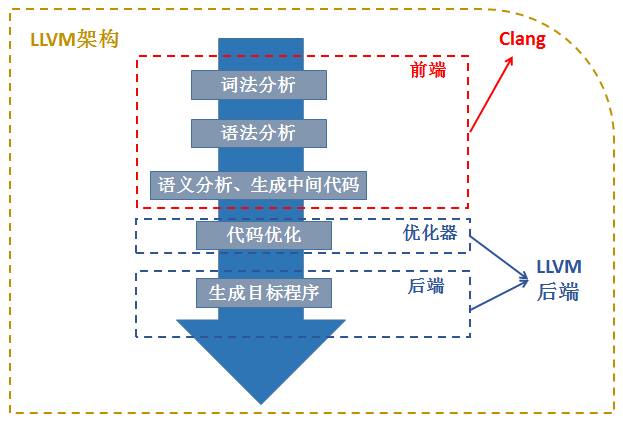

# llvm


> 参考：
>
> [LLVM官网](http://llvm.org/)
>
> [LLVM-docs](http://llvm.org/docs/) ：注意要查看对应版本的文档，每个版本文档都有所改变
>
> [Github-llvm/llvm-project](https://github.com/llvm/llvm-project/)
>
> [Github-llvm-mirror/llvm](https://github.com/llvm-mirror/llvm)
>
> 
>
> [Github-heroims/obfuscator](https://github.com/heroims/obfuscator) ：移植好的ollvm9.0等
>
> [OLLVM代码混淆移植与使用](https://heroims.github.io/2019/01/06/OLLVM%E4%BB%A3%E7%A0%81%E6%B7%B7%E6%B7%86%E7%A7%BB%E6%A4%8D%E4%B8%8E%E4%BD%BF%E7%94%A8/) ：heroims的博客
>
> 
>
> [Github-obfuscator-llvm/obfuscator](https://github.com/obfuscator-llvm/obfuscator) ：官方版本
>
> [obfuscator-wiki](https://github.com/obfuscator-llvm/obfuscator/wiki)
>
> 
>
> [pediy.com---[原创]ollvm快速学习](https://bbs.pediy.com/thread-225756.htm)
>
> [llvm入门](https://juejin.im/post/5bfba01df265da614273939a)
>
> [OLLVM代码混淆移植与使用](https://heroims.github.io/2019/01/06/OLLVM%E4%BB%A3%E7%A0%81%E6%B7%B7%E6%B7%86%E7%A7%BB%E6%A4%8D%E4%B8%8E%E4%BD%BF%E7%94%A8/)
>
> [llvm学习（三）：移植ollvm等作品到单独编译的Pass](https://www.leadroyal.cn/?p=659)
>
> [蓝色的味道](https://zhuanlan.zhihu.com/frozengene)：谁说不能与龙一起跳舞：Clang / LLVM
>
> [OLLVM代码混淆移植与使用](https://www.jianshu.com/p/e0637f3169a3)
>
> [llvm入门笔记](https://zhuanlan.zhihu.com/llvm-tutorial)
>
> [llvm编译流程](https://www.jianshu.com/p/333cf1c02a0e)
>
> 
>
> 


## 啥是LLVM？


> [[原创]LLVM了解篇剧场版](https://bbs.pediy.com/thread-247981.htm)

以上这篇文章简要地介绍了LLVM

LLVM：Low Level Virtual Machine(最初)

官方定义：**LLVM是一个模块化和可重用的编译器和工具链技术的集合**

LLVM最初是在2000年由伊利诺伊大学香槟分校(UUIC)的学生Chris Lattner及其硕士顾问Vikram Adve创建的研究项目，并在2003年发布第一个正式版本，目的是提供一种基于SSA的现代编译策略，这种策略能够支持任何编程语言的静态和动态编译。

有意思的是，他的作者原本想要写一个低层虚拟机的，然而他并没有被当成虚拟机来用，逐渐地偏离了他原本的方向。现在llvm不是任何单词的缩写，而是一种体系，包含了一系列的项目

对于LLVM核心（LLVM Core）来说，它是一个编译器基础设施框架，它包含了为我们编写编译器一系列的库（如程序分析、代码优化、机器代码生成等），并且提供了调用这些库的相关工具，如llvm-opt可以调用LLVM优化相关的库，llvm-mc可以调用LLVM机器代码生成相关的库。并为此提供了一个非常方便简单、具备类型的、平台无关的统一中间代码语言，称之为LLVM IR.


以上是一个正常编译器的流程，源代码经过前端编译成中间代码，在经过优化和后端生成相应的机器码，即可执行文件


LLVM编译一个源文件的过程：预处理 -> 词法分析 -> Token -> 语法分析 -> AST -> 代码生成 -> LLVM IR -> 优化 -> 生成汇编代码 -> Link -> 目标文件


拿个例子来说就是：首先，我们有C代码程序文件，然后经过了Clang前端（或者古老的llvm-gcc前端，这是在Clang出现以前使用的前端，可以产生LLVM IR），然后会产生LLVM IR。在这里，我们可以发现LLVM IR是以.bc结尾，缩写代表的单词是bitcode，它是序列化的数据，用以存储在磁盘中。而LLVM IR非常牛逼的创建了三种LLVM IR表示格式，除了bitcode这种用以存储的格式，第二种是用于人类可读的的格式，一般以.ll结尾。

```sh
$ clang a.c -S -emit-llvm# 生成.ll可读文件
```

这条命令即可产生`.ll`文件

而第三种格式则是内存表示格式，这一般是用于我们程序开发，去操作LLVM IR。那么这里面有一个宏观的概念，那就是一个编译单元（即一个.c文件），在LLVM IR中代表着一个Module，而一个Module里面含有Global Value，主要包括Global Variable 和 Function，而至于Global Alias大家接触比较少，我们暂时忽略。而一个Function里面包含着Basic Block，而一个 Basic Block里面包含着指令，如add。那么关系你可以认为是Module -> Function -> Basic Block -> Instructions. 这是一个宏观的认识，需要具备。而这一个也就是我们常常去查阅的相关LLVM IR的API，如：[llvm-GlobeValue](http://llvm.org/docs/doxygen/html/classllvm_1_1GlobalValue.html)

而这里明确的一点是，这三者是完全等价的，并且可以转换的

再回到上面的流程图，即产生`.bc`的阶段。产生完毕后，它这里直接进入`llvm-link`阶段，其实不太完整。若是我们使用了O2等优化，我们在这里还会经历一个优化的阶段，即对这一个编译单元的优化，大约包括了40多种优化Pass，如死代码消除，内联等。而经过优化后，依然是.bc文件，然后再进入llvm-link阶段。而在llvm-link阶段，所要做的其实就是把多个.bc文件合并成一个.bc文件，并且做链接时优化，在这篇文章中提到过一个例子：[LLVM Link Time Optimization](http://llvm.org/docs/LinkTimeOptimization.html)，可以查阅一下是如何进行链接时优化的。

而经过`llvm-link`阶段后，我们得到了一个新的`.bc`文件，那么我们会再次进入优化阶段，重新再进行一次优化。因为经过`llvm-link`后，我们的IR结构可能发生了一些变化，从而可能更有利于我们优化，得到更优化的IR。而这一步骤后，可以得到最终优化后的.bc，正式进入代码生成阶段。

而在这一幅图中，只列举出来了一个llc，即走机器代码生成的路径。其实对于LLVM来说，还可以有一个过程，那就是lli，即解释执行LLVM IR。不过我们这里不多谈，我们重点在机器代码生成。那么llc的作用就是把LLVM IR 编译成汇编文件`.s`，这里你可以把LLVM IR想象成一个编程语言，然后经过了llc编译器，最后产生了汇编文件。如同C程序，经过Clang，产生了LLVM IR一般。那么，产生了汇编文件以后，就可以调用系统的汇编器，如GNU的as，从而产生目标文件object file，即`.o`文件了。而细心的童鞋可能注意到了这里还有一条路径是`llvm-mc`，直接走生成object file的过程。而这条路径在如今来说，并不是每个平台都会走，核心在于LLVM本身的集成汇编器，即`-fintegrated-as`，使用集成汇编器既可以使用MCLoweing到MCInst，再使用MCStreamers直接到`.o`，当然也可以到`.s`。而目前本身的集成汇编器，我认为是并非完美，但是以发展趋势来看，会大一统的，从而做到没有平台差异，这也是LLVM做集成汇编器的一大理由。而生成完.o文件，剩下的过程就很简单了，就是链接器链接相关的库，然后和目标文件一起生存可执行文件`.out / .exe`了。


```sh
# 二进制代码形式
$ clang -emit-llvm -c main.c -o main.bc

# 可读文本代码形式
$ clang -emit-llvm –S -c main.c -o main.ll
```


* #### llvm 和 clang 的关系



对于 LLVM 来说，其前端是 clang，在编译源码文件的时候使用的编译工具也是 clang。
而生成中间 IR 代码后，llvm需要对 IR 代码进行一些操作，例如添加一些代码混淆功能。LLVM 的做法是通过编写 Pass(其实就是对应的一个个模块，每个类实现不同的功能)来实现混淆的功
能。所以实现混淆，其实就是编写功能性的 Pass


### Obfuscator-LLVM


Obfuscator-LLVM是由瑞士伊夫尔东莱班的应用科学与艺术大学信息安全小组（HEIG-VD）于2010年6月发起的一个项目。

该项目的目的是提供[LLVM](http://www.llvm.org/)编译套件的开源分支，该套件能够通过[代码混淆](http://en.wikipedia.org/wiki/Obfuscation_(software))和防篡改来提高软件安全性。由于我们目前大部分工作在[中间表示](http://en.wikipedia.org/wiki/Intermediate_language)（IR）级别，因此我们的工具与所有编程语言（C，C ++，Objective-C，Ada和Fortran）和目标平台（x86，x86-64，PowerPC，PowerPC-64）兼容。

LLVM当前支持的ARM，Thumb，SPARC，Alpha，CellSPU，MIPS，MSP430，SystemZ和XCore）。

Obfuscator-LLVM的目的主要是在编译时增强软件就对抗向工程和编译时修改（动态调试？）


#### Install

可以直接从github上下载源码

```sh
$ git clone -b llvm-4.0 https://github.com/obfuscator-llvm/obfuscator.git
$ mkdir build
$ cd build
# 如果不想跑测试用例加上-DLLVM_INCLUDE_TESTS=OFF 
$ cmake -DCMAKE_BUILD_TYPE=Release ../obfuscator/
$ make -j7
```


然而我在4核4G虚拟机里编译将近2h，还报错了tcl

我现在只想再来几根内存条 :(

```sh
error:virtual memory exhausted:Cannot allocate memory
$ make -j7 >>40%

$ make -j4 >>95%

$ make -j2 >>100%
```


#### o-llvm手动打包


> http://www.few.vu.nl/~lsc300/LLVM/doxygen/index.html
>
> API Document


因为我下的ollvm9.0的`-fla`有bug，所以决定亲自打包一波，顺便再深入了解ollvm

由Diffinity将ollvm4.0和llvm4.0进行对比，发现了以下文件的不同，也就意味着我们将ollvm打包进最新的llvm也需要修改以下文件。

```sh
./include/llvm/Transforms/Obfuscation/ # obfuscation的头文件
./include/llvm/Transforms/CryptoUtils.h # obfuscation的头文件
./lib/Transforms/IPO/LLVMBuild.txt
./lib/Transforms/IPO/PassManagerBuilder.cpp # Pass注册
./lib/Transforms/Obfuscation/ # obfuscation source code
./lib/Transforms/CMakeLists.txt
./lib/Transforms/LLVMBuild.txt
./tools/clang # 集成clang,要在gitignore里取消clang的注释
./.gitignore
./CMakeLists.txt
./CODE_OWNERS.TXT
./LICENSE.TXT
```


从自己的github的obfuscator仓库中clone下来，注意一定要clone，直接下载downloadzip没有.git信息，虽然他真的很慢。

然后创建自己的llvm9.0分支

```sh
$ git clone git@github.com:Magic-King/obfuscator.git
Cloning into 'obfuscator'...
remote: Enumerating objects: 86723, done.
remote: Total 86723 (delta 0), reused 0 (delta 0), pack-reused 86723
Receiving objects: 100% (86723/86723), 132.79 MiB | 35.00 KiB/s, done.
Resolving deltas: 100% (15346/15346), done.
$ git  branch -a
* master
  remotes/origin/HEAD -> origin/master
  remotes/origin/clang-425.0.24
  remotes/origin/llvm-3.3
  remotes/origin/llvm-3.4
  remotes/origin/llvm-3.5
  remotes/origin/llvm-3.6.1
  remotes/origin/llvm-4.0
  remotes/origin/master

$ git  branch -r
  origin/HEAD -> origin/master
  origin/clang-425.0.24
  origin/llvm-3.3
  origin/llvm-3.4
  origin/llvm-3.5
  origin/llvm-3.6.1
  origin/llvm-4.0
  origin/master

$ git remote add origin git@github.com:Magic-King/obfuscator.git
fatal: remote origin already exists.

$ git checkout -b llvm-9.0
Switched to a new branch 'llvm-9.0

$ git push origin llvm-9.0
Total 0 (delta 0), reused 0 (delta 0)
remote:
remote: Create a pull request for 'llvm-9.0' on GitHub by visiting:
remote:      https://github.com/Magic-King/obfuscator/pull/new/llvm-9.0
remote:
To github.com:Magic-King/obfuscator.git
 * [new branch]          llvm-9.0 -> llvm-9.0

```

然后把最新的llvm9.0.1放入`obfuscator/`文件夹下，把clang放入 `obfuscator/tools/clang`里

然后将obfuscator-llvm4.0移植到obfuscate里，具体可以查看我的github的commit记录


#### o-llvm的特点

* [nstructions Substitution](https://github.com/obfuscator-llvm/obfuscator/wiki/Instructions-Substitution) `-mllvm -sub`：指令替换
* [Bogus Control Flow](https://github.com/obfuscator-llvm/obfuscator/wiki/Bogus-Control-Flow) `-mllvm -bcf`：伪控制流
* [Control Flow Flattening](https://github.com/obfuscator-llvm/obfuscator/wiki/Control-Flow-Flattening) `-mllvm -fla`：激活控制流扁平化
* [Functions annotations](https://github.com/obfuscator-llvm/obfuscator/wiki/Functions-annotations)：可以针对一些特定函数进行混淆（选择性混淆）


##### [nstructions Substitution](https://github.com/obfuscator-llvm/obfuscator/wiki/Instructions-Substitution)

这种混淆技术的目标仅在于用功能上等效但更复杂的指令序列代替标准的二进制运算符（如加，减或布尔运算符）。当几个等效的指令序列可用时，随机选择一个。

这种混淆非常简单，并且不会增加很多安全性，因为可以通过重新优化生成的代码轻松地将其删除。但是，如果伪随机数发生器使用不同的值作为种子，则指令替换会在生成的二进制文件中带来多样性。

当前，只有整数运算符可用，因为用浮点值替代运算符会带来舍入误差和不必要的数值误差。


可用的编译器选项：

- `-mllvm -sub`：激活指令替换
- `-mllvm -sub_loop=3`：如果激活了通行证，则将其应用到功能上3次。默认值：1。


wiki中提到了可替换的运算：add、sub、and、or、xor。


##### [Bogus Control Flow](https://github.com/obfuscator-llvm/obfuscator/wiki/Bogus-Control-Flow) 

该方法通过在当前基本块之前添加一个基本块来修改函数调用图。这个新的基本块包含一个不透明的谓词，然后有条件地跳转到原始的基本块。

原始的基本块也将被克隆并填充以随机选择的垃圾指令。

可用的编译器选项：

- `-mllvm -bcf`：激活伪控制流程
- `-mllvm -bcf_loop=3`：如果激活了通行证，则将其应用到功能上3次。默认值：1
- `-mllvm -bcf_prob=40`：如果激活了通行证，则基本团块将以40％的概率被混淆。默认值：30


##### [Control Flow Flattening](https://github.com/obfuscator-llvm/obfuscator/wiki/Control-Flow-Flattening)

此过程的目的是完全弄平程序的控制流程图。简单来说就是拆分基本块并置于无限循环中，程序流程由switch控制

可用的编译器选项：

- `-mllvm -fla`：激活控制流展平
- `-mllvm -split`：激活基本块分割。一起使用可改善展平性。
- `-mllvm -split_num=3`：如果激活了通行证，则在每个基本块上应用3次。默认值：1


##### [Functions annotations](https://github.com/obfuscator-llvm/obfuscator/wiki/Functions-annotations)

注释使您可以按功能指定要应用（或不应用）混淆的功能

用法：只需向您的函数添加属性。

例如：

```c++
int foo() __attribute((__annotate__(("fla"))));
int foo() {
   return 2;
}
```

您可以为每个功能添加使用一个或多个注释。如果要禁用功能的混淆，也可以使用“反向标志”（例如，如果要禁用功能的伪造控制流，请使用注释“ nobcf”）。


#### 对比


