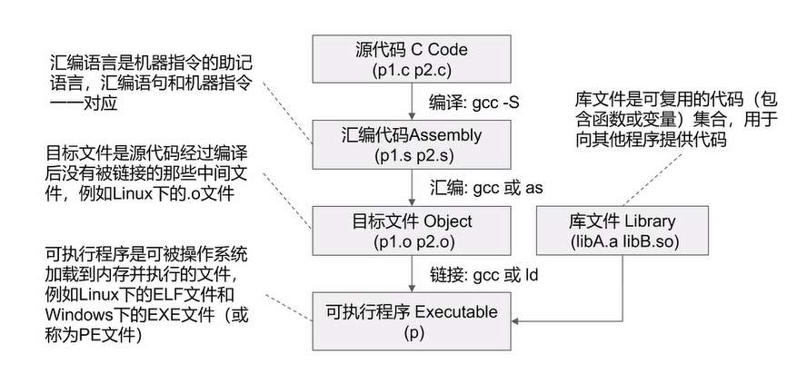
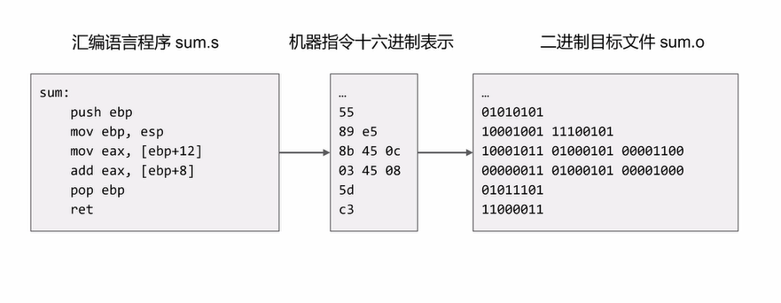
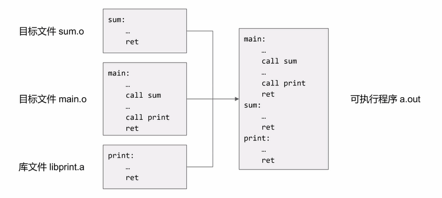

# Pwn

> 参考：
>
> https://mp.weixin.qq.com/s/JovqFitTQj4M37su_lH--g
>
> Pwn学习
>
> 漏洞平台
> https://bbs.h-acker.net/?p=69
>
>
> https://www.jarvisoj.com/
>
> about plt & got:
> https://blog.csdn.net/linyt/article/details/51635768

## 0x00 序

关于Pwn的前置技能

### 从C语言到可执行程序

我们一般编译，直接`gcc -o test test.c`就编译出可执行程序可以直接跑了

不过编译并没有表面上一条命令这么简单，通过上学期的编译原理我们可以知道，编译要经过词法分析、语法分析、语义分析等等，经过编译器的前端生成未经优化过的中间代码，然后再由后端优化生成可执行程序的汇编代码，再进一步转成可执行的二进制代码（机器码）

如上图，为gcc编译的过程：编译，汇编，链接

> 其实还少了一部分——预编译：`p1.c`，`p2.c`经过预编译`gcc -E p1.c p2.c`生成`p1.i`，`p2.i`
>
> 此阶段主要完成#符号后面的各项内容到源文件的替换，例如头文件#include和宏定义#define, #ifdef等。
> 可以用gcc的参数-E来指示编译器只做预处理而不进行下面的编译、汇编、链接三个动作
>
> 编译：`gcc -S p1.i p2.i -o p1.s p2.s`
>
> * `.S` ：预处理，编译
>
> * `.s`：编译

* 编译：把源程序处理成汇编代码

  * `gcc -S p1.c -o p1.s`

  * > 词法分析
    >
    > 语法分析
    >
    > 中间代码生成与优化
    >
    > 目标代码生成与优化

* 汇编：将汇编代码处理成字节码，即汇编命令的01串翻译

  * `gcc -C p1.s -o p1.o`

  * > 语法分析
    >
    > 助记符转为操作码
    >
    > 立即数、标号、地址转为操作数
    >
    > 生成目标文件

  * gcc或as或nasm汇编器都可以实现

我们一般阅读的都是十六进制表示（比如所说的74/75破解）

* 链接：将多个目标文件或库文件链接成可执行程序

  * `gcc p1.o -o p1`

  * > 将多个目标文件、库文件中的代码、数据的信息合并
    >
    > **修复文件之间的引用关系**：核心作用
    >
    > 生成可执行程序
    >
    > 静态库中的代码和数据会完整拷贝到可执行程序，而动态库则需要再程序运行时通过动态链接的方式加载
    >
    > * 库文件：可复用的代码集合，以供使用者调用
    >
    >   * 静态库：`.a`
    >   * 动态库：`.so`、`.dll`：节约文件内存、操作系统的运行时的内存
    >
    >   

如上图，链接将`sum.o`、`main.o`、`libprint.a`三个目标代码整合至可执行程序`a.out`里

这就是链接的过程

### 机器指令如何执行

