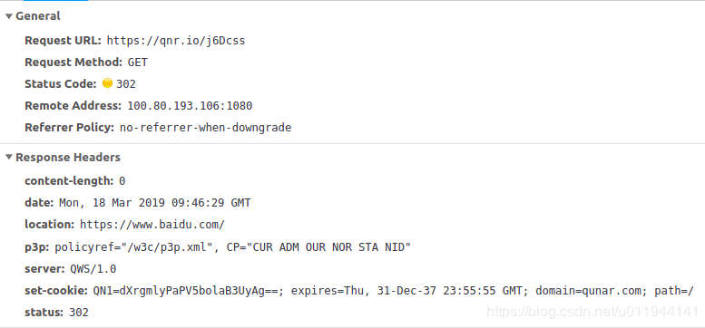

# URL


>引用：
>
>[url_Wiki]([https://zh.wikipedia.org/wiki/%E7%BB%9F%E4%B8%80%E8%B5%84%E6%BA%90%E5%AE%9A%E4%BD%8D%E7%AC%A6](https://zh.wikipedia.org/wiki/统一资源定位符))
>
>[短链接原理分析](<https://blog.csdn.net/zl1zl2zl3/article/details/84712511>)
>
>[短链接的算法](<https://blog.csdn.net/u011944141/article/details/88646552>)
>
>
>
>


## 统一资源定位符（英语：**U**niform **R**esource **L**ocator）


**统一资源定位符**（英语：**U**niform **R**esource **L**ocator，缩写：**URL**；或称**统一资源定位器**、**定位地址**、**URL地址**，俗称**网页地址**或简称**网址**）是因特网上标准的资源的地址（Address），如同在网络上的门牌。它最初是由蒂姆·伯纳斯-李发明用来作为万维网的地址，现在它已经被[万维网联盟4编制为因特网标准[RFC 1738](https://tools.ietf.org/html/rfc1738)。

在互联网的历史上，统一资源定位符的发明是一个非常基础的步骤。统一资源定位符的语法是一般的，可扩展的，它使用[美国信息交换标准代码](https://zh.wikipedia.org/wiki/美国信息交换标准代码)的一部分来表示因特网的地址。统一资源定位符的开始，一般会标志着一个计算机网络所使用的网络协议。

统一资源定位符的标准格式如下：

```
[协议类型]: //服务器地址:端口号/资源层级UNIX文件路径文件名?查询#片段ID
[protocol]://server_address:port/path_and_filename?search#fragmentID
```
统一资源定位符的完整格式如下：

```
[协议类型]: //访问资源需要的凭证信息@服务器地址:端口号/资源层级UNIX文件路径文件名?查询#片段ID
```

其中[访问凭证信息]、[端口号]、[查询]、[片段ID]都属于选填项。


### 语法

超文本传输协议（http）的统一资源定位符将从因特网获取信息的五个基本元素包括在一个简单的地址中：

1. 传送协议。
2. 层级URL标记符号(为[//],固定不变)
3. 访问资源需要的凭证信息（可省略）
4. 服务器。（通常为域名，有时为IP地址）
5. 端口号。（以数字方式表示，若为默认值可省略）
6. 路径。（以“/”字符区别路径中的每一个目录名称）
7. 查询。（GET模式的窗体参数，以“?”字符为起点，每个参数以“&”隔开，再以“=”分开参数名称与数据，通常以UTF8的URL编码，避开字符冲突的问题）
8. 片段。以“#”字符为起点

以*http://zh.wikipedia.org:80/w/index.php?title=Special:%E9%9A%8F%E6%9C%BA%E9%A1%B5%E9%9D%A2* 为例, 其中：

1. **http**，是协议；
2. **zh.wikipedia.org**，是服务器；
3. **80**，是服务器上的网络端口号；
4. **/w/index.php**，是路径；
5. **?title=Special:%E9%9A%8F%E6%9C%BA%E9%A1%B5%E9%9D%A2**，是询问。

大多数网页浏览器不要求用户输入网页中“**http://**”的部分，因为绝大多数网页内容是超文本传输协议文件。同样，“**80**”是超文本传输协议文件的常用端口号，因此一般也不必写明。一般来说用户只要键入统一资源定位符的一部分（**zh.wikipedia.org/wiki/Special:%E9%9A%8F%E6%9C%BA%E9%A1%B5%E9%9D%A2**）就可以了。

由于超文本传输协议允许服务器将浏览器重定向到另一个网页地址，因此许多服务器允许用户省略网页地址中的部分，比如 **www**。从技术上来说这样省略后的网页地址实际上是一个不同的网页地址，浏览器本身无法决定这个新地址是否通，服务器必须完成重定向的任务


## 短链接


短链接本质上是http协议中的重定向内容，一般为http301和http302

短链接的优势：简短、美观、便于传播


### 原理


例如短链接 http://qnr.io/j6Dcss



1. DNS解析qnr.io域名，发送GET请求 /j6Dcss
2. 服务器会通过短码获取对应的原URL
3. 然后通过 HTTP 302 （或HTTP 301）转到对应的原URL


### 常见算法实现


#### 自增序列算法

短址的长度一般设为 6 位，而每一位是由 [a - z, A - Z, 0 - 9] 总共 62 个字母组成的，所以 6 位的话，总共会有 62^6 ~= 568亿种组合，一般肯定是够用了。
将原网址分配一个从1位到6位的随机短码，存数据库记录，对返回的id进行62进制转码。

即可使用发号策略。发号策略是这样的，当一个新的链接过来时，发号器发一个号与之对应。往后只要有新链接过来，发号器不停发号就好。举个例子，第一个进来的链接发号器发0号，对应的短链接为 xx.xxx/0，第二个进来的链接发号器发1号，对应的短链接为 xx.xxx/1，以此类推。
发号器发出的10进制号需要转换成62进制，这样可以大大缩短号码转换成字符串后的长度。比如发号器发出 10,000,000,000 这个号码，如果不转换成62进制，直接拼接在域名后面，得到这样一个链接 xx.xxx/10000000000。将上面的号码转换成62进制，结果为AOYKUa，长度只有6位，拼接得到的链接为 xx.xxx/AOYKUa。可以看得出，进制转换后得到的短链接长度变短了一些。6位62进制数，对应的号码空间为626，约等于568亿。也就是说发号器可以发568亿个号，这个号码空间应该能够满足多数项目的需求了，所以基本上不用担心发号器无号可发的情况。上述是发号策略压缩URL的原理，在实际写代码的过程中还需要考虑很多细节，比如缓存，存储等。


#### 摘要算法

将原网址 md5 生成 32 位签名串,分为 4 段, 每段 8 个字节
对这四段循环处理, 取 8 个字节, 将他看成 16 进制串与0x3fffffff(30位1) 与操作, 即超过 30 位的忽略处理 这 30 位分成 6 段, 每 5位的数字作为字母表的索引取得特定字符, 依次进行获得 6 位字符串
总的 md5 串可以获得 4 个 6位串,取里面的任意一个就可作为这个长 url 的短 url 地址 这种算法,虽然会生成4个,但是仍然存在重复几率


#### 算法比较

第一种算法的好处就是简单好理解，永不重复。但是短码的长度不固定，随着 id 变大从一位长度开始递增。如果非要让短码长度固定也可以就是让 id 从指定的数字开始递增就可以了。

第二种算法，虽然几率很小，但是存在碰撞（重复）的可能性。短码位数是比较固定的。


### Q：同一长链接，每次转成的短链接是否一样

A：同一长链接，每次转成的短链接不一定一样，原因在于如果查询缓存时，如果未命中，发号器会发新号给这个链接。需要说明的是，缓存应该缓存经常转换的热门链接，假设设定缓存过期时间为一小时，如果某个链接很活跃的话，缓存查询命中后，缓存会刷新这个链接的存活时间，重新计时，这个链接就会长久存在缓存中。对于一些生僻链接，从存入缓存开始，在存活时间内很可能不会被再次访问，存活时间结束缓存会删除记录。下一次转换这个生僻链接，缓存不命中，发号器会重新发号。这样一来会导致一条长链接对应多条短链接的情况出现，不仅浪费存储空间，又浪费发号器资源。那么是否有办法解决这个问题呢？是不是可以考虑建立一个长链接-短链接的key-value表，将所有的长链接和对应的短链接都存入其中，这样一来就实现了长短链接一一对应的了。但是想法是美好的，现实是不行的，原因在于，将所有的长链接-短链接对存入这样的表中，本身就需要耗费大量的存储空间，相对于生僻链接可能会对应多条短链接浪费的那点空间，这样做显然就得不偿失了。


### HTTP 301与 302的区别

301 是永久重定向，302 是临时重定向。短地址一经生成就不会变化，所以用 301 是符合 http 语义的。同时对服务器压力也会有一定减少。用户第一次访问某个短链接后，如果服务器返回301状态码，则这个用户在后续多次访问统一短链接，浏览器会直接请求跳转地址，而不是短链接地址，这样一来服务器端就无法收到用户的请求。如果服务器返回302状态码，且告知浏览器不缓存短链接请求，那么用户每次访问短链接，都会先去短链接服务端取回长链接地址，然后在跳转。从语义上来说，301跳转更为合适，因为是永久跳转，不会每次都访问服务端，还可以减小服务端压力。但如果使用301跳转，服务端就无法精确搜集用户的访问行为了。相反302跳转会导致服务端压力增大，但服务端此时就可精确搜集用户的访问行为。
但是如果使用了 301，我们就无法统计到短地址被点击的次数了。而点收集击次数的意义那就不言而喻了，关键是现在服务器硬件设备都很好，还有支持高并发的NGINX，所以对服务器的压力几乎可以忽略，最终也就选择302。

